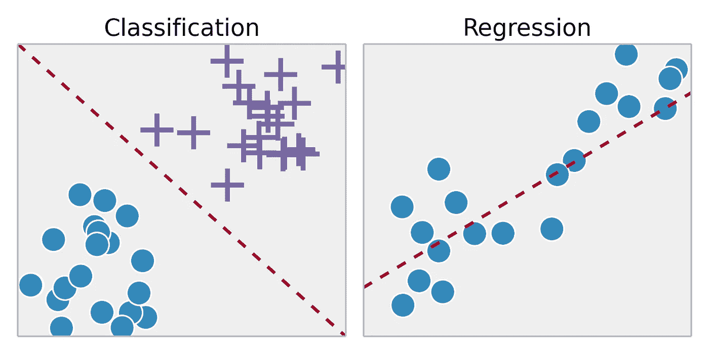
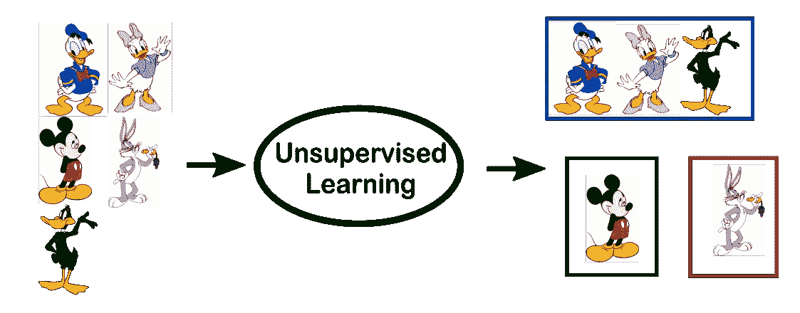
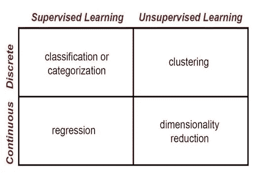

# 监督与非监督学习

> 原文：<https://towardsdatascience.com/supervised-vs-unsupervised-learning-14f68e32ea8d?source=collection_archive---------0----------------------->

## 理解两种主要机器学习方法的区别

在机器学习领域，有两种主要类型的任务:监督的和非监督的。这两种类型之间的主要区别在于，监督学习是使用**基本事实**完成的，或者换句话说，我们事先知道样本的输出值应该是多少。因此，监督学习的目标是学习一个函数，该函数在给定数据样本和期望输出的情况下，最接近数据中可观察到的输入和输出之间的关系。另一方面，无监督学习没有标记输出，因此它的目标是推断一组数据点中存在的自然结构。

## 监督学习

当我们希望将输入映射到输出标签时，监督学习通常在分类环境中完成；当我们希望将输入映射到连续输出时，监督学习通常在回归环境中完成。监督学习中的常见算法包括逻辑回归、朴素贝叶斯、支持向量机、人工神经网络和随机森林。在回归和分类中，目标是在输入数据中找到特定的关系或结构，使我们能够有效地产生正确的输出数据。请注意,“正确的”输出完全是由训练数据决定的，因此，虽然我们确实有一个我们的模型将假设为正确的基本事实，但这并不是说数据标签在现实世界中总是正确的。嘈杂或不正确的数据标签将明显降低模型的有效性。

当进行监督学习时，主要考虑的是模型复杂性和偏差-方差权衡。请注意，这两者是相互关联的。

模型复杂性指的是您试图学习的函数的复杂性，类似于多项式的次数。模型复杂性的适当级别通常由训练数据的性质决定。如果您有少量的数据，或者如果您的数据没有均匀地分布在不同的可能场景中，那么您应该选择低复杂度的模型。这是因为一个高复杂度的模型如果用在少量的数据点上会**过度拟合**。过度拟合指的是学习一个非常适合你的训练数据的函数，但不**将**推广到其他数据点——换句话说，你严格地学习产生你的训练数据，而没有学习导致这个输出的数据中的实际趋势或结构。想象一下试图拟合两点之间的曲线。理论上，你可以使用任何次数的函数，但在实践中，你会吝啬地增加复杂性，并使用线性函数。

偏差-方差权衡也与模型泛化有关。在任何模型中，偏差(恒定误差项)和方差(不同训练集之间的误差变化量)之间都有一个平衡。因此，高偏差和低方差的模型在 20%的时间里都是错误的，而低偏差和高方差的模型在 5%-50%的时间里都是错误的，这取决于用来训练它的数据。请注意，偏差和方差通常彼此反向移动；增加偏差通常会导致较低的方差，反之亦然。在制作模型时，您的具体问题和数据的性质应该允许您在偏差-方差谱的哪个位置做出明智的决定。通常，增加偏差(和减少方差)会导致模型具有相对保证的基线性能水平，这在某些任务中可能是至关重要的。此外，为了生成具有良好泛化能力的模型，模型的方差应与训练数据的大小和复杂性成比例-小而简单的数据集通常应使用低方差模型来学习，而大而复杂的数据集通常需要高方差模型来完全学习数据的结构。

## 无监督学习

无监督学习中最常见的任务是聚类、表示学习和密度估计。在所有这些情况下，我们希望了解数据的内在结构，而不使用显式提供的标签。一些常见的算法包括 k 均值聚类、主成分分析和自动编码器。由于没有提供标签，所以在大多数无监督学习方法中，没有特定的方法来比较模型性能。

无监督学习的两个常见用例是探索性分析和降维。

无监督学习在探索性分析中非常有用，因为它可以自动识别数据中的结构。例如，如果分析师试图对消费者进行细分，无监督聚类方法将是他们分析的一个很好的起点。在人类不可能或不切实际地提出数据趋势的情况下，无监督学习可以提供最初的见解，然后可以用于测试个人假设。

降维是指使用较少的列或特征来表示数据的方法，可以通过无监督的方法来实现。在表征学习中，我们希望学习个体特征之间的关系，允许我们使用与初始特征相关的潜在特征来表示我们的数据。这种稀疏潜在结构通常使用比我们开始时少得多的特征来表示，因此它可以使进一步的数据处理不那么密集，并且可以消除冗余特征。

## TLDR:

