# 支持向量机——机器学习算法简介

> 原文：<https://towardsdatascience.com/support-vector-machine-introduction-to-machine-learning-algorithms-934a444fca47?source=collection_archive---------0----------------------->

## 从零开始的 SVM 模式

## 介绍

我猜现在你已经习惯了线性回归和 T2 逻辑回归算法。如果没有，我建议你在学习支持向量机之前先看看它们。支持向量机是另一种简单的算法，每个机器学习专家都应该拥有它。支持向量机是许多人的首选，因为它以较少的计算能力产生显著的准确性。支持向量机，缩写为 SVM，可用于回归和分类任务。但是，它被广泛用于分类目标。

## 什么是支持向量机？

支持向量机算法的目标是在 N 维空间(N-特征的数量)中找到一个超平面，该超平面清楚地分类数据点。

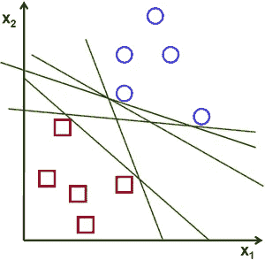

Possible hyperplanes

为了分离这两类数据点，有许多可能的超平面可供选择。我们的目标是找到一个具有最大余量的平面，即两类数据点之间的最大距离。最大化边缘距离提供了一些加强，以便可以更有把握地对未来的数据点进行分类。

## 超平面和支持向量

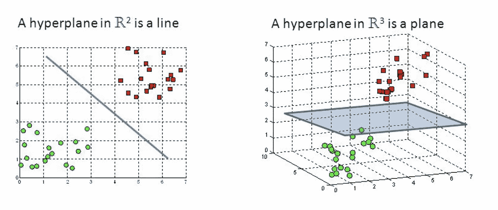

Hyperplanes in 2D and 3D feature space

超平面是帮助分类数据点的决策边界。落在超平面任一侧的数据点可以归属于不同的类别。此外，超平面的维数取决于特征的数量。如果输入特征的数量是 2，那么超平面只是一条线。如果输入特征的数量是 3，则超平面变成二维平面。当特征的数量超过 3 时，变得难以想象。

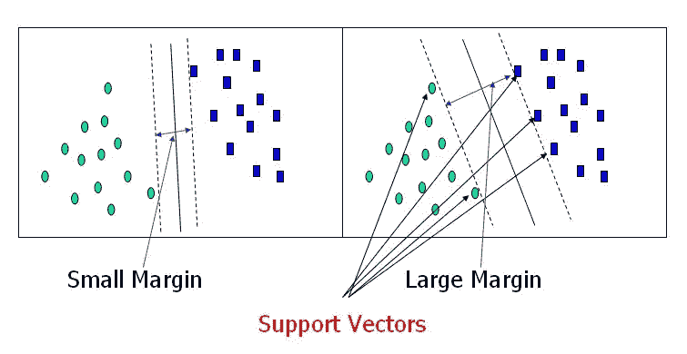

Support Vectors

支持向量是更接近超平面并影响超平面的位置和方向的数据点。使用这些支持向量，我们最大化分类器的余量。删除支持向量将改变超平面的位置。这些是帮助我们建设 SVM 的要点。

## 大幅度直觉

在逻辑回归中，我们采用线性函数的输出，并使用 sigmoid 函数压缩[0，1]范围内的值。如果挤压值大于阈值(0.5)，我们将其指定为标签 1，否则将其指定为标签 0。在 SVM，我们获取线性函数的输出，如果该输出大于 1，我们将其识别为一个类，如果输出为-1，我们将其识别为另一个类。由于在 SVM 阈值被改变为 1 和-1，我们获得了这个值的加强范围([-1，1])，其作为余量。

## 成本函数和梯度更新

在 SVM 算法中，我们希望最大化数据点和超平面之间的间隔。有助于最大化裕量的损失函数是铰链损失。

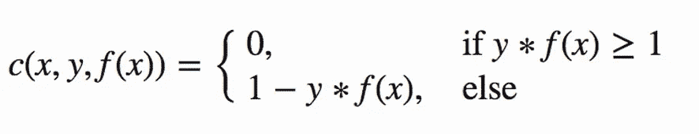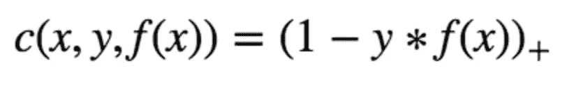

Hinge loss function (function on left can be represented as a function on the right)

如果预测值和实际值符号相同，则成本为 0。如果不是，我们就计算损失值。我们还在代价函数中加入了一个正则化参数。正则化参数的目标是平衡余量最大化和损失。添加正则化参数后，成本函数如下所示。

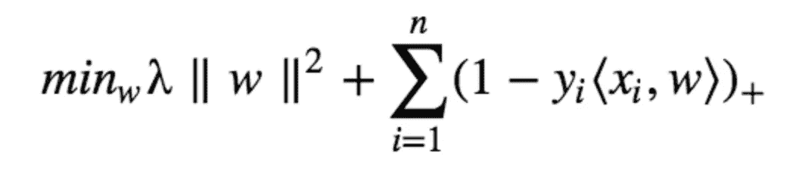

Loss function for SVM

现在我们有了损失函数，我们对权重求偏导数来求梯度。使用梯度，我们可以更新我们的权重。

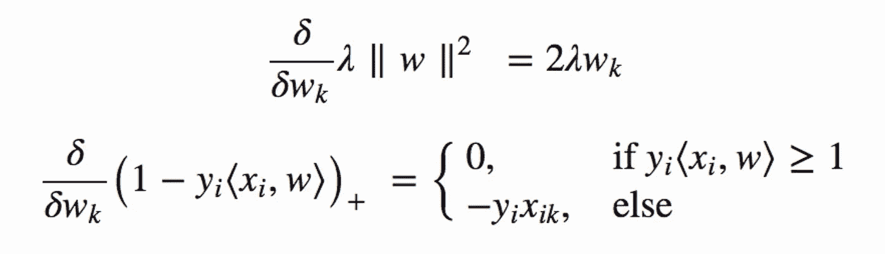

Gradients

当没有错误分类时，即我们的模型正确地预测了我们的数据点的类别时，我们只需要根据正则化参数更新梯度。

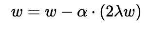

Gradient Update — No misclassification

当存在错误分类时，即我们的模型在预测我们的数据点的类别时出错，我们将损失与正则化参数一起包括进来以执行梯度更新。

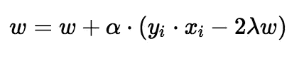

Gradient Update — Misclassification

## Python 中的 SVM 实现

我们将用来实现 SVM 算法的数据集是虹膜数据集。可以从这个[链接](https://www.kaggle.com/jchen2186/machine-learning-with-iris-dataset/data)下载。

由于 Iris 数据集有三个类，我们将删除其中一个类。这给我们留下了一个二元类分类问题。

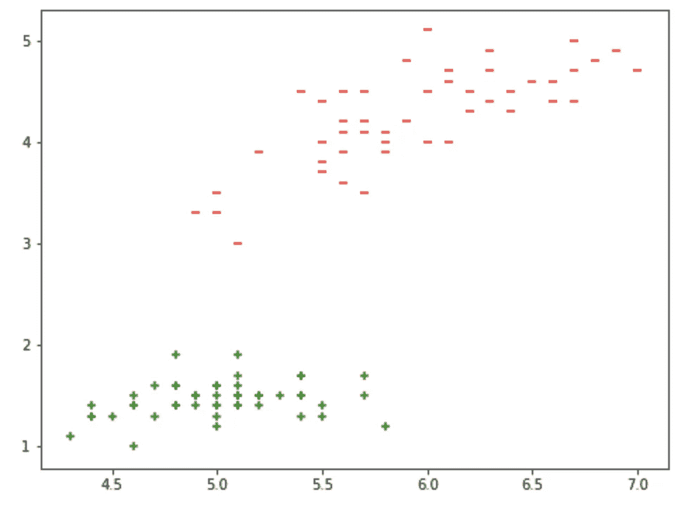

Visualizing data points

另外，有四个特性可供我们使用。我们将只使用两个特征，即萼片长度和花瓣长度。我们把这两个特征画出来。从上图中，你可以推断出可以用一条直线来分隔数据点。

我们提取所需的特征，并将其分成训练和测试数据。90%的数据用于训练，剩下的 10%用于测试。现在让我们使用 numpy 库来构建我们的 SVM 模型。

α(0.0001)是学习率，正则化参数λ被设置为 1/历元。因此，正则化值减少了历元数的增加。

我们现在裁剪权重，因为测试数据只包含 10 个数据点。我们从测试数据中提取特征并预测值。我们获得预测值，并将其与实际值进行比较，打印出我们模型的准确性。

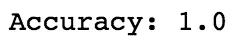

Accuracy of our SVM model

还有另一种简单的方法来实现 SVM 算法。我们可以使用 Scikit 学习库，只需调用相关函数来实现 SVM 模型。代码的行数明显减少太少行。

## 结论

支持向量机是一种优雅而强大的算法。明智地使用它:)