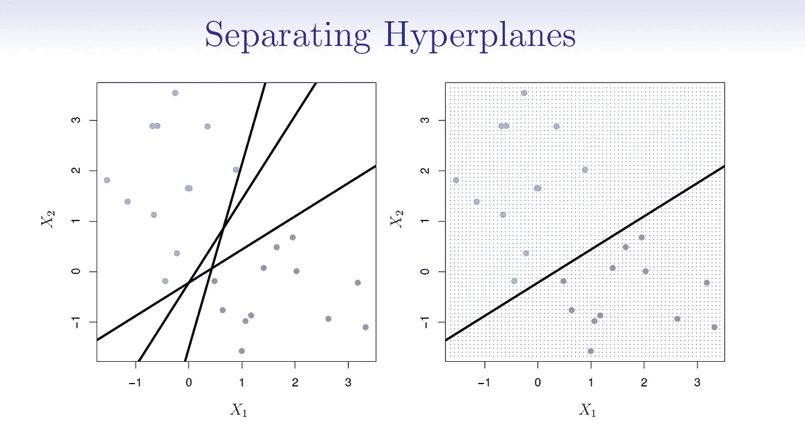
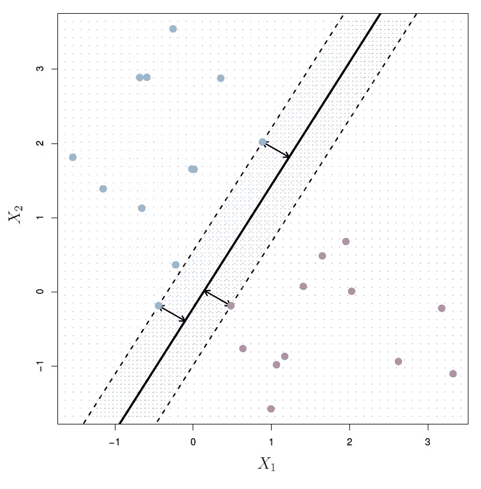
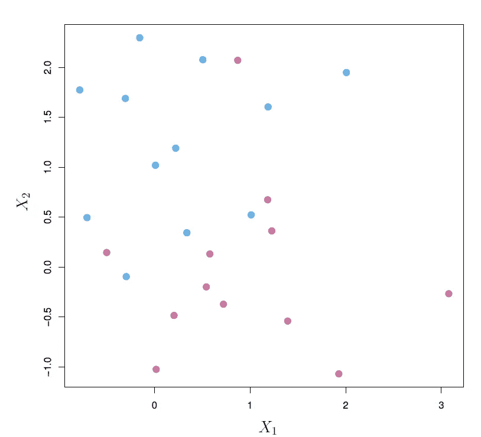
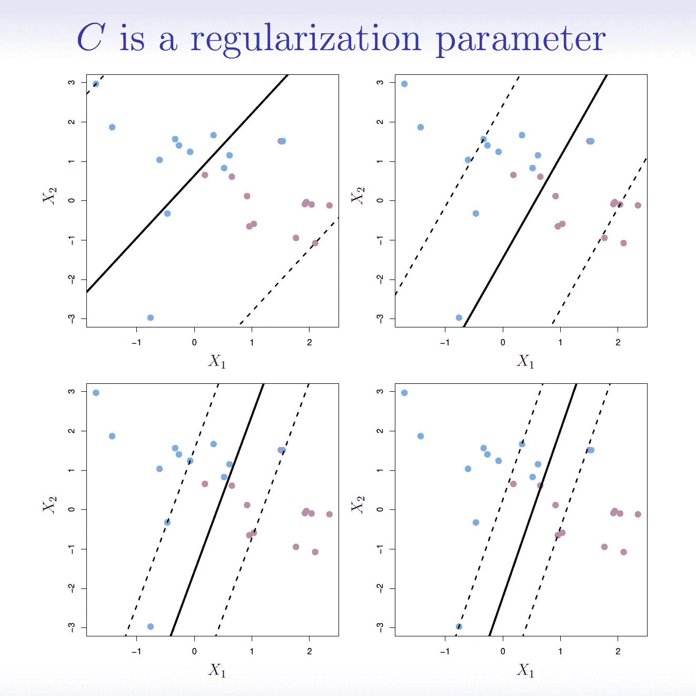
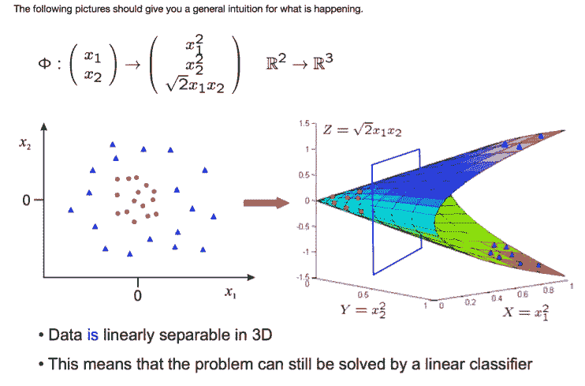
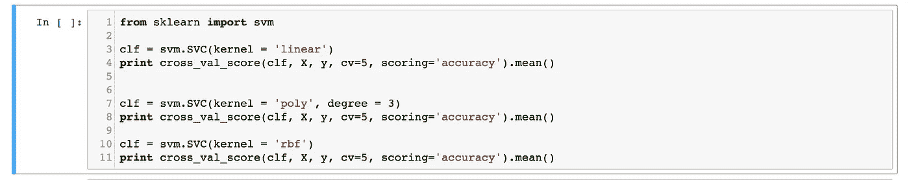
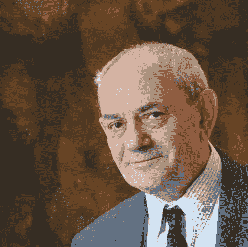

# 支持向量机——概述

> 原文：<https://towardsdatascience.com/support-vector-machines-a-brief-overview-37e018ae310f?source=collection_archive---------8----------------------->

有多种方法可以用机器学习对数据进行分类。你可以运行一个逻辑回归，使用决策树，或建立一个神经网络来完成这项任务。1963 年，Vladimir Vapnik 和 Alexey Chervonenkis 开发了另一种分类工具，即支持向量机。Vapnik 在 20 世纪 90 年代完善了这种分类方法，并扩展了支持向量机的用途。支持向量机已经成为数据科学家的一个很好的工具。

在这篇博文中，我计划提供一个关于支持向量机的高层次概述。我将谈论支持向量机背后的基本理论，为什么它们是相关的，以及这种分类器的优点和缺点。我还向您展示了一个用 Python 实现 SVM 的快速示例。我还提供了一个资源列表，这些资源有助于理解支持向量机。如果你想理解数学，我鼓励你查阅更多的支持向量机深度指南。这些信息的大部分是从 Tibshirani 的*统计学习导论中提炼出来的。*

**论**:

支持向量机试图通过数据集传递一个线性可分的超平面，以便将数据分为两组。这个超平面对于任何维度都是线性分隔符；它可以是直线(2D)、平面(3D)和超平面(4D+)。请看*统计学习简介*中的这张图表:

我们可以用无限多的超平面来分离红色和蓝色物体。哪个超平面最好？好吧，最好的超平面是最大化边际的超平面。边缘是超平面和几个接近点之间的距离。这些接近点是支持向量，因为它们控制超平面。下图显示了红色和蓝色物体的最佳超平面。

这是最大间隔分类器。它使超平面的边缘最大化。这是最好的超平面，因为它最大程度地减少了泛化误差。如果我们添加新数据，最大间隔分类器是正确分类新数据的最佳超平面。最大间隔分类器是我们的第一个 SVM。但是这个 SVM 要求两个类完全线性分离。情况并非总是如此，因此在 1993 年，Vapnik 开发了他的另一台机器。

下图显示了不完全可分的数据。

在这种情况下，最大间隔分类器将不起作用。Vapnik 开发了一个软余量，允许对数据进行一些错误分类。这被称为软边界分类器或支持向量分类器。它还试图最大限度地扩大两个阶层之间的差距。下图说明了这个 SVM。

支持向量分类器包含一个调整参数，以便控制它将允许多少错误分类。当希望最小化误差时，这个调谐参数是重要的。和所有监督学习一样，有一个偏差-方差权衡。当调整参数(通常表示为 C)较小时，分类器只允许少量的误分类。支持向量分类器将具有低偏差，但是可能不能很好地概括，并且具有高方差。如果我们的调整参数太小，我们可能会过度拟合训练数据。如果 C 很大，则允许的错误分类数会增加。这个分类器可以更好地进行归纳，但是可能会有很大的偏差。当调整参数为零时，不可能有错误分类，并且我们有最大间隔分类器。下图说明了这一点。

如果数据不是线性可分的，则支持向量分类器可能会失败。1992 年，Vapnik 开发了一种处理非线性可分类的方法。这个方法使用内核技巧。我们需要“扩大特征空间，以适应类别之间的非线性边界”(*统计学习介绍*)。核是量化观察值之间相似性的函数。用于分离非线性数据的常见类型的核是多项式核、径向基核和线性核(与支持向量分类器相同)。简单地说，这些核转换我们的数据，以便通过一个线性超平面，从而对我们的数据进行分类。下面是各种内核类型的一些可视化指南。

【http://svmcompbio.tuebingen.mpg.de/img/poly.png 号

支持向量机的扩展可以用来解决各种其他问题。我们可以使用一对一分类或一对所有分类来建立多个类别的支持向量机。在*统计学习简介*中可以找到对这些的简要描述。此外，支持向量回归机存在的回归问题。你也可以研究支持向量聚类、SVM 排名、直推式 SVM 等等。

那么，我们应该什么时候使用支持向量机呢？当组被清楚地分开时，支持向量机在分类方面做得很好。当我们的数据非线性分离时，它们也能做得很好。您可以转换数据以线性分离它，或者让 SVM 转换数据并线性分离这两个类。这是使用支持向量机的主要原因之一。您不必自己转换非线性数据。支持向量机的一个缺点是这些函数的黑盒性质。使用核来分离非线性数据使得它们很难(如果不是不可能的话)解释。

下面是一个用 Scikit-Learn 在 Python 中快速实现 SVM 的例子。

在上面的代码中，我用特定的内核函数实例化了 SVM，并使用交叉验证来检查模型的平均准确性。正如您所见，使用 SVM 可以非常简单。

总的来说，支持向量机是针对特定情况的优秀分类器。理解它们将会给你一个替代 GLMs 和决策树的分类方法。一定要看看我下面的引用，尤其是如果你想要更深入的支持向量机的数学解释。如果您有在这些资源中尚未找到答案的问题，请向 Vapnik 发送消息。他目前在脸书人工智能研究所工作。

资源:

加雷斯·詹姆斯、丹妮拉·威滕、特雷弗·哈斯蒂和罗伯特·蒂布拉尼的《统计学习导论》

【https://www.svm-tutorial.com/ 号

【http://www.yaksis.com/ 

Joseph Nelson 和 Matt Speck 在 DC SVM 大会上的演讲

麻省理工学院 6.034 人工智能，2010 秋季课程——导师:帕特里克·温斯顿