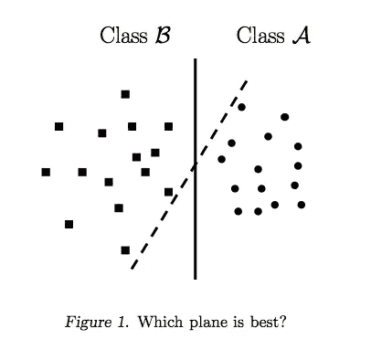
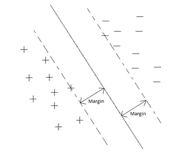
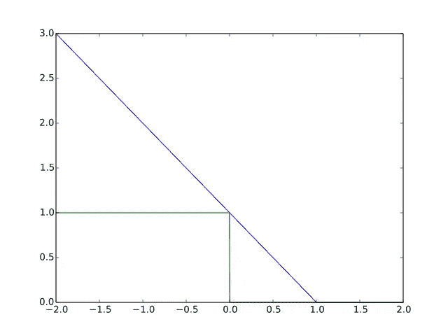

# 支持向量机(直观理解)——第二部分

> 原文：<https://towardsdatascience.com/support-vector-machines-intuitive-understanding-part-2-1046dd449c59?source=collection_archive---------1----------------------->

## 最大差值分类的概念

 [## 支持向量机(直观理解)——第一部分

### 网上关于这个话题的大部分材料都是用数学和很多细节来处理的，其中一个…

medium.com](https://medium.com/towards-data-science/support-vector-machines-intuitive-understanding-part-1-3fb049df4ba1) 

这是关于这个主题的第一部分的延续。如果你愿意，请参考以上部分。

这里我们将讨论 SVM 固有的最大利润分类背后的直觉。问题陈述如下—

理想情况下，我们希望我们的分类线看起来像上图中的粗线。请注意，与虚线相比，粗线离其最近的数据点更远。那么，SVM 是如何做到这一点的呢？

首先，让我们复习一些基础知识来理解这一点。我们知道一个简单的线性方程由 a* *x* +b* *y* +c = 0 给出。我们将对 2D 使用这个简单的等式，这可以很容易地扩展到对 *n* D

一些基本假设—

*   我们将只考虑两个特性 *x1，x2*
*   一个目标类 *y* ，对于正类可以取+1，对于负类可以取-1。
*   设 *x1i，x2i(对于 i = 1 到 n，*组观察值 *)* 代表个体' *n'* 对这些特征中的每一个的个体观察值 *x1，x2* 。

那么我们可以把我们的简单线性方程改写为 w1 **x1*+w2 **x2*+w0 = 0——只是代入:a = w1，b = w2，c = w0，x = *x1* ，y =*x2*；其中 w1、w2 和 w0 是我们的优化算法将最终计算出的权重。

然后，对于任何观察说，( *x1* i， *x2* i) —

*   w1 **x1i*+w2 **x2i*+w0**+0、** if ( *x1* i、 *x2* i)位于直线的一侧(当( *x1* i、 *x2* i)属于 *y* = +1 目标类时发生)

*或*

*   w1 **x1i*+w2 **x2i*+w0**<**0**，如果( *x1* i， *x2* i)位于直线的另一侧(当( *x1* i， *x2* i)属于 *y* = -1 目标时发生**

将两个等式合并为一个:*y**(w1 **x1i*+w2 **x2i*+w0)>0，当 *y* =-1 或+1(仅在两边乘以目标值， *y* (+1 / -1)时，该等式适用于上述两种情况，因此该等式适用于正负两种分类

从几何学中，我们知道从点( *x1* i， *x2* i)到直线 w1* *x1* +w2*x2+w0 = 0 的垂直距离(姑且称之为' *m* ')由下式给出

*m*=(w1 **x1i*+w2 * x2i+w0)**/**sqrt(*w1*+*w2*

请参考下面的链接，了解为什么会这样的简单推导

 [## 点到一条线的垂直距离

### 展示了如何找到一个点到一条线的垂直距离，以及公式的证明。

www.intmath.com](https://www.intmath.com/plane-analytic-geometry/perpendicular-distance-point-line.php) 

考虑到归一化权重( *w1* + *w2* = 1)，我们可以去掉上一个等式中的分母，它简化为以下等式

w1 **x1i*+w2 **x2i*+w0 =*m*

通过在任一侧乘以目标值， *y* (+1 / -1)，该等式可以概括为对正类和负类进行分类。给定这一点，然后下面的内等式，**y *(w1 **x1i*+w2 **x2i*+w0)≥*m****，*保证对于阴性/阳性目标类，每个观察值( *x1* i， *x2* i)位于/超出分类线两侧的距离“ *m* ”。在这里，‘*m*’被称为边距。

Margin = m

那么现在下一个问题来了，是什么原因导致 SVM 将利润最大化？答案在于优化第一部分中讨论的成本/损失函数。

*   正如我们从第 1 部分的图中注意到的，当“预测的*y*”≥1 时，铰链损失变为 0。
*   如第 1 部分所示的“预测的 *y* ”等于 w1* *x1* + w2*x2 + w0(输入值的加权平均值，X)。

综合以上，当 w1* *x1* + w2*x2 + w0 ≥ 1 时，铰链损耗为 0。同样，通过在任一侧将此乘以 y (+1 / -1)的目标值，使得该等式可以概括为分类正类和负类。这样，我们得到:*y**(w1 **x1*+w2 * x2+w0)≥1。与之前的等式(粗体)相比，我们可以看到裕量 m 等于 1。根据我们使用的铰链损耗函数，我们可以将这个裕量更改为我们想要的值。优化算法将计算出权重，使得上述等式成立，以便最小化损失函数。

margin value on x-axis vs loss on y-axis

从上面的图中，请注意—

*   对于离分类线相当远的所有点，余量， *m* 大于 1。所以他们的损失= 0(蓝线)。因此，只有在分类线附近( *m* ≤1)的点才真正影响权重。
*   对于更远的点( *m* > 1)，无论如何损失函数是 0，因此当优化算法遇到这样的更远的点时，不对权重进行调整。
*   为此，( *m* ≤1)的点称为 ***支持向量*** ，因为它们支持/影响分类线。为什么是矢量？—因为任何点都是数据空间中的向量。

这里需要注意的重要一点是，第 1 部分中“预测 y”的概念只不过是边缘值的概念， *m.* 如果“*m”*高(=“预测 y”高)，那么该点离分类线更远，因此我们更确信观察值肯定属于所识别的类别。这正是最大间隔分类器背后的概念。

最后，通过控制我们在第 1 部分中讨论的成本函数中的正则化参数“C ”,我们间接操纵每个观察值的裕量*‘m’*(*x1*I， *x2* i ),从而调整缓冲/松弛量，我们同意，在对数据进行错误分类时。如果“C”选择得更高，那么我们允许更多的缓冲数据被错误分类，反之亦然。我们可以直观地理解这一点，考虑一个让‘C’= 0 的极限情况，这意味着我们不允许任何缓冲。然后，请注意，损失函数只是简化为优化成本=||w ||/2(我们在第 1 部分中讨论了这一点作为硬间隔分类器)，这意味着我们需要取得平衡以减少权重(使上述成本函数最小)，同时实现 1 的间隔(因为我们希望 w1* *x1* + w2*x2 + w0 ≥ 1)。组合的这种性质不允许任何错误分类的缓冲，因此被恰当地称为硬边界分类器。

在下一个也是最后一个部分，我们将看看如何使用内核技巧来完成特性转换。