# 支持向量机(SVM)

> 原文：<https://towardsdatascience.com/support-vector-machines-svm-c9ef22815589?source=collection_archive---------0----------------------->

# 简介:

支持向量机可能是最受欢迎和谈论最多的机器学习算法之一。它们在 20 世纪 90 年代开发的时候非常流行，并且仍然是几乎不需要调整的高性能算法的首选方法。在这篇博客中，我们将描绘 SVC 的各种概念。

## 映射的概念:

***1。什么是 SVM？***

**2*。SVM 背后的意识形态。***

***3。直觉发展。***

***4。SVM 使用的术语。***

***5。超平面(决策面)。***

***⑥。硬保证金 SVM。***

***7。软利润 SVM。***

**8。SVM 的损失函数解释。**

***9。SVM 的双重形式。***

**10*。什么是内核诡计？***

**11*。内核的类型。***

**12*。SVM 的利与弊。***

**13*。为 SVM 准备数据。***

**14*。模型应用***

# 1.什么是 SVM？

被称为 SVM 的支持向量机是一种 ***监督学习算法*** ，可用于支持向量分类(SVC)和支持向量回归(SVR)等分类和回归问题。它用于较小的数据集，因为处理时间太长。在这一集中，我们将关注 SVC。

# 2.SVM 背后的意识形态:

SVM 是基于寻找一个超平面的想法，该超平面最好地将特征分成不同的域。

# 3.直觉发展:

考虑以下情况:

有一个跟踪者正在给你发邮件，现在你想设计一个函数(超平面)来明确区分这两种情况，这样无论何时你收到一封跟踪者发来的邮件，它都会被归类为垃圾邮件。下面是绘制超平面的两种情况，你会选择哪一种，为什么？花点时间分析一下情况……

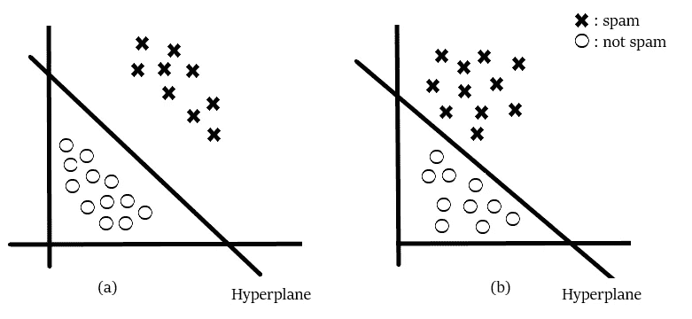

我猜你会选无花果。你想过你为什么要选无花果吗？因为图(a)中的电子邮件是明确分类的，与图(b)相比，你对此更有信心。基本上，SVM 是由提出一个 ***最优超平面*** 的想法组成的，它将清楚地分类不同的类(在这种情况下，它们是二元类)。

# 4.SVM 使用的术语:

离超平面最近的点称为 ***支持向量点*** ，向量离超平面的距离称为 ***边距*** 。

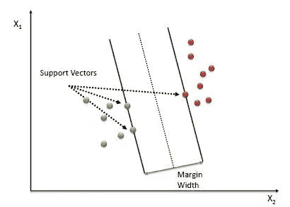

这里要发展的基本直觉是，SV 点离超平面越远，在它们各自的区域或类中正确分类这些点的概率就越大。SV 点在确定超平面时非常关键，因为如果向量的位置改变，超平面的位置也会改变。技术上这个超平面也可以称为***边缘最大化超平面*** 。

# 5.超平面(决策面):

在这篇文章中，我们已经讨论超平面很久了，让我们在继续讨论之前证明它的意义。超平面是用于区分特征的函数。在 2-D 中，用于在特征之间分类的函数是一条线，而用于在 3-D 中分类特征的函数被称为平面，类似地，用于在更高维度中分类点的函数被称为超平面。现在，既然你知道了超平面，让我们回到 SVM。

假设有“m”个维度:

因此,“M”维中超平面的方程可以表示为=

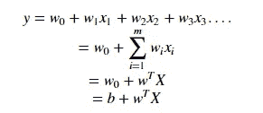

在哪里，

Wi =向量(W0，W1，W2，W3……Wm)

b =有偏项(W0)

X =变量。

# 6.硬利润 SVM:

现在，

*假设 3 个超平面，即(π，π+，π)，使得‘π+’平行于穿过正侧支持向量的‘π’，而‘π’平行于穿过负侧支持向量的‘π’。*

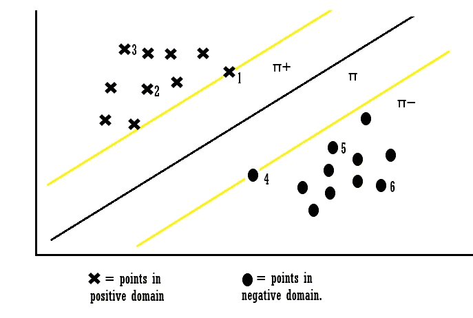

每个超平面的方程可以被认为是:

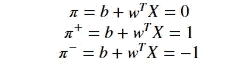

对于点 X1:

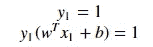

*解释:当点 X1 时，我们可以说该点位于超平面上，并且方程确定我们的实际输出和超平面方程的乘积为 1，这意味着该点被正确地分类在正域中。*

对于 X3 的观点:

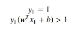

*解释:当点 X3 时，我们可以说该点远离超平面，并且该方程确定我们的实际输出和超平面方程的乘积大于 1，这意味着该点被正确地分类在正域中。*

对于点 X4:

*解释:当点 X4 时，我们可以说该点位于负区域中的超平面上，并且该方程确定我们的实际输出和超平面方程的乘积等于 1，这意味着该点被正确地分类在负区域中。*

对于点 X6:

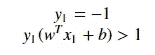

*解释:当点 X6 时，我们可以说该点远离负区域中的超平面，并且该方程确定我们的实际输出和超平面方程的乘积大于 1，这意味着该点被正确地分类在负区域中。*

让我们看看未分类的约束条件:

对于点 X7:

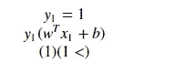

*解释:当 Xi = 7 时，点被错误地分类，因为对于点 7，wT + b 将小于 1，这违反了约束。所以我们发现了由于违反约束而导致的错误分类。同样，我们也可以说对于点 Xi = 8。*

*由此从上面的例子中，我们可以得出，对于任意一点 Xi，*

***如果易(WT*Xi +b) ≥ 1:***

***那么 Xi 被正确归类***

***其他:***

***Xi 被错误归类。***

因此，我们可以看到，如果这些点是线性可分的，那么只有我们的超平面能够区分它们，如果引入任何异常值，那么它就不能将它们分开。所以这些类型的 SVM 被称为 ***作为硬边界的 SVM*** *(因为我们有非常严格的约束来正确地分类每一个数据点)。*

# 7.软利润 SVM:

我们基本上认为数据是线性可分的，这可能不是现实生活中的情况。我们需要更新，以便我们的函数可以跳过一些异常值，并能够对几乎线性可分的点进行分类。为此，我们引入一个新的 ***松弛变量(*** ξ)，称为 *Xi。*

如果我们把ξ it 引入前面的方程，我们可以把它改写为

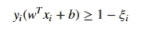

Introduction of Xi

***如果ξi= 0，***

***这些点可以被认为是正确分类的。***

***其他:***

***ξi > 0，错误分类分。***

因此，如果ξi> 0，这意味着 Xi(变量)位于不正确的维度，因此我们可以认为ξi 是与 Xi(变量)相关的误差项。平均误差可由下式给出:

average error

因此我们的目标，在数学上可以描述为；

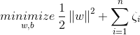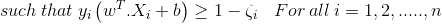

其中ξi = *ςi*

****

这种方法被称为软边界技术。

# 8.SVM 的损失函数解释:

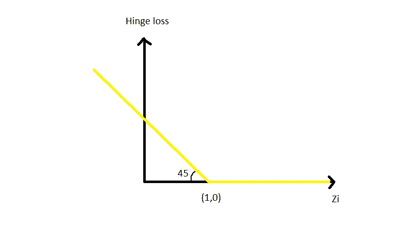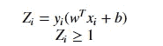

when Zi is ≥ 1 then the loss is 0

when Zi < 1 then loss increases.

因此，可以解释为铰链损耗最大(0，1-Zi)。

# 9.SVM 的双重形式:

现在，让我们考虑当我们的数据集根本不是线性可分的情况。

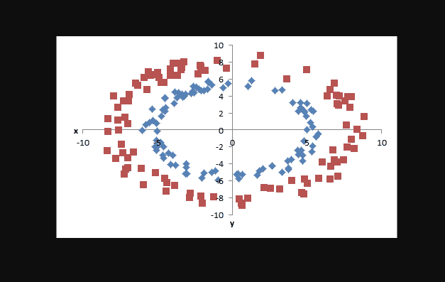

基本上，我们可以像在逻辑回归中一样，通过向数据点添加相关的特征，将数据点投影到更高的维度中，从而分离每个数据点。但是有了 SVM，就有了一种强大的方法来完成将数据投射到更高维度的任务。上述公式是 SVMT3 的 ***原形。另一种方法是对偶形式的 SVM，它使用 ***拉格朗日乘数*** 来解决约束优化问题。***

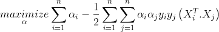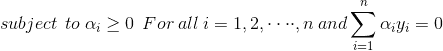

***注:***

***如果αi > 0，则 Xi 是支持向量，当αi=0 时，则 Xi 不是支持向量。***

观察:

1.  为了解决实际问题，我们不需要实际的数据点，而只需要每对向量之间的点积就足够了。
2.  为了计算“b”偏差常数，我们只需要点积。
3.  SVM 对偶形式相对于拉格朗日公式的主要优点是它只依赖于 ***α*** 。

# 10.什么是内核诡计？

即将来到 SVM 最著名的主要部分， ***内核绝招*** 。核是在某些(非常高维)特征空间中计算两个向量 **x** 和 **y** 的点积的一种方式，这就是为什么核函数有时被称为“广义点积”。

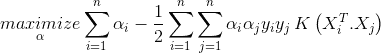

try reading this equation…

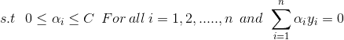

s.t = subjected to

应用核技巧意味着用核函数替换两个向量的点积。

# 11.内核类型:

1.  线性核
2.  多项式核
3.  径向基函数核(RBF)/高斯核

我们将集中在多项式和高斯核，因为它是最常用的。

## 多项式内核:

一般来说，多项式核定义为；

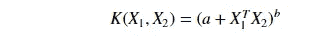

b = degree of kernel & a = constant term.

在多项式核中，我们简单地通过增加核的幂来计算点积。

示例:

假设最初 X 空间是二维的

Xa = (a1，a2)

Xb = (b1，b2)

现在，如果我们想将数据映射到更高维度，比如说在六维的 Z 空间中，看起来可能是这样的

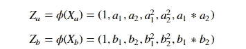

为了求解这个对偶 SVM，我们需要(转置)Za ^t 和 Zb 的点积。

方法 1:

传统上，我们会通过以下方式解决这个问题:

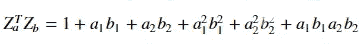

这将花费很多时间，因为我们必须在每个数据点上执行点积，然后计算点积，我们可能需要做乘法，想象一下对数千个数据点这样做…

或者我们可以简单地使用

方法二:

使用内核技巧:

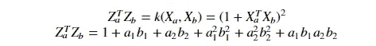

在这种方法中，我们可以通过增加幂的值来简单地计算点积。简单不是吗？

## 径向基函数核(RBF)/高斯核:

高斯 RBF(径向基函数)是另一种流行的核方法，用于 SVM 模型。RBF 核是一个函数，它的值取决于到原点或某个点的距离。高斯核具有以下格式:

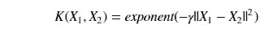

||X1 — X2 || = Euclidean distance between X1 & X2

使用原始空间中的距离，我们计算 X1 和 X2 的点积(相似性)。

*注:相似度是两点之间的角距离。*

## 参数:

1.  c:正则化强度的倒数。

*行为:随着“c”值的增加，模型变得过拟合。*

*随着“c”值的减小，模型的拟合度降低。*

2.γ:γ(仅用于 RBF 核)

*行为:随着“* γ *”值的增加，模型变得过拟合。*

*随着'* γ *的值减小，模型欠拟合。*

# 12.SVM 的利与弊:

## 优点:

1.  在更高维度真的很有效。
2.  当特征数多于训练样本数时有效。
3.  类可分时的最佳算法
4.  超平面仅受支持向量的影响，因此异常值的影响较小。
5.  SVM 适合极端情况下的二元分类。

## 缺点:

1.  对于较大的数据集，需要大量的时间来处理。
2.  在重叠类的情况下性能不佳。
3.  适当选择 SVM 的超参数，以获得足够的泛化性能。
4.  选择合适的内核函数可能很棘手。

# 13.为 SVM 准备数据:

## ***1。数值转换:***

SVM 假设你的输入是数字的，而不是分类的。所以你可以用一个最常用的"[***one hot encodin***](http://scikit-learn.org/stable/modules/generated/sklearn.preprocessing.OneHotEncoder.html)***g、***[***label-encoding***](http://scikit-learn.org/stable/modules/preprocessing_targets.html#preprocessing-targets)***etc***"来转换它们。

## ***2。二进制转换:***

由于 SVM 只能对二进制数据进行分类，所以您需要使用( [***一对一对其余的***](http://scikit-learn.org/stable/modules/multiclass.html#one-vs-the-rest) ***方法/*** [***一对一对一方法***](http://scikit-learn.org/stable/modules/multiclass.html#one-vs-one) )转换方法将多维数据集转换为二进制形式。

# 14.模型应用:

由于这个帖子已经太长了，所以我想到把编码部分链接到我的 Github 账号( [***这里***](https://github.com/Ajayay/SVM_on_AFFR) )。

# 参考资料:

*   [吴恩达 SVM 笔记。](http://cs229.stanford.edu/notes/cs229-notes3.pdf)
*   [SVM 的 Sklearn 页面](http://scikit-learn.org/stable/modules/generated/sklearn.svm.SVC.html)

# 导师:

Harshall Lamba，新潘韦尔皮莱工程学院助理教授。