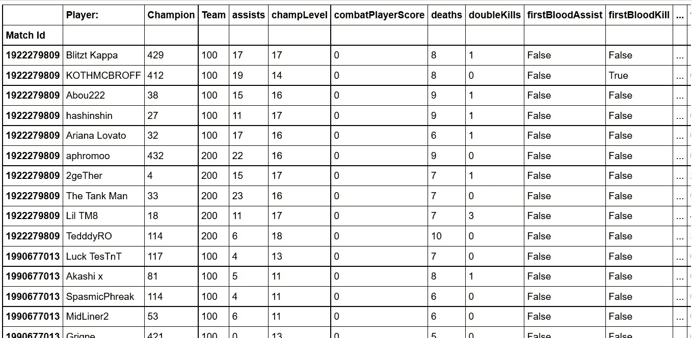
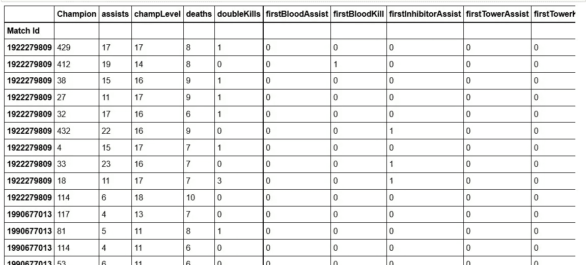
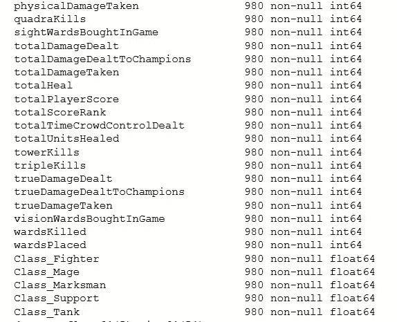
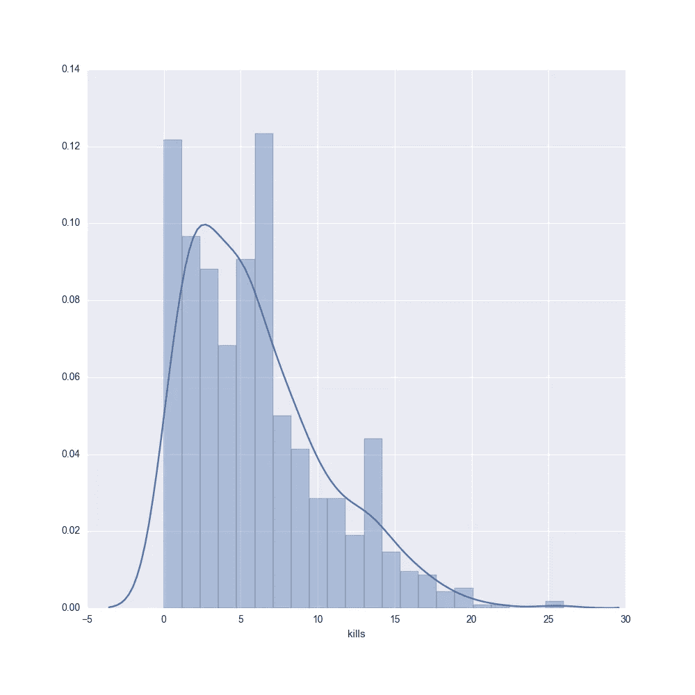
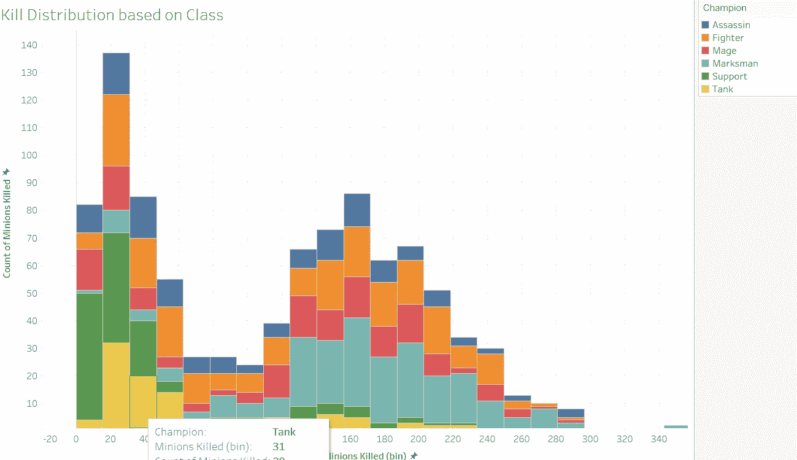
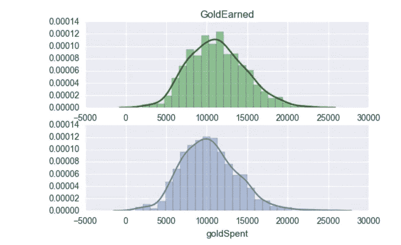
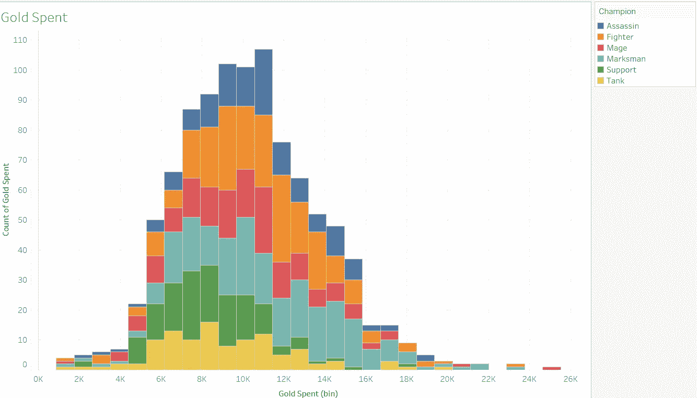
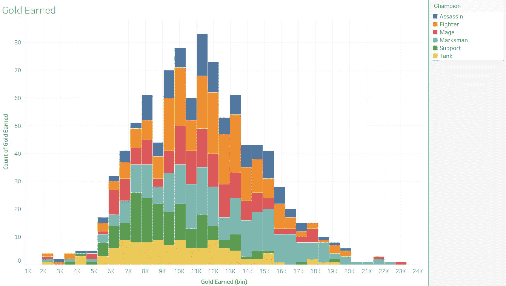
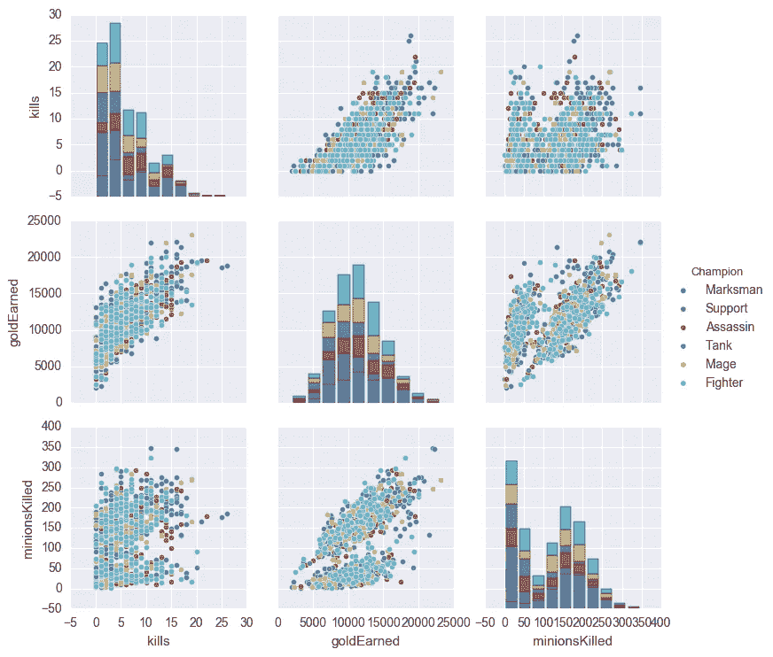

# Riot API 的第 2 部分:表层故事。

> 原文：<https://towardsdatascience.com/surface-level-stories-14f672d83947?source=collection_archive---------6----------------------->


从我的[上一篇文章](https://medium.com/towards-data-science/data-downpour-b1c4b41d7862)继续，我已经扩展了我的数据集很多，在修补和清理数据后，我创建了一个 98 场比赛的 CSV，每场比赛包含 10 名球员数据(5 v 5)。

**更新***虽然我第一次尝试使用 Riot API 是为了适应一般的 API，但我从玩家 [Doublelift](http://lol.gamepedia.com/Doublelift) 那里获得的数据集太小，无法对其进行任何重要的建模(最近 10 场游戏)。所以下一步是撒下更大的网来合作。结果是一个由 98 场比赛组成的数据集，每场比赛由 10 名球员组成。我没有选择基于一个特定玩家的数据子集，而是收集了 25 个游戏，并在这些游戏中收集了一系列游戏 id，以便将这些数据子集化为玩家数据的匹配项(说起来容易做起来难)。所以我们来分解一下。



980x by 61x

我的目标是得到一个包含 1000 个匹配的数据集，但是我承认只有 980 个。我仍然习惯于速率限制，并一度设置了一个定时器，在每 10 个请求后暂停。我想提到的是，我对将匹配数据分割成由匹配 ID 链接的单独的行有所保留，因为我的意图是使用二进制“赢家”目标将特征拟合到逻辑回归模型中。我不想在特性中执行数据[泄漏](https://www.kaggle.com/wiki/Leakage)，所以我必须删除将每一行链接在一起的列。因此，我觉得像“团队”这样的功能必须放弃。

```
df.drop('Team',inplace=True,axis=1)
df.drop('combatPlayerScore',inplace=True,axis=1)
df.drop('unrealKills',inplace=True,axis=1)
df.drop('firstInhibitorKill',inplace=True,axis=1)
df.drop('Player:',inplace=True,axis=1)# Later on I took out the item features 
feat = [c for c in df.columns if not c.startswith("item",0,4)]
df_no_items = df[feat]
```

我还做了一个 bool 到 int 的转换

```
df['winner'] = df['winner'].map({True:0,False:1})
df['firstBloodAssist'] = df['firstBloodAssist'].map({False:0,True:1})
df['firstBloodKill'] = df['firstBloodKill'].map({False:0,True:1})
df['firstTowerAssist'] = df['firstTowerAssist'].map({False:0,True:1})
df['firstTowerKill'] = df['firstTowerKill'].map({False:0,True:1})
df['firstInhibitorAssist'] = df['firstInhibitorAssist'].map({True:1,False:0})
```



现在下一个问题是处理冠军 Id，它是由我想要虚拟的 int 组成的。这是我开发数据的第一个分支。每个数字对应一个特定的 Lol 冠军，每个冠军包含一个[类](http://na.leagueoflegends.com/en/news/game-updates/gameplay/dev-blog-classes-subclasses)和[子](http://na.leagueoflegends.com/en/news/game-updates/gameplay/dev-blog-classes-subclasses)类。为了简单起见，我决定把每个冠军的 ID 和它的相关职业(刺客、坦克、战士、法师、射手、支援)分开，并把这些类别虚拟出来。为此，我将主数据帧映射到一个单独的静态字典，该字典由 Champion ID 及其关联的类组成(这可以在 API 的静态数据中找到，不会计入您的总请求限制)。现在我们可以虚拟这些类，并开始绘制数据。



现在，随着类被转换为虚拟类，我们现在可以开始建模了。(放下刺客假人以避开假人陷阱。。。)

我的第一个问题是想看看死亡的分布。在 python 和 seaborn 中，我做了一个简单的直方图。一个相当健康的正左倾分布，这是有道理的。我注意到一些山谷表明，玩家要么不杀任何人，当他们做的时候，大约是 5-8 人。但总的来说，这些数据并不能真正说明问题。让我们深入下去。



进入画面，我们现在可以建立一个叙事，看看谁在做所有的杀戮。从我的观察中，我们可以看到支援和坦克职业与重型[刺客，战士，法师，神射手]之间的良好关系。(你希望你的核心 DPS/Carries 获得击杀，因为它会产生更多的黄金和经验，这**应该**与胜利相关。简而言之，你不希望你的支援职业从你的核心玩家那里流失可能的资源(然而我们可以在柱状图中间看到一些顽固的坦克和支援，可能是杀贼)

我的下一个问题是查看黄金的平均分布。



在《英雄联盟》中，一个吸引人(取决于你问的是谁)的游戏特色是，你不会因为死亡而受到惩罚，但当你真的死亡时，你会给你的对手一个优势。



快速观察显示，大买家是战士、射手和刺客(他们通常携带武器，需要花费更多来完成更大的物品集)。高收入者似乎是神枪手/战士，因为他们更频繁地占据外侧右侧。我假设拥有一套专注于伤害的技能可以转化为更高的黄金产量。支撑物和坦克位于坚固的中间区域，这暗示着玩家正在相应地适应他们的角色。

有一点让我印象深刻，那就是法师职业在花费和收入上的频率，这表明这个角色在物品购买上比坦克和支援角色更灵活。理想情况下，你不会希望支持者购买高端物品，因为这毫无意义，而且你也不会希望你的核心玩家浪费时间和金钱去建造像病房这样的实用物品。

总的来说，我做了一些表面模型，但还没有像我希望的那样深入研究数据。下周我将探索建模能力，尝试一些逻辑预测。到目前为止，它只是加强概念，稍微深入一点。



关于我的树莓 pi 3 项目，我已经让相机工作。现在我只需要设置好 OpenCV，就可以开始了！神经网络我们来了！！！