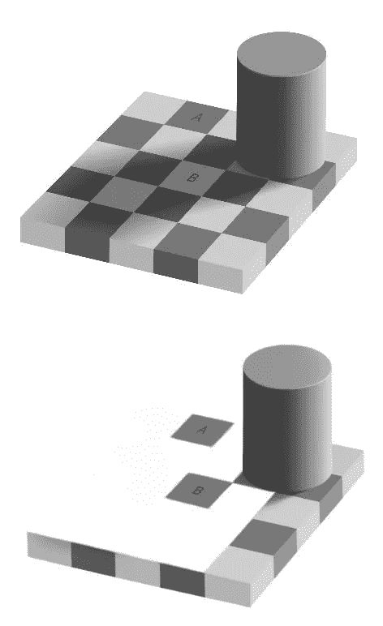
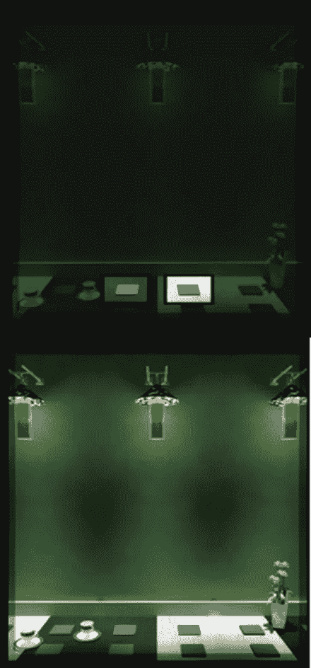
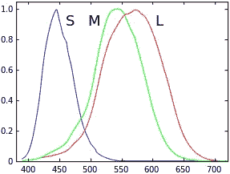
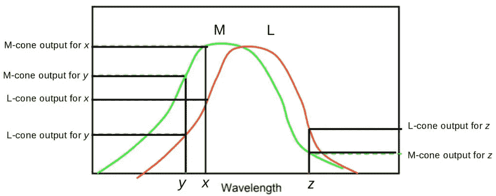
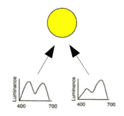
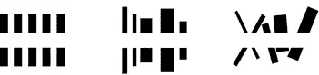
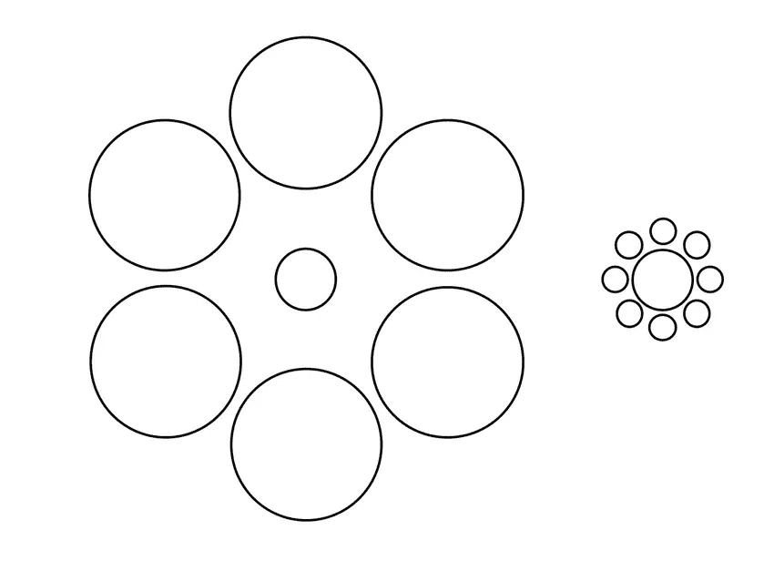
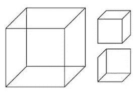
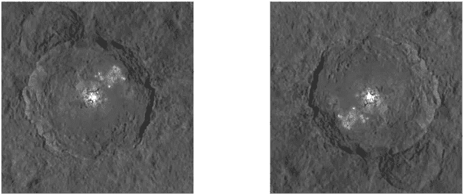
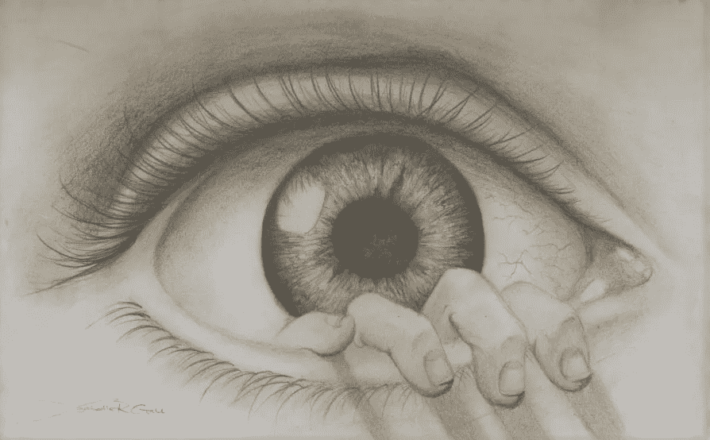

# 视觉工作的惊人方式

> 原文：<https://towardsdatascience.com/surprising-ways-visual-perception-works-8f624218fba0?source=collection_archive---------10----------------------->

…不像卷积神经网络看到的那样。

> “我一直坚信，让人工智能工作的唯一方法是用类似于人脑的方式进行计算……”——杰弗里·辛顿

在一位同事分享他遇到的一些关于感知的令人惊讶的事实之前，我对视觉感知的大多数了解都来自于研究应用于不同领域图像的卷积神经网络(CNN)的变体。

CNN 没有模仿*所有*人类视觉感知系统*的属性，也没有模仿*(没关系)。研究是要突破今天的界限，有时是看似很小的一步。

# 颜色感知是一项空间任务

Adelson’s Checker-shadow³. To most viewers, area A appears to be a darker color than area B (top figure) when in fact both areas have identical color (seen clearly in bottom figure)

想想这些阿德尔森的棋盘格影子人物。对于大多数观众来说，区域 A 看起来比区域 B(上图)更暗，而实际上两个区域的颜色相同(下图清晰可见)。下图与上图相同，只是去掉了 B 区周围的方块，而 B 区保持不变。移除 B 区域周围的方块会改变观察者的感知——A&B 区域看起来颜色相同。颜色感知是一项空间任务。改变一个区域的环境可以改变我们对该区域颜色的感知。

色觉是空间任务的另一个例子:

Top figure: Small grey squares are perceived to be colored differently when in fact they are same color. Bottom figure: The added context (spatial information) removes the perception of color difference among small grey squares. (Just to be clear, the small grey squares are indeed identically colored in both top & bottom figures.)⁴

认为人类仅仅从一个区域反射的光来感知一个区域的颜色很有诱惑力，但这是错误的。事实上，我们的感知系统也处理来自该区域周围的光，以确定该区域的颜色。

起初，这似乎令人惊讶。但是考虑到照明的光谱组成在我们生活的环境中变化的事实。从一个小区域反射回来的光总是被照明的变化所混淆。**我们的感知系统依赖于对来自邻近区域的光的相对量的理解来忽略照明的变化。因此，即使在变化的光照下，我们也能更准确地感知颜色。**这种观察的技术术语是*颜色恒常性*。

**脚注**

*   在本小节中，更准确的说法是指一个区域的*反射特性*而不是一个区域的颜色。
*   *颜色恒常性*指的是观察到颜色在光照发生较大变化时保持不变。⁵ ⁶

# 每个人都是色盲

*同色异谱*是指不同光谱成分的光可以给观察者产生完全相同的外观(看起来是相同的颜色)的现象。⁷

Response curves of the 3 types human cone receptors (denoted S, M, L). Y-axis is response. X-axis is wavelength(nm).⁸

人类眼睛里有三种视锥受体。这三种受体对可见光谱中的短波(S)、中波(M)和长波(L)做出反应。

当光线照射到眼睛时，L、M 和 S 受体分别被长、中和短波长的光子激发。

假设单一波长的光源 *x* 导致*产生与*完全相同的 L、M 和 S 响应*，另一个光源*包括两个波长 *y* 和 *z* 。这两种光源看起来是相同的颜色！这种现象叫做*同色异谱*。

Illustration of a light source of single wavelength *x causing identical responses as another light source comprising two wavelengths y & z. Only M & L receptor response curves shown for simplicity. ⁹*

更具体地说，*同色异谱*出现在这种情况下是因为:
M-cone 输出为 *x =* M-cone 输出为 *y +* M-cone 输出为 *z
和* L-cone 输出为 *x =* L-cone 输出为 *y +* L-cone 输出为 *z*

为了简单起见，省略了 S 受体。此外，为简单起见，仅讨论了 3 种波长。

Different spectra perceived as same color. ⁹

*同色异谱*在日常生活中的一个例子是衣服在不同的光线下会变色(例如，在商店灯光下与阳光相比颜色不同)。在许多情况下，这是因为衣服被带有⁰.同色异谱特征的染料染色

**脚注**

*   这个[在线实验](https://isle.hanover.edu/Ch06Color/Ch06ColorMatchExp.html)通过让你调整红色、绿色和蓝色强度来匹配所显示的色块，来确定你对条件配色现象的*主观等同点*。
*   有些人是四色视者，这意味着他们有 4 种视锥受体，而不是通常的 3 种，这些人比大多数人看到更多的颜色。有些动物，如螳螂虾，拥有 12 种锥状感受器。

# 咬合印痕

当一个物体在另一个物体后面时，后面的物体被前面的物体*遮挡*。

From left to right, increasing impression of a white rectangle occluding black objects.¹¹

左图**微弱地**给观众留下一个白色物体挡住(*遮挡*)黑色矩形的印象。咬合的印象**在中图中加强**，在右图中**最强**。尽管这些图没有明确显示物体相互遮挡，我们还是感觉到了遮挡。这些**遮挡的印象是由于我们的感知系统以独特的方式对待物体边界**。

# 感知不是物理现实

Müller-Lyer illusion. Most viewers perceive the top horizontal line as being longer than the bottom horizontal line. Actually, both lines are the same length.

Ebbinghaus illusion or Titchener circles.Most viewers perceive the center circle of the left cluster to be smaller than the center circle of the right cluster. Actually, both center circles are the same size.¹²

上述错觉表明，我们所感知的可能会偏离物理现实。这证明了**感知不仅仅是关于进入我们眼睛的视觉阵列**(物理光)。感知包括更高层次的过程。

# 交替感知

考虑以下导致我们的感知在解释之间交替的演示。

Necker’s cube. Most viewers alternate between interpretations of these cubes’ orientations.¹³

Spinning dancer. Center figure: Most viewers flip back and forth between interpretations of the dancer’s spin direction (clockwise or anti-clockwise). Left & right figures have added contours that help the viewer’s perception stabilize on a clockwise and anti-clockwise spin interpretation respectively.¹⁴

当观看这些演示时，注意到你的感知是如何在不同的解释中交替变化的吗？还要注意你如何一次只能持有一种解释(而不是同时感知两种解释)？这些观察表明**感知伴随着类似于选择**的认知过程。

**脚注**
*多稳态感知*和*双稳态感知*是这种现象的专业术语。

# 来自上述假设的光线

下面的论证表明，我们的感知偏向于相信光来自上方。

To most viewers, the left sphere appears convex and right sphere appears concave. But the right sphere is merely a 180 degree rotation of the left sphere.

To most viewers, the left crater appears concave and the right crater appears convex. But the right crater is merely the image of the left crater rotated 180 degrees.¹⁵

仅仅通过旋转上面的图像就获得了不同的解释，这是因为我们的感知**偏向于光来自上方**的信念。这种偏见是由我们适应环境统计规律的感知系统建立起来的。

**脚注**
更准确地说，这种偏置假设的光线方向是“左上”而不是正上方。这与我们是左撇子还是右撇子无关。⁶

# 结论

这篇文章中提到的惊喜源于我们的感知系统已经进化到适应我们的环境。进化/适应(**类似于机器学习**)已经产生了一些怪癖，可以通过研究这些怪癖来更好地理解人类感知**并改进感知的现代实现**(例如卷积神经网络)。

1.  [罗杰斯，布莱恩(2017)。*观感:一段很短的介绍*。牛津大学出版社，2017 年](https://global.oup.com/academic/product/perception-a-very-short-introduction-9780198791003)
2.  [https://www . utoronto . ca/news/u-t-computer-scientist-takes-international-prize-grounding-work-ai](https://www.utoronto.ca/news/u-t-computer-scientist-takes-international-prize-groundbreaking-work-ai)
3.  爱德华·阿德尔森(2005 年)。【方格阴影错觉】
4.  来源[https://www . ted . com/talks/beau _ lotto _ optical _ imaginations _ show _ how _ we _ see](https://www.ted.com/talks/beau_lotto_optical_illusions_show_how_we_see)
5.  贾德博士(1940 年)。彩色照明下表面颜色的色调饱和度和亮度。 *JOSA* ， *30* (1)，2–32。
6.  E.Hering，Grundzuge der Lehre vom Lichtsinn，Graefe-Samischs《第十二届妇女大会手册》(1905 年和 1907 年)。
7.  桑顿 W. A. (1998)。同色异谱干扰色彩空间有多强。颜色研究&应用:由国际社会颜色委员会、颜色组织(英国)、加拿大颜色学会、日本颜色科学协会、荷兰颜色研究学会、瑞典颜色中心基金会、澳大利亚颜色学会、法国颜色中心 23(6)，402–407 批准。
8.  来源 https://en.wikipedia.org/wiki/Cone_cell
9.  改编自[http://Jim-stone . staff . shef . AC . uk/psy 305/Lectures _ pdf/L10 _ colour theory _ v4 . pdf](http://jim-stone.staff.shef.ac.uk/psy305/Lectures_pdf/L10_ColourTheories_v4.pdf)
10.  [https://blog.1000bulbs.com/home/what-is-metamerism](https://blog.1000bulbs.com/home/what-is-metamerism)
11.  Gillam 和 p . j . Marlow(2014 年)。比较 Kanizsa 正方形和线性边缘对齐的主观轮廓(“纽约泰坦尼克号”图)。*感知*， *43* (9)，977–988。
12.  来源[https://www . research gate . net/figure/The-Ebbinghaus-Illusion _ fig 1 _ 310505100](https://www.researchgate.net/figure/The-Ebbinghaus-Illusion_fig1_310505100)
13.  洛杉矶内克(1832 年)。“观察在瑞士看到的一些显著的光学现象；以及在观察晶体或几何立体图形时出现的光学现象”。*伦敦和爱丁堡哲学杂志和科学杂志*。**1**(5):329–337
14.  来源[https://imgur.com/gallery/kcaw8OI](https://imgur.com/gallery/kcaw8OI)。最初由网页设计师 Kaya hara Nobuyuki(2003)[http://www.procreo.jp/labo.html](http://www.procreo.jp/labo.html)
15.  来源[https://en.wikipedia.org/wiki/Crater_illusion](https://en.wikipedia.org/wiki/Crater_illusion)
16.  [马马西安，p .&古彻，R. (2001 年)。照明位置的先验知识。*认知*， *81* (1)，B1-B9。](https://pdfs.semanticscholar.org/8b41/d0b9b1b4274a5015e7c1ae404181e654cae4.pdf)

Source [https://www.deviantart.com/vintagexxrose/art/evil-eye-329099696](https://www.deviantart.com/vintagexxrose/art/evil-eye-329099696)