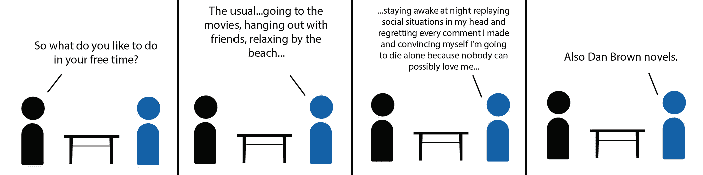
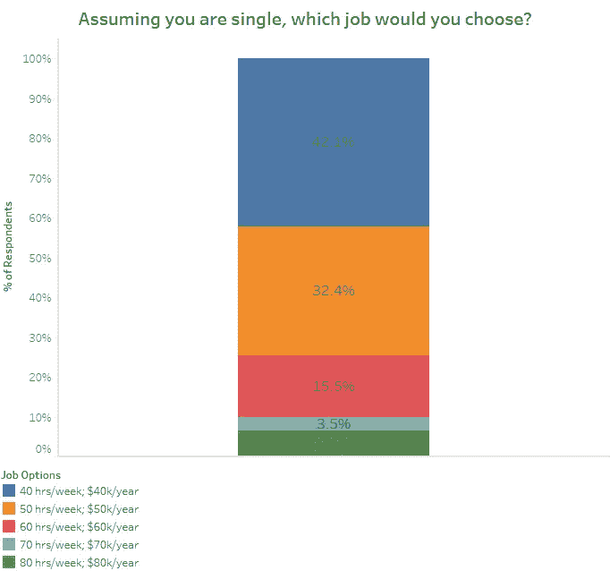
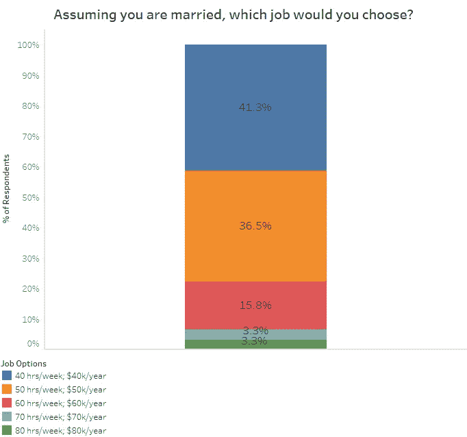
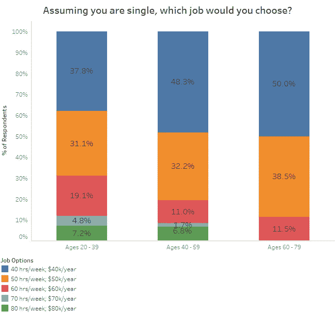
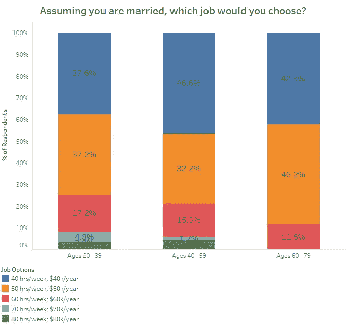
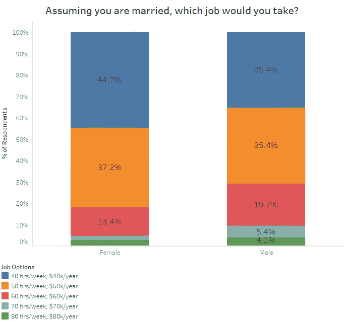

# 理想的工作生活平衡是怎样的？

> 原文：<https://towardsdatascience.com/survey-says-this-is-the-ideal-work-life-balance-e7ae22627042?source=collection_archive---------3----------------------->

## 时间和金钱哪个更重要？

# 一份工作

每天，全世界有数百万人去找一份叫做工作的工作。前提很简单。给一家公司你的时间、劳动和智力，他们会给你一种叫做钱的东西。然后你可以用这些钱去购买生存所需的东西:食物、住所、动感单车课程等等。

我最近读了一篇文章，说平均每周工作时间是 47 小时。我想起了大三的一堂英语课，老师让全班同学在五份工作中做出选择:

1.  每周工作 40 小时，年薪 4 万美元
2.  每周工作 50 小时，年薪 5 万美元
3.  每周工作 60 小时，年薪 6 万美元
4.  每周工作 70 小时，年薪 7 万美元
5.  每周工作 80 小时，年薪 8 万美元

尽管我的班级很小——只有 12 个人——但我是唯一一个想每周工作 80 小时，年薪 8 万美元的人。当时，我很困惑——难道我的同学不明白，如果他们赚了更多的钱，他们就可以买更多的东西吗？

从那以后，我意识到赚更多的钱通常是以花更少的时间为代价的。尽管如此，由于相对年轻，现在有了选择，我的一部分仍然倾向于选择第五个选项，因为，说实话，我还能利用空闲时间做什么呢？

但是我想知道其他人是否也有这种感觉。

# 调查时间到了

所以我发出了一份调查。

我在网上招募了 411 人，女性 260 人，男性 151 人。

我让参与者想象他们正在他们目前居住的城市或城镇开始一份新的工作。他们可以在 5 份他们喜欢但不喜欢的几乎相同的工作中做出选择。我向他们展示了我的英语老师提供的五小时工资选项，并告诉他们，他们选择的工作将是他们在可预见的未来会得到的相同工资。

我首先让参与者选择一份工作，假设他们是单身。为了混淆视听，我让他们选择一份工作，假设他们的丈夫每周工作 50 小时，年薪 6 万美元，但没有孩子(现在或可预见的将来)。

# 那么大家是怎么想的？

结果如下:

## 不管婚姻状况如何，大多数人都希望工作时间更短，收入更少。

无论是单身还是已婚，超过四分之三的人表示，他们更愿意每周工作 40 或 50 个小时，年薪 4 万或 5 万美元。很明显，我想把醒着的所有时间都花在工作上的愿望并不是大多数人都有的想法。

## 如果人们更年轻，他们更愿意工作更长时间。

我把人们分成三个年龄组——20 到 39 岁，40 到 59 岁，60 到 79 岁。最年轻年龄段的人总是愿意比其他两个年龄段的人工作更长时间。在单一情景中，31.1%的 20-39 岁的人选择每周工作 60 小时以上，而 40-59 岁和 60-79 岁的人分别为 19.5%和 11.5%。

当人们结婚后，选择每周工作 60 小时以上的 20-39 岁人群的比例下降到 25.2%。然而，这仍然高于其他两个年龄组。

## 男性选择工作更长时间。虽然女性的工作偏好在婚后保持不变，但男性的偏好向中间靠拢。

与女性相比，更多的男性更喜欢每周工作 60 小时以上。不管他们是单身(32.4%的男性对 21.3%的女性)还是已婚(29.2%的男性对 18.2%的女性)，情况都是如此。

结婚后，女性的反应略有变化，而最初选择 40 和 80 小时工作周的男性倾向于 50 和 60 小时工作周。很明显，有些人想通过工作来躲避他们的配偶(这是个笑话)。实际上，有些男人可能想多工作，因为他们不想挣得比配偶少，而另一些男人可能只是想在经济上多支持他们的配偶，

# 我梦想工作与生活的平衡

大多数人都不想像我高中时那样拼命工作。我不知道工作 80 小时是什么感觉。工作几年后，我梦想着减少工作量，即使这意味着减薪。这就是我决定研究工作与生活平衡的原因:它意味着什么，它是否实际存在，以及如何实现它。

# 你可能喜欢的其他文章

如果你喜欢这篇文章，请访问[**LateNightFroyo.com**](http://latenightfroyo.com/)，阅读关于爱情、生活等话题的话题。

[什么时候去参加聚会比较合适？](https://www.latenightfroyo.com/archive/2017/10/14/289d7z2zo3kbxp00dsg4am34uha0gf)

[如何走出去？](https://www.latenightfroyo.com/archive/2017/4/30/how-to-get-out-of-going-out)

[多年轻才算年轻到不能约会？](https://www.latenightfroyo.com/archive/2016/10/2/how-young-is-too-young)