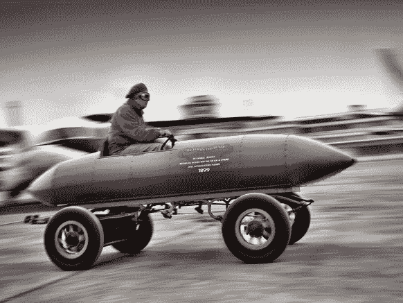

# 最快的生存者

> 原文：<https://towardsdatascience.com/survival-of-the-fastest-2270ee6d31a6?source=collection_archive---------8----------------------->

Photo Credit: Martyn Goddard

“即使你有最好的产品，如果你是第三个推出你的产品的人，那么你也只是损失了该产品潜在价值的 50%。”—辉瑞副总裁兼总经理 Peter Stevenson

曾经需要几十年的市场变化现在只需几周甚至几个月就能发生。自动化、分析和人工智能(AI)的不可阻挡的崛起正在加速以前所未有的速度开展业务、创造价值、做出决策、满足客户期望，并在竞争对手之前将产品和服务推向市场。很简单，速度决定了你是破坏还是被破坏，因为在这个快节奏的机器时代，不领先就意味着落后。如今，许多标准普尔 500 公司的股东报告中充斥着“速度”、“快”及其同义词，这并非巧合。

10 年前，随着全球化无情地压低单位成本，企业不得不学会以“中国价格”竞争。今天，你的企业需要通过适应“谷歌价格”和“谷歌速度”来做出另一个改变。随着科技企业家利用数字平台并迅速积累数十亿美元的财富，从而挑战传统的商业模式和行业，任何市场的准入门槛都大大降低了。考虑以下几点:

在我们对 500 名 IT 经理的[未来工作调查](https://www.cognizant.com/the-work-ahead)中，报告的第一个问题是他们的业务太慢，无法有效地利用数字化。

一项新的[研究](https://www.tradearabia.com/news/REAL_319453.html)证实，许多零售商在创造竞争优势和新收入来源的领域投资过于缓慢，这使他们面临被行动更快、更具创新性的零售企业超越的风险。

数据是新的石油，但公司充斥着数据。如果你的决策周期需要几个月，即使是关键任务项目，你也无法赶上游戏的速度。使用高级分析和机器学习的公司[成为前四分之一财务表现者的可能性是前者的两倍](http://www.bain.com/publications/articles/creating-value-through-advanced-analytics.aspx)，执行有效决策的可能性是后者的三倍。

一些公司已经在速度要求上展开竞争。他们正在转变行业商业模式，挑战现状，采取行动，承担风险，永远改变游戏规则。例子包括:

Reliance Jio 在印度的成功仅用了 170 天就达到了 1 亿用户，相当于每天每秒 7 个用户，迫使竞争对手降低了价格。

对于阿迪达斯，[来说，速度要求围绕着](https://www.marketingweek.com/2016/07/19/adidas-details-revolutionary-three-pillar-strategy-as-it-aims-to-reclaim-lost-ground/)“显著缩短上市时间并与客户保持同步。”为了实现这一目标，阿迪达斯正在彻底重塑其商业模式，从产品系列规划到产品创新、采购、供应链、上市和销售。它的目标是到 2020 年，50%的销售额来自重塑后的业务

ANZ 银行[正在利用人工智能实现后台自动化](https://www.itnews.com.au/news/how-anz-bank-is-expanding-its-use-of-cognitive-computing-415402)，以缩短无担保和个人贷款审批的上市时间。据该银行的首席技术官称，由于自动化程度的提高，已经减少了 1，000 小时的后台活动。

西班牙电信巨头 telefónica[正在改变其业务 DNA](http://www.i-cio.com/strategy/digitalization/item/telefonica-s-digitally-inspired-business-transformation) 以创建一个全数字、数据驱动的身份。该公司在全球范围内彻底改革了其核心业务流程和系统，目标是转向能够对快速变化的业务环境做出反应的实时业务模式。

荷兰银行 ING 已经设立了一个[转型“作战室”](https://www.finextra.com/newsarticle/30148/ing-sets-up-transformation-war-room)来全面了解所有项目的状态，并快速解决问题。目标是加速沟通和决策。

更快的上市时间是竞争的需要，这种压力不会很快消失。商业新陈代谢的速度需要提高。当银行意识到与金融科技初创公司对抗毫无意义时，它们就与它们合作。如今，许多大银行正在向初创公司投入数百万美元。

那么，在这个新的、大胆的世界里，组织如何才能加快速度，赢得胜利呢？你不必一下子就想明白。你只需要愿意开始并做出成功所需的组织变革。在一系列较小的任务中取得成功，远比在试图像大爆炸一样解决转型计划时遭遇惨败更令人向往。设定方向，在沙地上画一条线，明白那条线会动。提前花时间为以后的加速做准备没有错。一个企业成功前进的速度取决于它的起步状态，即它对变化的准备程度及其速度容忍度。

**一句话:**快速应对一切已经成为一项战略要务，未来几年最成功的公司将是那些行动最快的公司。然而，并不是每家公司都能以同样的速度前进，因为在新机器时代，每家公司都有自己的抱负和优先事项。你必须找到你真正的北方，为此你可以参考我们的[速度框架](https://www.cognizant.com/whitepapers/fast-but-not-furious-the-speed-you-need-to-win-in-the-fourth-industrial-revolution-codex2828.pdf)，我们开发这个框架是为了帮助领导者找到他们业务的当前速度和他们需要设定的目标来加快步伐。

有这么多的利害关系，公司不能放松油门。

*Manish 领导 Cognizant 亚太和中东未来工作中心。作为一名受人尊敬的演说家和思想家，Manish 用他发人深省的研究和咨询技巧引导许多财富 500 强公司走向工作的未来。他住在印度新德里，可以通过* [*联系到 manish.bahl@cognizant.com*](mailto:manish.bahl@cognizant.com)*|*[*https://www.linkedin.com/in/manishbahl/*](https://www.linkedin.com/in/manishbahl/)*| @ mbahl*