# SVM 和内核 SVM

> 原文：<https://towardsdatascience.com/svm-and-kernel-svm-fed02bef1200?source=collection_archive---------3----------------------->


# 摘要

在本文中，您将了解到 **SVM** 或**支持向量机**，这是最流行的人工智能算法之一(它是十大人工智能算法之一)，以及关于**内核技巧**，它处理**非线性**和**更高维度**。我们将触及像**超平面、拉格朗日乘数**这样的主题，我们将有**视觉示例**和**代码示例**(类似于在 [KNN 章节](http://dummyprogramming.com/stupid-simple-ai-series/)中使用的代码示例)来更好地理解这个非常重要的算法。

# SVM 解释道

**支持向量机**是一种**监督学习算法**，主要用于**分类**，但也可用于**回归**。主要思想是基于标记的数据(训练数据),该算法试图找到可用于分类新数据点的**最佳超平面**。在二维中，超平面是一条简单的直线。

**通常**学习算法试图学习一个类的**最常见的特征(一个类与另一个类的区别)**，并且分类是基于那些学习到的代表性特征(因此分类是基于类之间的差异)。SVM 的工作方式正好相反。它**找到**和**类之间最相似的例子**。这些将是**支持向量**。

作为一个例子，让我们考虑两类，苹果和柠檬。

其他算法将学习苹果和柠檬最明显、最有代表性的特征，比如苹果是绿色的、圆形的，而柠檬是黄色的、椭圆形的。

相比之下，SVM 将寻找与柠檬非常相似的苹果，例如黄色椭圆形的苹果。这将是一个支持向量。另一个支持向量将是一个类似于苹果的柠檬(绿色和圆形)。因此**其他算法**学习**差异**而 **SVM** 学习**相似性**。

如果我们想象一下上面 2D 的例子，我们会得到这样的结果:

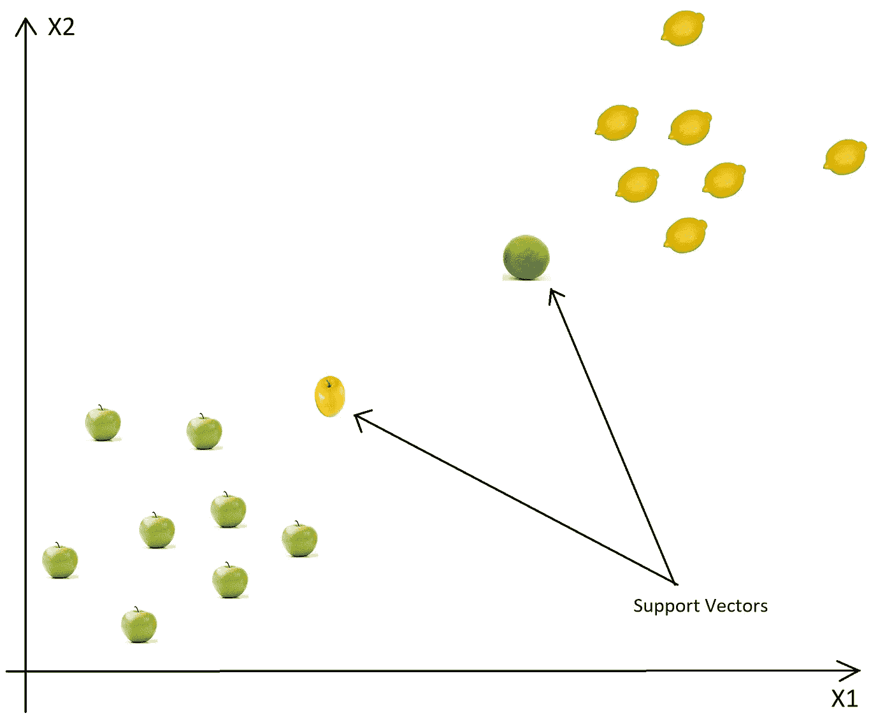

当我们从左到右，所有的例子将被归类为苹果，直到我们到达黄色的苹果。从这一点来看，新示例是苹果的置信度下降，而柠檬类的置信度增加。当柠檬类置信度变得大于苹果类置信度时，新示例将被分类为柠檬(介于黄色苹果和绿色柠檬之间)。

基于这些支持向量，该算法试图找到分隔类别的最佳超平面**。在 2D，超平面是一条线，所以它看起来像这样:**

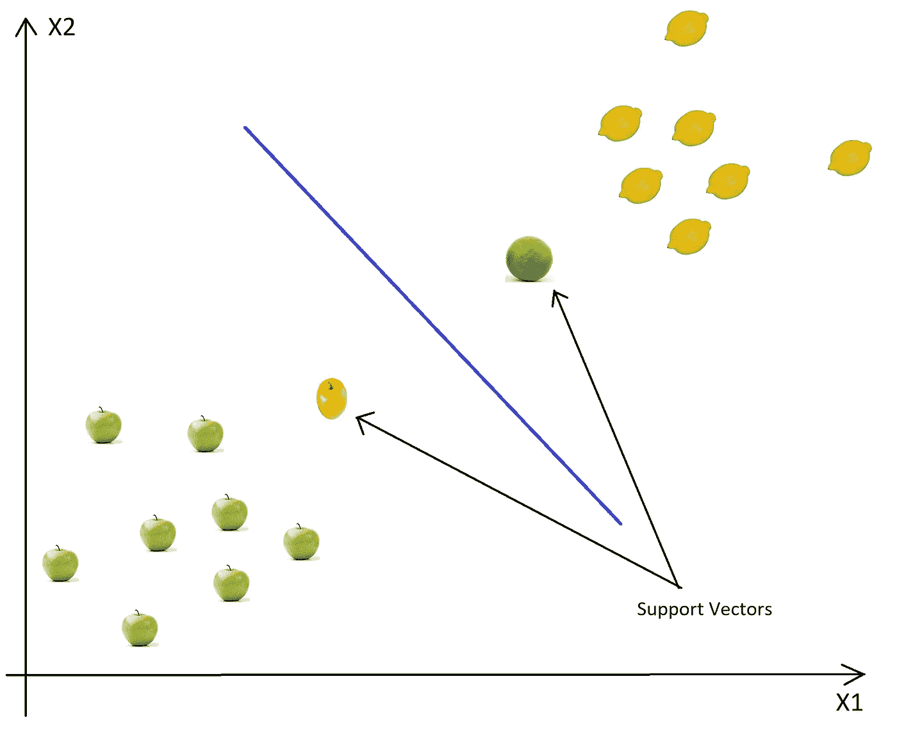

好的，但是**为什么我把蓝色的边界画成上面图片** **的样子？**我也可以画出这样的界限:

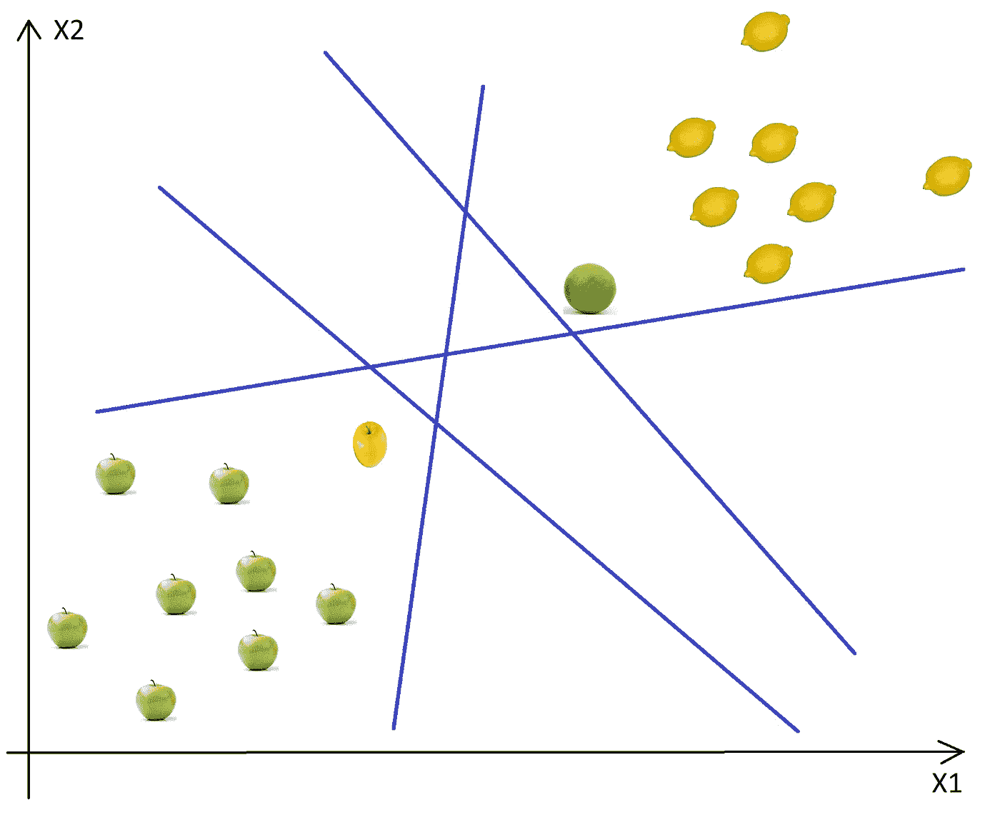

如你所见，我们有**无限的可能性来画出决策边界**。那么如何才能找到最优的呢？

# 寻找最优超平面

直觉上，最佳线**是远离苹果和柠檬示例**的线**(具有最大的余量)。为了获得最优解，我们必须**以两种方式最大化利润**(如果我们有多个类别，那么我们必须考虑每个类别来最大化利润)。**

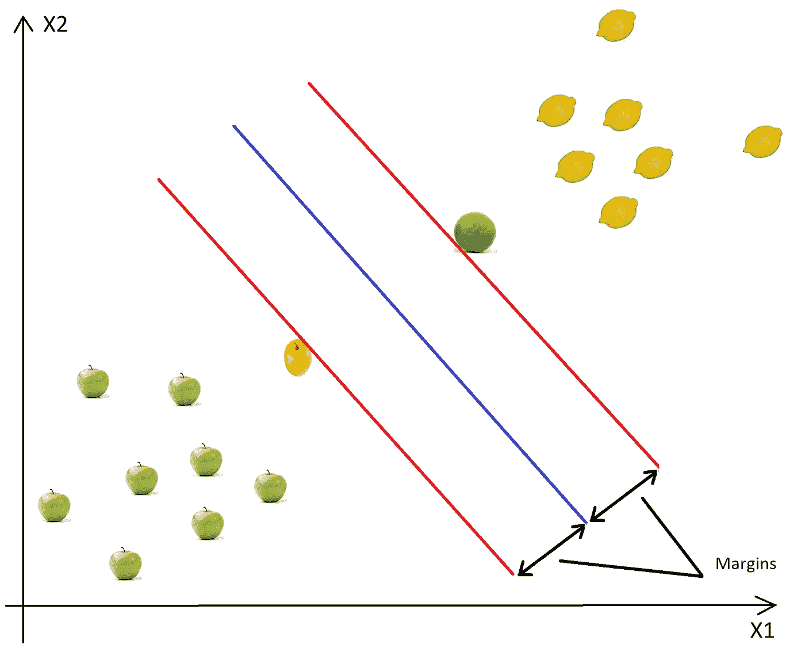

因此，如果我们将上面的图片与下面的图片进行比较，我们可以很容易地观察到，第一个是最优超平面(线)，第二个是次优解，因为边缘要短得多。

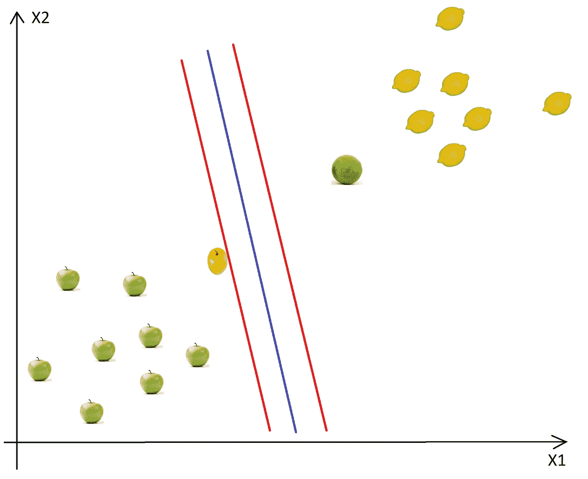

因为我们想要最大化考虑到所有类**的边距，而不是为每个类使用一个边距**，我们使用考虑到所有类**的“全局”边距、**。该边距看起来像下图中的紫色线:****

**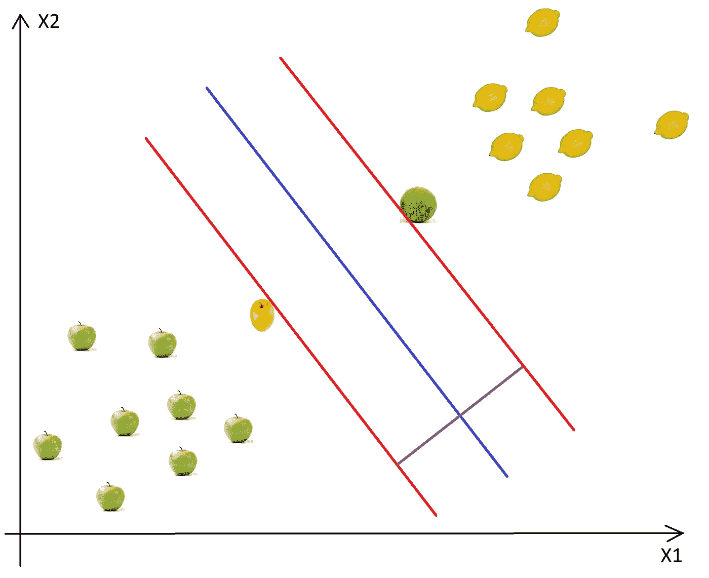**

**这个边距与边界的**正交**，与支持向量的**等距**。**

**那么向量在哪里呢？每个计算(计算距离和最佳超平面)都在**矢量空间**中进行，因此每个数据点都被视为一个矢量。空间**的**尺寸**由示例的属性**数量定义。为了理解背后的数学，请阅读这个简单的向量、超平面和优化的数学描述: [SVM 简洁地](https://www.svm-tutorial.com/)。**

**总之，**支持向量**是**定义超平面**的位置和边缘的数据点。我们称它们为**“支持”向量**，因为这些是类的代表性数据点，**如果我们移动它们中的一个，位置和/或边距将改变**。移动其他数据点不会影响超平面的边缘或位置。**

**为了进行分类，我们不需要所有的训练数据点(像在 KNN 的情况下)，我们只需要保存支持向量。在最坏的情况下，所有的点都将是支持向量，但这是非常罕见的，如果发生这种情况，那么你应该检查你的模型的错误或缺陷。**

**所以基本上**学习等同于寻找具有最佳余量的超平面**，所以这是一个简单的**优化问题**。**

# **基本步骤**

**SVM 的基本步骤是:**

1.  **选择**两个超平面**(在 2D)，这两个超平面将数据**分开，它们之间没有点**(红线)**
2.  ****最大化他们的距离**(边距)**
3.  ****平均线**(这里是两条红线中间的线)将是**决策边界****

**这很好也很容易，但是找到最佳余量，优化问题不是微不足道的(在 2D 很容易，当我们只有两个属性时，但是如果我们有 N 个维度，N 是一个非常大的数字呢)**

**为了解决优化问题，我们使用**拉格朗日乘数**。为了理解这个技巧，你可以阅读下面两篇文章:[二元 Langrange 乘数](https://www.svm-tutorial.com/2016/09/duality-lagrange-multipliers/)和[一个关于 Langrange 乘数为什么工作的简单解释](https://medium.com/@andrew.chamberlain/a-simple-explanation-of-why-lagrange-multipliers-works-253e2cdcbf74)。**

**到目前为止，我们有线性可分的数据，所以我们可以使用一条线作为类边界。但是如果我们不得不处理非线性数据集呢？**

# **非线性数据集的 SVM**

**非线性数据的一个例子是:**

**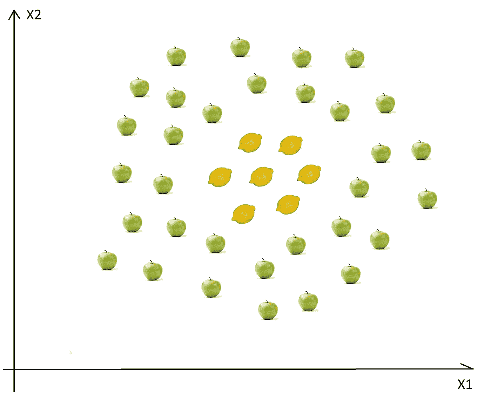**

**在这种情况下，我们找不到一条直线来区分苹果和柠檬。那么如何才能解决这个问题呢。我们将使用**内核技巧！****

**基本思想是，当一个数据集在当前维度上不可分时，**添加另一个维度**，也许这样数据将是可分的。想一想，上面的例子是在 2D，它是不可分的，但也许在 3D 中苹果和柠檬之间有一个间隙，也许有一个等级差异，所以柠檬在第一层，苹果在第二层。在这种情况下，我们可以很容易地在 level 1 和 level 2 之间绘制一个分离超平面(在 3D 中，超平面是一个平面)。**

# **映射到更高维度**

**为了解决这个问题，我们**不应该只是盲目地增加另一个维度**，我们应该转换空间，以便我们有意识地产生这种层次差异。**

# **从 2D 到 3D 的映射**

**让我们假设我们增加了另一个叫做 **X3** 的维度。另一个重要的转变是，在新的维度中，使用公式 **x1 + x2** 来组织点。**

**如果我们画出由 **x + y** 公式定义的平面，我们会得到这样的结果:**

**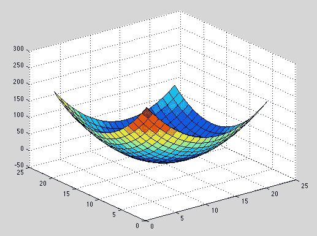**

**现在我们必须将苹果和柠檬(只是简单的点)映射到这个新空间。仔细想想，我们做了什么？我们刚刚使用了一个变换，其中**我们基于距离**添加了级别。如果你在原点，那么这些点将在最低层。当我们远离原点时，这意味着我们正在**爬山**(从平面的中心向边缘移动)，因此点的高度会更高。现在如果我们考虑原点是中心的柠檬，我们会得到这样的东西:**

**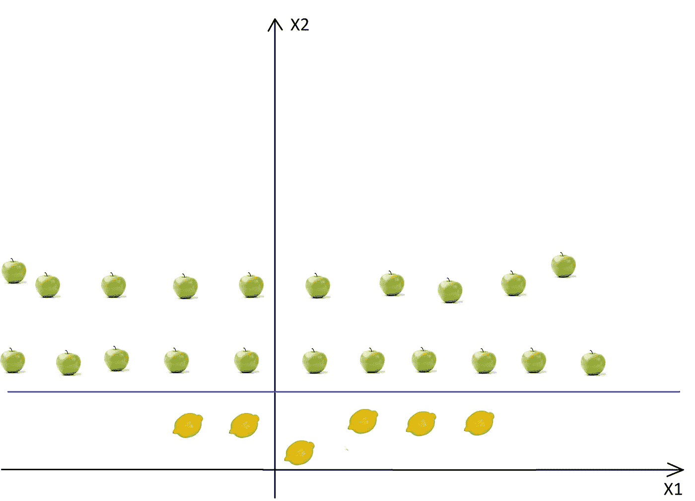**

**现在我们可以很容易地将这两个类分开。这些转换被称为**内核**。常见的核有:**多项式核、高斯核、径向基函数(RBF)、拉普拉斯 RBF 核、Sigmoid 核、Anove RBF 核**等(参见[核函数](https://data-flair.training/blogs/svm-kernel-functions/)或更详细的描述[机器学习核](https://mlkernels.readthedocs.io/en/latest/kernels.html))。**

# **从 1D 到 2D 的测绘**

**另一个在 2D 更容易的例子是:**

**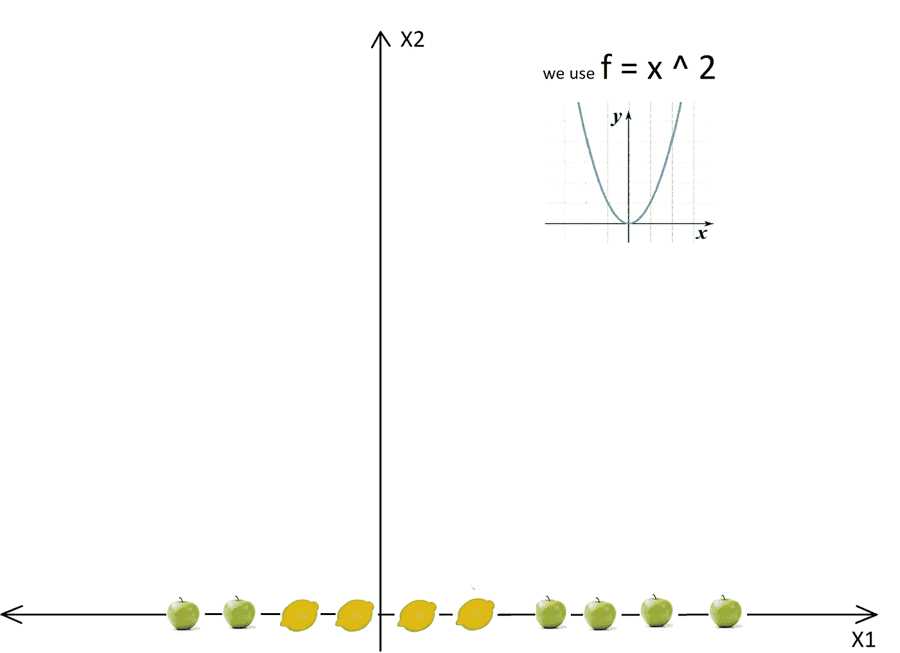**

**在使用了内核和所有的转换之后，我们将得到:**

**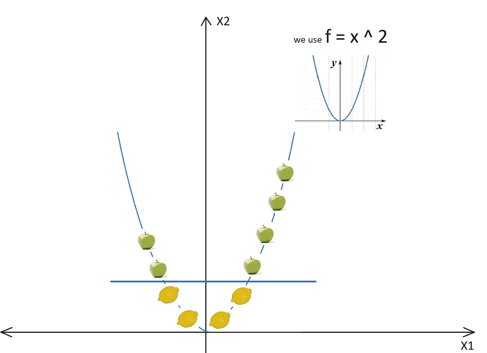**

**所以在转换之后，我们可以很容易地用一行代码来划分这两个类。**

**在现实生活中，我们不会有一条简单的直线，但我们会有很多曲线和高维数。在某些情况下，我们不会有两个超平面来分隔数据，它们之间没有点，所以**我们需要一些权衡，对异常值的容忍**。幸运的是，SVM 算法有一个所谓的**正则化参数**来配置权衡并容忍异常值。**

# **调谐参数**

**正如我们在上一节**中看到的，选择正确的内核至关重要**，因为如果转换不正确，那么模型的结果会非常糟糕。根据经验，**总是检查你是否有线性数据**，在这种情况下**总是使用线性 SVM** (线性内核)。**线性 SVM 是一个参数模型**，但 **RBF 核 SVM 不是**，因此后者的复杂性随着训练集的大小而增长。不仅**训练一个 RBF 核 SVM** 更昂贵，而且你还必须**保持核矩阵在**周围，并且**投影** **到**这个“无限的”**高维空间**中，在预测过程中，数据变成线性可分的**也更昂贵**。此外，您有**更多的超参数来调整**，因此模型选择也更加昂贵！最后，对复杂的模型进行过度拟合要容易得多！**

# **正规化**

****正则化参数**(python 中的**称之为** **C** )告诉 SVM 优化**你想要避免多少漏分类**每个训练示例。**

**如果 **C 比** **高**，那么优化会选择**更小的**超平面，所以训练数据**的漏检率会更低**。**

**另一方面，如果 **C 比** **低**，那么**的裕量将会大**，即使有**将会漏分类**训练数据的例子。这显示在以下两个图表中:**

**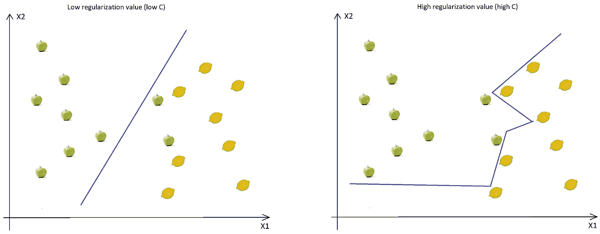**

**正如你在图中看到的，当 C 较低时，即使两个苹果被归类为柠檬，边距也较高(因此我们没有太多曲线，直线也没有严格遵循数据点)。当 C 高时，边界充满曲线，并且所有训练数据被正确分类。**不要忘记**，即使所有的训练数据都被正确分类，这并不意味着增加 C 将总是增加精度(因为过拟合)。**

# **微克**

**下一个重要参数是**伽马**。gamma 参数定义了**单个训练示例的影响达到**的程度。这意味着**高伽玛**将只考虑靠近可信超平面的点**，而**低伽玛** **将考虑距离**较远的点**。******

**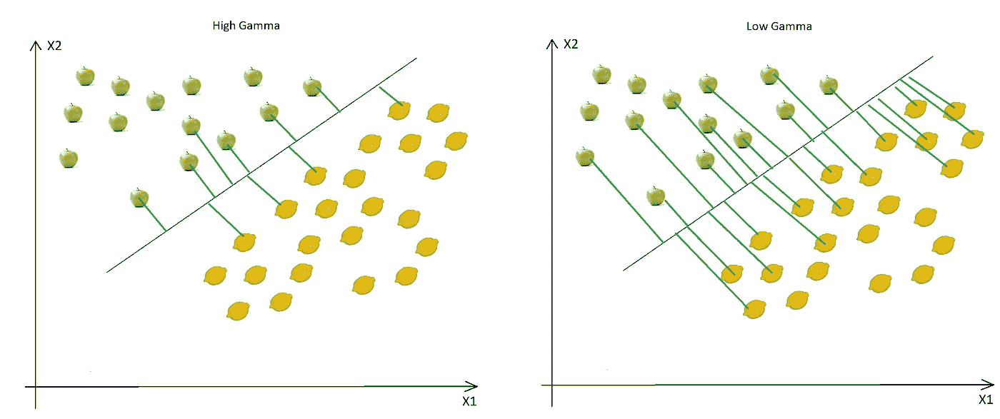**

**正如您所看到的，减少 Gamma 将导致寻找正确的超平面将考虑距离更远的点，因此将使用越来越多的点(绿线表示在寻找最佳超平面时考虑了哪些点)。**

# **边缘**

**最后一个参数是**余量**。我们已经讨论过利润率，**更高的利润率产生更好的模型**，因此更好的分类(或预测)。页边距应始终最大化**。****

# ****使用 Python 的 SVM 示例****

****在本例中，我们将使用 Social_Networks_Ads.csv 文件，该文件与我们在上一篇文章中使用的文件相同，参见 [KNN 使用 Python 的示例](http://dummyprogramming.com/stupid-simple-ai-series-knn/#knn-code-example)。****

****在这个例子中，我将只写下 SVM 和 KNN 之间的差异，因为我不想在每篇文章中重复我自己！如果你想要**完整的解释**关于我们如何读取数据集，我们如何解析和分割我们的数据，或者我们如何评估或绘制决策边界，那么请**阅读上一章的代码示例** ( [KNN](http://dummyprogramming.com/stupid-simple-ai-series-knn/#knn-code-example) )！****

****因为 **sklearn** 库是一个写得非常好、非常有用的 Python 库，所以我们没有太多代码需要修改。唯一的区别是我们必须从 **sklearn.svm** 中导入 **SVC** 类(在 sklearn 中 SVC = SVM ),而不是从 sklearn.neighbors 中导入 KNeighborsClassifier 类****

```
**# Fitting SVM to the Training set
from sklearn.svm import SVC
classifier = SVC(kernel = 'rbf', C = 0.1, gamma = 0.1)
classifier.fit(X_train, y_train)**
```

****导入 SVC 后，我们可以使用预定义的构造函数创建新模型。这个构造函数有很多参数，但我将只描述最重要的参数，大多数时候你不会用到其他参数。****

****最重要的参数是:****

1.  ******内核:**要使用的内核类型。最常见的内核是 **rbf** (这是默认值)、 **poly** 或者 **sigmoid** ，但是你也可以创建自己的内核。****
2.  ******C:** 这是在[调整参数](#tuning)部分描述的**正则化参数******
3.  ******伽玛:**这也在[调谐参数](#tuning)一节中描述****
4.  ******度数:**仅当选择的内核是 poly 时使用**并设置 polinom 的度数******
5.  ******概率:**这是一个布尔参数，如果为真，那么模型将为每个预测返回属于响应变量的每个类别的概率向量。所以基本上它会给你每个预测的置信度。****
6.  ******收缩:**这表示您是否想要一个**收缩启发式算法**用于您的 SVM 优化，该算法用于[顺序最小优化](https://www.microsoft.com/en-us/research/wp-content/uploads/2016/02/tr-98-14.pdf)。它的默认值是真的，一个**如果你没有很好的理由，请不要把这个值改成假的**，因为缩小会大大****提高你的性能**，对于非常**小的损失**而言**精度**在大多数情况下。******

****现在让我们看看运行这段代码的输出。训练集的决策界限如下所示:****

****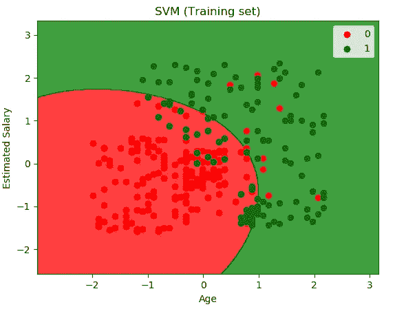****

****正如我们在[调谐参数](#tuning)部分所见，因为 C 值很小(0.1)，所以判定边界是平滑的。****

****现在，如果我们将 C 从 0.1 增加到 100，决策边界中将有更多曲线:****

****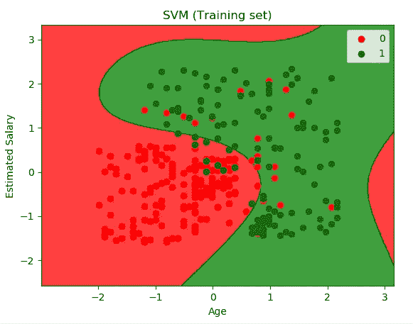****

****如果我们使用 C=0.1，但现在我们将 Gamma 从 0.1 增加到 10，会发生什么？让我们看看！****

****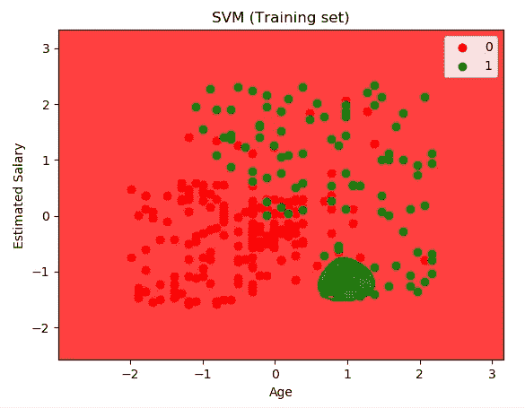****

****这里发生了什么？为什么我们会有这么差的模型？正如你在[调整参数](#tuning)部分看到的，**高伽玛**意味着当计算似是而非的超平面时，我们只考虑**靠近**的点。现在，因为绿色点**的**密度**仅在所选绿色区域**中较高，在该区域中，这些点足够接近似是而非的超平面，所以选择了这些超平面。小心 gamma 参数，因为如果将其设置为非常高的值(什么是“非常高的值”取决于数据点的密度)，这可能会对模型的结果产生非常坏的影响。****

**对于此示例，C 和 Gamma 的最佳值分别为 1.0 和 1.0。现在，如果我们在测试集上运行我们的模型，我们将得到下图:**

**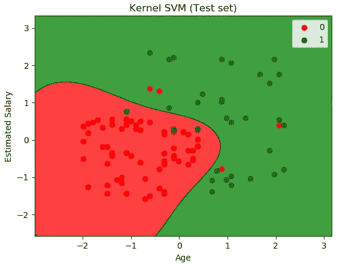**

**而**混淆矩阵**看起来是这样的:**

**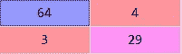**

**如你所见，我们只有 **3 个假阳性**和 **4 个假阴性**。该模型的**准确率**为 **93%** 这是一个非常好的结果，我们获得了比使用 [KNN](http://dummyprogramming.com/stupid-simple-ai-series-knn/) (准确率为 80%)更好的分数。**

****注意:**精确度不是 ML 中使用的唯一指标，也不是评估模型的最佳指标，因为[精确度悖论](/accuracy-paradox-897a69e2dd9b)。为了简单起见，我们使用这个指标，但是稍后，在章节**评估人工智能算法的指标**中，我们将讨论**准确性悖论**，并且我将展示该领域中使用的其他非常流行的指标。**

# **结论**

**在这篇文章中，我们看到了一个非常流行和强大的监督学习算法，**支持向量机**。我们已经学习了**的基本思想**，什么是**超平面**，什么是**支持向量**以及它们为什么如此重要。我们也看到了许多**视觉表现**，这有助于我们更好地理解所有的概念。**

**我们接触的另一个重要话题是**内核技巧**，它帮助我们**解决非线性问题**。**

**为了有一个更好的模型，我们看到了调整算法的技术。在文章的最后，我们有一个用 Python 编写的**代码示例，它向我们展示了如何使用 KNN 算法。****

**[](https://ko-fi.com/zozoczako)**

**我真的很喜欢咖啡，因为它让我有精力写更多的文章。**

****如果你喜欢这篇文章，那么你可以请我喝杯咖啡来表达你的欣赏和支持！****

**作为最后的想法，我想给出一些**的优点&缺点**和一些流行的**用例**。**

****成为媒介上的作家:**[https://czakozoltan08.medium.com/membership](https://czakozoltan08.medium.com/membership)**

# **赞成的意见**

1.  **SVN 可能非常有效，因为它只使用了训练数据的子集，只使用了支持向量**
2.  **在**较小的数据集、非线性数据集**和**高维空间**上运行良好**
3.  **在**维数大于样本数**的情况下**非常有效****
4.  **它可以有**高精度**，有时甚至可以比神经网络表现得更好**
5.  ****不**对过度配合非常**敏感****

# **骗局**

1.  **当我们有大量数据集时，训练时间很长**
2.  **当数据集有更多的**噪声**(即目标类别重叠)**时，SVM 表现不佳****

# **流行的使用案例**

1.  **文本分类**
2.  **检测垃圾邮件**
3.  **情感分析**
4.  **基于方面的识别**
5.  **基于方面的识别**
6.  **手写数字识别**

# **参考**

1.  **[了解 SVM](https://www.analyticsvidhya.com/blog/2017/09/understaing-support-vector-machine-example-code/)**
2.  **SVM:一个简单的解释**
3.  **SVM:理解数学**
4.  **[SVM 理论](https://medium.com/machine-learning-101/chapter-2-svm-support-vector-machine-theory-f0812effc72)**
5.  **[Udemy:机器学习 A-Z](https://www.udemy.com/machinelearning/learn/v4/t/lecture/5714406?start=0)**