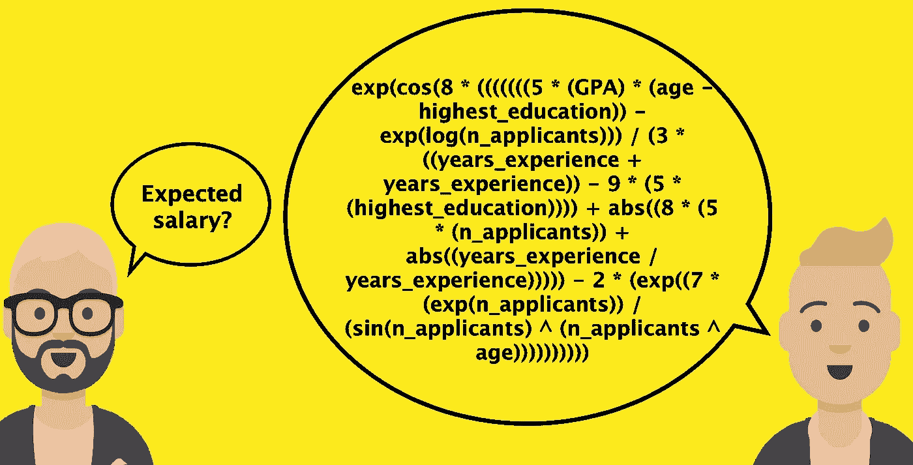
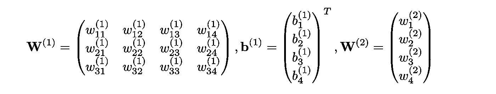
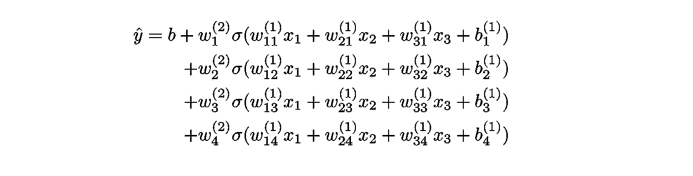
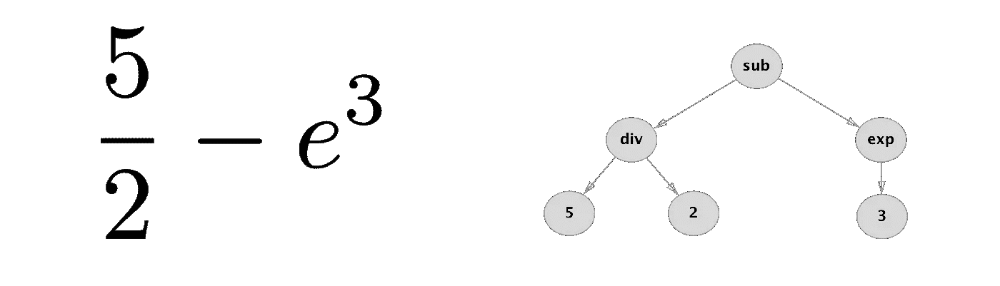
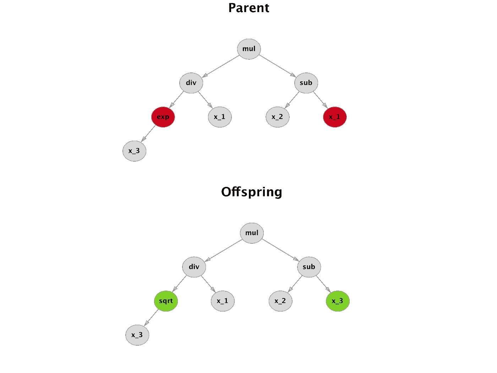
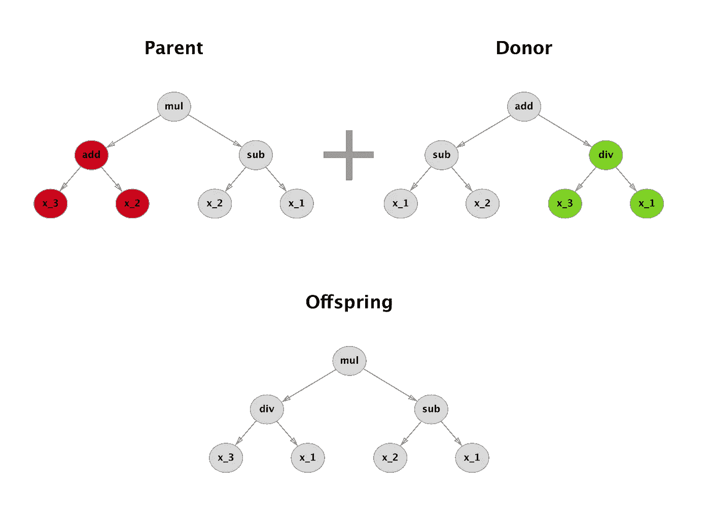
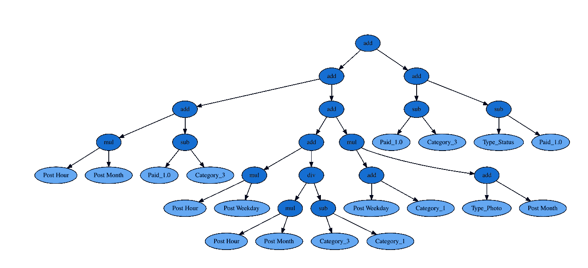

# 符号回归和遗传编程

> 原文：<https://towardsdatascience.com/symbolic-regression-and-genetic-programming-8aed39e7f030?source=collection_archive---------7----------------------->

符号回归和遗传编程远未成为主流的机器学习技术。然而，他们绝对值得相当多的关注。这篇文章是一个温和而非正式的介绍。

# 动机

想象一下，有人让你在不使用矩阵或求和符号的情况下，写下单输出神经网络的正向传递。啊？为了使事情变得简单，你可能会想到最普通的神经网络:具有一个隐藏层的多层感知器。所以在矩阵符号中，它看起来像这样

好的，为了去掉矩阵符号，你需要决定输入和隐藏层的大小。假设有 3 个输入特征和 4 个隐藏节点。所以你的矩阵是:

最后也是最乏味的一步是写出所有的东西，没有任何矩阵和求和符号

尽管这种表述非常不切实际，但它清楚地表明了一件重要的事情:预测只是对输入要素应用基本数学运算的结果。具体来说，这些操作是加法、乘法和合成。换句话说，我们把一堆代表数学运算的**符号表达式组合起来，希望得到正确的预测。**

这是一个转折。利用神经网络，人们试图找到所有的 *w* 和 *b* 的最优值，使得某个损失函数最小化。然而，另一个想法是修复所有的 *w* 和 *b* ，只改变符号表达式 iteself！或者换句话说，改变逼近器的函数形式。这正是**符号回归**的意义所在。改变自然可以有两种形式。您可以添加新的符号表达式(数学运算)或删除一些现有的符号表达式。

# 但是怎么做呢？

与优化权重不同，对于符号回归，以可以使用梯度下降技术的方式将问题公式化并不是微不足道的。但是，很容易评估单个表达式的性能。那么我们如何想出这种实现低损耗的神奇表达呢？进入**遗传编程**。

遗传编程(GP)和更臭名昭著的遗传算法(GA)之间的区别在于，GP 将解表示为树，而 GA 表示为字符串。使用树表示的主要原因是能够捕捉解决方案的内在结构。这与我们的应用非常相关，因为每个数学表达式都可以通过树来表示。参见下面的例子

可以基于回归度量(如均方误差或平均绝对误差)为每棵树分配适合度分数。对于 GP，还需要决定如何执行交叉和变异。有几种不同的方法可以做到这一点，但让我们只描述一种简单的方法。

对于突变，最简单的程序是所谓的点突变。树的随机节点被选择和改变。需要注意节点类型，因为一个节点可以表示不同的操作(一元、二元、…)。

交叉使用 2 个具有高适应值的解决方案，并尝试将它们结合起来。标准的方法是从捐献者那里得到一个随机的子树，并把它插入到父树的随机子树中。

# gplearn

当然，你可以自己编码所有的东西，但是已经有一些开源包关注这个主题了。我能找到的最好的一个叫做 **gplearn** 。它最大的优点是它遵循了 scikit-learn API ( `fit`和`transform` / `predict`方法)。

它实现了两个主要的算法:回归和转换。对于回归，适应度函数只是一个度量，如均方误差或平均绝对误差。然而，transformer 通过尝试最大化等于相关性(spearman 或 pearson)的适应度函数，从原始特征中创建新特征。

一旦安装完毕，用户可以通过属性`_program`检查最佳解决方案。请注意，有多个超参数可以定制演进的所有主要部分。我鼓励你阅读官方文档并熟悉其中的一些，特别是如果你想防止像过度拟合这样的事情发生，或者如果你只是想寻求加速。

# 脸书度量数据集

为了说明 gplearn 在实践中是如何工作的，让我们从 UCI 机器学习库中取一个名为脸书度量的玩具数据集([链接](http://archive.ics.uci.edu/ml/datasets/Facebook+metrics))。它是根据一个未公开的化妆品品牌脸书·佩奇设计的。参见下面感兴趣的属性。

目标`Total Interactions`是一个帖子发布后获得的所有赞、分享和评论的总和。我们应用一些预处理，然后训练符号回归器。为了简单起见，只启用默认的二元运算:`add`、`sub`、`mul`、`div`。20 代之后最合适的解决方案如下。

> *add(add(mul(Post Hour，Post Month)，sub(payed _ 1.0，Category_3))，add(add(mul(Post Hour，Post Weekday)，div(mul(Post Hour，Post Month)，sub(Category_3，Category_1))，mul(add(Post Weekday，Category_1)，add(Type_Photo，Post Month)))，add(sub(payed _ 1.0，Category_3)，sub(Type_Status，payed _ 1.0)))*

显然，这种文本格式对于可视化来说不是最佳的。请参见下面的树形图。

嗯，这到底是什么意思？我如何最大化互动？嗯，这并不重要。符号回归的输出很难理解但是加油，真的很酷！

如果你想看实施细节和与标准回归的比较，请随意查看笔记本[这里](https://github.com/jankrepl/symbolic-regression-genetic-programming/blob/master/main.ipynb)。

# 附言（同 postscript）；警官（police sergeant）

我第一次接触符号回归是在 Kaggle ( [example_1](https://www.kaggle.com/scirpus/genetic-programming-lb-0-0643904) 和 [example_2](https://www.kaggle.com/scirpus/genetic-programming-lb-0-88) )上浏览公共内核的时候。期待一些精心制作的代码片段，当我看到这些可怕的公式设法在官方排行榜上获得非常体面的分数时，我忍不住笑了。

# 参考

1.  约翰·科扎，《基因编程是通过自然选择为计算机编程的一种方式》统计与计算 4，第 2 期(1994):87–112
2.  (莫罗等人，2016 年)莫罗，s .，丽塔，p .，&瓦拉，B. (2016 年)。预测社交媒体性能指标和评估对品牌建设的影响:一种数据挖掘方法。商业研究杂志，69(9)，3341–3351。
3.  [gplearn 文档](http://gplearn.readthedocs.io/en/stable/)

**更新:**2018 年 7 月 2 日

*原载于 2018 年 7 月 2 日*[*jank repl . github . io*](https://jankrepl.github.io/symbolic-regression/)*。*