# 符号拼写与 BK 树:模糊字符串搜索和拼写检查快 100 倍

> 原文：<https://towardsdatascience.com/symspell-vs-bk-tree-100x-faster-fuzzy-string-search-spell-checking-c4f10d80a078?source=collection_archive---------0----------------------->

传统智慧和教科书说 [BK 树](https://en.wikipedia.org/wiki/BK-tree)特别适合拼写纠正和模糊字符串搜索。但这真的成立吗？

在我的[博客上关于拼写纠正的评论](https://seekstorm.com/blog/1000x-spelling-correction/)中，BK-tree 也被认为是一种优秀的模糊搜索数据结构。

所以我决定将 BK-tree 与其他选项进行比较和基准测试。

# 近似字符串搜索算法

近似字符串搜索允许在字符串列表中查找一个字符串，并根据特定的[字符串度量](https://en.wikipedia.org/wiki/String_metric)返回那些相近的字符串。

有许多不同的字符串度量，如 [Levenshtein](https://en.wikipedia.org/wiki/Levenshtein_distance) 、 [Damerau-Levenshtein](https://en.wikipedia.org/wiki/Damerau%E2%80%93Levenshtein_distance) 、 [Hamming distance](https://en.wikipedia.org/wiki/Hamming_distance) 、 [Jaro-Winkler](https://en.wikipedia.org/wiki/Jaro%E2%80%93Winkler_distance) 和[Strike match](http://www.catalysoft.com/articles/StrikeAMatch.html)。

我将比较四种不同的算法，根据 [Damerau-Levenshtein](https://en.wikipedia.org/wiki/Damerau%E2%80%93Levenshtein_distance) 字符串度量在最大[编辑距离](https://en.wikipedia.org/wiki/Edit_distance)内查找字符串列表中的一个字符串。

对于拼写校正，可以使用与每个术语相关联的额外的**词频**来进一步对结果(建议)进行分类和过滤。

*还可以实现一种* ***加权编辑距离*** *，给予在键盘布局上彼此接近或发音相似的对以更高的优先级(例如*[*Soundex*](https://en.wikipedia.org/wiki/Soundex)*或其他* [*语音算法*](https://en.wikipedia.org/wiki/Phonetic_algorithm) *，其识别相同发音的不同拼写)。同时还有一个* [*SymSpell 实现带权重的 Damerau-Levenshtein 编辑距离/keyboard-distance*](https://github.com/searchhub/preDict)*，* ***这个带权重的编辑距离超出了本文的重点*** *。它可以作为一个后处理步骤添加到最近似的字符串搜索算法中，只需根据您的偏好对由 Damerau-Levenshtein 编辑距离过滤的初步结果重新进行优先级排序/排序。*

所有算法都努力实现相同的目标，以实现较短的查找时间:**减少查找和比较**(在单词和/或人工生成的候选词之间)，可能**进一步减少完整编辑距离计算**的数量，最后**减少编辑距离计算**本身的计算复杂性，同时不损害其准确性。

我想要比较和评测的四种不同算法是:

*   诺维格拼写校正器
*   [BK 树(布尔夏德-凯勒树)](https://en.wikipedia.org/wiki/BK-tree)
*   [SymSpell](https://github.com/wolfgarbe/symspell) (对称删除拼写纠正算法)
*   [LinSpell](https://github.com/wolfgarbe/LinSpell) (线性搜索拼写纠正算法)

# 莱文斯坦编辑距离变化

所有四种算法都使用 Levenshtein 编辑距离的导数。
有三种不同的 levenshtein 距离:

*   [Levenshtein 距离](https://en.wikipedia.org/wiki/Levenshtein_distance):相邻换位(AC- > CA)计为 2 次编辑。**三角形不等式确实成立**。
*   [受限 Damerau-Levenshtein 距离](https://en.wikipedia.org/wiki/Damerau%E2%80%93Levenshtein_distance)(最优字符串对齐算法):相邻换位计为 1 次编辑，但子字符串不能编辑多次:ed("CA "，" ABC") =3。**三角形不等式不成立**。
*   [真实 Damerau-Levenshtein 距离](https://en.wikipedia.org/wiki/Damerau%E2%80%93Levenshtein_distance):相邻的变调算作 1 次编辑，子串可以编辑多次:ed("CA "，" ABC") =2。**三角形不等式确实成立**。

**Norvig 的算法**正在使用**真实 Damerau-Levenshtein** 编辑距离。它可以被修改以使用 Levenshtein 距离。

Xenopax 的 **BK 树** [实现正在使用 **Levenshtein** 编辑距离。可以对其进行修改，以使用真实的 Damerau-Levenshtein 编辑距离，而不是受限的 Damerau-Levenshtein 编辑距离，其中 BK 树所需的](https://nullwords.wordpress.com/2013/03/13/the-bk-tree-a-data-structure-for-spell-checking/)[三角形不等式不成立](https://cstheory.stackexchange.com/questions/18535/spell-checker-with-bk-tree-and-edit-distance-that-accounts-for-transpositions)。

**符号**正在使用**受限的 Damerau-Levenshtein** 编辑距离。可以修改它以使用 Levenshtein 距离或真实的 Damerau-Levenshtein 距离。

**LinSpell** 正在使用**限制的 Damerau-Levenshtein** 编辑距离。可以修改它以使用 Levenshtein 距离或真实的 Damerau-Levenshtein 距离。

# 搜索结果的详细程度

在我们的测试中，我们区分了**搜索结果的三种详细程度**，这将导致**不同的查找时间**:

**0 级:**只返回最大编辑距离内编辑距离最小的结果。如果存在多个具有相同编辑距离的结果，则返回具有最高词频的结果。这允许提前终止搜索，例如，如果找到编辑距离=0 的结果。

**第一级:**返回最大编辑距离内编辑距离最小的所有结果。如果存在多个具有相同编辑距离的结果，则返回所有按词频排序的结果。这允许提前终止搜索，例如，如果找到编辑距离=0 的结果。

**二级:**返回最大编辑距离内的所有结果，按词频排序。这不允许提前终止搜索。

# 诺维格拼写矫正器

这个想法是，如果我们人为地从拼写错误的术语中生成最大编辑距离内的所有术语，那么正确的术语一定在其中。我们必须在字典中查找它们，直到找到匹配的为止。因此，生成了 4 种拼写错误类型(插入、删除、替换和相邻转换)的所有可能组合。这是非常昂贵的，例如，对于长度=9 和编辑距离=2 的单词生成 114，324 个候选项。

原来是用 Python 写的[。对于基准测试，我使用了来自 Lorenzo Stoakes 的忠实的](http://norvig.com/spell-correct.html) [C#端口](https://github.com/lorenzo-stoakes/spell-correct/blob/master/cs/faith.cs)，这是 Peter Norvig 的算法，已经扩展到支持编辑距离 3。

# BK 树

[BK 树](https://en.wikipedia.org/wiki/BK-tree)利用了[三角形不等式](https://en.wikipedia.org/wiki/Triangle_inequality)，Levenshtein 编辑距离的一个性质:Levenstein(A，B)+Levenstein(A，C)≥Levenstein(B，C)和 Levenstein(A，B)——leven stein(A，C)≤Levenstein(B，C)。

**在索引**期间，Levenshtein(根节点，子节点)是预先计算好的。

**在查找**期间，我们计算 Levenshtein(输入，根节点)。[三角形不等式](https://en.wikipedia.org/wiki/Triangle_inequality)用作过滤器，仅递归地跟随那些预先计算的 Levenstein(根节点，子节点)在范围[Levenstein(输入，根节点)-dmax，Levenstein(输入，根节点)+dmax]内的子节点。

有几个有趣的帖子详细讨论了 BK 树:

*   [BK 树——一种用于拼写检查的数据结构](https://nullwords.wordpress.com/2013/03/13/the-bk-tree-a-data-structure-for-spell-checking/)
*   [有趣的数据结构:BK 树](http://signal-to-noise.xyz/post/bk-tree/)
*   [有趣的数据结构:BK 树(HN 讨论)](https://news.ycombinator.com/item?id=14022424)
*   [该死的酷算法，第一部分:BK 树](http://blog.notdot.net/2007/4/Damn-Cool-Algorithms-Part-1-BK-Trees)
*   [BK-Tree |简介&实现](http://www.geeksforgeeks.org/bk-tree-introduction-implementation/)
*   [在 Clojure 中实现 BK 树](http://blog.mishkovskyi.net/posts/2015/Jul/31/implementing-bk-tree-in-clojure)
*   [BK-tree](https://github.com/vy/bk-tree)

我比较了 BK 树的三种 C#实现

*   BK-tree 1([tgriffith](https://github.com/tgriffith/Spellcheck/blob/master/BK-Tree/BKTree.cs)的 C#实现)
*   BK-tree 2([TarasRoshko](https://github.com/TarasRoshko/fast-fuzzy-matching/blob/master/src/FFM/FFM/BKTree/BKTree.cs)的 C#实现)
*   BK-tree 3([xeno Pax 的 C#实现](https://nullwords.wordpress.com/2013/03/13/the-bk-tree-a-data-structure-for-spell-checking/))

并决定使用 Xenopax (也是从维基百科链接的)中最快的[作为基准。](https://github.com/TarasRoshko/fast-fuzzy-matching/blob/master/src/FFM/FFM/BKTree/BKTree.cs)

# 符号拼写算法

SymsSpell 是一种算法，可以在很短的时间内从一个巨大的字符串列表中找到最大编辑距离内的所有字符串。它可以用于拼写纠正和模糊字符串搜索。

SymSpell 从**对称删除拼写纠正算法**中获得其速度，并通过**前缀索引**检查其内存需求。

[**对称删除拼写校正算法**](https://seekstorm.com/blog/1000x-spelling-correction/) 降低了给定 Damerau-Levenshtein 距离的编辑候选生成和字典查找的复杂性。它比删除+转置+替换+插入的标准方法快六个数量级，并且与语言无关。

与其他算法相反，只需要删除，不需要转置+替换+插入。输入术语的转置+替换+插入被转换成字典术语的删除。替换和插入的开销很大，并且依赖于语言:例如，中文有 70，000 个 Unicode 汉字！

速度来自于廉价的**只删除编辑候选生成**和**预计算**。在最大编辑距离为 3 的范围内，一个平均 5 个字母的单词有大约**300 万个可能的拼写错误**，但是 SymSpell 只需要生成 **25 个删除**来覆盖所有这些错误，在预计算和查找时都是如此。神奇！

**前缀索引**背后的思想是，附加字符的**区分能力随着单词长度**而降低。因此，通过将删除候选生成限制到前缀，我们可以节省空间，而不会过多地牺牲过滤器效率。在基准测试中，使用了三种不同的前缀长度 lp=5、lp=6 和 lp=7。它们反映了搜索速度和索引大小之间的不同折衷。**更长的前缀长度意味着更高的搜索速度，代价是更大的索引大小**。

SymSpell 的 [C#源代码在 GitHub](https://github.com/wolfgarbe/symspell) 上开源发布。

# 林拼

这基本上是对单词列表的线性扫描，并计算每个单词的编辑距离(稍作调整)。它旨在作为基准的基线度量。令人惊讶的是，尽管它具有 O(n)的特性，但结果却优于 BK-tree 和 Norvig 的算法。

这有几个原因:

*   不要低估大 O 符号中的常数。仅访问 BK-树中 20%的节点比原子成本仅为 10%的线性搜索更昂贵。
*   因为 Damerau-Levenshtein 计算非常昂贵，所以重要的不是处理的单词的数量，而是我们需要完整的 Damerau-Levenshtein 计算的单词的数量。如果我们可以从计算中预先过滤单词，或者一旦达到某个编辑距离就终止计算，我们就可以加速搜索。
*   如果我们将搜索限制为最佳匹配，我们可以利用提前终止搜索的选项。
*   没有拼写错误的单词是常见的情况。然后可以用 O(1)中的哈希表或 trie 进行查找！如果我们将搜索限制在最佳匹配，我们可以立即终止搜索。
*   如果 Abs(word ),我们不需要计算编辑距离。长度-输入。Length)>最大编辑距离(或目前为止找到的最佳编辑距离，如果我们将搜索限制为最佳匹配)
*   如果我们将搜索限制为最佳匹配，那么一旦达到目前找到的最佳编辑距离，我们就可以终止编辑距离计算。
*   如果我们将搜索限制为最佳匹配，并且我们已经找到了一个编辑距离=1 的匹配，那么如果所讨论的项的计数小于已经找到的匹配的计数，我们就不需要计算编辑距离。

LinSpell 的 [C#源代码在 GitHub](https://github.com/wolfgarbe/LinSpell) 上开源发布。

# 测试设置

为了对**的四种近似字符串搜索算法**进行基准测试，我们对每种算法进行了 **2*3*3+2*2 测试**

**1000 个有随机拼写错误的单词**搜索**两个字典大小**(29159 个单词，500000 个单词)**三个最大编辑距离** (2，3，4) **和三个冗长类型** (0，1，2)。对于每个测试，测量**总搜索时间**。

对于**两种字典大小** (29，159 个单词，500，000 个单词)，测量创建字典和辅助数据结构所需的**预计算时间**及其**内存消耗**。

对于四种算法中的每一种，已对发现的建议进行了比较，以确保结果的**完整性。**由算法使用的不同 Levenshtein 变量导致的结果差异已被考虑在内。

# 测试重点和限制

基准测试将最大编辑距离限制为 4，因为对于自然语言搜索，4 的编辑距离已经接近合理范围，因为误报的数量随着最大编辑距离呈指数增长，精度下降，而召回率仅略有提高。

该基准被限制在 50 万字以内，因为即使是 20 卷的牛津英语词典也只有 171，476 个当前使用的单词和 47，156 个过时的单词。

使用较长字符串或位向量(图像、语音、音频、视频、DNA 序列、指纹等)的模糊搜索超出自然语言搜索，可能需要更长的编辑距离和更大的字典大小，并导致不同的结果。

模糊搜索多个单词(产品/事件数据库)或更大的文本片段(剽窃检查)可能需要复合/分解和超出编辑距离的字符串度量，如[匹配](http://www.catalysoft.com/articles/StrikeAMatch.html)以考虑缺失和调换的单词。

这两个应用领域都超出了本文的重点。

# 测试数据

**嘈杂 _ 查询 _en_1000.txt**

对于查询，我们使用前 1000 个唯一的单词。来自 Norvig 的文字语料库 [big.txt](http://norvig.com/big.txt) 。

对于每个单词，在范围 0 内的随机编辑次数..选择 Min(word.length/2，4)。对于每个编辑，在单词内的**随机位置**应用一个**随机类型的编辑**(删除，插入**随机字符**，替换为**随机字符**，切换相邻字符)。编辑后不允许出现长度为< 2 的重复和单词。

**frequency _ dictionary _ en _ 30 _ 000 . txt**

这些是来自 Norvig 的文本语料库 [big.txt](http://norvig.com/big.txt) 的 29159 个独特的单词，以及它们在该语料库中的频率。

**frequency _ dictionary _ en _ 500 _ 000 . txt**

这些是来自谷歌图书 Ngram 数据[的英语一百万单词列表中最常见的 500，000 个单词，以及它们的频率。](http://storage.googleapis.com/books/ngrams/books/datasetsv2.html)

所有三个测试数据文件都在 GitHub 上发布。

*如果你想自己重现基准测试结果或者与另一种模糊字符串搜索算法进行比较，你也会在 Github 上找到* [*基准测试源代码*](https://github.com/wolfgarbe/SymSpell/blob/master/symspell.Benchmark/SymSpell.Benchmark.cs) *。*

# 基准测试结果

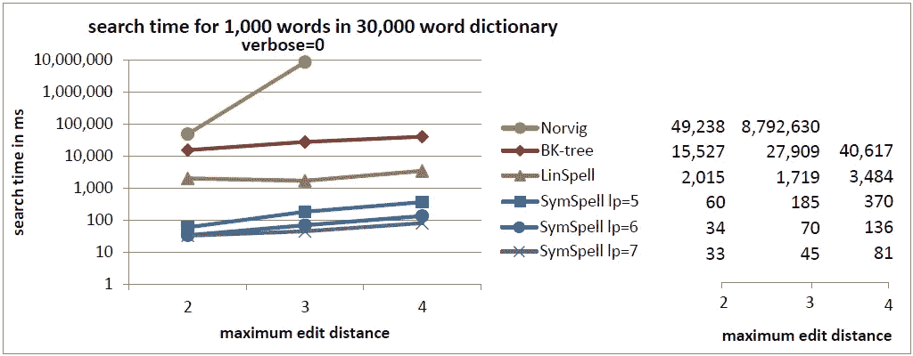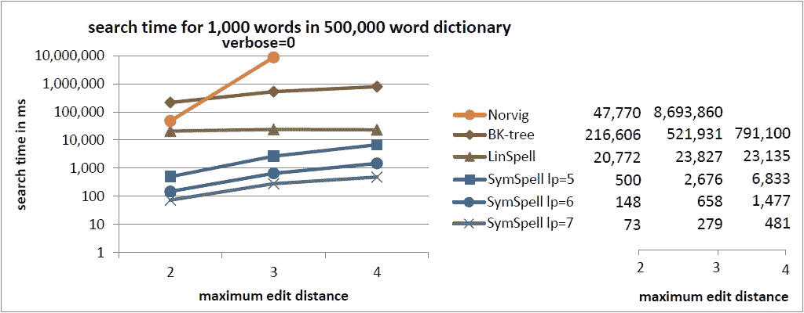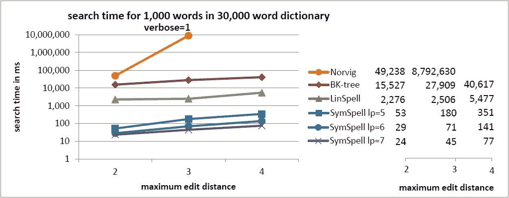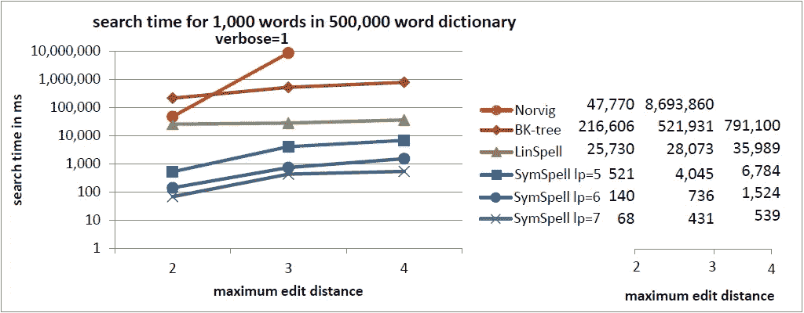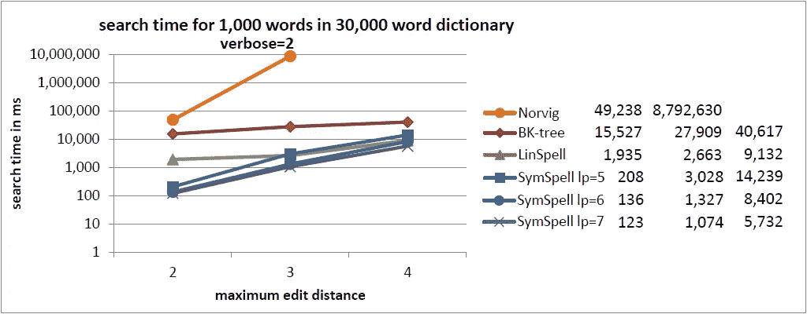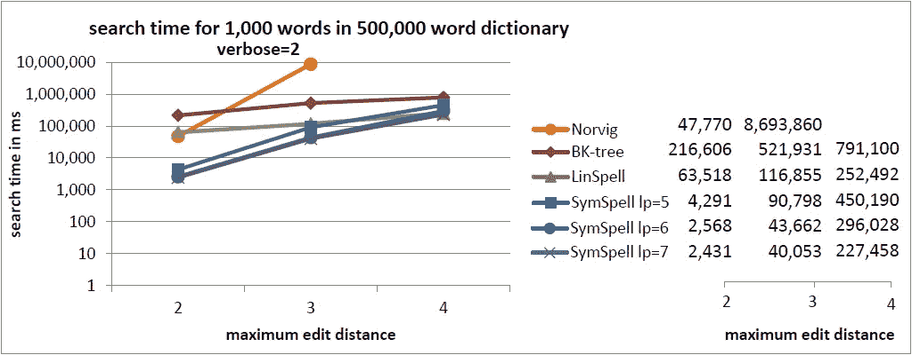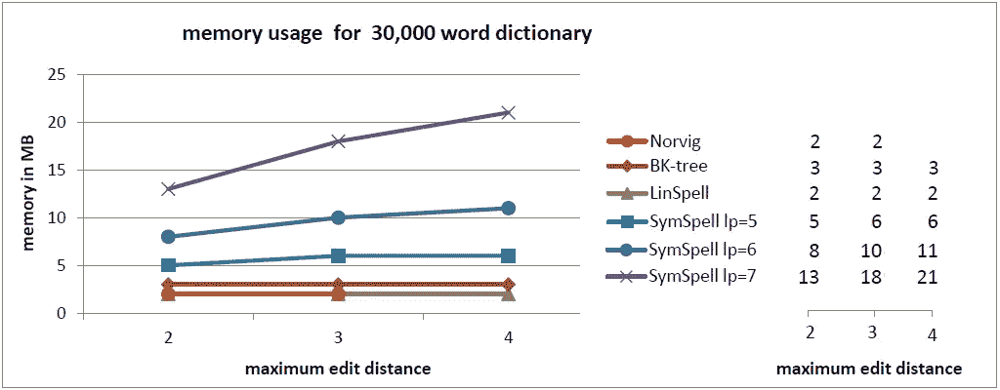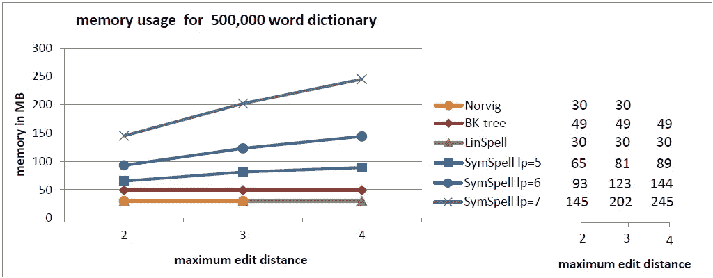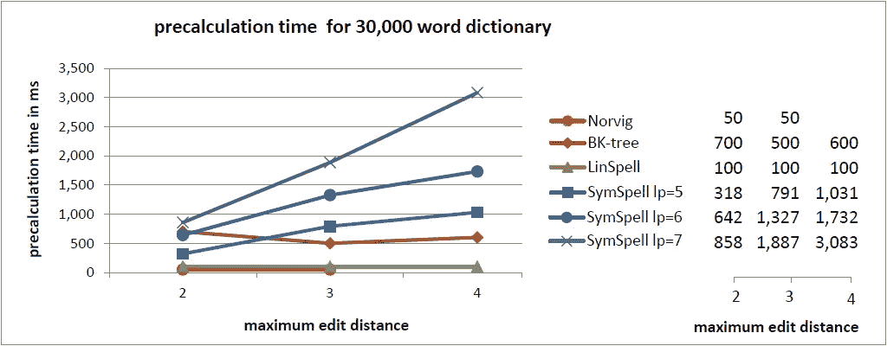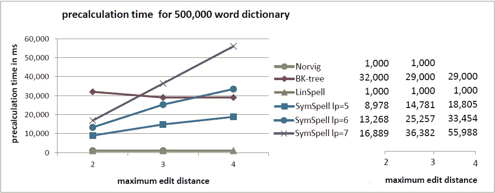

在当前的基准测试中，我们用一个**随机编辑距离** (0...最大编辑距离)。这样可以很好地理解**平均** **查找时间**。

在[之前的基准](https://seekstorm.com/blog/fast-approximate-string-matching/)中，我们用**固定编辑距离** (=最大编辑距离)来比较单词。这样可以很好地理解**最大** **查找时间**。[作为用户体验的衡量标准，平均值有时可能会产生误导](https://www.elastic.co/blog/averages-can-dangerous-use-percentile)。对于编辑距离=3 **，SymSpell 比 Norvig 的算法快 100 万倍**。

# 应用

符号拼写非常快。但是我们真的需要这样的速度吗？为什么？对于单个用户或小编辑距离，其他算法可能就可以了。但是对于搜索引擎和[搜索即服务搜索 API](https://seekstorm.com) 来说，您必须为成千上万的并发用户提供服务，同时仍然保持几毫秒的延迟，并且拼写纠正甚至不是主要的处理任务，而只是查询预处理中的许多组件之一，您需要最快的拼写纠正。

# 摘要

除了教科书和论坛上流传的历史原因和习惯之外，基准测试无法证实 BK-trees 和 Norvig 算法的广泛使用和推荐背后的任何基本原理。对于 SymSpell 和 LinSpell，有两种可供选择的算法，它们总能提供更好的结果，至少在这个测试的范围内。

*   **如果速度很重要，使用符号法术。比 BK-Tree 快 2-3 个数量级，比 Norvig 的算法**快 5-6 个数量级。随着字典大小和最大编辑距离的增加，符号拼写查找时间只会适度增加。在所有情况下，它都优于其他三种算法，通常高出几个数量级。这是以**更高的内存消耗和预计算时间**为代价的。预计算时间仅在程序/服务器启动期间产生一次，或者如果预计算数据被序列化/反序列化，甚至仅在程序开发期间产生一次。
*   如果内存使用很重要，使用 LinSpell。对于相同的内存使用，它比 BK-Tree 快 10 倍。LinSpell 查找时间随着字典的大小线性增长，但几乎与最大编辑距离无关。它几乎总是优于 BK-tree 和 Norvig 的算法。不会导致额外内存消耗和预计算时间。
*   **使用 BK 树没有明显的好处。在所有情况下，SymSpell 在速度方面优于它，LinSpell 在内存方面优于它。虽然 BK-tree 比 Norvig 的编辑距离算法> 2 快，但它比 LinSpell 或 SymSpell 慢得多。BK-tree 的性能很大程度上依赖于字典的大小，但是随着最大编辑距离的增加，它的增长是适度的。**
*   **nor vig 的算法没有明显的好处。在所有情况下，它在速度上优于 SymSpell 和 LinSpell，在内存上优于 LinSpell。**nor vig 算法的查找时间与字典的大小无关，但随最大编辑距离呈指数增长。
*   **始终小心使用 verbose = 2**(列举最大编辑距离内的所有建议，而不仅仅是编辑距离最小的建议)。它要慢得多，因为它防止了搜索的提前终止！

# 更新:

我收到了一封电子邮件，其中表达了对基准测试结果的一些**怀疑，并暗示该结果是由于所选 BK-tree **的**糟糕的 C#实现**，而不是 BK-tree 和 SymSpell 之间的算法差异**。我认为我已经非常小心地选择了 C#中最快的 BK-tree 实现**来防止这种怀疑。但是不可否认的是，有时确实很难区分算法或其实现对性能的贡献有多大。

我将添加一些**客观数据**:在字典中搜索期间完成的 Levenshtein 计算的平均**次数:**

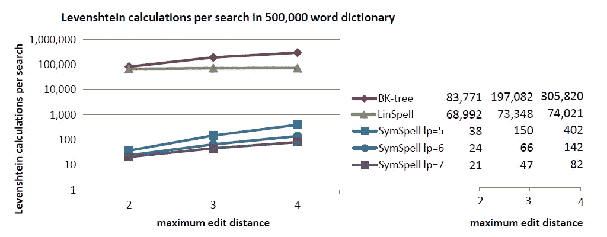

由于 **Levenshtein 计算是 BK-tree 和 SymSpell** 中搜索的最昂贵的组成部分，在给定大小的字典中搜索期间所需的 Levenshtein 计算的平均数量应该是算法、**的真实性能的**相当可靠的指标，独立于其实现**。**

而对于 BK 树，我们需要**计算词汇**(字典中的单词)的 17%到 61%的 Levenshtein 距离， **SymSpell 只需要计算词汇的 0.0042%到 0.016%** 的 Levenshtein 距离。这就是为什么 **SymSpell 的速度源于算法**的设计，而不是实现。

顺便说一下，我还测试了一个将 BK-tree 三角形不等式原理集成到 SymSpell 中的**集成，作为进一步减少/过滤所需 Levenshtein 计算数量的附加步骤。性能提升很少，但是由于字典生成期间的 Levenshtein 计算，增加了内存需求和预计算成本。**