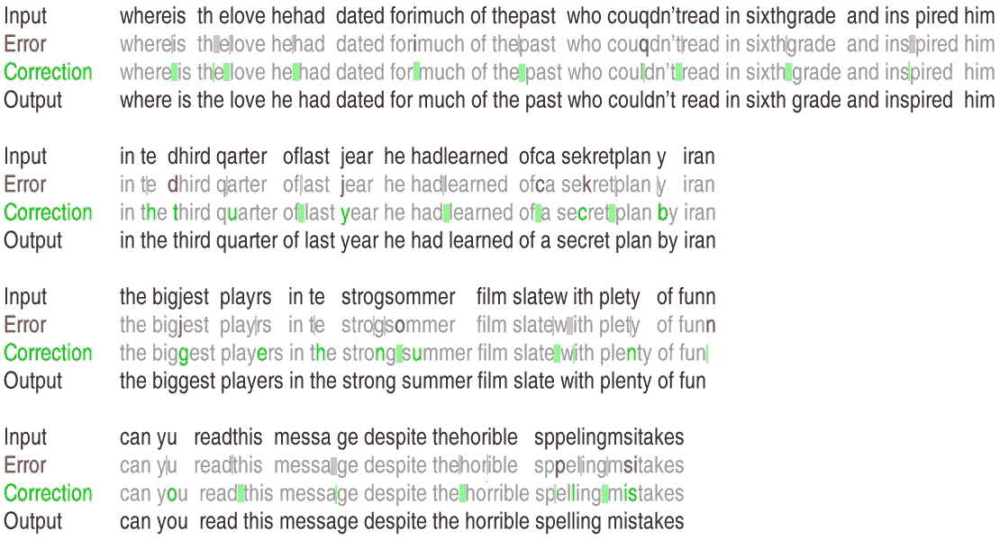

# 拼写纠正速度提高 1000 倍

> 原文：<https://towardsdatascience.com/symspellcompound-10ec8f467c9b?source=collection_archive---------0----------------------->

亚毫秒**复合**感知**自动拼写纠正**

Source: [https://www.flickr.com/photos/theredproject/3968278028](https://www.flickr.com/photos/theredproject/3968278028)

最近我被指向了两个关于拼写纠正的[有趣帖子](https://medium.com/@majortal/deep-spelling-9ffef96a24f6)(这里)。他们应用了一种深度学习方法，即现代的魔法石。从 [AlphaGo 赢得围棋冠军](https://www.tastehit.com/blog/google-deepmind-alphago-how-it-works/)、 [Watson 赢得 Jeopardy](https://www.technologyreview.com/s/539226/ibm-pushes-deep-learning-with-a-watson-upgrade/) 、[打击假新闻](https://techcrunch.com/2016/11/14/facebook-fake-news/)到[用奇点威胁人类](http://www.bbc.com/news/technology-30290540)，深度学习的普及程度真的很让人着迷。

问题是深度学习多工具是否会在每个领域超越并取代高度专业化的算法和数据结构，如果它们都值得拥有它们的位置，或者如果它们的互补优势结合起来，它们是否会发光。与此同时，最初对深度学习纠正拼写的热情随之而来的是一些幻灭。

他们求助于深度学习的原因是他们认为传统拼写检查的“糟糕透顶”的性能(估计拼写一个短单词需要 **~0.1 秒**)。

虽然到目前为止没有披露深度学习方法的纠正性能和内存消耗，但我知道拼写纠正可以比 0.1 秒快得多。

[SymSpell](https://github.com/wolfgarbe/symspell) ，基于[对称删除拼写纠正算法](https://seekstorm.com/blog/1000x-spelling-correction/)，在一台旧 MacBook Pro 上仅仅用了[**0.000033 秒**(编辑距离 2)**0.000180**秒(编辑距离 3)](https://seekstorm.com/blog/fast-approximate-string-matching/) 。

不过话说回来，他们的方法能够处理更复杂的表达式，比如**“爱在哪里”**！

SymSpell 总是期望单个输入项，并且不能纠正插入到单词中的**个空格或者两个单词**之间缺少的**个空格。**

我的好奇心被激起，我决定尝试在 SymSpell 上增加一个算法层来处理它。

# symspell 化合物

[SymSpellCompound](https://github.com/wolfgarbe/SymSpellCompound) 支持多单词输入字符串的复合感知自动拼写纠正。它建立在比 SymSpell 快 100 万倍的拼写纠正算法之上。

**1。复合分裂&分解**

SymSpell 假设每个输入字符串都是一个单独的术语。SymSpellCompound 支持*复合拆分/分解*三种情况:

1.  错误地在正确的单词中插入空格导致两个不正确的术语
2.  错误地**省略了两个正确单词之间的空格**导致了一个不正确的组合术语
3.  **多个输入项**有/无拼写错误

拆分错误、连接错误、替换错误、换位错误、删除错误和插入错误可以混合在同一个单词中。

**2。自动拼写纠正**

*   大型文档集合使得手动校正不可行，并且需要无人监督的全自动拼写校正。
*   在单个单词的常规拼写校正中，向用户呈现拼写校正建议。对于长的多单词文本的自动拼写校正，算法本身必须做出有根据的选择。

**例子:**

**工作原理**

*个人代币*

输入字符串被分割成标记。然后使用[对称删除拼写校正算法](https://seekstorm.com/blog/1000x-spelling-correction/)来单独获得每个单词的建议。

*组合令牌*

此外，检查每个二元模型(连续标记的级联对)的建议，但仅当两个连续标记中的一个不提供建议或最佳建议的编辑距离> 1 时。

如果建议(令牌 1+令牌 2 ),则建议组合令牌优先。编辑距离+1 < suggestion(token1).editDistance+suggestion(token2).editDistance

*分割令牌*

此外，还会生成一个标记的所有子标记对，但前提是该标记未合并，该标记由多个字符组成，并且该标记的最佳建议的 editDistance >0。

*字典生成*

词典质量对纠错质量至关重要。为了实现这一点，两个数据源通过交集进行了合并:

[Google Books Ngram data](http://storage.googleapis.com/books/ngrams/books/datasetsv2.html) ，其提供了代表性的**词频**，但是包含许多带有**拼写错误**和[怒容的条目——面向拼写检查器的词表](http://wordlist.aspell.net/)，其确保了真实的**英语词汇**但是**不需要词频**来对相同编辑距离内的建议进行排序。

**性能**

0.0002 秒/字
5000 字/秒(2012 Macbook Pro 上的单核)

**应用**

对于单个用户或小编辑距离，其他算法可能就可以了。但是对于搜索引擎和搜索即服务搜索 API，您必须为数千个并发用户提供服务，同时仍然保持几毫秒的延迟，并且拼写纠正甚至不是主要的处理任务，而只是查询预处理中的许多组件之一，您需要最快的拼写纠正。

*   查询校正([高达 **26%** 的网络查询包含拼写错误的术语](https://www.ncbi.nlm.nih.gov/pmc/articles/PMC2137159/))，
*   聊天机器人(例如使用符号拼写的[符号](https://blog.infermedica.com/three-challenges-youre-going-to-face-when-building-a-chatbot/)和[佛罗伦萨](https://blog.florence.chat/florence-gets-a-little-bit-more-intelligent-c280c20b1b45))，
*   OCR 后处理，
*   自动校对。

**频率字典**

[词频列表](https://github.com/wolfgarbe/SymSpellCompound/blob/master/wordfrequency_en.txt)是通过交叉下面提到的两个列表创建的。通过相互过滤，只使用那些同时出现在两个列表中的单词。应用了附加的过滤器，并且结果列表被截断为大约 80，000 个最频繁的单词。

*   [谷歌图书 Ngram 数据](http://storage.googleapis.com/books/ngrams/books/datasetsv2.html) [(许可)](https://creativecommons.org/licenses/by/3.0/):提供代表性词频
*   [怒容—面向拼写检查器的单词列表](http://wordlist.aspell.net/) [(许可)](http://wordlist.aspell.net/scowl-readme/):确保真正的英语词汇

**博客文章:算法、基准、应用**

[1000 倍快速拼写校正算法](https://seekstorm.com/blog/1000x-spelling-correction/)
[快速近似字符串匹配大数据中的大编辑距离](https://seekstorm.com/blog/fast-approximate-string-matching/)
[非常快速的数据清理产品名称、公司名称&街道名称](https://seekstorm.com/blog/very-data-cleaning-of-product-names-company-names-street-names/)

**待办事宜**

如果一个**拼写错误同时是一个有效单词**(例如消息 vs .消息)**，那么它当前没有被纠正**。

词频可以用于排名，但有时在给定的上下文中，罕见的词可能是正确的。

**二元模型概率**可以提供上下文，但上下文通常不是来自连续的术语，而是隐藏在文本的更远处。收集和存储滑动窗口内词汇表的所有术语组合的**同现概率可能是禁止的。**

我们可以求助于**语法**和**句子成分**和 [**语法网**](https://research.googleblog.com/2016/05/announcing-syntaxnet-worlds-most.html) 。

我们可以通过利用**键盘接近度**、**语音接近度**和作者过去的**个人词汇偏好**来猜测作者的意图/错误原因。

**正确时会出现误报**，但未知单词在其他已知单词的 editDistanceMax 内。