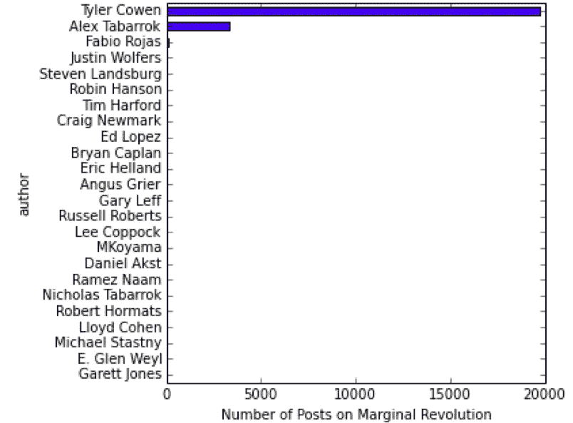
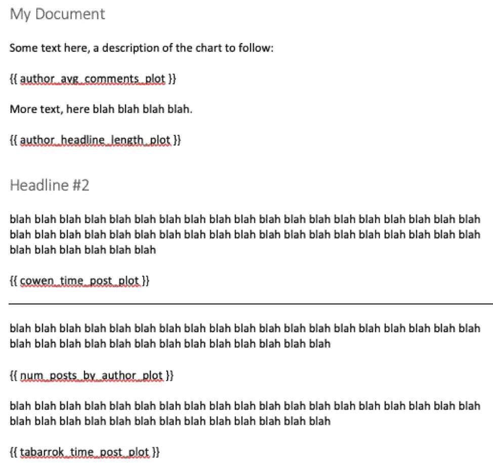
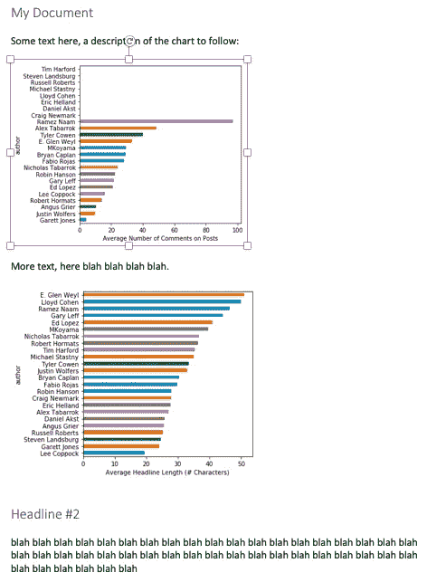

# 将 Jupyter 笔记本图表同步到 Microsoft Word 报表

> 原文：<https://towardsdatascience.com/syncing-your-jupyter-notebook-charts-to-microsoft-word-reports-187fc6cde5b6?source=collection_archive---------12----------------------->


Photo by [J-S Romeo](https://unsplash.com/photos/ywwoGCpczeM?utm_source=unsplash&utm_medium=referral&utm_content=creditCopyText) on [Unsplash](https://unsplash.com/search/photos/word-document?utm_source=unsplash&utm_medium=referral&utm_content=creditCopyText)

***情况是这样的*** :你正在 Jupyter 笔记本上做大数据分析。你有大量的图表，你想对它们进行报告。理想情况下，你可以在 Jupyter 笔记本上创建你的最终报告，它具有所有花哨的降价功能，并且能够将你的代码和报告保存在同一个地方。但问题是:大多数人仍然想要 Word 文档报告，并不关心您的代码、可复制性等。报道时，以最有用的形式向人们提供信息是很重要的。

因此，您有大量的图表和图形想要放入 Word 报告中——您如何保持两者同步呢？如果您的图表稍有变化(例如，更改报告中每个图表的样式)会怎样？您不得不从笔记本中复制和粘贴图表，这是一个手动、耗时且容易出错的过程。

在这篇文章中，我将向你展示我对这个问题的解决方案。它包括以下步骤:

*   **用代码将 Jupyter 笔记本上的图表图像保存到你的桌面上。**
*   **准备您的 Word 文档报告，在报告的适当位置引用您保存在桌面上的图像名称。**
*   **将图像加载到新版本的 Word 文档中。**

# 将 Jupyter 笔记本中的图表图像保存到桌面

第一步是收集您想要加载到报告中的图像，将它们从 Jupyter 笔记本保存到硬盘上的图像文件中。在这篇文章中，我将使用几个月前我的“[让我们刮一个博客](http://www.marknagelberg.com/lets-scrape-a-blog-part-1/)”文章中产生的数据和分析，在那里我刮了我最喜欢的博客[边际革命](https://marginalrevolution.com/)并做了一些简单的分析。

该分析使用 matplotlib 生成了一些简单的结果图表。为了将这些图像保存到您的桌面，matplotlib 提供了一个名为 savefig 的有用函数。例如，在该分析中生成的一个图表按作者查看了博客帖子的数量:



以下代码生成此图表，并将其保存到“report_images”文件夹中名为“num_posts_by_author_plot.png”的文件中。

关于这一步的几点建议:

*   *确保给你的图片起一个有用的、描述性的名字*。这有助于确保在 Word 文档中放置正确的引用。我个人喜欢遵循这样的惯例，即在代码中给绘图图像取与绘图对象相同的名称。
*   *您的图像必须有唯一的名称，否则第一个图像将被第二个图像覆盖*。
*   *为了保持有序，请将图像存储在专门为保存报告图像而设计的单独文件夹中*。

对我的其他图表重复类似的代码，我的 report_images 文件夹中只剩下 5 个图表图像:


# 准备带有图像引用的 Word 文档报告

有一个流行的微软 Word 文档包叫做 [python-docx](https://python-docx.readthedocs.io/en/latest/) ，它是一个很棒的库，可以用 Python 代码操作 Word 文档。但是，它的 API 不允许您在文档中间插入图像。

我们真正需要的是类似 Jinja2 for Word Docs 的东西:一个可以在文档中指定特殊占位符值，然后自动加载图像的包。嗯，幸运的是确实有这样一个包存在: [python-docx-template](https://docxtpl.readthedocs.io/en/latest/) 。它构建在 python-docx 和 Jinja2 之上，允许您在 Word 文档中使用类似 Jinja2 的语法(参见[我的另一篇关于使用 Jinja2 模板创建 PDF 报告的文章](http://www.marknagelberg.com/creating-pdf-reports-with-python-pdfkit-and-jinja2-templates/))。

要使用 python-docx-template 将图像导入 Word，很简单:只需在 Word 文档中使用常用的 Jinja2 语法{{ image_variable }}。在我的例子中，我有六张图片，我放在一起测试的 Word 模板看起来像这样:



为了让系统工作，您必须在{{ }}中使用与图像名称对齐的变量名(在'之前)。png ')和 Jupyter 笔记本中的绘图变量名。

# 将图像加载到文档中

最后也是最重要的一步是获取模板中的所有图像。为此，代码大致遵循以下步骤:加载 Word 文档模板，从 image 目录中加载图像作为 InlineImage 对象的 dict，在 Word 文档中呈现图像，并将加载的图像版本保存为新文件名。

下面是执行此操作的代码:

要运行代码，您需要指定 Word 模板文档、将包含图像的新 Word 文档名称以及存储图像的目录。

```
python load_images.py <template Word Doc Filename> <image-loaded Word Doc filename> <image directory name>
```

在我的例子中，我使用了以下命令，它接受模板 *template.docx* ，生成加载了图像的 Word 文档 *result.docx* ，并从文件夹 *report_images* 中获取图像:

```
python load_images.py template.docx result.docx report_images
```

瞧，加载了图像的 Word 文档看起来像这样:



你可以在 Github [这里](https://github.com/marknagelberg/load-images-to-word)找到我用来创建这个指南的代码。

*原载于 2018 年 12 月 2 日*[*【www.marknagelberg.com】*](http://www.marknagelberg.com/syncing-your-jupyter-notebook-charts-to-microsoft-word-reports/)*。你可以在推特上关注我* [*这里*](https://twitter.com/MarkNagelberg) *。要访问我共享的 Anki deck 和 Roam Research notes 知识库，以及关于间隔重复和提高学习效率的技巧和想法的定期更新，* [*加入“下载马克的大脑”。*](http://downloadmarksbrain.marknagelberg.com/auth)