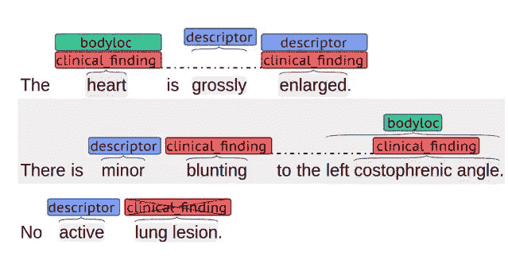
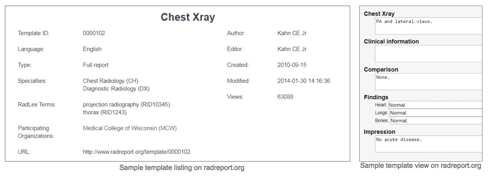
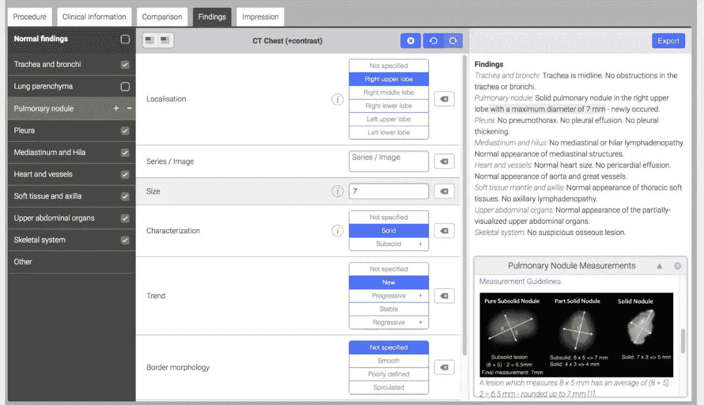

# 概要报告造就更好的放射科医生和算法

> 原文：<https://towardsdatascience.com/synoptic-reporting-makes-better-radiologists-and-algorithms-9755f3da511a?source=collection_archive---------0----------------------->

我仍然记得我作为放射科医生犯的第一个真正的错误。这是一个很小的错误，几乎不明显，但对病人有很大的影响。这个错误在我犯错的第二天才被发现，尽管如此，也为时已晚...

# 遗漏的错误

几年前，我在夜班工作的创伤中心报告紧急 CT 扫描。有一些常见的东西，很多 CT 头，一些肾结石的发现，和一些全身外伤的研究。其中会出现来自病房上方的紧急扫描，如术后腹部和 ITU 机构。一切都在以相当快的速度进行着，每次我完成一份报告，一项新的研究就会出现在工作列表中。那天晚上我是高级注册员(培训生)，第二天早上我的顾问会仔细检查一切。

外科病房的一项研究是针对一名因阑尾手术破裂而被送进手术室的年轻男子。显然，他手术后败血症的情况很糟糕，团队很有理由想检查他腹部的状况。我调出了他的入院 CT 检查了一遍。右侧髂窝内有大量游离液体，脂肪滞留，如预期的那样，盲肠附近有壁状聚集。阑尾炎延迟表现的典型表现。然后我打开最近的术后扫描，开始口述。收集物已经过手术处理，只剩下一点点游离液体。伤口看起来很好，没有什么新的东西值得注意。我写完报告，继续下一项研究。单子做好之后(嗯，永远做不完，但是我的班做完了)，我就回家了。

第二天，我一上班，就像往常一样查看了我的电子邮件。第一条消息的标题为“紧急:升级的放射学错误”。我愣了一会儿——我做了什么？我的大脑想不出会是什么。我打开电子邮件，通读了一遍。它很短，但切中要害。不过，对我来说没有意义，一开始没有。我重读了一遍。

“Harvey 医生，昨天您报告了对患者 x 进行的术后 CT 扫描。*根据您的报告，患者被连夜送回手术室进行剖腹探查，但由于手术团队无法将他们的发现与您报告的情况联系起来，手术被迫中止。病人现在在重症监护室，接受术后治疗。请联系首席手术顾问，安排时间对该事件进行调查性审查，该事件已上报管理层。”*

*问题掠过我的脑海。他们为什么把他带回剧院？我说过他的腹部看起来好多了，不是吗？我报告了错误的扫描吗？*

*我冲进报告办公室，把我昨天报告的扫描结果装了进去。我向下滚动列表，它就在那里。一名顾问甚至对其进行了反复检查和核实。我打开它，又看了一遍图片——但没什么不同，还是我昨天报道的那项研究。我肯定报告了正确的研究。我又看了一遍我的报告。再一次。根据我的发现，我不明白他们为什么决定去剧院。我说过这些收藏品已经不在那里了，周围的自由流体也已经消散了。*

*实际上，我没有。*

*这就是我的错误，白纸黑字写得清清楚楚，这是我的疏忽。有时候最难看到的是那些不存在的东西。我想说的是“之前提到的盲肠旁集合没有被看到。”我实际上报道的是“前面提到的盲肠旁集合可见。”*

*我漏掉了一个单词。“不是”。仅仅在这个基础上，外科医生就认为这个集合仍然存在，是败血症的源头，并把病人带回手术室切除。*

*一个词。仅仅一句话就给一个极度不适的年轻病人带来了不必要的伤害，让他冒着再次接受大手术的风险。不仅如此，手术团队连夜完成了这项工作，医院为此付出了巨大的代价，这无疑只会给其他病人的治疗增加延误。我感到羞愧。*

*我回复了邮件，安排了一次会面，并走完了正式审查的流程。我只能道歉。我可以试着把责任归咎于我的自动听写软件漏掉了一个单词，或者是外科医生没有亲自检查图像，或者是我的顾问在核实之前没有彻底阅读报告。然而，完全正确的是，责任在我身上。我应该更仔细地阅读我的报告。令人欣慰的是，病人最终很好，只在重症监护室呆了很短时间。没有对我采取任何行动。他的败血症是由败血症(血液感染)引起的，他对抗生素反应良好。我从错误中吸取了教训，并养成了认真检查口述报告的习惯，尤其是因为它们是由语音识别软件自动处理的。每当我结束一份报告，我仍然回想起那个年轻人和我给他带来的不必要的痛苦。*

# *词语很重要*

*我犯的第一个严重错误是许多放射学家都知道的。我并不孤单。一项研究显示，高达 33.8%的未经编辑的报告包含此类错误。我们是一个被我们的话语所束缚的职业，我们的话语是我们患者旅程中的法律记录。词语很重要，我们把它们弄对是至关重要的。尽管像语音识别软件这样的技术很有用，但最终的责任还是在我们人类身上。那么，我们如何减少这些错误呢？在一个工作量不断增加、疲惫不堪、筋疲力尽的放射科医生的世界里，也许我们不能指望每个字都被考虑、检查和验证。*

*我更担心的是最近在图像感知方面推进的人工智能，它依赖于人类口述的报告，为算法提供学习数据。如果人类的自由文本报告已经包含错误，并且[自然语言处理](http://pubs.rsna.org/doi/abs/10.1148/radiol.16142770)试图解析文本并找到意义，那么这些错误只会被转移。更糟糕的是，来自人类的自由文本报告都非常不同——每个放射科医师都以不同的风格，使用不同的描述符进行报告。[我之前在关于](/separating-the-art-of-medicine-from-artificial-intelligence-6582f86ea244) [CheXnet 研究](https://arxiv.org/abs/1705.02315)的博客中报道过这个话题，并解释了你如何不能真正使用源自人类的自由文本作为基础事实来了解胸部 x 光片中的内容。至少没有人类准确。*

**

*Image from Modelling Radiological Language with Bidirectional Long Short-Term Memory Networks, [Cornugreta et al, 2016](https://arxiv.org/abs/1609.08409).*

*我不是唯一一个担心这个的人。[来自宾夕法尼亚州好时医疗中心的 Huesch 等人](http://www.jacr.org/article/S1546-1440(17)31653-8/fulltext)最近发表了他们的发现，试图挖掘寻找肺栓塞(肺部动脉中的血凝块)的 CT 扫描文本报告。他们的结论是，自由文本报告“与报告长度和报告术语的广泛可变性相关”。作者继续指出，“这些结果支持对一个完全结构化的报告模板的影响的预期评估，该模板至少具有一些强制性的离散字段，以方便报告的使用和理解”。换句话说，他们建议报告的结构不仅要强制标准化，还要更好地让机器学习理解它们。*

# *这都是关于结构的*

*二十多年来，人们一直在推动所谓的“结构化报告”。实质上，结构化报告是一个模板，它规定了需要由报告放射科医师填写的某些字段。例如，在胸部 x 光报告中，字段可能包括肺、心脏和骨骼。其目的是创建一个标准化的报告，该报告以相同的格式包含相同数量的有用信息，而不管是哪个放射科医师完成的。*

*对结构化报告好处的广泛研究令人信服。已经表明，结构化报告绝对"[比非结构化报告](https://www.ajronline.org/doi/abs/10.2214/AJR.14.12636)更加完整和有效"，在清晰度方面具有" T2 "优势，提供了" T4 "增强的感知临床影响，它们" T6 "便于信息提取并受到转诊医生的青睐，并且可以" T8 "改进手术计划。在医疗保健行业金钱为王的美国，结构化报告对于识别账单代码非常有价值。此外，结构化报告已被推荐用于任何涉及放射学报告的研究活动，在[诊断准确性研究报告标准](http://bmjopen.bmj.com/content/6/11/e012799) (STARD)声明中有明确规定。简而言之，结构化报告比自由文本报告要好。报告更清晰，更好的解释，包含更多的信息，是机器可读的，你的临床同事喜欢它们。*

*那么为什么不是所有的放射科医生都使用结构化报告呢？这就是棘手的地方。放射科提供商和供应商在很大程度上没有执行结构化报告。有些解决方案就是在空白处写上几个字，告诉你报告的副标题应该是什么。剩下的部分由你来填写，最终，放射科医生只是在标题下放一份自由文本报告，然后就不管它了。*

**

*Sample ‘fill in the blanks’ report from RSNA’s [RadReport](https://www.rsna.org/Reporting_Initiative.aspx). These haven’t gone down well with radiologists.*

*其他结构化报告有太多的部分需要完成，所以最终感觉你在勾选不必要的框，浪费时间回答不相关的问题，减慢你的工作流程。他们不适应，他们是一个尺寸适合所有人，他们会感到束缚和负担。另一个担心是，花在填写结构化报告上的时间是花在*而不是*看图像上的时间，这是放射科医生不喜欢的！*

# *概要报告*

**

*Image courtesy of [Smart Radiology](https://www.smart-radiology.com/en/#solutions)*

*很明显，我们必须减少错误，使医疗数据为人和机器都可以理解。随着[放射学标准化词典](https://www.rsna.org/RadLex.aspx)的兴起，以及将结构化报告集成到 DICOM 格式的工具的出现，我们看到了技术与临床需求的融合，最终可能使结构化报告成为可用的现实，这是通过所谓的“概要报告”实现的。这是直接从输入数据生成机器可读报告的概念。通过这种方式，临床数据在来源处被标记化，附加到您喜欢的任何编码系统(ICD-10、FIHR、SNOMED)，然后在结构化模板内被处理成自由文本报告。与传统的纯文本报告相比，底层编码数据更适合计算分析，从而为精确的大规模放射学数据查询打开了大门。*

*在 RSNA 2017 上，一家供应商[智能报告](https://www.smart-radiology.com)展示了一个优雅的概要报告解决方案。该软件将数据字段转换成人类可读的自由文本，而不是说教式的打勾。使用语音命令(与领先的放射学语音听写软件 [Nuance](https://www.nuance.com/en-gb/healthcare/medical-imaging.html) 链接)，放射科医生只需说话即可导航模板字段，无需点击鼠标。*

*每个领域都是完全可定制的，因此每个放射科都可以根据需要设置自己的格式，或者选择使用子专业专家为每个临床用例设计的模板。随着放射科医生的工作进展，会显示实时决策支持(如上面关于肺结节测量的示例所示)，确保放射科医生都按照相同的黄金标准工作。“正常”研究可以在几秒钟内以您的科室和转诊临床医生喜欢的格式报告出来。癌症研究尤其受益于详细的标准化，智能报告旨在减少填写此类报告的繁琐。*

*实际上，该软件从放射科医师提供的数据中创建了自由文本，消除了口述整篇文章的需要。机器学习研究人员的好处是，底层数据已经硬编码，不需要 NLP 筛选。对于那些努力让 NLP 准确一致地工作的人来说，这是个好消息。事实上，它完全否定了 NLP 的必要性。*

> *我们不必再创建我们希望从中获取数据的文档，相反，我们可以从我们的数据中创建清晰、集中的多媒体文档。*

*对于那些担心失去正常机智报告的细微差别的人，不要担心，你可以随时编辑一个模板来包含你最喜欢的谚语，安全地知道你的报告仍然有足够的结构。您编辑的基础数据点保持不变，但文本是您自己的。更重要的是，你的妙语可以立即翻译成多种语言，甚至有可能从相同的底层结构化数据中创建面向患者的报告，这是我的[人工智能在放射学中的五大用例](/5-radiology-artificial-intelligence-companies-to-build-and-none-of-them-interpret-medical-images-7a21633f4d6)之一。*

*另一个聪明的功能是，你可以合并人工智能图像感知算法的输出，将相应的文本(根据你的喜好编辑)自动放入报告中。这一技术目前正在荷兰拉德布大学医学中心与 [Thirona](https://thirona.eu/) 成像分析进行测试。还有一个集成的分析套件，所以你可以深入到所有报告的数据中，这是单靠自由文本根本不可能做到的。所有这些数据点都有可能链接到您医院的电子记录中，用于审计、数据分析和机器学习研究。这与当前的热门话题，甚至是医疗技术中更热门的“真实世界数据”业务紧密相关。那些知道如何大规模创造和利用准确的真实世界数据的人正看到巨大的回报；看看今年罗氏以 19 亿美元收购的熨斗[就知道了。创建和管理自己的数据湖的价值显而易见。现在，它取决于放射科医生接受它。](https://www.roche.com/media/store/releases/med-cor-2018-02-15.htm)*

# *摘要*

*如果我们要开发真正的放射学人工智能系统，那么我们需要数十亿个干净的数据点。自由文本和事后 NLP 数据提取在医学等安全关键环境中并不适用，因此我们需要更智能地生产数据，以供我们的算法进行训练。不仅如此，为了我们的患者，我们应该尽我们所能减少我们自己的错误，为了我们的临床同事和患者，我们应该提供清晰、可操作和可读的报告。*

*相反，随着人工智能在规模和功能上的增长，概要报告将是这些系统产生输出的唯一方式。我们当然不会训练人工智能系统产生没有底层编码数据点的自由文本块！*

*概要报告有可能提高护理质量，同时改善我们与同事和患者的互动和交流，并确保每个放射科医生都按照最高标准进行报告。*

*这只是更聪明的做事方式。*

*如果你和我一样对放射学人工智能的未来感到兴奋，并想讨论这些想法，请保持联系。我在推特上 [@drhughharvey](http://twitter.com/drhughharvey)*

**如果你喜欢这篇文章，点击推荐并分享它会很有帮助。**

**关于作者:**

**Harvey 博士是一名委员会认证的放射科医生和临床学者，在英国国民医疗服务体系和欧洲领先的癌症研究机构 ICR 接受过培训，并两次获得年度科学作家奖。他曾在 Babylon Health 工作，领导监管事务团队，在人工智能支持的分诊服务中获得了世界第一的 CE 标记，现在是顾问放射科医生，皇家放射学家学会信息学委员会成员，以及人工智能初创公司的顾问，包括 Algomedica 和 Kheiron Medical。**