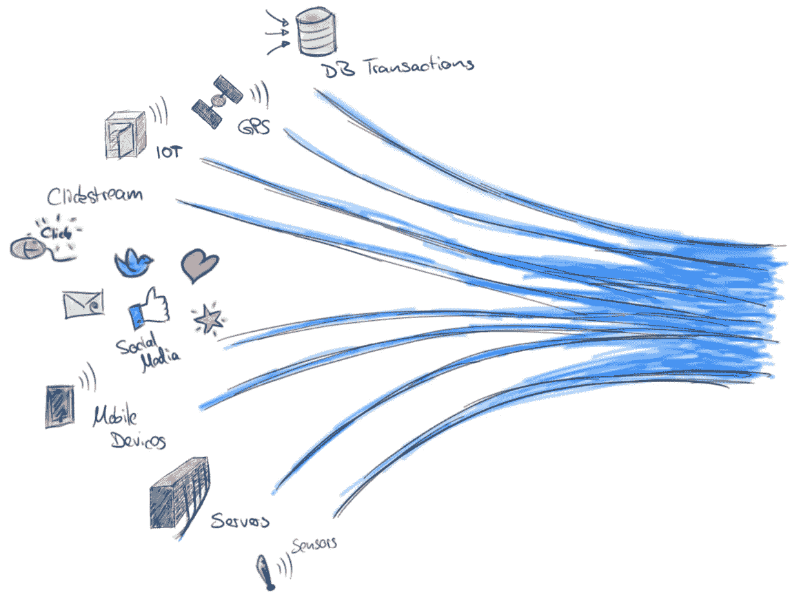

# 综合大数据框架和深度学习

> 原文：<https://towardsdatascience.com/synthesizing-big-data-frameworks-and-deep-learning-603674d10c44?source=collection_archive---------9----------------------->

Photo from Apache Flink Website

大多数大数据框架软件工程师用 Java 编写，而大多数机器学习，特别是深度学习库的研究人员用 Python 编写。这在双方之间产生了一条有趣的断层线。一方面，我们拥有 Spark、Flink 和 Kafka 等大型数据框架，可以快速高效地处理海量数据集，但缺乏(轻松)训练和加载专门针对大型数据集的高度成功的模型的能力。另一方面，您有强大的框架来轻松实现深层架构，但是，这些框架没有提供将这些模型集成到大规模数据系统的简单方法。弥补这个缺陷并不是一个简单的问题，因为它需要将 Python 中编写的代码转移到 JVM 中。此外，还需要一系列的依赖和预处理。

## 历史和背景

JVM 上的

**追溯到 2005 年 Hadoop 项目的最初形成，大数据框架一直在 Java 虚拟机上生存和发展。当时，Java 和 C++是占主导地位的编程语言之一(特别是在工业界)。因此，Hadoop 将存在于 JVM 上是理所当然的。2009 年，用 Scala 编写的 Apache Spark 出现在伯克利 AMP 实验室。Spark 由于其分布式内存结构，除了提高速度之外，还允许更广泛的计算。大约在同一时间，LinkedIn 出现了 Apache Kafka。Kafka 充当了连接实时数据源的中心框架。此后不久，Flink 在 2010 年作为一种完全基于流的大数据处理方法出现。**

**其次，Java 中涌现出大量的文件系统和数据库。HDFS、卡珊德拉、Neo4j 都成为了 Java 驱动的大数据文件系统/数据库。ElasticSearch 也主要用 Java 编写，尽管它的 API 允许来自任何语言或命令行的请求。虽然几乎所有的论文都有 Python 库，但是繁重的工作都是用 Java 完成的。**

## **Python 端**

**与此同时，在这一切进行的同时，机器学习包继续在 Python 中开发。NumPY 是在 90 年代后期建立的，它为后来 Python 中的 DL 开发奠定了基础。尽管现在已被弃用，但 2007 年出现的 Theano 是第一个(2002 年出现的 Lua 中的 Torch)非专有 DL 框架。Theano 是由 MILA 的 Yoshua Bengio 发明的。随着深度学习开始起飞，许多研究人员选择 Python 作为他们的语言。Tensorflow、Keras 和 PyTorch 都迅速成为事实上的深度学习框架。现在很难找到哪个深度学习论文的代码不是用 Python 实现的。**

## **就不能用 API 吗？**

**一个明显的问题是，为什么不直接使用 API 在 Java 框架和部署的 Python 模型之间进行通信。GraphPipe、Kubeflow 和 TF-Serving 都提供了将模型部署到 API 的方法。API 通常是一个很好的解决方案，特别是对于简单的用例，但是在某些情况下，它们可能会增加延迟。此外，对于流处理，这可能会变得非常复杂。例如，假设您有一个 ML 微服务，它为一个带有 GrahPipe 的模型提供服务。例如，现在从 Flink 调用微服务需要使用 AsyncIO，这可能很难实现。我们现在还必须单独处理 ML 微服务的扩展。此外，在理想情况下，我们可以使用底层数据平台以分布式方式训练模型。这尤其有用，因为这些大数据系统都有易于访问/处理的库来处理数据湖中的数据。然而，在某些情况下，微服务表现很好，因此我们应该总是根据微服务的性能进行基准测试。**

## **持续解决方案**

**目前，有许多可能的解决方案“正在进行中”，尽管它们都有缺点，有些目前还处于规划阶段。**

1.  ****PySpark:****

**Spark 生态系统在整合模型方面取得了重大进展。具体来说， [Spark 深度学习](https://github.com/databricks/spark-deep-learning)旨在让将 DL 模型纳入 Spark 管道变得更加容易。Spark 深度学习 Spark 也投入了大量资源来使其 Python 库 PySpark 获得成功。PySpark 实际上是用 Py4J 编写的，我稍后会讨论这一点。然而，目前没有办法在 Spark 中加载 ONNX 模型。此外，这些技术目前在流设置中不起作用。**

****2。** [**阿帕奇光束**](https://beam.apache.org/get-started/quickstart-py/)**

**Apache Beam 缓慢地继续尝试使其平台与 Python 代码兼容。目前，所有 Python 代码仍处于正式的“测试”阶段。然而，从长远来看，Beam 希望在 Python 中支持 Flink 和 Spark。这肯定会证明是有用的，特别是如果你的公司有一个完整的 Python 堆栈，因为你可以合并 Flink 和其他 Java 技术。**

****3。**[**tensor flow Java**](https://www.tensorflow.org/install/lang_java)**

**Tensorflow 提供了一个 Java 版本的框架，您可以在其中加载 Tensorflow 模型。这对 Tensorflow 很好，但是它不支持其他框架。另外，[性能可能不如其他方法](https://www.slideshare.net/FlinkForward/flink-forward-berlin-2017-dongwon-kim-predictive-maintenance-with-apache-flink)好。**

****4。**[**【Java 嵌入式 Python (JEP)**](https://www.py4j.org/index.html)**

**Java 嵌入式 Python 或 JEP 允许在 Java 中使用 Python 代码。用户可以调用 Python 方法，并通过实例化的 JEP 类导入 Python 包。这是通过 [Java 本地接口](https://en.wikipedia.org/wiki/Java_Native_Interface) (JNI)完成的，它允许 C 和 C++应用程序调用 JVM 中的应用程序。为了在 Python 中使用 Java，不能从 Python 中启动 JEP。如果您想在 Python 应用程序中使用 Java，这是一个糟糕的选择。在关于预测性维护 D [的演讲中，ongwon Kim 总结说，JEP 通常比使用 TFServing 或 Java Tensorflow API 更快(至少对于 RNN 类型的预测)。](https://www.slideshare.net/FlinkForward/flink-forward-berlin-2017-dongwon-kim-predictive-maintenance-with-apache-flink)**

****5。**[**【Py4j(逆))**](https://www.py4j.org/)**

**Py4J 允许在 Python 中使用 Java。Py4J 使用 Java 网关是为了克服与从 Python 调用 Java 相关的问题。这实际上是 PySpark 构建的一个重要部分。从长远来看，为用 Java 编写的框架提供一个有效的 Python 库可能需要以某种方式使用这个框架。**

****6。** [**DL4J**](https://deeplearning4j.org/)**

**Java 深度学习最初是作为 JVM 上 DL 的全面框架。如果您还想完全用 Java 进行模型开发，它仍然是最佳解决方案。但是，它现在也支持将 Keras 模型加载到 Java 中。也许更重要的是，它在 Java 中提供了对各种多维数组的支持(本质上相当于 numpy)。**

**7。[**Java CP presets**](https://github.com/bytedeco/javacpp-presets)**

**Java CPPresets 是移植到 Java 的 C/C++包的集合。它也使用 JNI，但主要是直接用于 C++包，而不是 Python。最近，CPPresets 中包含了一个 ONNX 库。使用该库，您可以加载模型并将它们导出为其他格式。然而，目前没有后端，所以没有办法实际运行加载的模型，这显然是有问题的。一个名为 Lantern 的 Scala 库最终可能会为执行模型提供必要的后端，然而这还很遥远。**

****其他路线****

**Jython 不再是一个选项，因为它只支持 Python 2.7，不支持 numpy 和许多其他库。**

## **结论**

**目前，尝试将模型加载到 Java 中有多种选择。然而，不幸的是，目前都没有完成。我目前的建议是，如果要使用 batch Tensorflow，使用 PySpark。流媒体在任何情况下都会更加复杂，因此 DL4J + Keras + Spark 可能是您的最佳选择。如果你需要使用 ONNX，那么 JEP 或者一个 API 是你唯一的选择。目前，我正在整合我的模型不可知预测库，以便与 JEP 一起工作。这应该有望缓解一些与 JEP 有关的繁琐问题。我希望在接下来的几周里有一个使用 JEP 和 Flink 的端到端流示例。**