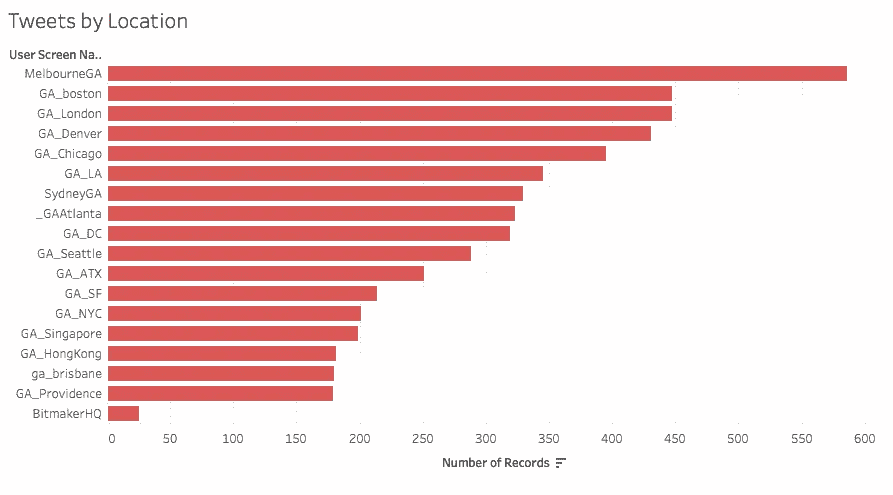
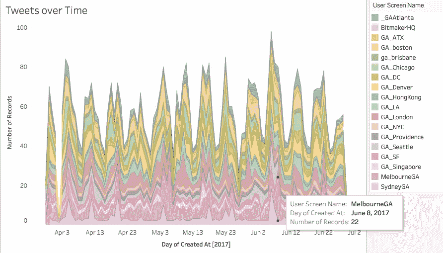
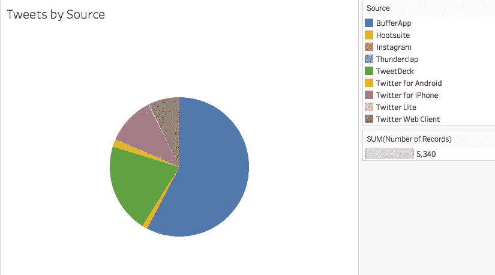
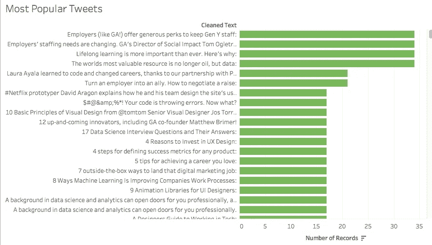
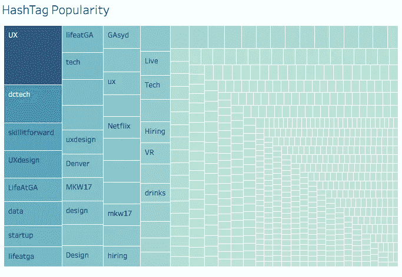
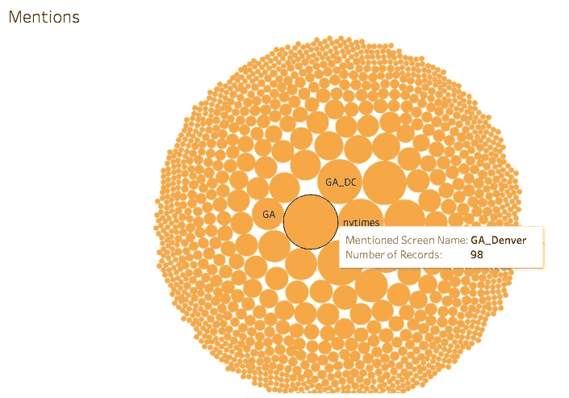

# 大会推特的表格分析

> 原文：<https://towardsdatascience.com/tableau-analysis-of-general-assembly-tweets-46b8541ca494?source=collection_archive---------1----------------------->

当我在[大会](https://medium.com/u/ade87cdd122e?source=post_page-----46b8541ca494--------------------------------)上学的时候，我写了一个 python cronjob 来收集来自所有[大会地点](https://twitter.com/GA/lists/ga-locations/members)的推文。我想在课程期间写一篇关于它的博客和作品集，但是所有的测试、项目和其他事情都在进行中，事情远离了我。我最近看了一下 cronjob 收集的信息，我在 3 个月的时间里收到了 5340 条推文。我不应该让这个浪费掉，所以下面是我使用 Tableau 对 GA 的 twitter 策略的探索。如果您想与任何可视化交互，请单击可视化下方的链接。

**警告/迷你咆哮**

在对收集的信息和这些账户上的实际信息进行抽查比较时，我确实注意到一些推文不见了。这大概是我在 MacBook 上设置 cronjob 的一个功能。我不得不设置一个 cronjob 来收集推文，因为 Twitter 限制了在给定时间内可以收集的数据量。Macbooks 在您关闭时会进入睡眠状态，不会执行您的 cronjobs。当我了解到这一点时，我努力让我的 MacBook 在工作安排时保持打开。通常我会建议将 cronjobs 设置在一个服务器上，或者至少是一个您知道会可靠地开启和唤醒的本地服务器上，但是这些是我必须使用的资源，我觉得这些数据对于这个分析来说已经足够好了。

**分析**

我认为我的博客中列出的最活跃的校园，[哪个 GA 校园最活跃？](https://medium.com/@brendangallegobailey/which-ga-campus-is-most-happening-f1d6a8d74a87)，也将拥有最活跃的社交媒体账户。我错了——墨尔本在这一时期最活跃，其次是波士顿。这有点道理，因为发推特不需要任何成本，但我认为有更多活动的校园会有更多的推特。

[Tweets by Location](https://public.tableau.com/views/GA_Tweets/TweetsbyLocation?:embed=y&:display_count=yes)

随着时间的推移查看推文，你可以看到什么校园在什么时候最活跃。例如，墨尔本在 6 月 8 日有很多活动，原因是看起来他们那天有一个基于推特语言的活动。

[Tweets Over Time](https://public.tableau.com/profile/brendan.bailey#!/vizhome/GA_Tweets/TweetsoverTime)

BufferApp 是 GA 最喜欢的推文模式。当我在 GayTravel.com 做社交媒体实习生的时候，他们最喜欢的模式是排在第二位的 Tweetdeck。

[Tweets by Source](https://public.tableau.com/views/GA_Tweets/TweetsbySource?:embed=y&:display_count=yes)

推文看起来很协调。在清理了自定义网址的推文后，5340 条中有 2339 条(44%)是唯一的。最受欢迎的推文是“雇主(像 GA！)提供丰厚的额外津贴来留住 Y 世代员工:“这段时间有 34 条推文进来。原因是这种联系导致《每日电讯报》发表了一篇报道，强调了在 GA 工作的一些额外津贴。看起来像是在 6 月 3 日和 6 月 16 日有一场通过所有校园推特账号发布这条推文的运动。我不怪 GA 宣传这份好报纸——根据你在 GA 工作第三年的文章，你有为期两周的带薪假期，包括酒店和机票！

[Most Popular Tweets](https://public.tableau.com/views/GA_Tweets/MostPopularTweets?:embed=y&:display_count=yes&publish=yes)

大会有几个课类型包括 web 开发，移动开发，UX，数据科学(我毕业的那个)。UX 似乎肯定是通过标签宣传最多的(#UX、#UXDesign、#UXdesign、#ux、# UXDesign)。

[Hashtag Popularity](https://public.tableau.com/views/GA_Tweets/HashTagPopularity?:embed=y&:display_count=yes)

就提及次数而言，GA_Denver 被提及次数最多。这并不是因为 GA 的其他校园在推广丹佛校园，而是 GA_Denver 转发了任何提到他们的人。

[Mentions](https://public.tableau.com/views/GA_Tweets/Mentions?:embed=y&:display_count=yes)

如果你想知道这些数据是如何收集的，或者你想要这些数据的平面文件，这里有 [GitHub 链接](https://github.com/brendanbailey/Medium/tree/master/GATwitter)。