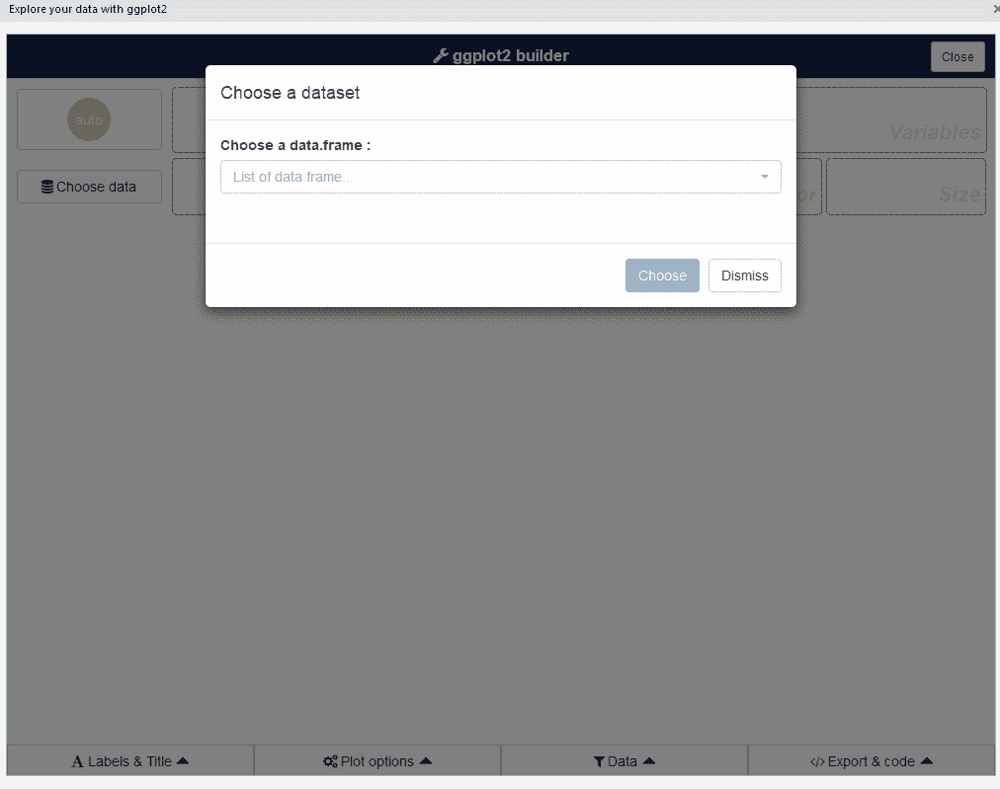
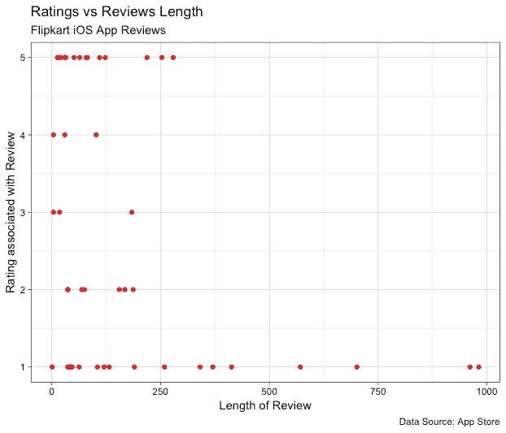

# R 中类似 Tableau 的拖放 GUI 可视化

> 原文：<https://towardsdatascience.com/tableau-esque-drag-and-drop-gui-visualization-in-r-901ee9f2fe3f?source=collection_archive---------7----------------------->



Tableau 和 Qlik 等自助式数据可视化工具提供了 R 和 Python 等复杂的数据科学语言所不提供的少数几个功能之一，即*创建可视化的拖放 GUI*。您可以简单地拖放您的维度和度量标准，这种灵活性是如此直观，以至于没有技术经验的高中生也可以构建一个像样的可视化。

如果你是一个 R 用户，并且你一直羡慕他们，这里有一个神奇的工具——***esquisse***——它就在你的 RStudio 中，帮助你用拖放 GUI 构建 *ggplot2* 。(顺便说一下，这非常直观，Python 用户也能做到！)

# 关于 esquisse:

这个新的 R 包[**esquisse**](https://github.com/dreamRs/esquisse)**由法国公司 [DreamRs](https://www.dreamrs.fr) 创建并开源，该公司已经开源了多个像这样有用的 R 包。**

**如文档中所述，**

> ***esquisse* 允许您通过用 ggplot2 软件包可视化数据来交互式地浏览数据。它允许您绘制条形图、曲线、散点图、直方图，然后导出图表或检索生成图表的代码。**

# ****安装&装载****

*****esquisse*** 在起重机上可用，因此可使用以下代码进行安装:**

```
# From CRAN
install.packages("esquisse")
```

**或者您可以使用以下代码安装 github 上的开发版本。**

```
# with remotes
remotes::install_github("dreamRs/esquisse")

# or with install-github.me service (based on remotes)
source("https://install-github.me/dreamRs/esquisse")

# or with devtools:
devtools::install_github("dreamRs/esquisse")
```

# **拖放可视化**

**正如我们从一开始就知道的，这个软件包 esquisse 帮助我们通过拖放来生成可视化(ggplot2 ),我们将看到如何做同样的事情。**

**首先，我们将使用 R 包`itunesr`提取一些应用评论(在本例中，是印度电子零售商 Flipkart 的 iOS 应用)，并尝试使用我们的拖放 GUI 进行可视化。**

```
#loading tidyverse to read inputlibrary(tidyverse)# loading itunesr for retrieving itunes review data that we will use in this analysislibrary(itunesr)#loading the magical esquisse librarylibrary(esquisse)# Flipkart Reviewsreviews <- getReviews(742044692,'in',1)#converting Rating to numeric typereviews$Rating <- as.numeric(reviews$Rating)#let us say we want to see if there's any correlation between rating and review lengthreviews$len <- nchar(reviews$Review)
```

**上面的想法很简单。**

*   **我们正在加载所需的包**
*   **使用`itunesr`获取数据**
*   **将变量`Rating`转换为数值并计算`len`中的审核长度的一些数据准备**

**这样，我们就可以用下面的代码开始我们的拖放之旅了。**

```
#let the magic beginesquisse::esquisser(reviews)
```

**正如您在上面看到的，函数`esquisser`将我们想要可视化的数据帧作为参数，如果没有提供任何参数，它会将当前 R 环境空间中的数据帧视为选项。如果在当前的 R 环境空间中没有数据帧，那么就提供像`diamond`这样的内置数据集。**

**从这一点来说，它将是基于 GUI 的动作，因此我为这篇文章创建了以下视频——解释如何使用拖放 GUI 创建 ggplot2 可视化，并最终复制所创建的绘图的 R 代码。**

**复制的代码如下:**

```
#copied codeggplot(data = reviews) +
  aes(x = len, y = Rating) +
  geom_point(color = '#e31a1c') +
  labs(title = 'Ratings vs Reviews Length',
       x = 'Length of Review',
       y = 'Rating associated with Review',
       caption = 'Data Source: App Store',
       subtitle = 'Flipkart iOS App Reviews') +
  theme_linedraw()
```

**这给出了下面的图:**

****

**尽管上面的情节并不花哨，但这是一个完整的情节，我的意思是，有右轴标签和细节，如标题、副标题和说明。**

**我认为这个包肯定会节省很多时间，也为 EDA 期间的分析师提供了更多的可能性。如果你想创建这样的解决方案，你可以从 Datacamp 的[用闪亮的课程](https://www.datacamp.com/courses/building-web-applications-in-r-with-shiny?tap_a=5644-dce66f&tap_s=210728-e54afe)用 R 构建 Web 应用程序中学到更多。这里使用的完整代码可以在[我的 github](https://github.com/amrrs/drag_drop_ggplot_esquisse) 上获得。**

# **[免费注册接收我的数据科学简讯——人工智能](https://nulldata.substack.com/)**