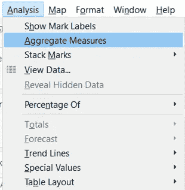
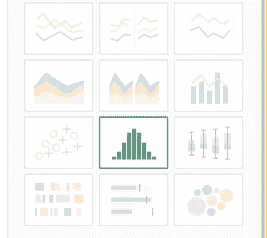
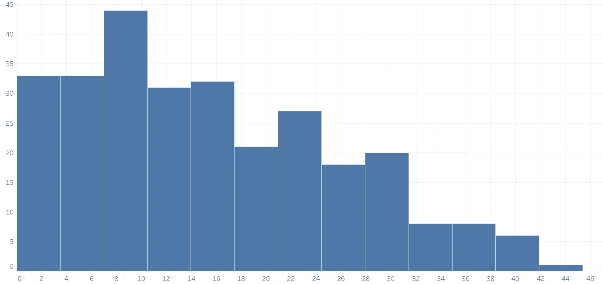
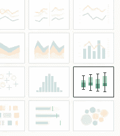
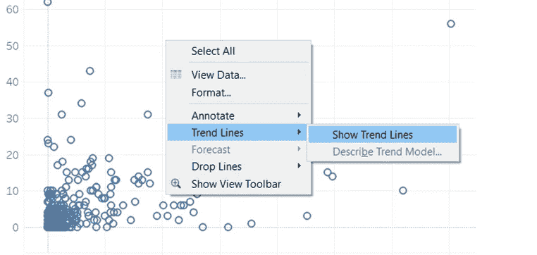
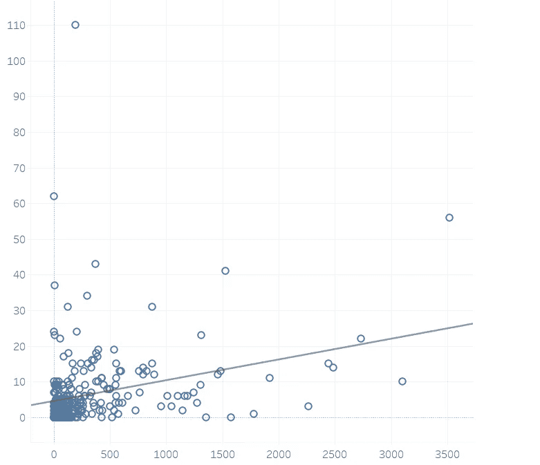
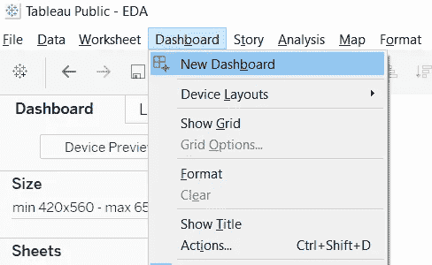
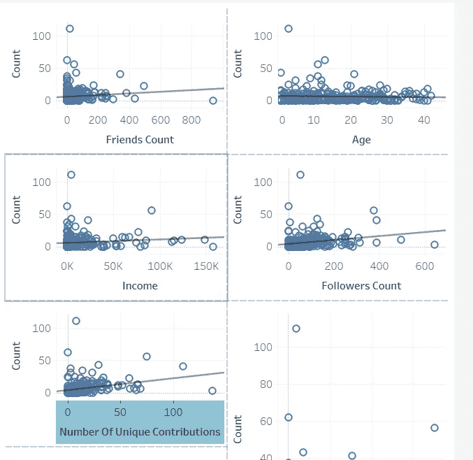

# 探索性数据分析表

> 原文：<https://towardsdatascience.com/tableau-for-exploratory-data-analysis-eda-c503aa84515a?source=collection_archive---------6----------------------->

Photo by [Stephen Dawson](https://unsplash.com/@srd844?utm_source=medium&utm_medium=referral) on [Unsplash](https://unsplash.com?utm_source=medium&utm_medium=referral)

任何数据科学项目最重要的一步是进行探索性数据分析(EDA)。根据约翰·图基的说法，

"*探索性数据分析是一种态度，一种灵活的状态，一种寻找我们认为不存在的东西以及我们认为存在的东西的意愿*"

EDA 是在做机器学习模型之前执行的步骤，它提供了关于数据当前状态的有价值的见解。它可以揭示导致数据的数据管道中的代码错误，也有助于可视化数据中的异常值。

实现 EDA 的方法有很多，最常见的方法是使用 matplotlib、Seaborn 等库。我更喜欢使用 Tableau 来执行 EDA，然后如果需要，使用库来获得任何可视化，这不是作为软件的一部分。在这里，我将带你了解我如何使用 Tableau 进行[单变量](https://en.wikipedia.org/wiki/Univariate_analysis)和[双变量分析](https://en.wikipedia.org/wiki/Bivariate_analysis)。Tableau 是一款免费软件，可从这里下载。

# 单变量分析

单变量分析简单地说就是一次只看一个变量，试图理解它的均值、中值、方差和分布等。可视化分布的最简单方法是使用直方图和箱线图。

Photo by [rawpixel](https://unsplash.com/@rawpixel?utm_source=medium&utm_medium=referral) on [Unsplash](https://unsplash.com?utm_source=medium&utm_medium=referral)

# 直方图和箱线图

在 tableau 中创建直方图非常简单。

1.  从左侧窗格的功能列表中拖动一个功能。
2.  默认情况下，如果要素是一个测量值(如一组数值)，Tableau 会将值聚合为 sum 或 count。确保取消选中分析选项中的聚合度量，如下所示。

3.从可用的可视化效果中选择直方图。

4.产生如下所示的直方图。如果 x 轴上的变量不是分类变量。Tableau 会自动将它们转换为垃圾箱，这是一个很大的增值。

4.对于箱形图，选择以下选项。

# 双变量分析

双变量分析涉及对两个变量(通常表示为 *X* 、 *Y* )的分析，目的是确定它们之间的经验关系。

Photo by [Chris Liverani](https://unsplash.com/@chrisliverani?utm_source=medium&utm_medium=referral) on [Unsplash](https://unsplash.com?utm_source=medium&utm_medium=referral)

# 散点图

散点图是进行双变量分析和可视化两个变量之间关系的最佳方式。

按照以下步骤在 Tableau 中创建散点图。

1.  将 x 变量拖到“列”窗格中。
2.  将 y 变量拖到行窗格中。
3.  默认情况下，如果要素是一个测量值(如一组数值)，Tableau 会将值聚合为 sum 或 count。确保取消选中分析选项中的聚合度量，如下所示。

4.使用趋势线突出显示数据中有趣的趋势。

# 将所有内容整合在一起(仪表板)

Photo by [Marek Szturc](https://unsplash.com/@m_maaris?utm_source=medium&utm_medium=referral) on [Unsplash](https://unsplash.com?utm_source=medium&utm_medium=referral)

一旦对数据集中的每个要素执行了上述步骤，您可能会得到大量的表，而将这些表集中到一个视图中的简单方法是使用仪表盘。创建仪表板

1.  选择新仪表板

2.只需从左侧的工作表窗格中逐个添加您创建的工作表。

# 结论

通常 EDA 步骤会被忽略，但这一步是找出最佳模型的最重要步骤之一。EDA 可以显示数据是线性分布还是非线性分布，这可以提供关于哪个模型最适合数据集的宝贵见解。

*如有任何反馈或问题，欢迎随时联系我* [*LinkedIn*](https://www.linkedin.com/in/anooj-j-54a08551)