# 加速和高精度处理大数据

> 原文：<https://towardsdatascience.com/tackling-big-data-with-acceleration-and-high-accuracy-89f3d4ba15bc?source=collection_archive---------24----------------------->

Fast Machine Learning

监督模型用于预测业务成果，其中我们已经有了对历史数据集的响应。几个例子是线索转换，正确的广告位置，员工流失和它的许多应用。拥有大型数据集可以带来更高的准确性，从而带来更好的预测和更高的盈利能力或业务成功。但线性模型表现有限，落后于非线性模型，如梯度树提升、随机森林、SVM、深度学习等。我们将讨论梯度树提升算法，因为它给出了最好的结果之一。

**梯度推进**

梯度树提升是一种预测算法，通过解决无限维优化问题，以决策树的线性组合的形式顺序产生模型。但是训练这些数据需要大量的时间，因为我们需要调整参数来找到准确的模型。有一种方法可以提高训练速度，那就是加速。

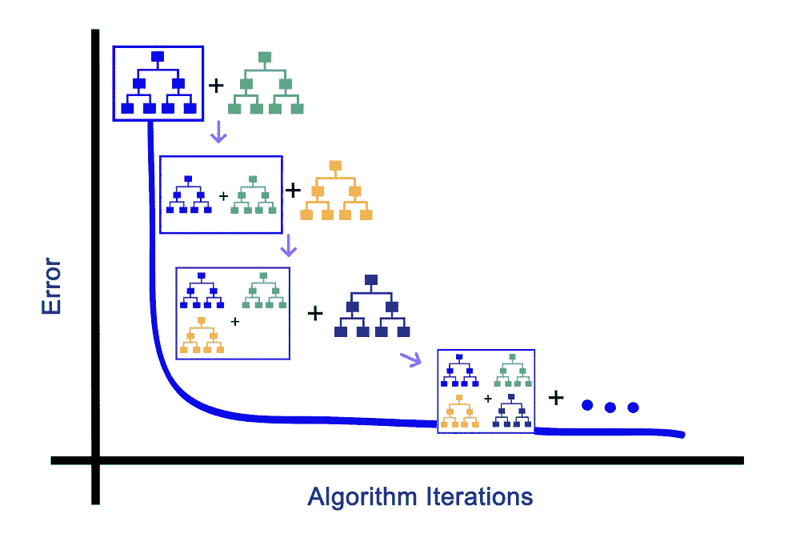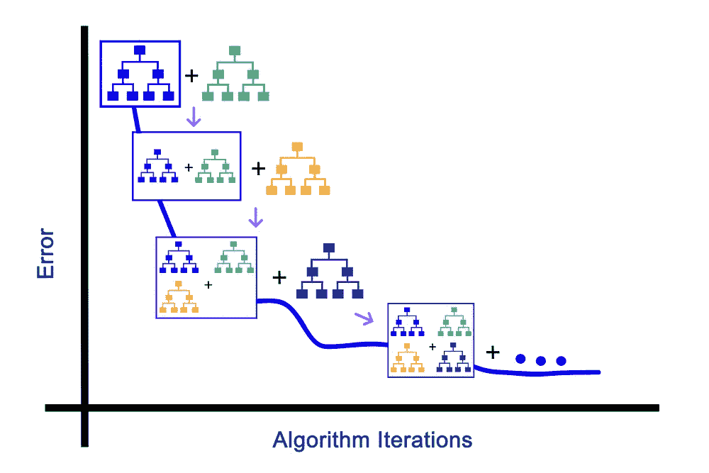

With Acceleration and Without Acceleration

**内斯特罗夫加速**

加速是优化技术中的一个一般概念，我们试图快速达到方程的最小值。内斯特罗夫加速度一般用于加速训练。如果我们对寻找 f(x)的最小值感兴趣，我们使用下面的等式来寻找最小值

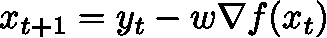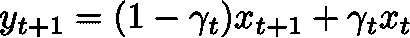

其中 w 是步长。

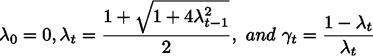

**加速梯度推进**

我们可以将梯度提升与加速度相结合，其中顺序拟合值知道梯度并被视为权重和。我们使用了两个真实世界的数据集来展示性能:-

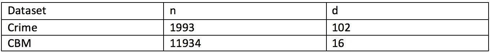

数据集的来源-[https://archive.ics.uci.edu/ml/datasets.html](https://archive.ics.uci.edu/ml/datasets.html)

**犯罪数据集**

原始数据集有 1993 个实例和 128 个要素，其中的响应是每个人口的暴力犯罪。31 个变量有 85%缺失，因此从数据集中丢弃。

下面是带加速和不带加速的梯度助推的性能对比。

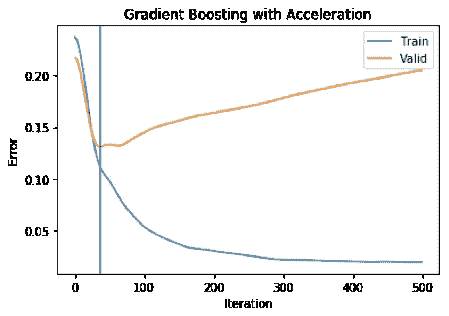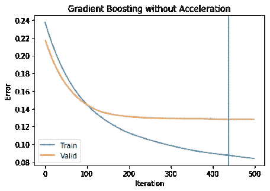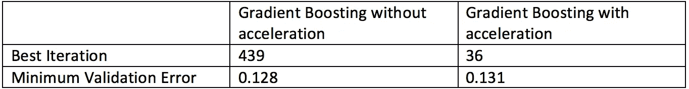

**船舶推进装置的视情维护-数据集**

原始数据集有 11934 个实例和 16 个特征，其中压缩机衰变状态系数和涡轮机衰变状态系数是响应。我们使用涡轮机衰变状态系数作为响应。

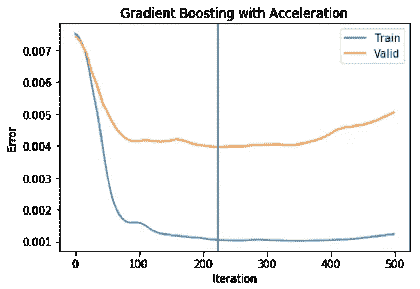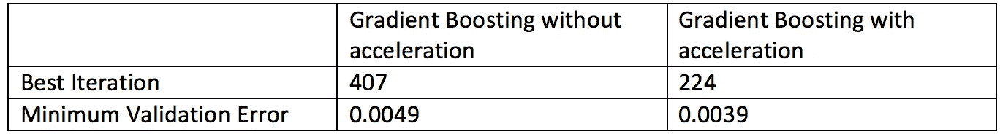

在这两个例子中，我们假设收缩= 0.01，最大深度= 4，每个节点的最小观察值= 10。

我们可以清楚地看到，迭代次数可以减少到 10 倍，同时保持精度，对于示例 2 甚至更高的精度。

**进一步工作**

我们可以进一步研究加速梯度增强的性质，同时改变超参数，如收缩和终端节点。已经表明它对收缩不太敏感。

**参考文献**

[1] G. Biau，B. Cadre 和 L. Rouviere，“加速梯度推进”，arXiv:1803.02042 [stat .2018 年 3 月。

[2] Friedman，Jerome h . Greedy function approximation:一种梯度推进机。安。统计学家。29 (2001 年)，第 5 号，1189-1232。doi:10.1214/aos/1013203451。

[3]内斯特罗夫。一种求解凸规划问题的方法，收敛速度为 o (1/k2)。苏联数学多克拉迪，第 27 卷，372-376 页，1983 年。