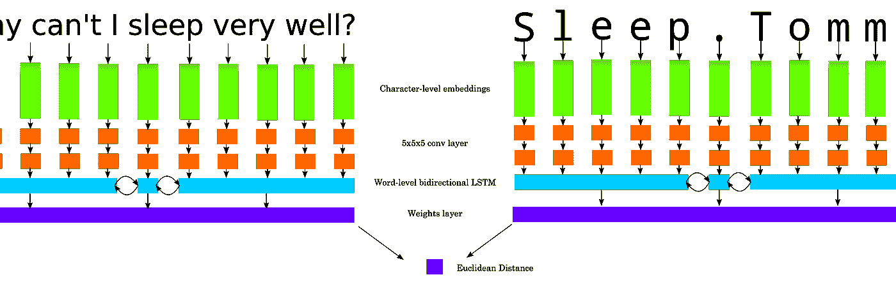
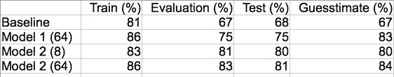

# 解决 Quora 问题数据集

> 原文：<https://towardsdatascience.com/tackling-the-quora-questions-dataset-43666c74bb0e?source=collection_archive---------1----------------------->

语义相似性基本上是决定两个文档彼此有多相似，评估它对于识别重复帖子、半监督标签、两篇新闻文章是否谈论同一件事以及许多其他应用非常有用。因此，当 Quora 在一月份发布了一个潜在重复问题的数据集时，我非常感兴趣，我决定看看我是否可以快速建立一个合理的方法。TL；大卫:得到有效的东西很容易，但是得到真正有效的东西很难——但是我越来越接近了。

# 预处理

该文件包含大约 405，000 个问题对，其中大约 150，000 个是重复的，255，000 个是不同的。这种类的不平衡直接意味着，只要在每条记录上返回“distinct ”,就可以获得 63%的准确率，所以我决定平衡这两个类，以确保分类器真正学到了一些东西。我还必须纠正 TSV 格式的一些小问题(本质上，一些问题包含了不该包含的新行，这扰乱了 Python 的 csv 模块)。然后我使用 [twokenize.py](https://github.com/myleott/ark-twokenize-py) 对数据进行了标记化，这是 [CMU 的 ark-tweet-nlp 标记器](https://github.com/brendano/ark-tweet-nlp/blob/master/src/cmu/arktweetnlp/Twokenize.java)的一个端口，其中[做了一些修改，增加了对 Python 3](https://github.com/Sentimentron/ark-twokenize-py) 的支持。使用这个标记器没有特别的要求，但是我发现它在 tweets 和大多数你可以在网上找到的其他非正式文本上表现得相当好。

# 基线

当一个简单的解决方案可以解决问题时，没有必要一头扎进一个复杂的解决方案，所以为了获得一个合理的基线，我决定使用一个标准的单词袋方法，同时使用线性和朴素贝叶斯分类器。scikit-learn 可以轻松处理这种事情，它的训练速度非常快，实际上很难击败——线性模型在自我评估中达到了大约 81%的准确率，这使它达到了我在深度模型中达到的最高水平。

Baseline assessment script.

# 德拉库拉

[我以前写过关于 Dracula](https://medium.com/@sentimentron/faceoff-theano-vs-tensorflow-e25648c31800#.igabc1icy) 的文章——它是一个字符级的自然语言模型，通过双向 LSTMs 构建更高级别的单词和文档表示。自从我上一次写这篇文章以来，我已经稍微改变了设计，去掉了特别昂贵的字符级 LSTMs，代之以卷积层:这导致了更大的单词级表示，并且看起来比旧方法稍微更准确，至少在 Twitter 词性标注方面。在此基础上需要的唯一修改是 1)同时对两个问题重复该模型，以产生文档级向量，以及 2)最终分类层，其将两者结合起来，以产生重复/不重复答案。我尝试了两种不同的方法来得出最终答案:

*   模型 1 使用标准的 softmax 层，它可以被解释为每个类的概率度量。这种情况下的成本函数是标准平均 softmax 交叉熵。
*   模型 2 将每个文档向量折叠成 128 个条目，然后使用欧几里德距离来比较它们。本来想用余弦距离，但是这个好像训练起来有难度。为了构建成本函数，我反转了标签(因此 1 变成了“不相关”，0 变成了“重复”)，并对预测距离与标签进行了均方误差分析。相似的问题逐渐获得相似的表示，而不相关的问题则没有，同时保持合理的权重。

Pretty messy high-level overview of model 2: two source documents are run through identical Dracula models, and the final document vectors are compared with Euclidean distance.

The core of the model — most of the other code in the repository is just data and IO.

# 比较

Dracula 的一个问题是，它非常慢，并且需要花费许多小时来运行数据集的一遍，所以为了保持我的性情，我选择报告 50:50 平衡训练的模型的准确性，以及保留的评估和测试集，以及原始文件的一个小样本(我称之为猜测集)，以了解它处理类不平衡的情况。评估集和测试集的区别在于，**评估集是在训练** **时使用的，以确保模型不会过度拟合训练数据**，并让我了解模型是否在学习一些东西；而**测试数据在训练**期间根本不使用，纯粹代表模型的性能。评估不用于基线训练，但显示模型在 50:50 班级平衡时的表现。猜测集是从原始文件中提取的，具有正确的类别比例，因此它可能包含训练、评估和测试数据，以及新的示例。事情是这样的:

如前所述，基线在自我评估下表现得相当好，但是对于看不见的例子似乎表现得很差。这可能是因为它使用了一个热门词嵌入，这可能意味着它不能很好地概括新的例子。即便如此，67%也不应该被低估，因为它训练起来非常容易和快速——而且通过一些额外的功能工程，它可以很容易地变得更好。模型 1 似乎在看不见的例子上做得更好，但是仍然显示出过度拟合的迹象——我的假设是分类层很难将输入其中的两个文档向量关联起来。模型 2 在最初的试验中表现得特别好:由于每个字符只有 8 个浮点数的嵌入大小，它在看不见的例子上比模型 1 表现得更好，当用更大的嵌入大小重新训练时，它表现得甚至更好。也就是说，它仍然是最有趣的变体——它提供了良好的准确性和快速(相对而言)的训练，而文件大小不到 64 浮点模型的 1%。

# 将来的

因为我的时间和资源有限，所以我可以做很多超参数优化——特别是改变双向字级 LSTMs 的数量，并试验卷积层的数量和大小。我对谷歌在上周的 TensorFlow 开发峰会上宣布的 Tensorboard 中增加的功能感到兴奋，这些功能基本上允许你为一系列超参数试验绘制有趣的指标，以及他们的新部署选项。我还想扩展训练数据，以纳入更多的重复问题数据集，以及额外的短文档相似性任务。

# 密码

所有三个模型和基线的代码都在 Github 上:

*   [模式一](https://github.com/Sentimentron/Dracula/tree/quora-model-1)
*   [型号 2](https://github.com/Sentimentron/Dracula/tree/quora-model-2-8) (8 尺寸嵌入)
*   [模式 2](https://github.com/Sentimentron/Dracula/tree/quora-model-2-64) (64 尺寸嵌入)

有关下载模型的说明，请查看 README.md 文件。