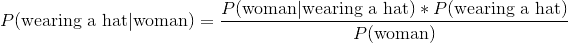
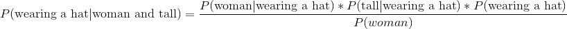

# 基于重要单词标记文档

> 原文：<https://towardsdatascience.com/tagging-documents-based-on-important-words-92bee9baa310?source=collection_archive---------6----------------------->

## 30 天写作挑战

这是我的 [*30 天写作挑战*](https://medium.com/@heldtogether/adventures-in-machine-learning-7eae4d9f951e) 的第三天，我试图在开始建立一个机器学习团队的新工作之前学习数据挖掘技术。昨天，我们深入研究了用于在文本文档中查找重要单词的 tf-idf 算法。现在，我们可以选择一个文档，并挑选出使该文档独特的单词，这将是一个很好的分组相似的文档在一起。可以把它想象成给每个文档建议“标签”,根据文档的内容对它们进行分类。

有很多方法可以解决这个问题，但是我将要工作的行业在不久的将来可能会受到严格的监管。我希望能够证明为什么我们为一个给定的文档建议一个类别，而不是依赖一个像神经网络一样的黑盒。我保证会在以后的文章中讨论神经网络。

有一个叫做贝叶斯分类的过程，它将让我们根据简单的概率来决定如何对事物进行分组。我不记得我是如何知道这种技术的，但我相当肯定贝叶斯定理是教给 16 岁的孩子的。我们应该会没事的…

好吧，我们言过其实了。先用通俗易懂的英语解释一下。

概率很简单。如果一个房间里有 100 个人，其中 55 个是女性，那么那个房间里的人是女性的概率是 55%。

我们把这个写成`P(woman) = 55/100 = 55%`。

如果房间里有 30 个人戴着一顶帽子，其中 20 个是女性，10 个是男性，那么我们知道，如果他们戴着一顶帽子，那么这个人是女性的概率是 66%。

我们把这个写成`P(woman|wearing a hat) = 20/30 = 66%`。

对，所以我们想知道，给定文档中的重要单词，文档属于某个类别的概率。然而，首先我们只能计算一个重要单词出现在给定类别的文档中的概率。这就是奇迹发生的地方。

贝叶斯定理让我们从`P(evidence|outcome)`到
`P(outcome|evidence)`，其实很简单。

这给了我们`P(wearing a hat|woman) = (0.66 * 0.3)/0.55 = 36%`。

这就是我们所需要的一切，我们收集已被手动标记的文档，并构建一个*模型*来预测文档的正确分类。

到目前为止，我们只考虑了基于单一证据的可能性。给定几个证据，找到某件事的概率也很容易。

想象一下，在戴帽子的人中，有 5 个人是高的。我们想知道某人戴着帽子的概率，假设我们知道他们是女性并且很高。

这给了我们`P(wearing a hat|woman and tall) = (0.66 * 0.17 * 0.3)/0.55 = 0.06`。

希望你能理解。

我们如何将此应用于文档分类应该是显而易见的。我想用一个真实世界的例子，你可能对可能的结果有一个直觉。我们不是要计算某人戴帽子的概率，而是要计算文档属于某个类别的概率。观察结果，比如这个人是女的还是高的，将改为文档是否包含某个单词。

这在一开始似乎是一个相当棘手的概念，但事实证明数学很简单。我们能够利用对现有数据的观察来确定一个项目属于某个类别的概率，给定一些我们知道的信息。

在下一篇[文章](https://medium.com/@heldtogether/the-danger-of-looking-at-problems-through-a-single-lens-98d494796d73)中，我将看看如何对一个给定文档的输入数据进行规范化，这样我们就可以用同样的方式处理‘摩托车’和‘摩托车’了。

*这是我的* [*30 天写作挑战*](https://medium.com/@heldtogether/adventures-in-machine-learning-7eae4d9f951e) *中的一个帖子。我是一名软件工程师，试图理解机器学习。我没有博士学位，所以我将用简单的语言和大量的例子来解释事情。*

*关注我的*[*Twitter*](https://twitter.com/heldtogether)*查看我的最新帖子。如果你喜欢这篇文章，请点击下面的心形按钮来分享——这将有助于其他人看到它。*