# 标记溢出—在 Stackoverflow 中关联标记

> 原文：<https://towardsdatascience.com/tagoverflow-correlating-tags-in-stackoverflow-66e2b0e1117b?source=collection_archive---------14----------------------->

## 为了从字里行间获得洞察力，您可以根据 StackOverflow 的*标签*所附加的问题对它们进行关联和分类。

> **更新:**O ' Reilly 的书《Apache Spark 和 Neo4j 上的图形算法》现在可以从 neo4j.com[免费下载电子书](https://neo4j.com/graph-algorithms-book/?utm_source=medium_mhunger)

**更新** : Piotr Migdal [联系了我](https://twitter.com/pmigdal/status/1139921775163314176)，提到他在 2015 年已经做了一个[类似的项目**同名**](https://p.migdal.pl/tagoverflow/) 。我不知道这件事。我们只是在黑客马拉松中随机选择了这个团队名称。

在这篇文章中，我想展示如何使用 Neo4j-Graph-Algorithms 库中的 Jaccard 过程来实现这一点。我们将 StackOverflow 的整个转储导入 Neo4j，运行算法，然后使用 Neo4j 浏览器和大型图形可视化工具 Graphistry 可视化结果。

**注意:我更新了服务器网址，所以你可能也需要更新你的网址。**

9 月，我们有机会在纽约 StackOverflow 的办公室运行 GraphConnect [“时髦词-宾果”GraphHack](https://buzzword.graph.zone/) ，这真的很酷。给我留下深刻印象的是，那里的人们真的采纳了 Joel Spolsky 多年前发表的关于软件公司(可能还有其他公司)更好的办公室布局的文章。许多开放的空间和房间可供讨论，但每个团队成员都有一个私人的六边形玻璃墙办公室，这是一个个性化的思考和工作场所。


Invidual offices at StackOverflow


The “StackExchange-Wall”

对于黑客马拉松，我们选择了项目和团队名称[“tag overflow”](https://hackdash.org/projects/5ba6886396a2952c33e300a9)。

# 数据模型和导入

StackOverflow 数据模型非常简单，*用户发布问题*和*回答*，其中一个*被接受*。每个问题也用一个或多个*标签*标记*标签*。

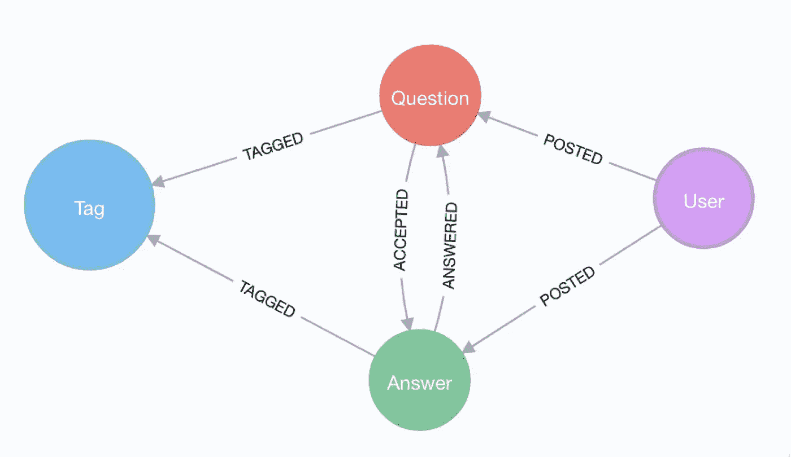

Simple StackOverflow Graph Model

对于进口，我们:

1.  从互联网档案下载了 StackOverflow 转储文件
2.  用 7zip 提取的
3.  将我们感兴趣的 XML 文件转换成节点和关系的 CSV 文件
4.  使用 Neo4j bulk importer 在几分钟内导入数据
5.  再过几分钟，创建一些索引和约束

然后 StackOverflow 的 *Neo4j 图形数据库就可以使用了。*

导入步骤都记录在 [GitHub 库](https://github.com/neo4j-examples/neo4j-stackoverflow-import)中，我们不久前在[10M 问题庆典](https://neo4j.com/blog/import-10m-stack-overflow-questions/)中已经介绍过这个过程。

我们的测试实例目前作为 Neo4j 云实例提供:

*   [https://demo.neo4jlabs.com](https://demo.neo4jlabs.com)
*   数据库“stackoverflow”
*   用户“stackoverflow”
*   密码“stackoverflow”

对于只读用户。

# 数据探索

我们使用[谷歌的 Colab 笔记本](https://colab.research.google.com/drive/1AMwmd4oM-6WV0pNuXFNFwDK447VkMkc8)在黑客马拉松团队中工作，效果非常好。这就像 Python 笔记本的 Google docs，即你有可定制的共享设置，每个人都可以在自己的电脑上编辑和运行单元格。感谢 Graphistry 的 Leo 提醒我这个非常酷的工具。

我们使用 [py2neo 库](http://py2neo.org)连接到 Neo4j，py2neo 库建立在 Neo4j Python 驱动程序的基础上，对 Pandas 和 Numpy 有一些很好的支持。要在 4.0 数据库上使用它，需要使用 py2neo 5.x。

```
graph = Graph("bolt+routing://f6087a21.databases.neo4j.io:7687", 
              auth=("stackoverflow", "stackoverflow"),
              name="stackoverflow", secure=True)
```

对于数据探索，我们首先运行一个查询，显示我们的图表中每种类型有多少数据。

```
result = {"label": [], "count": []}
for label in graph.run("CALL db.labels()").to_series():
    query = f"MATCH (:`{label}`) RETURN count(*) as count"
    count = graph.run(query).to_data_frame().iloc[0]['count']
    result["label"].append(label)
    result["count"].append(count)
nodes_df = pd.DataFrame(data=result)
nodes_df.sort_values("count")
```


或者如图表所示:

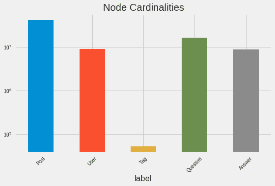

Entity Count Distribution

今天，我们对用户、问题和答案不感兴趣，只对他们的标签感兴趣。所以我们有 *52445 个标签*，这相当多，比我预期的多。

当然，它们的使用是一种幂律分布，我们的前 20 个标签的使用比后面的加起来还要多。

```
tag_usage_query = """
MATCH (t:Tag)
RETURN t.name as tag, size((t)<-[:TAGGED]-()) as deg
ORDER BY deg DESC LIMIT 20
"""tag_usage = graph.run(tag_usage_query).to_data_frame()
```

并以同样的方式绘制成图表。

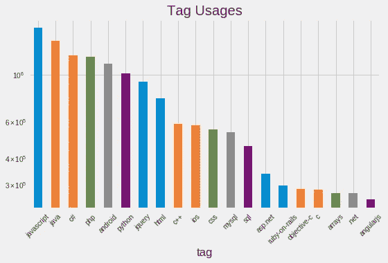

Tag Degree Distribution

# 标签相关性

类似于优先连接网络中的人和其他事物，标签也聚集在一起。通常，你会有一个主类别，比如`javascript`、`ruby`或`neo4j`，然后还有很多相关的标签。有些只在那个主要类别内有效，如`cypher`是`neo4j`的一部分，有些来自其他平行区域，如`neo4j`和`javascript`。

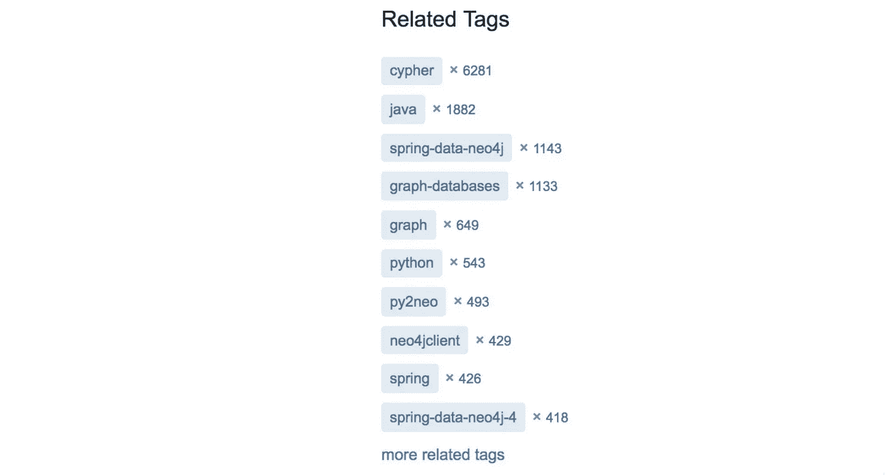

Correlated Tags to “neo4j”

如果我们对按频率排序的标签`ruby`进行同现查询。

```
MATCH (q:Question)-[t:TAGGED]->(tag:Tag {name:$tagName}),
      (q)-[:TAGGED]->(other:Tag)
WITH tag,other, count(*) AS freq
ORDER BY freq desc LIMIT 15
RETURN other.name, freq
```

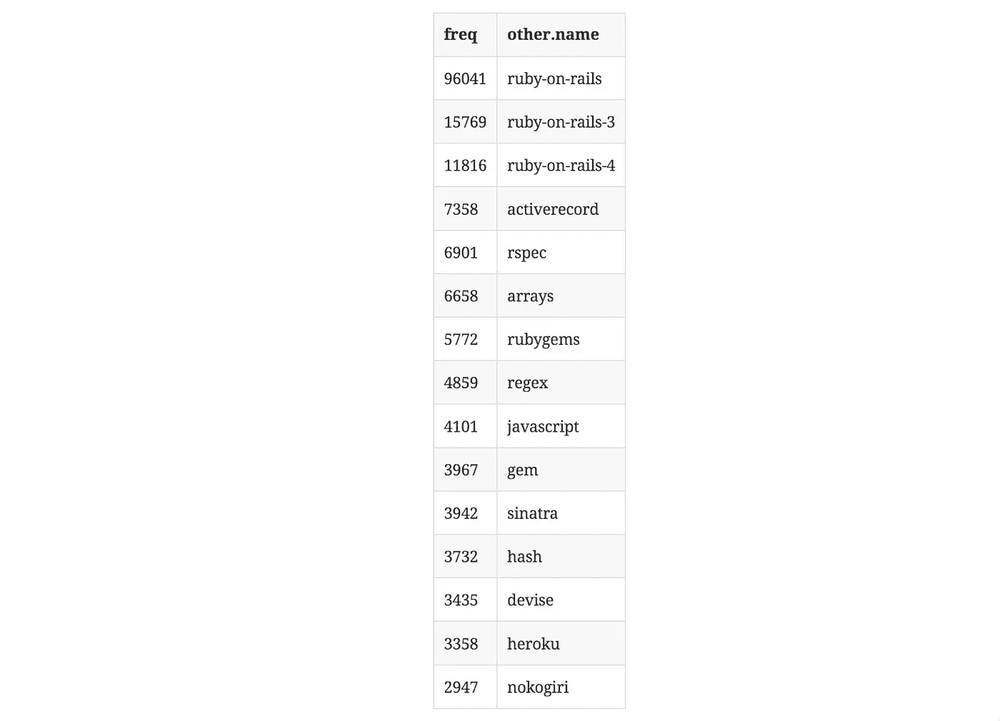

Tag correlations within the “ruby” tag.

您会发现结果是有意义的，其中许多标签要么是主要的 ruby 项目，要么是库。

我们还可以在 Neo4j 浏览器中将这些关联呈现为虚拟关系，方法是在我们的聚合数据上使用`apoc.create.vRelationship`函数，用`count`作为属性来表示`SIMILAR`关系。

```
MATCH (q:Question)-[t:TAGGED]->(tag:Tag {name:"ruby"}), 
      (q)-[:TAGGED]->(other:Tag)
WITH tag,other, count(*) as freqORDER BY freq DESC LIMIT 50
RETURN tag, other, 
       apoc.create.vRelationship(tag,'SIMILAR',{freq:freq}, other);
```

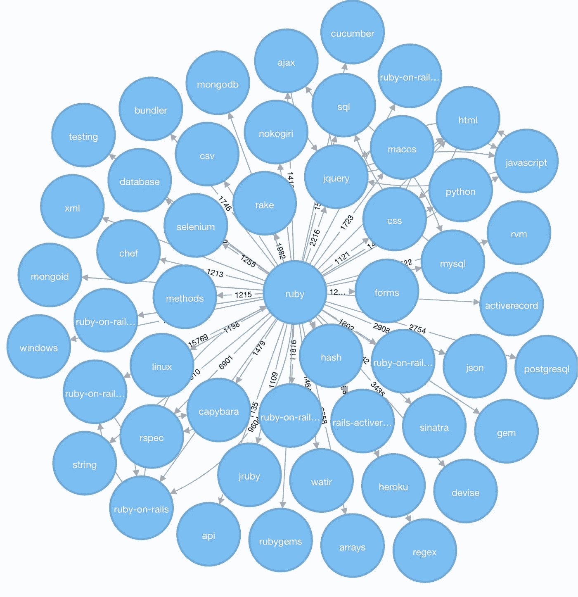

Correlation Visualization with Virtual Relationships

接下来，我们想通过观察它们的程度，来看看这些*其他标签*的使用频率。

```
MATCH (q:Question)-[t:TAGGED]->(tag:Tag {name:$tagName}),
      (q)-[:TAGGED]->(other:Tag)
WITH other, count(*) as freq
RETURN other.name, freq, size((other)<-[:TAGGED]-()) AS degree
ORDER BY freq DESC LIMIT 10
```

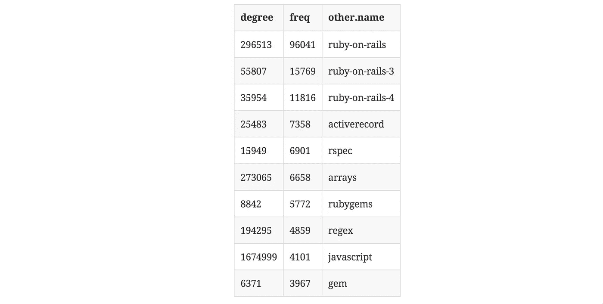

Usage frequencies of correlated tags.

原来`rails`、`arrays`、`javascript`的使用率真的很高。Rails 显示了它的受欢迎程度，其他两个标签也独立于 Ruby 用于其他编程语言问题。

# 标签相似度

然后我们看了标签的相似度计算，基于它们所附加的问题。

我们从基于两个集合的交集和总大小的 [Jaccard 相似度](https://neo4j.com/docs/graph-algorithms/current/algorithms/similarity-jaccard/)开始:

```
jaccard(A,B) = ∣A ∩ B∣ / ( ∣A∣ + ∣B∣ - ∣A ∩ B| )jaccard(A,B) = size(intersection(A,B)) / 
               (size(B) + size(B) - size(intersection(A,B)))
```

我们可以在 Neo4j 中运行它，或者作为一个函数，比如

```
RETURN algo.similarity.jaccard([1,2,3], [1,2,4,5]) AS similarity
```

它返回`0.4`(即`2/(3+4-2)`)。

或者作为用于更大数据量的过程。在那里，我们将传入一个地图/字典列表，其中每个条目都有一个`item`值和一个`categories`列表，例如`[{item:1, categories:[1,2,3]},{item:2, categories:[2,3,4]}]`。然后，该过程并行计算所有对的交集和相似度。我们可以传递额外的参数，如最小相似度或节点度(相关性)的截止值，详细信息记录在上面链接的文档中。

我们在我们的一小部分数据样本上运行这个程序，以显示它是有效的。

```
// find 100 tags with more than 50 questions
MATCH (tag:Tag) WHERE size((tag)<-[:TAGGED]-()) > 50 
WITH tag LIMIT 100MATCH (q:Question)-[:TAGGED]->(tag)
// find 3M tagged questions for those
WITH * LIMIT 3000000
// create the entry per item (tag) with its categories (questions)
WITH {item:id(tag), categories: collect(id(q))} as entry
WITH collect(entry) as entries// pass the entries to the algorithm, find the top 3 most similar items to each entry
CALL algo.similarity.jaccard.stream(entries, {topK:3})
YIELD item1, item2, count1, count2, intersection, similarity
// return each pair once
WHERE item1 < item2
// return the tag names, intersections and similarities ordered by highest similarityRETURN algo.getNodeById(item1).name AS firstTag,         
       algo.getNodeById(item2).name AS secondTag, 
       intersection, similarity
ORDER BY similarity DESC LIMIT 50;
```


Top3-Similarities between tags.

# 全球相关性

然后，我们在整个数据集上运行相似性计算，限于具有至少 100 个问题的相关标签，总共 17000 个标签节点，即 2.92 亿次比较(17k)。

```
// tags with at least 100 questions
MATCH (tag:Tag) WHERE size((tag)<-[:TAGGED]-()) > 100 WITH tag
// get the questions
MATCH (q:Question)-[:TAGGED]->(tag)
// create dict with tag as item and questions as categoriesWITH {item:id(tag), categories: collect(id(q))} as entry
WITH collect(entry) as entries
// run jaccard, write back resultsCALL algo.similarity.jaccard(entries, 
     {topK:5,similarityCutoff:0.1, write:true})
YIELD nodes, similarityPairs, write, writeRelationshipType, writeProperty, min, max, mean, stdDev, 
p25, p50, p75, p90, p95, p99, p999, p100RETURN *;
```

在我们竞争的共享测试机上运行 13 分钟来计算数据，在专用硬件上会更快。

由于 0.1 的非常高的最小相似性，并且仅写入 5 个最相似的邻居，我们创建了 2864 个`SIMILAR`关系，然后我们可以使用这些关系在上面运行其他图算法。

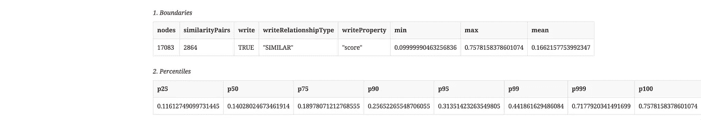

outputs of the jaccard similarity procedure.

在可视化中，我们看到我们只创建了“非常紧密”的相似性组，如`scheme<->racket`或`sed<->awk`，或者围绕 rdf、hadoop、flash 和 quickbooks 的一些小集群！

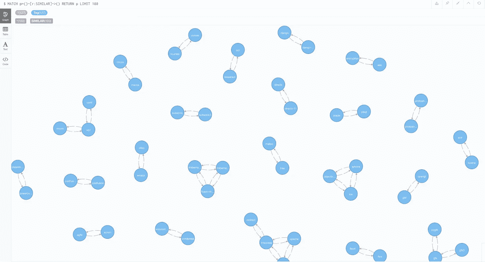

因此，我们以较低的相似性截止值 0.01 重新运行了计算，结果总共有 44728 个`SIMILAR`关系。

我们只保留了每个节点的**前 5 位**邻居，所以您可能会想到的一些相似之处可能会丢失，因为它们没有被删除。

# 利用相似关系

现在，我们使用新创建的关系来运行其他算法，例如像最短路径这样简单的算法。即相关标签是如何传递连接的。

```
MATCH (from:Tag {name:'html'}),(to:Tag {name:'neo4j'})
MATCH path = shortestPath((from)-[:SIMILAR*]-(to))
RETURN [n IN nodes(path) | n.name] as nodes
```

这就引出了这条路:

```
["html", "javascript", "json", "jackson", "spring-mvc", 
 "spring-boot", "spring-data", "spring-data-neo4j", "neo4j"]
```

或者是“javascript”的第四级邻居。

```
MATCH  path=(:Tag {name:"javascript"})-[:SIMILAR*..4]->() 
RETURN path
```

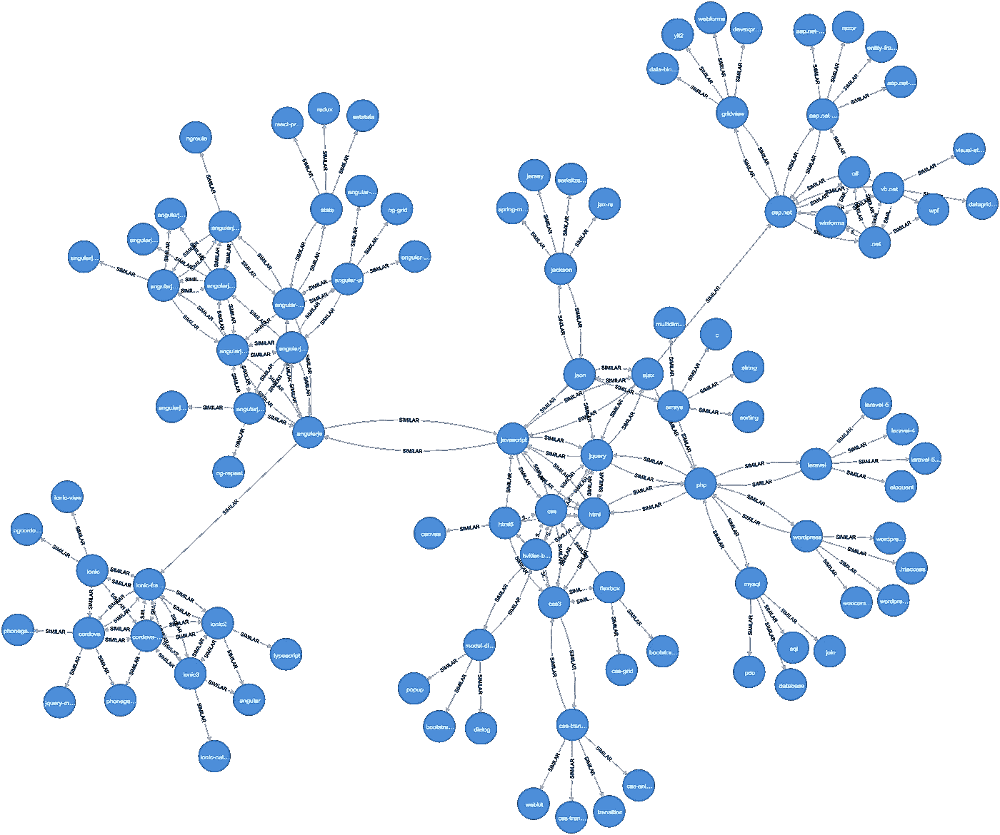

Neo4j Browser Visualization of “javascript” Neighborhood

除此之外，我们还在我们的推断图上快速运行其他图形算法，并将结果写回我们的数据库。

```
call algo.pageRank('Tag','SIMILAR');
call algo.labelPropagation('Tag','SIMILAR');
call algo.betweenness('Tag','SIMILAR');
```

现在我们的标签还带有`pagerank`、`partition`、`centrality`属性，这些属性捕捉了它们在我们的图中的相关性和位置。

```
match (t:Tag) return t limit 5;(:Tag {partition: 26, centrality: 406233.80006818444, name: ".net", count: 268970, pagerank: 2.532907, wikiPostId: 3607476})
(:Tag {partition: 4, centrality: 2545764.1141965324, name: "html", count: 752349, pagerank: 6.3226235, wikiPostId: 3673182})
(:Tag {partition: 415, centrality: 2731837.0951582957, name: "javascript", count: 1624044, pagerank: 5.2686405, wikiPostId: 3607052})
(:Tag {partition: 415, centrality: 642718.2814995827, name: "css", count: 537685, pagerank: 5.447395500000001, wikiPostId: 3644669})
(:Tag {partition: 204, centrality: 5703506.726861835, name: "php", count: 1200404, pagerank: 5.8298785, wikiPostId: 3607050})
```

# 形象化

既然我们的图的节点已经用图度量来丰富了，我们就可以将它们可视化，比如用我们的 [NeoVis.js Javascript 库](https://medium.com/neo4j/graph-visualization-with-neo4j-using-neovis-js-a2ecaaa7c379)。

例如围绕`javascript`标签的相似度图。

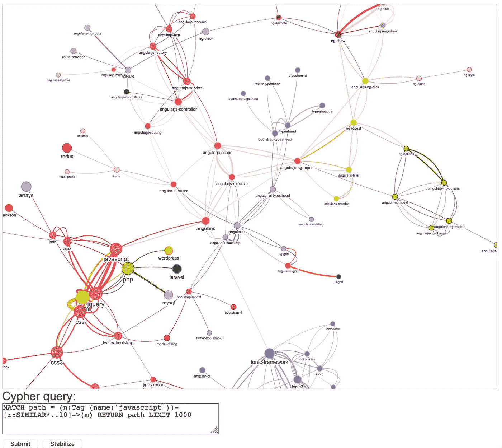

你可以在这里[现场试用](https://raw.githack.com/neo4j-examples/neo4j-stackoverflow-import/master/tagoverflow-viz.html)并在 GitHub 上找到[源码。](https://github.com/neo4j-examples/neo4j-stackoverflow-import/blob/master/tagoverflow-viz.html)

# 可视化:图形

幸运的是， [Leo Meyerovich](https://twitter.com/lmeyerov) ，Graphistry 的首席执行官和创始人，一个基于 GPU 的高性能图形可视化工具包，也在黑客马拉松上。在我们研究相似性的同时，Leo 围绕 Neo4j Python 驱动程序构建了一个小包装器，将节点和关系从一个 Cypher 查询拉到 Graphistry 的数据帧中，并根据需要绑定其列。

现在 Neo4j 连接器已经正确地集成到 Graphistry 中，所以您可以开箱使用它*。此外，还有大量的 Jupyter 笔记本演示。*

不过，你需要一个图形键，所以 ping Leo。

下面你可以看到图形用户界面和“kubernetes”周围网络的可视化，查询如下:

```
MATCH p=(t1:Tag {name:'kubernetes'})-[r:SIMILAR*..4]-(t2:Tag)
RETURN p
```

以下是 python 代码:

```
GRAPHISTRY = {
    'server': 'labs.graphistry.com',
    'api': 2,
    'key': 'xxxx'
} NEO4J = {
    'uri': "bolt+routing://f6087a21.databases.neo4j.io:7687",
    'auth': ("stackoverflow", "stackoverflow")
}!pip install pandas
!pip install graphistry[bolt] import pandas as pd
import graphistry
graphistry.__version__graphistry.register(bolt=NEO4J, **GRAPHISTRY)g = graphistry.cypher("""
      MATCH p=(t1:Tag {name:'kubernetes'})-[r:SIMILAR*..4]-(t2:Tag)
      RETURN p
  """,
  {})g = g.bind(point_title='name', edge_weight='score') 
# point_size='pagerank', point_color='partition',g.plot()
```

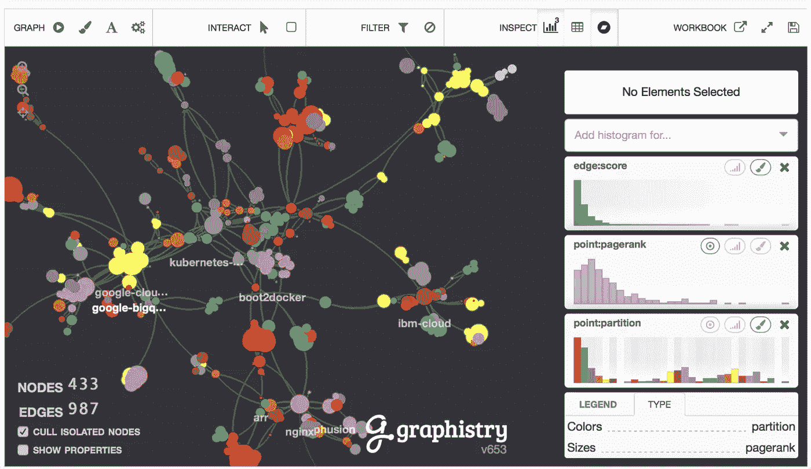

Graphistry Visualization of the K8S neighborhood.

在 graphistry 中，你可以直接用绑定来配置一些可视化设置，见上面的`name`。其他的更容易通过 UI 控制，通过`Add Histogram for …​`并选择一个属性，然后你可以使用这个分布来给节点和关系着色或调整大小。

# 摘要

这仅仅触及了图模型、图算法和 StackOverflow 数据可视化的表面。

我希望我激发了你对数据和数据集的兴趣，实例和笔记本是可以公开访问的，所以请尝试一下。我会再写一篇关于你可以在这个数据集上做的有趣的图形查询的文章。

对于流行语——黑客马拉松来说，这绝对是值得的——我们赢得了“最流行语”类别:)非常感谢我的合作者参与讨论，以及与这个很酷的数据集一起工作的乐趣。在这里，你可以读到黑客马拉松中另一个很酷的参赛项目，即[空间图形应用](https://neo4j.com/blog/graphconnect-2018-hackathon-stackoverflow/)。

请让我知道你还想做什么，我肯定有更多的想法。给 devrel@neo4j.com[写信或者在这个帖子上留言。](mailto:devrel@neo4j.com)

[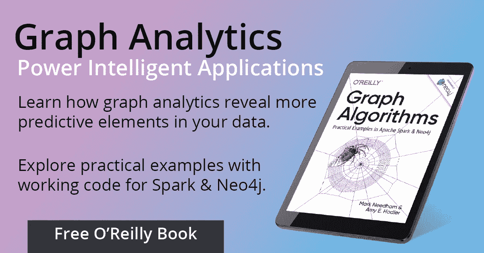](https://neo4j.com/graph-algorithms-book/?utm_source=medium_mhunger)

Free download: O’Reilly “Graph Algorithms on Apache Spark and Neo4j”