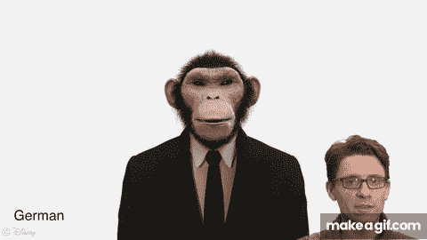
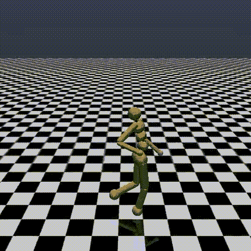

# 机器学习国际会议的收获

> 原文：<https://towardsdatascience.com/takeaways-from-the-international-conference-on-machine-learning-72d36b0c038?source=collection_archive---------8----------------------->

## 我从 ICML 2018 中学到了什么

作为一名专注于应用机器学习的工程师，我很幸运地参加了今年在瑞典斯德哥尔摩举行的机器学习国际会议(ICML)。以下是我最大的收获。

# 1.模仿对强化学习有重要的好处

主持人:[岳](https://medium.com/u/15c66be162cd?source=post_page-----72d36b0c038--------------------------------)(加州理工)&黄明乐(加州理工)

也被称为“从示范中学习”或“学徒学习”，**模仿学习**是 ML 研究的一个有前途的领域，因为它通过模仿预先存在的目标行为来帮助学习主体克服在开放世界环境中学习的挑战。例如，迪士尼的研究使用模仿学习来创造面部动画，模仿人们在说各种语言时下巴移动的方式*——这是岳和乐与迪士尼合作的项目。*

*探索的其他应用包括基于人类决策的自动驾驶汽车训练，基于获胜的例子跟踪运动员应该在场上的位置，以及挑选和放置物品以实现目标(想想亚马逊仓库)。*

**

*Demo of RL agent “mouthing” German by imitating a human.*

*模仿学习是引人注目的，因为它使用“成功”的例子来解决其母学科的一些基本挑战，**强化学习**。毕竟，强化学习的全部目的是训练一个代理人通过在一个环境中采取行动来最大化它收到的累积奖励(想象一只人工智能狗试图通过找出执行哪些技巧来最大化它可以获得的奖励数量)。通过发现预先存在的获胜行为作为目标(从“专家”或“示范者”那里)，模仿学习有助于 a)缩小可能导致奖励的可能行动的范围(没有专家，“行动空间”可能会非常大)和 b)建立行动和奖励之间的直接关联(而不是不确定在给定的情节中哪个行动导致了奖励)。*

*本次演讲涉及的技术包括行为克隆、直接策略学习和反向 RL。*

*视频和幻灯片[此处](https://sites.google.com/view/icml2018-imitation-learning/home?authuser=0)。*

# *2.无模型强化学习还没有为现实世界做好准备*

*演讲者:[本杰明·雷希特](http://people.eecs.berkeley.edu/~brecht/)(加州大学伯克利分校)*

*无模型强化学习试图通过让代理直接与其环境*交互*来最大化代理获得的回报，而不是首先建立该环境的明确定义的模型并作为代理与该模型交互。无模型方法之所以吸引人，是因为它们不需要试图建立一个有问题的环境模型的努力和开销。*

*从表面上看，似乎无模型 RL 将是帮助解决现实世界场景，特别是连续控制问题的一个很好的选择。连续控制问题涉及控制现实世界动态系统的输入以最小化成本(例如，机器人学习移动，自动驾驶汽车在繁忙的道路上导航，以及无人驾驶飞行器学习在半空中稳定)。因为连续控制问题在公式化方面非常类似于 RL 问题，即由状态、动作、转换和回报组成的最小化问题，如果我们能够学会解决这些问题而无需首先模拟复杂的现实世界环境，那不是很好吗？*

**

*Image shot by a stable unmanned aerial vehicle.*

*然而，尽管这看起来很有希望，但让无模型的 RL 代理控制现实世界的系统存在一些基本挑战。正如 Recht 博士在他的教程中令人信服地指出的那样，**无模型强化学习只有在高度结构化的封闭环境中才真正有效，例如在模拟和游戏中**。一旦一个代理进入真实世界的连续环境，它的性能就会变得非常不稳定，甚至对初始化中最小的扰动和变化都很敏感。性能下降的原因可能是因为封闭环境不能模拟所有真实世界的条件，所以在封闭环境中表现良好的代理可能不太适合预测真实世界中看不见的扰动。*

*无模型强化学习在现实世界中失败的第二个原因是**现实世界不允许太多的实验**，这是无模型学习的关键基础，因为赌注要高得多。例如，考虑一个 RL 代理在高速公路上学习控制一辆摩托车:它不允许*失败*到与模拟中相同的程度，因为重复摧毁摩托车的成本——更不用说有人类参与的情况了——因此代理不能像模拟中一样通过试错来学习。*

**

*Humanoid trained to walk in simulation using model-free RL.*

*考虑到强化学习会议是今年 ICML 最受欢迎的会议之一(以至于会议被开玩笑地称为 ICRL)，Recht 博士建议社区要么专注于基于*模型的*RL——特别是模型预测控制——要么寻找基本技术来进一步稳定现实环境中的无模型强化学习。Recht 警告说，如果我们继续只在仿真中优化无模型 RL 控制算法，我们就找错了对象。*

*为了更深入地了解 Recht 博士的工作，我推荐阅读他的简洁但极具教育意义的系列文章“[一个局外人的强化学习之旅](http://www.argmin.net/2018/06/25/outsider-rl/)*

*视频和幻灯片[在这里](https://people.eecs.berkeley.edu/~brecht/l2c-icml2018/)。*

# *3.人工智能对安全至关重要*

*主持人:[黎明之歌](https://people.eecs.berkeley.edu/~dawnsong/)(加州大学伯克利分校)*

*这个演讲探讨了人工智能和安全交叉领域的挑战和机遇:如果我们要将人工智能研究投入产品，机器学习和安全如何有一个纠缠不清的前进道路。为了展示我们的学习算法有多脆弱，宋博士讨论了攻击深度学习系统的不同技术，特别是视觉系统(有关这方面的例子，请查看我的介绍性工作[这里](https://github.com/dguliani/mnist-adversary))。另一方面，机器学习也可以用于*为不同的软件系统(例如 web 服务和物联网云)创建*新的攻击。*

*关于安全和 ML 的叙述的另一个关键部分是隐私的处理，特别是防止从机器学习模型中提取敏感信息的问题。虽然本质上是介绍性的，但这个演讲是对安全和机器学习之间日益增长的关系的一个很好的看法，它强调了前进中需要注意的一些最重要的问题。*

# *4.ICML 流行的纸主题*

*我在 ICML 偶然发现了一些有趣的论文，我认为按主题分类会有所帮助。*

## *a)对手*

*我遇到的最大主题之一是对抗性机器学习，这是一个广泛的领域，利用学习算法之间的竞争来优化产生新样本的生成器。在这个领域中，有两个主要的子领域——一个是基于来自训练集的学习来生成新样本(例如[训练生成器以得出特定风格的绘画](/gangogh-creating-art-with-gans-8d087d8f74a1)),另一个是生成旨在欺骗神经网络的对立样本。*

**

*Image generated through generative adversarial learning.*

*论文:*

> *模糊的渐变给人一种虚假的安全感:规避对敌对例子的防御*
> 
> *[通过凸外对抗性多面体对对抗性例子的可证明防御](https://arxiv.org/abs/1711.00851)*
> 
> *[利用有限的查询和信息进行阻塞盒对抗性攻击](http://proceedings.mlr.press/v80/ilyas18a/ilyas18a.pdf)*
> 
> *哪些 gan 的训练方法实际上是一致的？*

## *b)深度学习的新架构*

*这个主题指的是在向神经网络引入新的架构组件方面的进步，我看到了很多关于这方面的讨论。这项工作从整体上推进了深度学习领域，并为解决不同领域的预测问题提供了新的工具。*

*论文:*

> *[可微分塑性:用反向传播训练塑性神经网络](http://proceedings.mlr.press/v80/miconi18a/miconi18a.pdf)*
> 
> *[条件神经过程](https://arxiv.org/pdf/1807.01613.pdf)*
> 
> *[用于部分观察环境的具有空间记忆的生成时间模型](https://arxiv.org/pdf/1804.09401.pdf)*

## *c)将机器学习的进步应用到产品中*

*与在产品中部署机器学习系统相关的研究。*

*纸张:*

> *[并行 WaveNet:快速高保真语音合成](https://arxiv.org/pdf/1711.10433.pdf)*

## *d)强化学习*

*在状态-行动空间中通过决策解决累积奖励最大化问题的进展。*

*论文:*

> *[边玩边学——从零开始解决稀疏奖励任务](http://proceedings.mlr.press/v80/riedmiller18a/riedmiller18a.pdf)*
> 
> *[分层模仿和强化学习](https://arxiv.org/pdf/1803.00590.pdf)*
> 
> *[用于强化学习的无监督元学习](https://arxiv.org/pdf/1806.04640.pdf)*
> 
> *[用于分布式强化学习的隐式分位数网络](https://arxiv.org/abs/1806.06923)*

## *e)理论*

*这里的工作旨在进一步加深我们对机器学习(特别是深度学习)为什么以及如何工作的理论理解。这项工作对于使我们能够不断向前推进模型和网络的部署至关重要，因为它提供了基础知识来对比深度学习社区取得的高度经验性进展。*

*论文:*

> *[机器心理理论](https://arxiv.org/pdf/1802.07740.pdf)*
> 
> *[n 人可微分博弈的机制](http://proceedings.mlr.press/v80/balduzzi18a/balduzzi18a.pdf)*

## *f)隐私和公平*

*随着深度学习在广泛处理人群的上下文中变得适用(例如，医疗保健、贷款申请评估等。)，我们需要切向工具来消除训练数据中存在的历史偏见。同时，我们需要知道隐私信息不能通过敌对攻击从模型中提取出来的方法。这项工作在这些领域取得了进展。*

*论文:*

> *[来自偏见数据的公平机器学习中的剩余不公平](https://arxiv.org/pdf/1806.02887.pdf)*
> 
> *[重复损失最小化中无人口统计的公平性](https://arxiv.org/pdf/1806.08010.pdf)*

# *5.在 ICML 偷听到的*

*最后，一些有趣而有意义的 ICML 语录:*

> *“一旦我们将其投入生产，所有的机器学习都变成了强化学习。今天，你有这些大公司根据用户反馈定期重新训练模型。那就是强化学习。”*
> 
> *Benjamin Recht 博士，副教授(加州大学伯克利分校)*

***背景:【Benjamin Recht 博士提倡进行更多的基础研究，以稳定连续现实世界环境中的强化学习代理。他反映，生产中的许多非 RL 模型经常基于反馈进行再培训，实际上使它们成为 RL 系统。***

> *“作为机器学习人员，我们都喜欢写的那一行，即“(acc，loss) = model.evaluate(x_test，y_test)”已经不够了。”*
> 
> *——尼古拉斯·卡里尼，研究科学家(谷歌大脑)*

***背景:** Nicholas Carlini 因其作品“[模糊的渐变产生一种虚假的安全感](http://proceedings.mlr.press/v80/athalye18a/athalye18a.pdf)”获得最佳论文奖，他提倡一种更结构化的方法来验证模型，即通过创建方法来识别模型的安全程度。*

> *怎么样了？谢谢你有用的建设性建议和你有价值的深度问题。如果我们有空间来测试我们的估计，我们将阐明我们所学到的内容并更新最终附录！*
> 
> *- ICML 2018 组委会*

***上下文:**对于所有提交给 ICML 大学、需要修改才能被接受的论文，组织者使用经典的 NLP 技术来确定作者在回应批评时使用的最有可能改变结果的单词和短语。这是一个有趣的关键短语的大杂烩，旨在增加作者被 ICML 接受的机会..*

# *结论*

*超过 5000 名与会者和 600 多篇论文、主题演讲、海报展示以及在六天的紧凑日程中颁发的奖项，今年的 ICML 可谓收获颇丰。除了学术机构，许多公司也蜂拥而至，设立了自己的展位(我在另一篇文章中专门写了谁在那里[)。)今年提交给 ICML 的出席人数和新研究的增长不容忽视，这表明机器学习社区比以往任何时候都更加活跃。](https://medium.com/connected/icml-accepted-papers-stats-2018-1f9c0a9a6eaf)*

*对我来说，最重要的非技术性收获是**机器学习中基础理论研究和产品开发的持续结合**。ML 仍然是一个尚未真正商品化的领域。尽管我们有越来越复杂、先进和易用的工具(TensorFlow、PyTorch、云服务等)。)，真正有影响力的创新仍然主要来自研究。这意味着大公司继续对未知领域进行大量投资，建立研究实验室，顶级学者可以在那里赚取高额薪酬，同时制定自己的工作日程。*

*我希望明年能看到更多的东西，包括:*

*   *蒸馏研究，即解决随着社区的发展*而增加 [*研究债务*](https://distill.pub/2017/research-debt/) 的研究。看到更多的研究人员愿意全面处理、简化研究，并将研究置于更广阔的背景下，以减少过去十年积累的研究债务，这将是一件好事。**
*   *我也希望看到深度学习和强化学习之外的更广泛的优化探索。这只是我的看法，但我相信人工通用智能将不会是一个特定的领域，而是将优化与对大脑的半结构化理解结合起来。我认为，在解决智力问题时，社区应该继续从动物和人类的大脑中寻找灵感。*

*总而言之，ICML 是一次非凡的经历。我离开会议时充满活力，并受到鼓舞，继续致力于机器学习问题，将我的努力集中在提炼特定的研究领域，以便其他人可以了解哪些问题已经解决，并为解决其他挑战带来灵感。如果你有定量的背景并且对合作感兴趣，在这里评论或者发邮件给我。*

**Dhruv 是*[*Connected*](https://www.connected.io/?utm_source=Medium&utm_medium=Blog&utm_campaign=Thought%20leadership)*的 ML 软件工程师，这是一家产品开发公司，与客户合作，通过软件驱动的产品来提高影响力。更多故事* [*此处*](https://medium.com/connected) *。**

# *作者的评论*

*我想对伊莱·伯恩斯坦(Eli Burnstein)在多次修改中帮助校对和编辑这篇文章表示由衷的感谢。*

*像往常一样，留下评论并指出你在这里发现的任何错误。我会尽快修复它们！*

# *脚注*

1.  *基于模型的 RL 中的“模型”捕获状态和动作之间的转移概率，并包含一些关于来自这些转移的可能回报的信息。实际上，对转换动态的这种理解允许 RL 问题被简化为在一个环境中规划最优轨迹以最大化整体回报的问题。*
2.  *连续控制问题和 RL 问题之间的相似之处是由于这两个问题的基本公式。大多数强化学习问题被认为是[马尔可夫决策过程](https://en.wikipedia.org/wiki/Markov_decision_process) (MDPs)。MDP 是一种数学框架，用于模拟决策场景，包括 1)有限的状态集，2)有限的行动集，3)行动导致特定状态的概率，4)由于行动而在状态之间转换后收到的即时奖励(或预期即时奖励)，以及 5)折扣因子。连续控制问题也可以被认为是 MDP，具有上述相同的基本组成部分，因此强化学习技术在该领域也是有效的，这似乎是很自然的。*