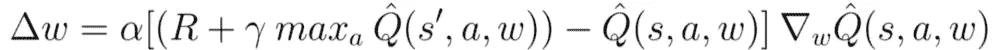
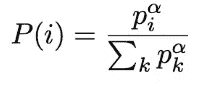

# 让 Deep Q Networks 更进一步

> 原文：<https://towardsdatascience.com/taking-deep-q-networks-a-step-further-bfcae4aa8adb?source=collection_archive---------13----------------------->

又见面了，

今天的话题是…嗯，和上一个一样。Q 学习和深度 Q 网络。[上次](https://sergioskar.github.io/Deep_Q_Learning/)，我们解释了什么是 Q 学习，以及如何使用贝尔曼方程来寻找 Q 值，从而得出最优策略。后来，我们介绍了深度 Q 网络，以及我们如何让深度神经网络学习近似它们，而不是计算 Q 表的所有值。

深度 Q 网络将环境状态作为输入，并为每个可能的动作输出 Q 值。最大 Q 值决定了代理将执行的操作。代理的训练使用 **TD 误差**作为损失，TD 误差是下一个状态的最大可能值和 Q 值的当前预测值之间的差(如贝尔曼方程所示)。因此，我们设法使用神经网络来逼近 Q 表。

到目前为止一切顺利。但是当然，也出现了一些问题。这只是科学研究前进的方式。当然，我们已经提出了一些很好的解决方案。

# 移动 Q 目标

第一个问题是所谓的移动 Q 目标。正如我们所看到的，TD 误差的第一个组成部分(TD 代表时间差)是 Q 目标，它的计算方法是立即奖励加上下一个状态的贴现最大 Q 值。当我们训练我们的代理时，我们根据 TD 误差更新权重。但是相同的权重适用于目标值和预测值。你看到问题了吗？

我们将输出移近目标，但我们也移动了目标。所以，我们最终追逐目标，我们得到一个高度振荡的训练过程。在我们训练网络的时候保持目标不变并不好。DeepMind 正是这么做的。

它不是使用一个神经网络，而是使用两个。是的，你没听错！(好像一个还不够)。

一个作为主要的深度 Q 网络，第二个(称为**目标网络**)专门且周期性地更新目标的权重。这种技术被称为**固定 Q 目标。**事实上，权重在大部分训练中是固定的，并且只是偶尔更新一次。

# 最大化偏差

最大化偏差是深度 Q 网络高估值和动作值(Q)函数的趋势。为什么会这样？我认为，如果由于某种原因，网络高估了某个动作的 Q 值，那么该动作将被选为下一步的首选动作，而同样的高估值将被用作目标值。换句话说，没有办法评估具有最大值的动作实际上是否是最佳动作。这个怎么解决？答案是一个非常有趣的方法，叫做:

# 双深 Q 网络

为了解决最大化偏差，我们使用两个深度 Q 网络。

*   一方面，DQN 一如既往地负责下一个动作的**选择**(取值最大的那个)。
*   另一方面，目标网络负责该动作的**评估**。

诀窍在于，目标值不是由最大 Q 值自动产生的，而是由目标网络产生的。换句话说，我们要求目标网络计算在下一个状态采取行动的目标 Q 值。并且作为副作用，我们还解决了移动目标问题。整洁对吗？一石二鸟。通过将动作选择与目标 Q 值生成分离，我们能够显著降低高估，并且训练更快、更可靠。

你觉得就这样了？抱歉让你失望了。我们将更进一步。现在怎么办？你打算增加第三个神经网络吗？哈哈！！

算是吧。现在谁在笑？

# 决斗深度 Q 网络

先刷新一下 Q 学习的基础。q 值对应于一个行为对于一个特定的州来说有多好的度量？这就是为什么它是一个动作值函数。度量标准只不过是该州对该行动的预期回报。事实上，q 值可以分解成两部分:状态值函数 V(s)和优势值 A(s，A)。是的，我们只是引入了一个新的功能:

Q(s，a)= V(s)+ A(s，A)

优势函数捕捉的是在给定状态下，一个行为与其他行为相比有多好，而价值函数捕捉的是在这种状态下有多好。决斗 Q 网络背后的整个思想依赖于**将 Q 函数表示为值和优势函数的总和**。我们简单地用两个网络来学习和的每一部分，然后我们合计它们的输出。

我们这样做有什么收获吗？当然，我们有。代理现在能够评估一个状态，而不关心该状态的每个动作的效果。这意味着决定一个状态好坏的特征不一定与评估一个动作的特征相同。并且它可能根本不需要关心动作。一个州采取的行动完全不会影响环境，这种情况并不少见。那么为什么要考虑它们呢？

*   快速提示:如果您仔细观察图像，您会发现，要合计两个网络的输出，我们并不是简单地将它们相加。这背后的原因是可识别性的问题。如果我们有 Q，我们就找不到 V 和 a，所以我们不能反向传播。相反，我们选择使用平均优势作为基线(减去的项)。

最后但并非最不重要的是，我们有更多的问题要讨论，它必须与优化经验重播。

# 优先体验重放

你还记得经验回放是指我们时不时地向代理人回放随机的过去经验，以防止他忘记它们。如果你没有，现在你有了。但是有些经历可能比其他经历更有意义。因此，我们应该优先播放它们。为此，我们使用优先级进行采样，而不是随机采样(来自均匀分布)。首先，我们定义 TD 误差的大小(加上一些常数，以避免选择体验的概率为零)。

> *p = |δ|+ε*

**中心思想:预测和目标之间的误差越高，就越迫切需要了解它**。

为了确保我们不会总是重复同样的经历，我们添加了一些随机性，这样就万事俱备了。此外，对于复杂性的动摇，我们将经验保存在一个叫做 SumTree 的二叉树中。

太多了。很多新的信息，很多新的改进。但是想想我们能把它们结合在一起。我们做到了。

我试图给出该领域最重要的最新成果的总结，并辅以一些直觉思维和数学知识。这就是强化学习对学习如此重要的原因。有如此多的潜力和如此多的增强功能，以至于你不能忽视它将成为人工智能中的大玩家的事实(如果它还不是的话)。但这就是为什么学习和跟上它是如此困难。

我们要做的就是不断学习…

> ***如果你有任何想法、评论、问题或者你只是想了解我的最新内容，请随时与我联系***[**Linkedin**](https://www.linkedin.com/in/sergios-karagiannakos/)**[**Twitter**](https://twitter.com/KarSergios)**[**insta gram**](https://www.instagram.com/sergios_krg/)**[**Github**](https://github.com/SergiosKar)**或者********

*****要阅读整个深度强化学习课程，学习所有你需要知道的关于人工智能的知识，去* [*这里*](https://medium.com/@SergiosKar/deep-reinforcement-learning-course-baa50d3daa62) *。*****

*****原载于 2018 年 10 月 14 日*[*sergioskar . github . io*](https://sergioskar.github.io/Taking_Deep_Q_Networks_a_step_further/)*。*****