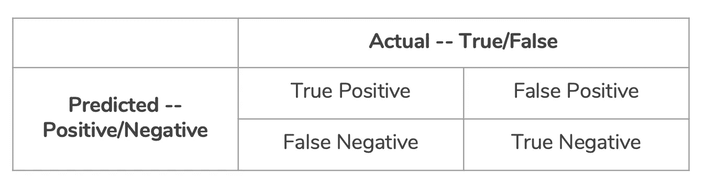
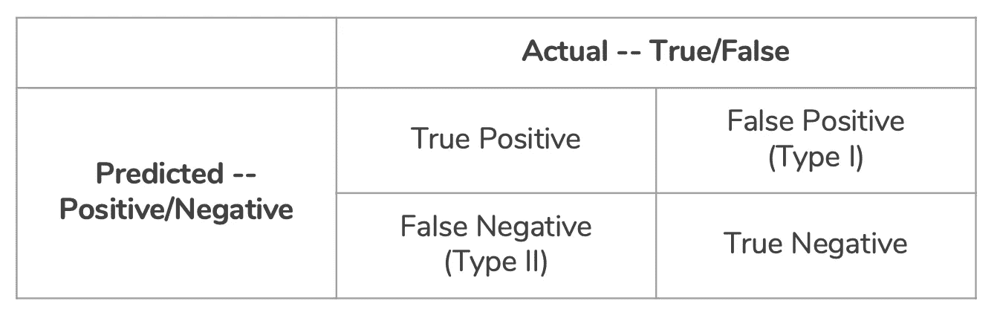
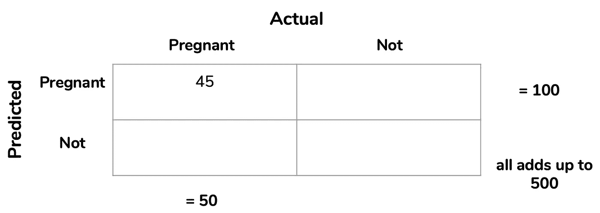
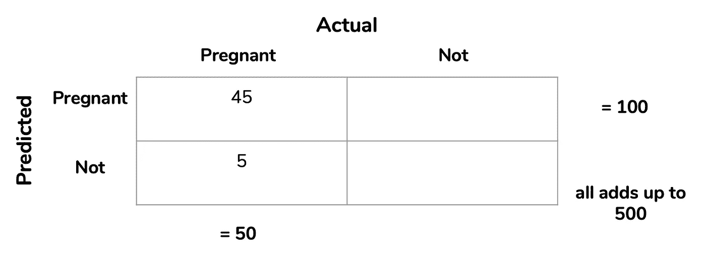
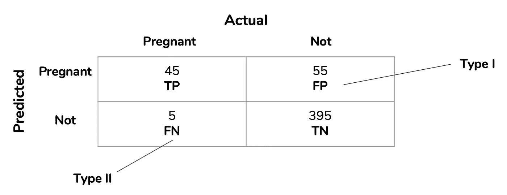
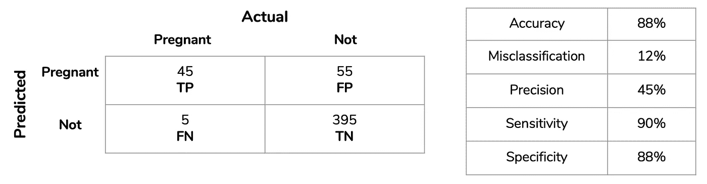

# 从混乱矩阵中找出混乱

> 原文：<https://towardsdatascience.com/taking-the-confusion-out-of-confusion-matrices-c1ce054b3d3e?source=collection_archive---------2----------------------->

Source: Understanding Confusion Matrix by Sarang Narkhede on Towards Data Science

当我第一次了解混乱矩阵的概念时，我有一种强烈的感觉:混乱。毕竟，它们被称为混淆矩阵。事实上，我确信它们之所以如此命名，是因为它们经常如此令人困惑(不要引用我的话)。但是，当你更深入地研究混淆矩阵的构造时，它实际上并不那么令人困惑。

最重要的是要知道，它完全基于**结果。**

# **真、假、正、负**

How you should look at a confusion matrix

正/负标签指的是实验的*预测*结果，而真/假指的是*实际*结果。因此，如果我预测有人怀孕了，但他们没有，那么这将是一个假阳性，因为*实际*结果是假的，但*预测*是阳性的。

# **错误类型**

Types of Errors

混淆矩阵有两类错误:第一类和第二类。

有人教我两种方法来保持第一型和第二型的正直。如果你知道这些年来有谁帮助过你，请在评论中留下他们——我喜欢好的记忆术！

第一种方法是重新写假阴性和假阳性。假阳性是一种 I 型错误，因为假阳性= **F** 也为真，并且只有一个 F。假阴性是一种 II 型错误，因为假阴性= **F** 也为 **F** 也为真，因此有两个 F 使其成为 II 型错误。(莱利·达拉斯的这种方法值得称赞！)

第二种方法是考虑这些单词的意思。误报包含一个否定词(False ),所以它是一类错误。假阴性有两个否定词(假+负)，所以是第二类错误。

# 混淆度量

从我们的混淆矩阵中，我们可以计算出五个不同的度量标准来衡量我们模型的有效性。

1.  准确度(全部**正确** /全部)= TP + TN / TP + TN + FP + FN
2.  分类错误(全部**不正确** /全部)= FP + FN / TP + TN + FP + FN
3.  精度(**真**正/预测**正)= TP / TP + FP**
4.  灵敏度又名召回(**真**阳性/所有**实际**阳性)= TP / TP + FN
5.  特异性(**真**阴性/所有**实际**阴性)=TN / TN + FP

# **示例**

在这一点上，我已经向你抛出了许多单词和公式，所以让我们将我们所学的应用到一个例子中。我通过做例子学得最好，说到矩阵，没有比怀孕更好的例子了。

假设我为塔吉特百货工作，我想根据购物模式[发现怀孕的青少年，这样我就可以在他们之前](https://www.forbes.com/sites/kashmirhill/2012/02/16/how-target-figured-out-a-teen-girl-was-pregnant-before-her-father-did/#5f1f30706668)通知他们的父亲。我随机抽取了 500 名女性青少年顾客。在这些青少年中，有 50 人实际上已经怀孕。我预测总共有 100 个怀孕的青少年，其中 45 个真的怀孕了。

我们的任务是双重的: **A)** 识别 TP、TN、FP、FN，并构建混淆矩阵和 **B)** 计算准确度、误分类、精确度、灵敏度和特异性

首先，让我们分解我们的问题陈述来回答 a 部分。

我随机抽取了 500 名少女顾客作为样本。在这些青少年中，有 50 人实际上已经怀孕。我**预测 100 个**怀孕少女，其中 **45 个**实际怀孕**。**

我预测了 100 次怀孕，所以我们的“预测怀孕行”应该加起来是 100。我们知道 100 人中有 45 人确实怀孕了，所以我们可以把 45 人放在预测怀孕的实际怀孕点上，也就是真阳性。

45 are indeed pregnant

此外，我的样本中有 50 人实际上已经怀孕。所以我的实际怀孕数应该是 50。因为我们在这一栏中已经有 45 个，我们在预测的而不是实际的怀孕点中放了 5 个，也就是假阴性。

50–45 = 5

我预测了 100 次怀孕，但是只有 45 次真的怀孕了。那么在我预测的所有人中，有多少是我错误预测的呢？答案是 55，这是我的假阳性，因为我错误地预测了阳性结果。

100–45 = 55

最后，我可以通过将 45、55 和 5 相加，然后从 500 个样本中减去，来确定真正否定的数量。这给我们留下了 395 个真正的否定。一旦我们的数字被填入，我们可以通过把我们所有的方块加起来并确保它们加起来是 500 来复查我们自己。

我们也知道 55 或假阳性是我们的 I 型错误，因为我们知道我在总共 100 次预测怀孕中错误地预测了 55 次。我们知道 5 或假阴性是我们的第二类错误，因为我们知道我错误地预测了 50 个实际怀孕的女孩中有 5 个没有怀孕。

接下来，我们可以使用我们的标签混淆矩阵来计算我们的指标。

1.  准确度(全部**正确** /全部)= TP + TN / TP + TN + FP + FN

(45 + 395) / 500 = 440 / 500 = 0.88 或 ***88%准确率***

2.分类错误(全部**不正确** /全部)= FP + FN / TP + TN + FP + FN

(55 + 5) / 500 = 60 / 500 = 0.12 或 ***12%误分类***

你也可以只做 1 —精度，所以:

1–0.88 = 0.12 或 ***12%误分类***

3.精度(**真**正/预测**正)= TP / TP + FP**

45 / (45 + 55) = 45 / 100 = 0.45 或 ***45%精度***

4.灵敏度又名召回(**真**阳性/所有**实际**阳性)= TP / TP + FN

45 / (45 + 5) = 45 / 50 = 0.90 或 ***90%灵敏度***

5.特异性(**真**阴性/所有**实际**阴性)=TN / TN + FP

395 / (395 + 55) = 395 / 450 = 0.88 或 ***88%特异性***

# 那又怎样？

Our final result

这一切都很好，但我们为什么要在乎呢？

我们之所以关心，是因为混淆矩阵可以帮助我们使用上面计算的指标来评估模型的性能。现在，我们不需要每次都做所有五个，我们只需要选择一个来帮助我们根据最坏的情况评估我们的模型。

在这种情况下，以我们的怀孕为例，假阳性的高发生率是最糟糕的结果。这使得精确度成为我想要关注的指标，它只有 45%，非常糟糕。这意味着我们有 55%的时间错误地预测怀孕，并通知父母不存在的怀孕。我们的模式，简单来说，很烂。

我希望这篇文章让您对混淆矩阵不再感到困惑。如果你有任何简化的问题或方法，请在下面的评论中留下。