# 1000 家 Crunchbase 创业公司的故事

> 原文：<https://towardsdatascience.com/tale-of-1000-crunchbase-startups-6de0ff97f60e?source=collection_archive---------3----------------------->

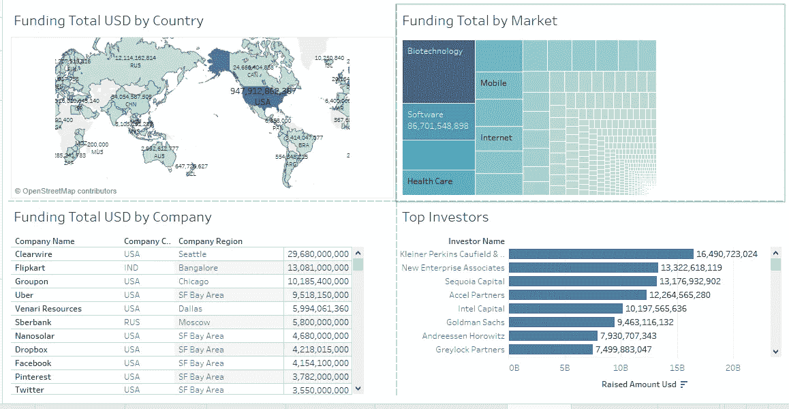

# 介绍

受到 100 个企业家的故事的启发，我想利用 Crunchbase 创业公司的数据做类似的事情。

[Crunchbase](https://www.crunchbase.com/) 是一个收集许多初创公司融资信息的网站。这是发现创新公司和了解他们背后的人的绝佳资源。

不幸的是，与其他公共数据源不同，人们必须支付专业会员费才能从 Crunchbase 下载数据。所以我决定在这里下载[的数据，这不是最新的；然而，它对我的目的是好的。](https://github.com/notpeter/crunchbase-data)

与此同时，我创作了这个 [Tableau 故事](https://public.tableau.com/profile/susan.li#!/vizhome/CrunchbaseData_2/Taleof1000CrunchbaseStartups?publish=yes)，可以在这里[查看](https://public.tableau.com/profile/susan.li#!/vizhome/CrunchbaseData_2/Taleof1000CrunchbaseStartups?publish=yes)。

# 数据

先做最重要的事情；我们来探究一下 r 中的数据。

该数据集包含三个表:投资、公司和收购。它包括 66，000 多家成立于 1977 年至 2015 年之间的公司。在这 66，000 家公司中，大约有 18，000 家公司后来被收购。

## 投资

**大多数资助金额在 5000 万至 6000 万美元之间。**

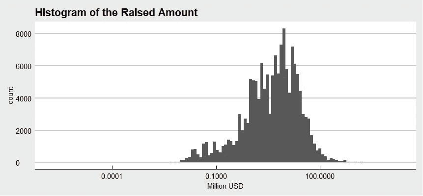

Figure 1

**按公司、类别和地区列出的最高筹资总额**。

毫不奇怪，大多数顶级资助的 crunchbase 初创公司都位于美国，尤其是旧金山湾区。我相信你会熟悉这些公司中的一些或全部。

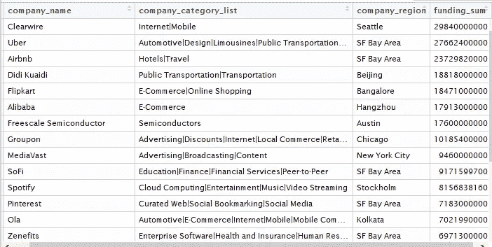

Figure 2

**公司筹集的前 20 笔资金总额**

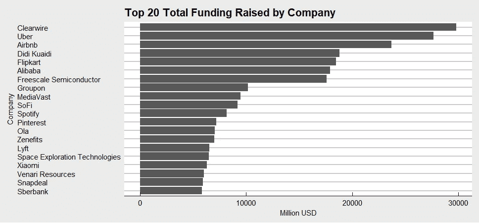

Figure 3

**按公司类别列出的前 20 名筹资总额**

对于一家年轻的生物技术公司来说，这是一个激动人心的时刻，因为该行业的风险投资热潮。

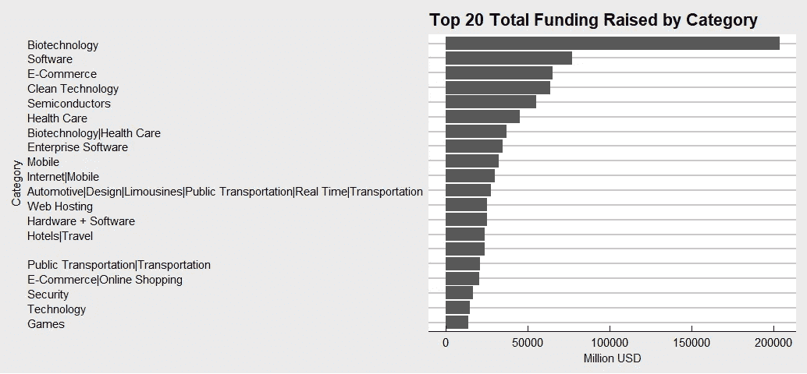

Figure 4

**生物技术风险投资排名前 15 位的城市**

任何想创办生物技术公司的人都应该密切关注这个列表。

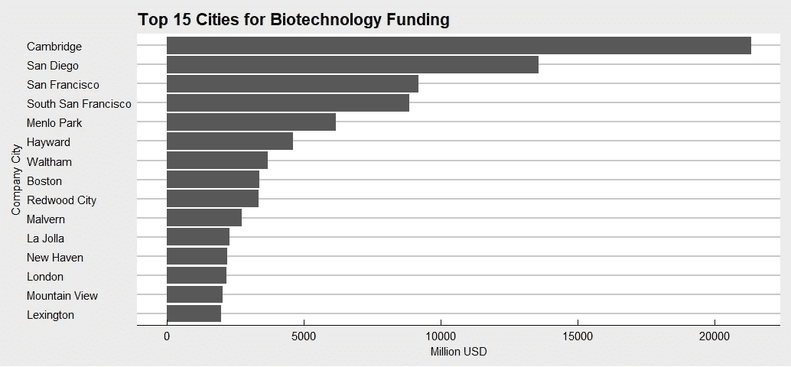

Figure 5

毫不奇怪，剑桥和波士顿应该争夺交易和美元排行榜的榜首。圣地亚哥远远落在第二位。旧金山、南旧金山、门洛帕克、海沃德、红木城和山景城都在湾区的名册上。

1977 年至 2015 年间，这 15 个最大的城市几乎占据了所有生物技术风险投资的一半。

**按区域划分的前 15 名筹资总额**

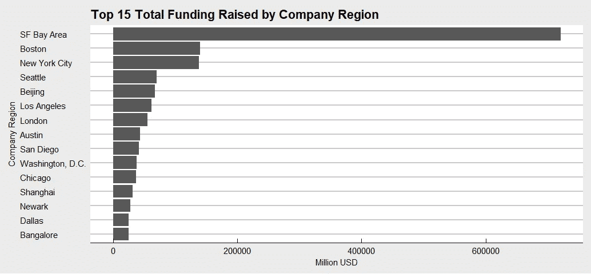

Figure 6

北京和上海现在是顶尖的创业中心，尽管这些亚洲城市获得的加速器资金比西欧城市少 10%。

毫不奇怪，随着联想、腾讯、阿里巴巴和百度等企业巨头在北京诞生，北京在 crunchbase 初创企业融资总额方面排名第四。

**融资轮次**

对那些不熟悉创业和早期投资领域的人来说(引用[维基百科](https://en.wikipedia.org/wiki/Venture_round)):

*   风险投资轮是一种用于风险资本融资的融资轮，初创公司通过它获得投资，通常来自风险资本家和其他机构投资者。获得风险投资是发展新公司和新技术的主要刺激因素之一。
*   私募股权通常是指以有限合伙制组织的投资基金，不公开交易，其投资者通常是大型机构投资者、大学捐赠基金或富裕的个人。
*   债务融资是指公司通过向个人和/或机构投资者出售债券、票据或票据来筹集营运资金或资本支出。
*   上市后是指公司首次公开发行股票后的一段时间，这是它在股权金融市场的首次亮相
*   术语“种子”意味着这是一个非常早期的投资，意味着支持企业直到它能够产生自己的现金，或者直到它准备好进行进一步的投资。

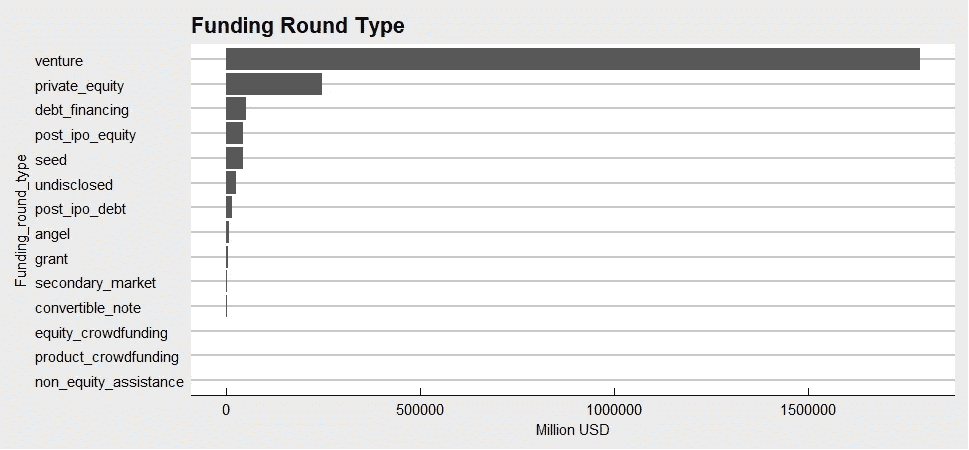

Figure 7

如果你想知道风险投资公司从哪里获得资金，可以看看 Quora 上的这篇文章。

**按投资者和地区列出的最高融资额**

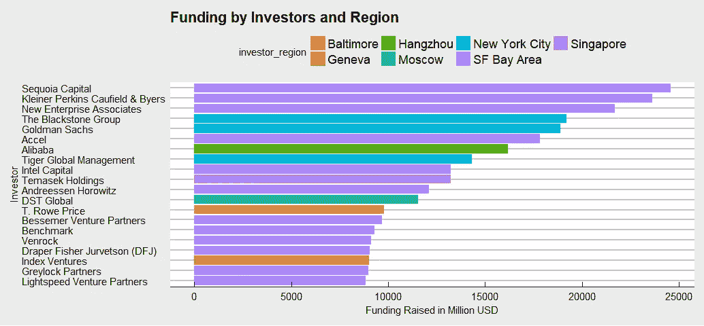

Figure 8

前 20 名投资者中有 12 名在旧金山湾区。前 20 名投资者中有 3 名在纽约市地区。其余的顶级投资者来自巴尔的摩、中国、莫斯科、日内瓦和新加坡。

## **采集**

对于大多数风险资本家来说，收购是一个重要的衡量标准。他们投资创业公司的钱最终必须回到锅里——最好是高倍数的。

在研究了收购表之后，我发现该表包括了失败的收购:也就是没有发生的计划收购，比如:

1.  在奥巴马政府瞄准了将美国最大的制药公司转移到爱尔兰以降低其税收的交易后，辉瑞和 Allergan 终止了他们计划中的 1500 亿美元的合并。
2.  美国地方法院裁决以反竞争为由阻止 Anthem-Cigna 合并， [Cigna 公司取消了与 Anthem Inc .的 480 亿美元合并协议](https://www.wsj.com/articles/cigna-calls-off-merger-with-anthem-1487104016)
3.  在司法部计划对 Comcast 和时代华纳有线提起反垄断诉讼以试图阻止它之后， [Comcase 宣布将撤回收购时代华纳有线](https://www.nytimes.com/2015/04/24/business/media/comcast-time-warner-cable-merger.html?_r=0)的提议。
4.  在法院以反垄断为由阻止交易后，Aetna 放弃了与 Humana 的 370 亿美元的合并计划。
5.  迈兰以 260 亿美元收购佩里戈的计划失败了。

记住这一点，让我们研究一下采集数据。

**收购价格金额分配**

大多数收购金额在 1 亿美元左右(请记住，该数据包括高价值的不成功交易)。

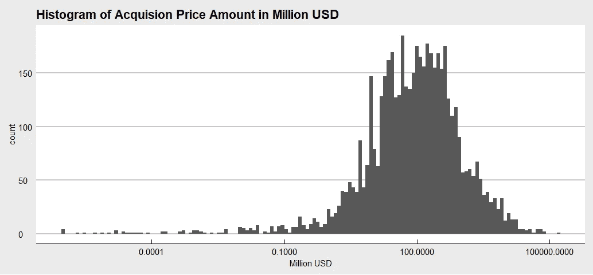

Figure 9

**按公司和收购方列出的顶级收购**

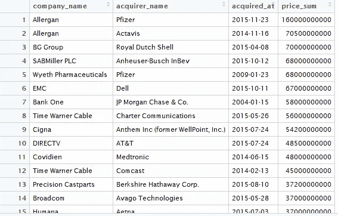

Figure 10

记住，对于上表来说，№1，9，12，15 都没有发生。

**需要多久才能被收购？**

在我们的数据集中，绝大多数初创公司都是在成立 10 年内被收购的。

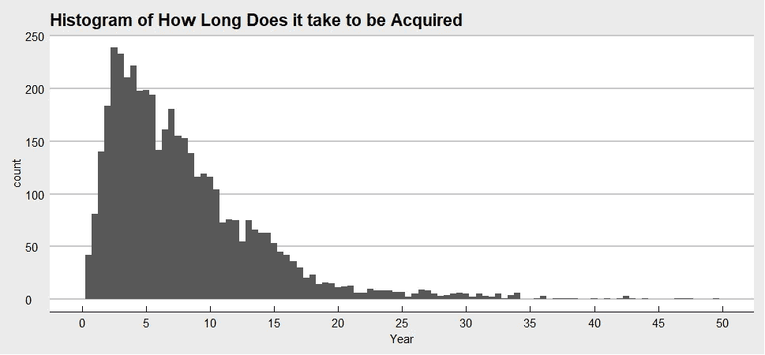

Figure 11

**收购数量最多的顶级风投公司**

最后，我们绘制了 10 大风投公司的图表(按照通过收购退出的数量排序)。

Figure 12

从 1960 年到 2015 年，思科投资、谷歌风险投资、微软风险投资、IBM 风险投资集团、惠普风险投资和英特尔投资是最活跃的企业风险投资者。雅虎和苹果没有风险投资部门。

甲骨文确实有一个风险投资部门，但它不再投资初创公司了。

EMC Ventures 现在是戴尔技术资本。

## 方法学

上述分析和 Tableau 中的[仪表板](https://public.tableau.com/profile/susan.li#!/vizhome/CrunchbaseData_2/Taleof1000CrunchbaseStartups)基于从[这里](https://github.com/notpeter/crunchbase-data)下载的数据，这些数据收集了 1977 年至 2015 年间成立的全球公司以及 1960 年至 2015 年间的收购信息。公司按行业分类。该图可能不包括在此期间成立和资助的所有公司。如你所见，数据中也有一些偏差。

创建这篇文章的源代码可以在[这里](https://github.com/susanli2016/Data-Analysis-with-R/blob/master/crunchbase_investment.Rmd)找到。我将很高兴收到关于上述任何反馈或问题。