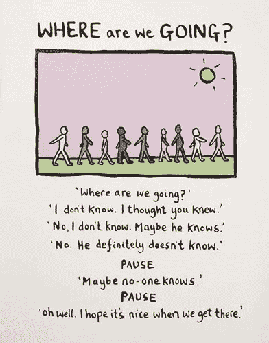
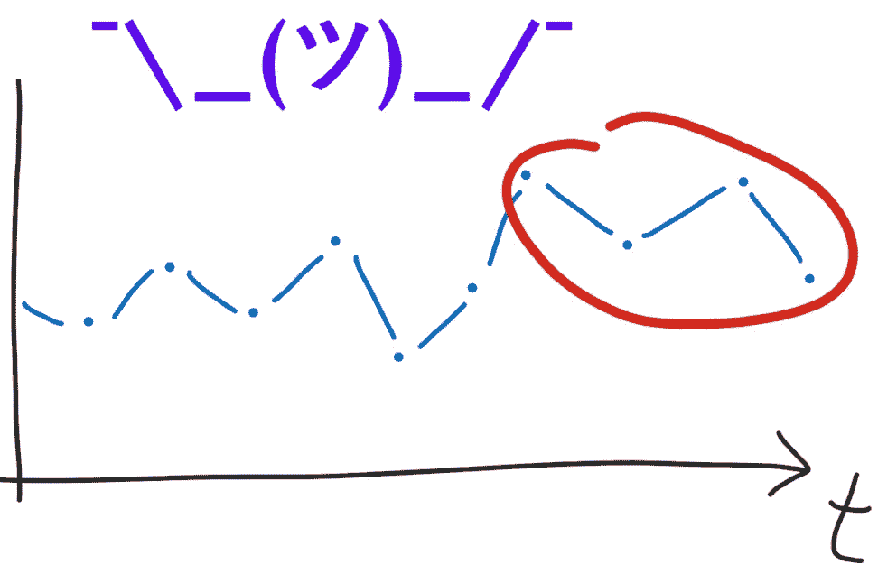
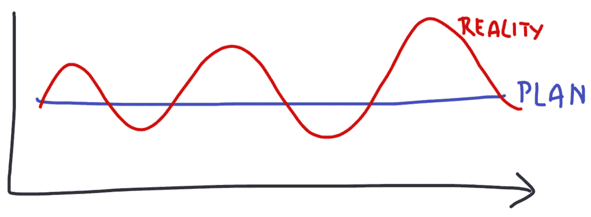
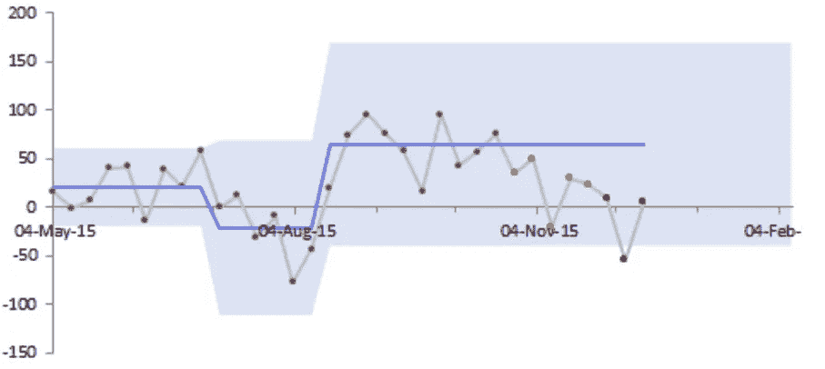

# 磁带的故事(或:如何让你的数据说简单的英语)

> 原文：<https://towardsdatascience.com/tale-of-the-tape-or-how-to-make-numbers-speak-plain-english-4db6b355353c?source=collection_archive---------3----------------------->

Do *you* know? (Picture by Ed Monkton)

*数据=头疼。听起来熟悉吗？你可能从事销售、运营、客户服务、营销、产品、工程或任何其他工作；每个人都会受伤。*

*我曾在收入从 0 到 2.5 亿美元的企业中工作过，将等式改为数据=决策……在正确的时间做出正确的决定，朝着正确的方向前进。我学到的一件事是获取数据来说简单的英语。这篇文章只是关于这样做的一种方法——一个已经不再使用但仍然有效的老技巧。这不是一切，但这是一个很好的开始。*

*在书中，这被称为控制(或“XmR”)图。我称之为“我应该关心”图表。*

# TL；灾难恢复—告诉您某些事情已经改变的数据

如果*现在*你的业务/奖金/信誉/【你重视的东西】岌岌可危，因为*你*对定期跟踪的 KPI 的变化反应一贯缓慢或草率，那么这篇文章对你很重要。

当真正重要的是**如果**和**的 **KPI** 已经**改变了**多少**时，控制(或“XmR”)图结束了猜谜游戏。它检测每日/每周/每月数据中有意义的变化—销售、投诉、回扣、NPS 等—以便您知道何时做出反应。

在这篇文章的最后，我分享了一个模板，你可以用它来实践。这篇文章是根据上下文写的，以防你认为这句话适用于你，但你想核实一下。它也有高质量的图片。

Should I care? Do you care? Does anybody care? (Picture by Charlie Taylor)

# **如果疼，说明什么东西坏了**

斯坦(真人；化名)在一家快速发展的企业中管理着一个 200 多人的运营团队。他必须确保业务能够吸收用户的指数级增长——产品发货、客户得到支持、人员得到雇佣、流程得到实施、工作实现自动化。

What’s your plan?

斯坦是个优秀的行动负责人。凡事都有计划；每个计划都有 KPI。然而，你不需要通过和迈克·泰森比赛来了解现实>计划。问题是如何预见打击的到来，并逆来顺受——换句话说，何时以及如何调整计划——因为被打脸(或害怕它会发生)是一种痛苦。

斯坦的第一个痛苦是担心生意会停滞不前。由于缺乏吸收增长的能力，营销和销售部门将不得不推迟新库存的到来或新员工的入职。他的第二个痛苦是害怕他看不到自己的深度。奖金、信誉、职业发展——今天的判断失误会让明天的回报受到质疑。

我问了斯坦他的经历。

> 我需要的不仅仅是漂亮的图表。数据应该回答一个问题，所以我知道要采取行动。当它不这样做时，我用直觉来填补空白。在熟悉的地方没问题，但在不熟悉的地方，这是试错法。当计划没有及时改变时，这可能是一个问题…但我不知道如何更快地发现数据的变化。你知道吗？

Up and Down, Up and Down (Caption from Venga Boys’ 1999 track: “Up and Down”)

# 金发女孩是一个童话故事

记得那次你改变了计划——不要太早，也不要太晚；不多也不少。刚刚好。你一次又一次地做对了。

不——因为企业是系统。事物通过它们流动(物理材料、数字内容、对话片段)；在某些点上，你有更多的控制权，而在另一些点上，你的控制权则更少；有使事物向不平衡倾斜的反馈回路和维持和谐的回路；而且有延迟。

这就是系统的感觉:

*   *我们用完了 ____*
*   *我们有太多的 __*
*   *花在 __* 上的钱太多了
*   *对 __* 关注不够
*   *为什么我们得到了这么多 __*
*   *下次多拿点 __*

引发匆忙和克制的延迟反应和过度反应。草率和反应不足会导致延迟，还会增加一点“以防万一”。

我不是说所有这些都有一个单一的解决方案。事实并非如此:业务可能很复杂，许多因素都会引发这些问题。

我想说的是，更敏锐地发现数据中的信号将有助于你在手枪实际开火时(而不是之前或之后)走出大门，并根据比赛的变化需求调整你的努力。

换句话说，有一种方法可以让你的感官变得敏锐。

Shovel-ready

# 告诉我一些我不知道的

这里有三件事(如果你都知道，我们一起出去玩吧):

1.  在 [1924](https://en.wikipedia.org/wiki/Control_chart#History) 年，一位[电话工程师](https://en.wikipedia.org/wiki/Walter_A._Shewhart#Influence)做了一张[图](https://en.wikipedia.org/wiki/Control_chart#/media/File:Xbar_chart_for_a_paired_xbar_and_R_chart.svg)来区分自然变异(即不要反应)并发出有事发生的信号(即 react)，都是用常规的时序图(即。x 轴上的时间，y 轴上的 KPI)
2.  有[完善的规则](https://en.wikipedia.org/wiki/Nelson_rules)来测试是否有事发生；还有一套更简单更实用的规则可以满足大多数情况
3.  这些图表和规则不在 Excel 或 Google Sheets 工具栏中

这是控制图，也称为 XmR 图。在网上搜索这两个词，你可能会找到大量枯燥的技术信息。我推荐两个简单明了的信息来源:

*   **斯泰西·巴尔**——一位绩效管理教练，他会清楚地解释这一切，并给出如何让[让](https://www.staceybarr.com/measure-up/build-xmr-chart-kpi/)和[解读](https://www.staceybarr.com/measure-up/3-essential-signals-to-look-for-in-your-kpis/)控制图的指示
*   唐纳德·惠勒(Donald Wheeler)——一位统计学家和作家，他的书[理解变化](https://www.amazon.co.uk/Understanding-Variation-Key-Managing-Chaos/dp/0945320531)更详细(但不太多)

做一个控制图，你会得到这样的东西:

Now you see it

*   **灰色和彩色点**是 KPI 在每个时间点的实际值
*   **蓝线**是给定时间点 KPI 的平均值；当系统改变时，蓝线移动并显示系统移动了多少
*   **蓝色阴影区域**是我们预期值下降的区域——即。它反映了系统基于其运行方式的自然变化
*   **彩色点**是系统性能变化的信号，即。系统脱离了自然变化——向你展示极移何时开始的

*没有上下文，我们只会看着灰点，试图理解它们。数字在转化为文字之前毫无意义，而文字是空洞的，除非它们植根于我们可以信任的东西——直觉，在它可靠的情况下；大多数其他情况下的统计。控制图给数据一个你可以信任的声音。*

> *你看着数据，它告诉你:我变了，这是我开始变的时候，这是我变了多少。现在由你来决定是否做出反应，改变计划。*
> 
> *那是什么——你没打算改变计划吗？那是改天的文章...*

*它可以是任何类型的数据。*

*   *如果是客户数据(如销售或 NPS)，那就是客户的声音*
*   *如果是商品数据(如股票)，则是流程的声音*
*   *如果是软件数据(比如 bug)，那就是代码的声音*
*   *…你明白了*

*如果你想做一个控制图，可以用 MATLAB 来做。不要尝试在 MATLAB 中做。*

*[**这里是我做的一个控制图 Excel 模板**](https://drive.google.com/file/d/10pe-MXdW6NZyWZ8tStno5TMCtF8VU2Uo/view?usp=sharing)；用这个。如果你卡住了，让我知道。如果你认为我犯了一个错误，让我知道。如果你读到这里，心想，嗯——这并没有我想象的那么无聊，请告诉我。*

*我花了几年时间收集数据来说简单的英语，这只是一个例子。如果这对你有帮助，那么让我知道还有什么是有帮助的，我会分享我所知道的。*

*PS。如果你喜欢这篇文章，你可能会喜欢[我的其他一些关于产品粘性的文章](http://medium.com/@ukcharlietaylor):*

* [## 被粘性愚弄

### DAU/MAU 是排名第一的粘性指标。以下是如何得到它的权利。

blog.usejournal.com](https://blog.usejournal.com/fooled-by-stickiness-a53d241ba463)*