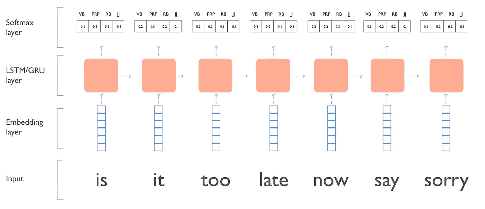

# 驯服 LSTMs:可变大小的小批量和为什么 PyTorch 对你的健康有益

> 原文：<https://towardsdatascience.com/taming-lstms-variable-sized-mini-batches-and-why-pytorch-is-good-for-your-health-61d35642972e?source=collection_archive---------0----------------------->


如果你使用过 PyTorch，你可能会感到兴奋，精力增加，甚至想在阳光下走一会儿。你的生活感觉又完整了。也就是说，直到您尝试使用 RNNs 进行可变规模的小批量生产。

并非所有的希望都破灭了。读完这篇文章后，你会回到你和 PyTorch 私奔到日落的幻想中，而你的循环网络达到了你只在 Arxiv 上读到过的新精度。

**我们将开发的忍者技能:**

1.  如何在 PyTorch 中实现每个小批量中序列大小可变的 LSTM。
2.  PyTorch 中[填充序列](https://pytorch.org/docs/stable/nn.html?highlight=pack_padded_sequence#torch.nn.utils.rnn.pack_padded_sequence)和[填充序列](https://pytorch.org/docs/stable/nn.html?highlight=pack_padded_sequence#torch.nn.utils.rnn.pad_packed_sequence)的作用。
3.  通过时间屏蔽[反向传播的填充令牌。](https://en.wikipedia.org/wiki/Backpropagation_through_time)

> **TL；DR 版本**:填充句子，使所有句子长度相同， [pack_padded_sequence](https://pytorch.org/docs/stable/nn.html?highlight=pack_padded_sequence#torch.nn.utils.rnn.pack_padded_sequence) ，遍历 LSTM，使用 [pad_packed_sequence](https://pytorch.org/docs/stable/nn.html?highlight=pack_padded_sequence#torch.nn.utils.rnn.pad_packed_sequence) ，展平所有输出并标记，屏蔽填充输出，计算交叉熵。

# 为什么这很难，为什么我在乎？

速度和性能。

将可变长度的元素一次输入到一个 LSTM 中是一个巨大的技术挑战，PyTorch 等框架已经很大程度上解决了这个问题(Tensorflow 也有一个很好的抽象，但它非常非常复杂)。

此外，文档不清楚，例子太旧。通过对来自多个例子而不是一个例子的梯度有一个更好的估计器，正确地做这将加速训练和增加梯度下降的准确性。

虽然 rnn 很难并行化，因为每一步都依赖于前一步，但我们可以通过使用迷你批处理获得巨大的提升。

# **序列标签**

虽然我不能帮你解决你对贾斯汀比伯的困扰(我不会说)，但我可以帮你对你最喜欢的 JB 歌曲[](https://www.youtube.com/watch?v=fRh_vgS2dFE)*进行词性标注。*

*这里有一个歌曲句子的例子:“现在说对不起还来得及吗？”(删除了'**'至'**'和'**？'**)。*

**

*LSTM/GRU model we’re building*

# ***数据格式化***

*虽然您可以进行大量的格式化，但我们不会...为了简单起见，让我们用不同大小的序列制作这一批人为的数据。*

```
*sent_1_x = ['is', 'it', 'too', 'late', 'now', 'say', 'sorry']
sent_1_y = ['VB', 'PRP', 'RB', 'RB', 'RB', 'VB', 'JJ']sent_2_x = ['ooh', 'ooh']
sent_2_y = ['NNP', 'NNP']sent_3_x = ['sorry', 'yeah']
sent_3_y = ['JJ', 'NNP']X = [sent_1_x, sent_2_x, sent_3_x]
Y = [sent_1_y, sent_2_y, sent_3_y]*
```

*当我们将每个句子输入到嵌入层时，每个单词都会映射到一个索引，所以我们需要将它们转换成整数列表。*

**

*Indexing an embedding matrix*

*这里我们将这些句子映射到它们对应的词汇索引*

```
*# map sentences to vocab
vocab = {'<PAD>': 0, 'is': 1, 'it': 2, 'too': 3, 'late': 4, 'now': 5, 'say': 6, 'sorry': 7, 'ooh': 8, 'yeah': 9} # fancy nested list comprehension
X =  [[vocab[word] for word in sentence] for sentence in X]# X now looks like:  
# [[1, 2, 3, 4, 5, 6, 7], [8, 8], [7, 9]]*
```

*分类标签也是如此(在我们的例子中是 POS 标签)。这些不会被嵌入。*

```
*tags = {'<PAD>': 0, 'VB': 1, 'PRP': 2, 'RB': 3, 'JJ': 4, 'NNP': 5}# fancy nested list comprehension
Y =  [[tags[tag] for tag in sentence] for sentence in Y]# Y now looks like:
# [[1, 2, 3, 3, 3, 1, 4], [5, 5], [4, 5]]*
```

# ***招数 1:通过填充使 mini-batch 中的所有序列具有相同的长度。***

*盒子里有什么东西，有各种不同的长度？不是我们的小批量！*

*为了让 PyTorch 完成它的工作，我们需要在填充之前保存每个序列的长度。我们将使用这些信息来掩盖损失函数。*

```
*import numpy as npX = [[0, 1, 2, 3, 4, 5, 6], 
    [7, 7], 
    [6, 8]]# get the length of each sentence
X_lengths = [len(sentence) for sentence in X]# create an empty matrix with padding tokens
pad_token = vocab['<PAD>']
longest_sent = max(X_lengths)
batch_size = len(X)
padded_X = np.ones((batch_size, longest_sent)) * pad_token# copy over the actual sequences
for i, x_len in enumerate(X_lengths):
  sequence = X[i]
  padded_X[i, 0:x_len] = sequence[:x_len]# padded_X looks like:
array([[ 1.,  2.,  3.,  4.,  5.,  6.,  7.],
       [ 8.,  8.,  0.,  0.,  0.,  0.,  0.],
       [ 7.,  9.,  0.,  0.,  0.,  0.,  0.]])*
```

*我们对标签做同样的事情:*

```
*import numpy as npY = [[1, 2, 3, 3, 3, 1, 4], 
    [5, 5], 
    [4, 5]]# get the length of each sentence
Y_lengths = [len(sentence) for sentence in Y]# create an empty matrix with padding tokens
pad_token = tags['<PAD>']
longest_sent = max(Y_lengths)
batch_size = len(Y)
padded_Y = np.ones((batch_size, longest_sent)) * pad_token# copy over the actual sequences
for i, y_len in enumerate(Y_lengths):
  sequence = Y[i]
  padded_Y[i, 0:y_len] = sequence[:y_len]# padded_Y looks like:
array([[ 1.,  2.,  3.,  3.,  3.,  1.,  4.],
       [ 5.,  5.,  0.,  0.,  0.,  0.,  0.],
       [ 4.,  5.,  0.,  0.,  0.,  0.,  0.]])*
```

***数据处理汇总:***

*我们将单词转换成索引序列，并用零填充每个序列，这样一批单词的大小就都一样了。我们的数据现在看起来像:*

```
*# X 
array([[ 1.,  2.,  3.,  4.,  5.,  6.,  7.],
       [ 8.,  8.,  0.,  0.,  0.,  0.,  0.],
       [ 7.,  9.,  0.,  0.,  0.,  0.,  0.]])# Y 
array([[ 1.,  2.,  3.,  3.,  3.,  1.,  4.],
       [ 5.,  5.,  0.,  0.,  0.,  0.,  0.],
       [ 4.,  5.,  0.,  0.,  0.,  0.,  0.]])*
```

# *模型*

*我们将使用 PyTorch 创建一个非常简单的 LSTM 网络。这些层将是:*

1.  *把...嵌入*
2.  *LSTM*
3.  *线性的*
4.  *Softmax*

# *招数二:如何使用 PyTorch pack_padded_sequence 和 pad_packed_sequence*

*概括地说，我们现在正在给一个已经填充了每个元素的批次供料。在向前传球中，我们将:*

1.  *嵌入序列*
2.  *使用 pack_padded_sequence 确保 LSTM 看不到填充的项目*
3.  *将打包的批处理运行到 LSTM 中*
4.  *使用 pad_packed_sequence 撤消打包*
5.  *转换 lstm 输出，这样我们就可以馈送到线性层*
6.  *通过 log_softmax 运行*
7.  *将形状转换回来，以便我们以(batch_size，seq_len，nb_tags)结束*

# *技巧 3:屏蔽掉我们不想在损失函数中考虑的网络输出*

**

*Mask out those padded activations*

*最后，我们准备计算损失函数。这里的要点是，我们不想考虑填充元素的网络输出。*

***直觉预警:**考虑这样做的最佳方式是扁平化所有网络输出和标签。然后计算这一序列的损失。*

*哇，就这么简单。现在，您可以使用小批量更快地训练您的模型，并继续痴迷于 JB(仍然不会告诉，不要担心)。*

*我知道你现在的感受…*

**

*这当然是一个非常简单的 LSTM。你可以做些什么来美化你的模型(不全面):*

1.  *用手套嵌入初始化。*
2.  *使用 GRU 细胞。*
3.  *使用双向机制(别忘了修改 init_hidden)。*
4.  *通过用卷积网络创建编码向量并附加到单词向量，使用字符级特征。*
5.  *添加辍学。*
6.  *增加层数*
7.  *…太多了*
8.  *当然，使用 Python 的最佳 hyperparemeter 优化库进行非常彻底的超参数搜索: [**试管**](https://github.com/williamFalcon/test_tube) (声明:我写了试管)。*

# *总而言之:*

*这就是在 PyTorch 中通过向 LSTM 提供可变长度的批量输入来恢复理智的方法*

1.  *首先按最大序列对输入进行排序*
2.  *通过填充到批中最大的序列，使所有长度相同*
3.  *使用 pack_padded_sequence 确保 LSTM 看不到填充的项目(脸书团队，你真的应该重命名这个 API)。*
4.  *使用 pad_packed_sequence 撤消步骤 3。*
5.  *将输出和标签展平为一个长向量。*
6.  *屏蔽掉你不想要的输出*
7.  *计算交叉熵。*

# *完整代码:*