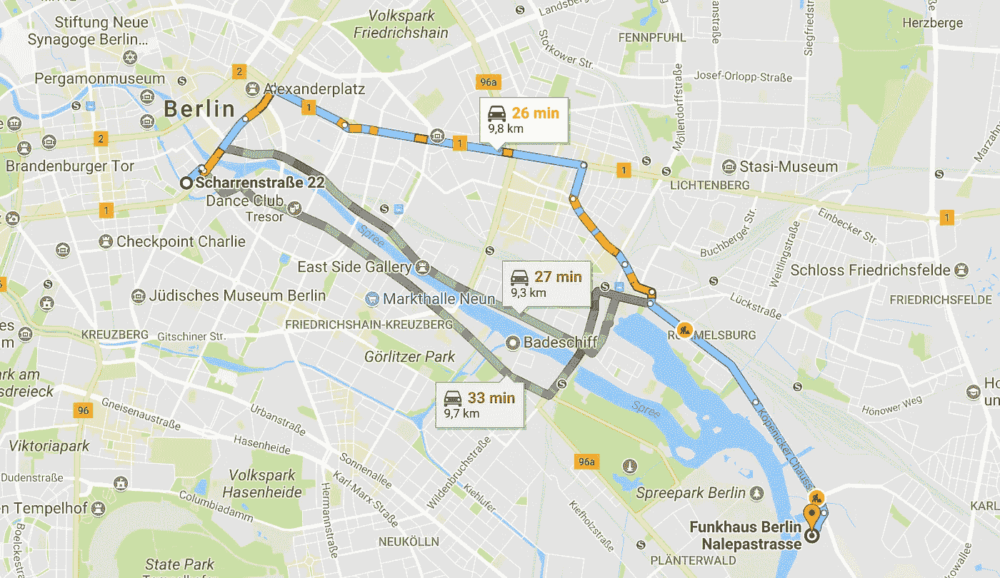

# 出租车去冯克豪斯

> 原文：<https://towardsdatascience.com/taxi-to-funkhaus-2dfee80f9427?source=collection_archive---------5----------------------->

不要试图把所有的知识都记在脑子里。你的大脑是一个可怕的信息存储媒介。把它放在它该在的地方:在软件里。并学会如何使用它。

我最近在柏林参加一个会议([柏林技术开放航空](https://toa.berlin/))。活动在一个叫 Funkhaus 的地方举行，离我在柏林米特的酒店很远。在这种情况下，我通常会打开我的优步应用程序，告诉它我想去哪里，然后优步的软件会给我发送一个司机，然后他会带我去我想去的地方。

可悲的是，优步在柏林是不存在的，因为**政客们把他们的灵魂卖给了说客，这些说客扼杀了所有来自外部的创新尝试，却没有提供任何合理的对等物**。所以我不得不体验德国传统出租车行业的迷人服务。

我用一个叫做 MyTaxi 的可怕的应用程序叫了一辆出租车，它缺乏让优步如此有用的所有功能。没有内置支付，没有评级，没有乘坐管理。只要大声喊一声“我在这里！”所有出租车，然后有人可能会来，如果你祈祷足够努力。

出乎意料的是，一辆出租车到了，我告诉司机我想去 Funkhaus，他说不知道那是哪里。巨大的建筑，重大的事件，一千或更多的与会者，但出租车司机从来没有听说过。对我来说很奇怪，但是没关系，没问题。我想没有人能知道所有的事情。正如哲学家唐纳德·特朗普曾经说过的，“没人知道这份工作有多难。”但谢天谢地，谷歌的机器知道。

“在谷歌地图上输入‘funk Haus’就可以了。这对我很有效，”我说。出租车司机开始摸索他的智能手机，问我地址。他为什么要地址？柏林有多少个冯克豪斯？但我没问，给了他街名:Nalepastrasse。然后他问我街道号码。“我没有电话号码，只有街道名”，我说。活动组织者只公布了街道名称。有点明显，因为这个地方太大了，几乎是整条街上唯一的东西。他们还不如叫它芬克豪斯街，而不是纳勒帕斯大街。但是没有，出租车司机没有被吓住。他需要一个确切的地址，否则他不能去。他可能想象纳勒帕斯大街会环绕东德，但事实并非如此。也许是德国的东西。

然后，我不骗你，司机拿出一本又大又旧的柏林街道手册，上面有数百页街道名称和街区地图。我的下巴掉到了汽车的地板上。我上一次看到这样的书是在 1997 年左右。我认为这可能是一个恶作剧。*有人在和我开玩笑。某个地方肯定有一台照相机。接下来，司机可能会问我是否可以去查理检查站，因为他知道它在哪里。我试图保持友好。我想，下周我就可以上德国电视了。*

有几分钟，我带着越来越大的困惑，看着德国出租车司机看似随意地敲着智能手机，翻看满是街道地图的页面。我在这里大方地使用了“司机”这个词，将这个词扩展到包括一个坐在驾驶座上，做了很多敲击和翻转，但没有实际驾驶的人。但是经过五分钟的不开车，我受够了。

“看在上帝的份上，让我带我们去吧，”我说。我手里拿着我的智能手机，启动 Waze，输入“Funkhaus”，点击 Go，然后说，“我们走，一直往前走！”在接下来的 20 分钟里，我把我们带到了纳勒帕斯大街。我想也许我应该向司机收费，而不是反过来，但我决定反对，因为它在德国电视上可能看起来不太好。这是我最大的市场。

到达目的地后，我付了出租车费，司机感谢我告诉他冯克豪斯在哪里。这也许是最令我困惑的。**有一个出租车司机，他认为他必须知道所有东西在哪里。但是这在 21 世纪已经没有任何意义了。软件知道所有东西在哪里。他需要做的是学会如何通过智能手机上的导航仪询问软件。对出租车司机来说，这似乎是一项有用的技能。我在完全不知所措的情况下离开了汽车，确保对着电视观众向各个方向微笑。**

那个星期，我又两次尝试使用名为 MyTaxi 的灾难软件，每次都有可预见的坏结果。因为它是由一个拒绝接受世界在前进的行业提供的。那么你能期待什么呢？我手机上的支付方式比我衣柜里的内裤还多。但是许多出租车仍然只收现金。还需要我多说吗？

就这样。

不要试图把所有的知识都塞进你的脑袋里。你的大脑是一个可怕的信息存储媒介。把它放在它该在的地方:在软件里。学会怎么用就好了。

[喜欢这条消息？在这里签名。](http://agilityscales.com/app)

我的团队希望在你的工作生活中为你导航，这样你就可以不再把所有事情都放在脑子里。 [**加入我未来的敏捷实践**](http://agilityscales.com/app) **。**