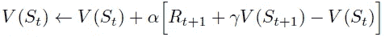
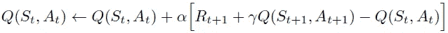
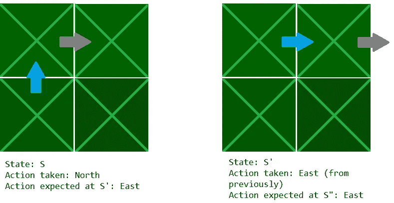
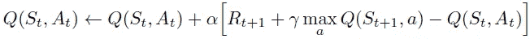
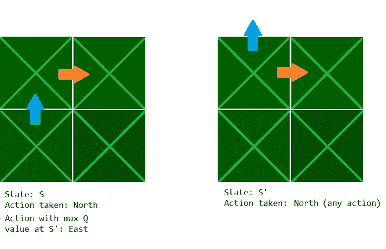
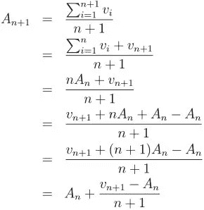

# TD 在强化学习中，最简单的方法

> 原文：<https://towardsdatascience.com/td-in-reinforcement-learning-the-easy-way-f92ecfa9f3ce?source=collection_archive---------4----------------------->

更新:学习和练习 TD 方法的最好方式是去[http://rl-lab.com/gridworld-td](http://rl-lab.com/gridworld-td)

假设你正在驾驶装有 GPS 的汽车。在旅程开始时，GPS 会给你一个到达时间的估计值(基于统计数据)，当你开车遇到交通堵塞时(或者没有)，它会改进估计值并给你其他到达时间。

您会注意到，在旅程的每一段，您都会得到一些关于到达时间的估计。

现在假设你的全球定位系统没有给你任何估计，但存储的数据，直到你到达，然后给你一个详细的报告，每段路花了多少时间。这对你有用吗？

答案会是:这取决于你想做什么。
但肯定的是，你会感谢早期的反馈，即使不是很准确。

这就是蒙特卡罗和时态差的区别。
示例中的后一种方法是基于蒙特卡罗的，因为它会等到到达目的地后再计算行程各部分的估计值。而前者是时间差异。

事实上，如果将蒙特卡罗(MC)方法和动态规划(DP)方法结合起来，就得到时间差分(TD)方法。

*注意:TD 将被记为 TD(0 ),这意味着它将向前看一步。TD(0)是 TD(n)的特例。*

回想一下，在 MC 中，我们播放一整集，直到结束，然后我们计算该集中出现的每个州的折扣奖励。我们做了大量的事件，然后我们平均每个状态的不同值。

在 DP 中，我们随机初始化所有状态，然后根据周围状态的(先前计算的)值迭代计算每个状态的值。我们一直这样做，直到我们注意到任何状态值都没有显著的改善。

# 政策预测

我们已经看到，在 MC 中，我们播放一集直到结束，然后我们向后移动，给每个状态分配该集的贴现收益 G。但这意味着我们必须等到最后才能知道 G.
的值，然而在 TD(0)中，我们根据下一个状态的 ***估计值*** 来更新当前状态。还记得 GPS 的例子吗，在某一点上，GPS 可能会注意到您的速度下降到 10Km/h，因此它会将其到达时间的估计值更新+30 分钟，但这可能是一个非常短暂的减速，几分钟后您会再次加速，GPS 会将其估计值更新-20 分钟。
与 TD(0)相同，V(s)根据以下公式更新:



where α is the step size ∈ ]0,1], 𝛄 is the discount factor

这是一个增量平均计算。查看文章末尾的“增量平均计算”了解详情。

很明显，仅基于一个事件，对 V(s)的估计是不准确的。和你那天的汽车旅行一样！只做一次，你不会很好地估计总时间和每一部分的时间。也许那天你是幸运的，没有交通堵塞，或者相反，你是不幸的，由于车祸你被困在一个不寻常的堵塞中。
**但是如果你每天都这样做(多放几集)，你就能每天都精确你的估计。**

TD(0)中策略评估的算法(伪代码)如下:

```
Evaluate_Policy(policy):
  randomly_initialize_non_terminal_states_values()Loop number_of_episodes:
  let s = start_state() # Play episode until the end
  Loop until game_over(): let a = get_action(policy, s, 0.1) 
                      # get action to perform on state s according 
                      # to the given policy 90% of the time, and a
                      # random action 10% of the time. let (s', r) = make_move(s, a) #make move from s using a and get 
                                  #the new state s' and the reward r # incrementally compute the average at V(s). Notice that V(s)
     # depends on an estimate of V(s') and not on the return 
     # G as in MC 
     let V(s) = V(s) + alpha * [r + gamma * V(s') - V(s)] let s = s' End Loop
End Loop
```

# 政策控制

TD(0)中的策略控制有两种实现: ***SARSA*** 和 ***Q-Learning*** 。

***SARSA*** 是一个 ***On-Policy*** 方法，这意味着它根据某个策略来计算 ***Q 值*** ，然后代理遵循该策略。

***Q-Learning*** 是一种 ***Off-Policy*** 方法。它包括根据贪婪策略计算 ***Q 值*** ，但是代理不一定遵循贪婪策略。

## 萨尔萨

像往常一样，当执行动作时，你需要计算动作-状态函数( ***Q 值*** )，因为它将状态和动作映射到估计。
在[蒙特卡洛](https://medium.com/@zsalloum/monte-carlo-in-reinforcement-learning-the-easy-way-564c53010511)的文章中，我们解释了为什么单独的***【V(s)】***无助于确定最优政策(计划，或在每个状态下采取的行动)。
因此，假设我们处于状态 ***s*** 并且我们想要基于状态 ***s*** 和动作*来计算 ***Q 值*** ，正如我们之前看到的，TD(0)使用增量平均值来计算任何状态的值。这个平均计算，用下一个状态的值来表示。
既然我们在计算 ***Q 值*** ，那么我们就得到了下一个状态***【s’***的 ***Q 值*** 。然而 ***Q*** 需要状态和动作两个参数。*

**

****SARSA*** 解决这个问题的方法是，为了得到 ***Q 值，*** 在状态***【s’***选择一个动作***【a’***(基于ε贪婪方法)，然后当代理到达***【s’***时，我们将执行动作***【a’***。*

*下图给出了一个 SARSA 示例。*

****

*Four actions per state: North, South, West, East*

*在左侧网格中，代理处于状态 ***s*** ，它计算向北移动的值(蓝色箭头)，为了能够进行计算，它需要向东移动的 ***Q 值******s’***(灰色箭头)。
右边的网格显示当代理移动到状态***‘s’***时，它遵循策略先前决定的动作，并计算向东(蓝色箭头)动作的 ***Q 值***…*

*以下是 ***SARSA*** 的伪代码:*

```
*SARRA():
  #initialization
  for each state s in AllNonTerminalStates:
     for each action a in Actions(s):
         Q(s,a) = random()
  for each s in TerminalStates:
      Q(s,_) = 0 #Q(s) = 0 for all actions in s Loop number_of_episodes:
    let s = start_state() # get action to perform on state s according 
    # to the given policy 90% of the time, and a
    # random action 10% of the time.    
    let a = get_epsilon_greedy_action(s, 0.1) # Play episode until the end
    Loop until game_over(): # make move from s using a and get the new state s'
       # and the reward r
       let (s', r) = make_move(s, a) # choose action to perform on state s'
      # a' will be used executed in the next iteration
      # but for the moment it will be used to get Q(s', a')
      let a' = get_epsilon_greedy_action(s', 0.1) # incrementally compute the average at Q(s,a)
     let Q(s, a) = Q(s, a) + alpha*[r + gamma * Q(s', a') - Q(s, a)] let s = s'  # move to the next state
     let a = a'  # use the same action a' as determined above End Loop
  End Loop*
```

## *q 学习*

****Q-learning*** 与*类似，只是在计算***【s，a】***Q(s，a)***【s’，a’***时，它使用贪婪策略从下一个状态***s’***中确定*Q(s’，a’*。
记住贪婪策略选择给出最高
***Q 值*** 的动作。然而，这一点很重要，它不一定遵循那种贪婪的政策。**

****

**这个形象的打击说明了 ***Q-Learning*** 的机理:**

****

**左侧网格显示了处于状态 ***s*** 的代理在向北行驶时计算 Q 值(蓝色箭头)。为此，它在计算中使用由状态 s(橙色箭头)的贪婪策略确定的 ***Q 值*** 。
右边的网格显示代理移动到状态***‘s’***，但不一定遵循贪婪策略确定的动作(橙色箭头)，而是选择随机动作(蓝色箭头)。**

*****Q-learning*** 的算法如下:**

```
 **QLearning():
  #initialization
  for each state s in AllNonTerminalStates:
     for each action a in Actions(s):
         Q(s,a) = random()
  for each s in TerminalStates:
      Q(s,_) = 0 #Q(s) = 0 for all actions in s Loop number_of_episodes:
    let s = start_state() # Play episode until the end
    Loop until game_over(): # get action to perform on state s according 
      # to the given policy 90% of the time, and a
      # random action 10% of the time.    
      let a = get_epsilon_greedy_action(s, 0.1) # make move from s using a and get the new state s'
      # and the reward r
      let (s', r) = make_move(s, a) # choose the max Q-value (qmax) on state s'
      let qmax = get_max_qvalue_on_state(s') # incrementally compute the average at Q(s,a)
      let Q(s, a) = Q(s, a) + alpha*[r + gamma * qmax - Q(s, a)] let s = s'  # move to the next state End Loop
End Loop**
```

# **增量平均计算**

**这一段说明了增量平均值的计算方法。
平均值的项以既有 A(n+1)又有 A(n)的方式排列。**

****

**Incremental Average Computation**

**请注意，1/(n+1)表示状态值和动作值函数中的α项。**

# **结论**

**时间差异比动态规划方法更好，因为它不需要环境的模型，也不需要报酬和概率分布。TD 也比蒙特卡罗方法有优势，因为不需要等到一集结束才知道回报，只需要一个时间步。**

# **相关文章**

*   **[开发人员强化学习政策](https://medium.com/@zsalloum/revisiting-policy-in-reinforcement-learning-for-developers-43cd2b713182)**
*   **[强化学习中的 Q vs V，最简单的方法](https://medium.com/p/9350e1523031)**
*   **[数学背后的强化学习，最简单的方法](https://medium.com/p/1b7ed0c030f4)**
*   **[蒙特卡洛强化学习，简单易行](https://medium.com/@zsalloum/monte-carlo-in-reinforcement-learning-the-easy-way-564c53010511)**
*   **[动态编程在强化学习中的简便方法](https://medium.com/@zsalloum/dynamic-programming-in-reinforcement-learning-the-easy-way-359c7791d0ac)**