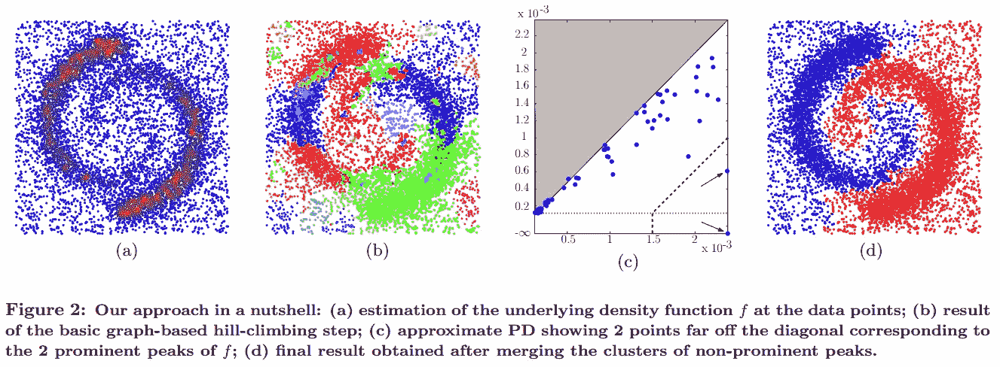
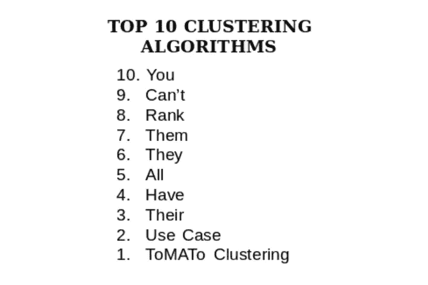
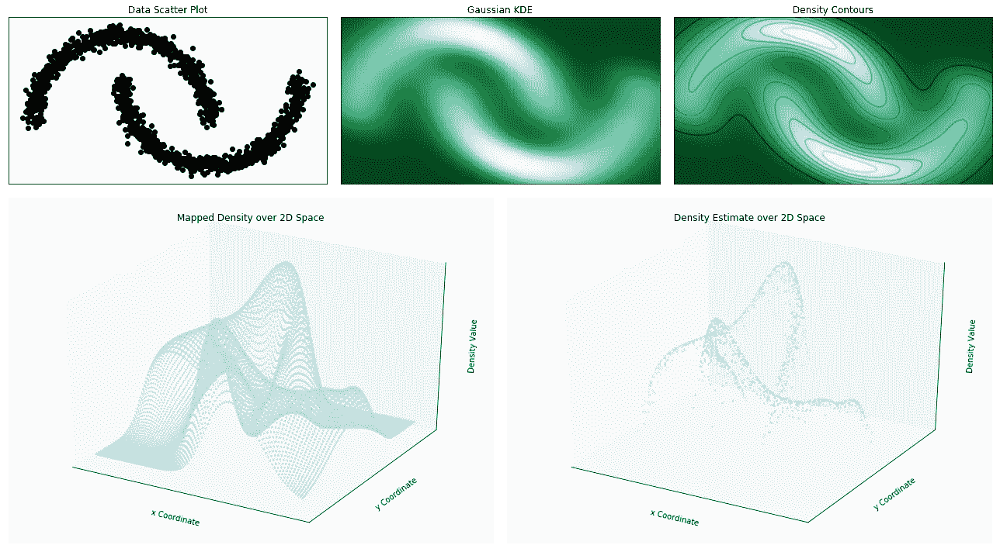
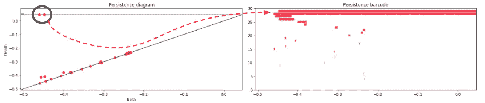
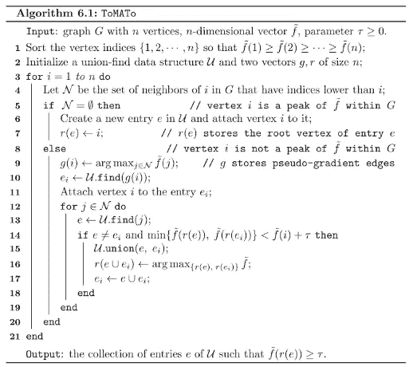
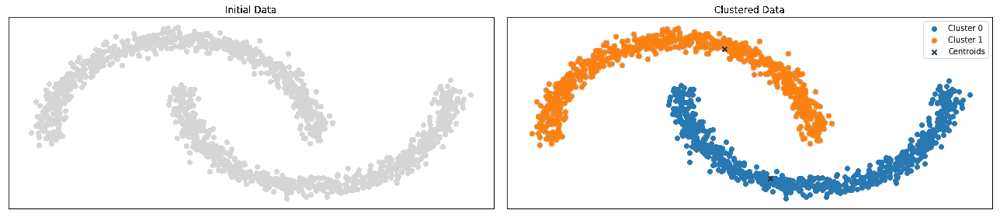
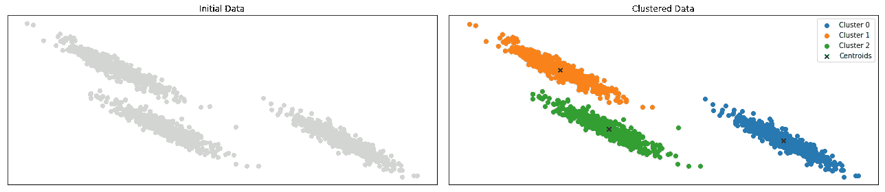
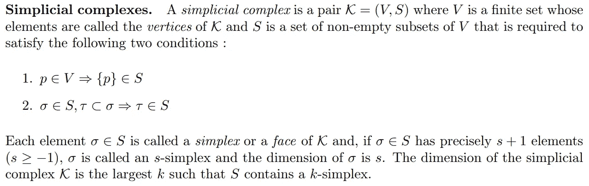
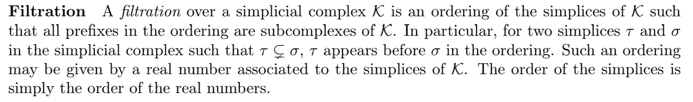
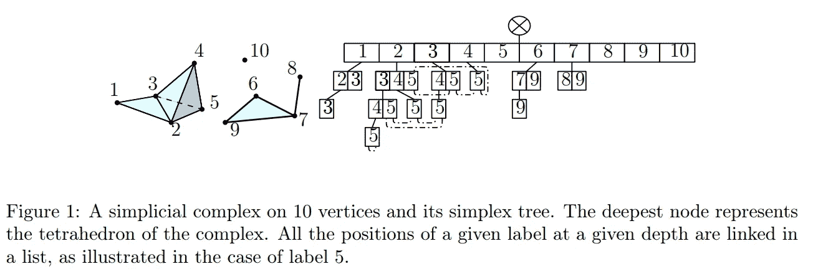

# TDA 统治一切:番茄集群

> 原文：<https://towardsdatascience.com/tda-to-rule-them-all-tomato-clustering-878e03394a1?source=collection_archive---------0----------------------->

## 忘了 K-Means 吧！



Credits: [Original Paper](https://geometrica.saclay.inria.fr/team/Steve.Oudot/papers/cgos-pbc-09/cgos-pbcrm-11.pdf)

你想念应用数学吗？同样，我的目标是推广**拓扑数据分析**及其提供的多种可能性。前一篇文章提到了机器学习和深度学习，但 TDA 在其中的一个领域找到了用途:**集群**。

[](/from-tda-to-dl-d06f234f51d) [## 从拓扑数据分析到深度学习:不劳无获

### 今天，我将尝试给出一些关于 TDA(用于拓扑数据分析)的见解，这是一个快速发展的数学领域…

towardsdatascience.com](/from-tda-to-dl-d06f234f51d) 

由 TDA 提供支持的聚类概念已经被引入(不那么)著名的番茄(*拓扑模式分析工具*)算法，在这篇[论文](https://geometrica.saclay.inria.fr/team/Steve.Oudot/papers/cgos-pbc-09/cgos-pbcrm-11.pdf)中介绍。与更常见的(scikit-learn 类)聚类算法相比，该算法有两个优点:

*   它给你一个方法来知道你的数据似乎有多少个集群；
*   它为您提供了一种将这些数据收集到**不同集合**中进行聚类的方法。

> 我开发了与本文相关的代码作为概念验证，其中肯定有需要改进的地方！不要放弃看一看，我很乐意接受你的批评；) !



Credits: Gaijin et al.

# **算法演示**

出于解释的目的，我将限于二维考虑。核心思想是将 TDA 应用于我们的数据点的密度估计，提取其最大值，从而提取其表观质心。很好，但是怎么做？

为了回到实际的 TDA，你需要建立**单纯形树***单纯形复形*** 的**嵌套族，最终基本上是一个对应于密度函数的图**、**。

*   首先，计算密度估计并初始化结构；
*   第二，给你数据集的每一个点一个索引；
*   第三，将每个数据点通过它们的索引插入到你的**单纯形树**中，通过赋予它们相应的密度值作为过滤*值；
*   第四，通过平均过滤值将每个点链接到其邻域图。

您最终得到一个**实例化的图**，并且您可以通过上层过滤来计算相应的持久性(~ *通过对所获得的过滤值进行递减排序来定义单纯复形的嵌套族*，在我的 [Github](http://github.com/Coricos/TdaToolbox) 库中给出了进一步的说明。

> (*)概念解释见下文



Density Estimation over a ‘two moons’ Dataset

通过计算这种过滤的**持久性图**(和持久性条形码),您会得到这样的结果:

```
gen = ClusterGenerator(structure=’anisotropy’, randomize=45)
clf = ToMaTo(*gen.generate())
_ = clf.estimate_clusters(graph=True)
```



Obtained Persistence from the upper levels Filtration of the Density Estimate

前面的结果让您对数据有了真正的了解:对角线上有两个元素，对应于具有最大持久性的对象。在这种情况下，持久性表征了已经创建的结构在你的图中难以重叠的程度。**基本上是指全局最大值(用于上层过滤)或全局最小值(用于子层过滤)**。在我们的例子中，我们只观察到你的数据有*两个质心，*对应两个密度峰值。现在，您需要将每个数据点链接到这两个质心，以构建不同的聚类。这可以通过一个 **UnionFind** 结构( *disjoint-set 数据结构*)来实现，并遵循下面算法中提出的思想。



ToMATo Algorithm

该概念仅基于过滤值的递减顺序。很好的一点是，你只需要一遍所有的数据点。对于每个有序数据点，您有两种可能性:

*   要么它没有具有更高过滤值的邻居，那么它被认为是局部密度最大值；
*   它也没有，您需要查看不同的邻居，合并根以将相同的边链接到其对应的最重权重的根(越接近给定的质心，权重越高)。

为了避免创建多个集群，对于由 *tau，*给出的过滤值有一个条件，它确保小集群将被链接到更大的集群。python 化后，它给出了以下内容(从一个更大的函数中提取，解释对象方法):

比较每个数据点的不同根/父项后:

```
gen = ClusterGenerator(structure='moons', randomize=45)
clf = ToMaTo(*gen.generate())
_ = clf.estimate_density(graph=**False**)
clf.estimate_clusters(graph=**False**)
prd = clf.fit_predict(num_clusters=2, graph=**True**)
```



# **其他例子**

其他例子在我的 [**Github 资源库**](http://github.com/Coricos/TdaToolbox) 中提供，作为处理各向异性数据的，那个 **k-means** (最常用的聚类算法之一)有聚类的麻烦(参见 scikit-learn 示例)。

```
gen = ClusterGenerator(structure='anisotropy', randomize=45)
clf = ToMaTo(*gen.generate())
_ = clf.estimate_density(graph=**False**)
clf.estimate_clusters(graph=**False**)
prd = clf.fit_predict(num_clusters=3, graph=**True**)
```



# **(*)一些概念**

对于那些对固有理论及其数学形式感兴趣的人来说，这里有一些元素可能会告诉你。



Credits: [The Simplex Tree](https://hal.inria.fr/hal-00707901v1/document)

这个理论有很多可能性，这些结果和深度学习之间的接口目前仍在开发中。许多想法将会出现，这使得这个话题变得非常热门和有趣！*敬请期待来稿，想要更多就鼓掌；)*！

# **参考文献**

*   [*骨质包*](https://project.inria.fr/gudhi/)
*   [*黎曼流形中基于持久性的聚类*](https://geometrica.saclay.inria.fr/team/Steve.Oudot/papers/cgos-pbc-09/cgos-pbcrm-11.pdf)
*   [*单形树:一般单形复形的有效数据结构*](https://hal.inria.fr/hal-00707901v1/document)