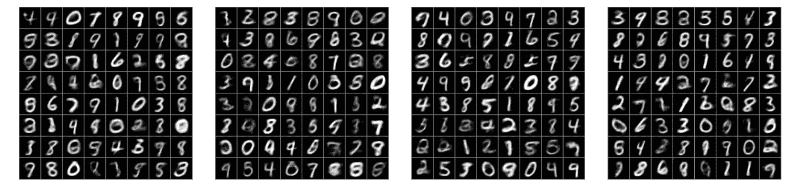
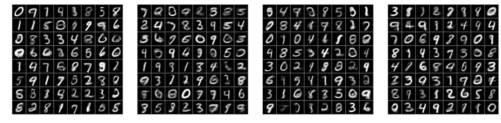

# 教一个变分自动编码器(VAE)画 MNIST 字符

> 原文：<https://towardsdatascience.com/teaching-a-variational-autoencoder-vae-to-draw-mnist-characters-978675c95776?source=collection_archive---------1----------------------->

These characters have not been written by a human — we taught a neural network how to do this!

*要查看完整的 VAE 代码，请参考我的* [*github*](https://github.com/FelixMohr/Deep-learning-with-Python/blob/master/VAE.ipynb) *。*

自动编码器是一种神经网络，可用于学习输入数据的有效编码。给定一些输入，网络首先应用一系列变换，将输入数据映射到低维空间。网络的这一部分被称为*编码器*。

然后，网络使用编码数据尝试重新创建输入。网络的这部分就是*解码器*。使用编码器，我们可以压缩网络能够理解的数据类型。然而，自动编码器很少用于此目的，因为通常存在更有效的手工算法(如 *jpg* -compression)。

相反，自动编码器被反复应用于执行去噪任务。编码器接收被噪声篡改的图片，并学习如何重建原始图像。

# 什么是变分自动编码器？

然而，自动编码器还有更有趣的应用。

一个这样的应用叫做**变分自动编码器**。使用可变自动编码器，不仅可以压缩数据，还可以生成自动编码器以前见过的新对象类型。

使用一个通用的自动编码器，我们对网络产生的编码一无所知。我们可以比较不同的编码对象，但是我们不太可能理解发生了什么。这意味着我们将不能使用我们的解码器来创建新的对象。我们只是不知道输入应该是什么样子。

使用变分自动编码器，我们采取相反的方法。我们不会去猜测潜在向量的分布。我们只是告诉我们的网络我们希望这个分布看起来像什么。

通常，我们将约束网络产生具有遵循单位正态分布的条目的潜在向量。然后，当试图生成数据时，我们可以简单地从该分布中采样一些值，将它们提供给解码器，解码器将返回给我们全新的对象，这些对象看起来就像我们的网络已经被训练过的对象。

让我们看看如何使用 Python 和 Tensorflow 来实现这一点。我们将教我们的网络如何画出 [MNIST 人物](https://en.wikipedia.org/wiki/MNIST_database)。

# 第一步—加载培训数据

首先，我们执行一些基本的导入。Tensorflow 有一个方便的功能，让我们可以轻松地访问 MNIST 数据集。

# 定义我们的输入和输出数据

MNIST 图像的尺寸为 28 * 28 像素，具有一个颜色通道。我们的输入`X_in`将是一批 MNIST 字符。网络将学习重新构建它们，并在占位符`Y`中输出它们，占位符具有相同的尺寸。

`Y_flat`将在以后计算损失时使用。`keep_prob`将在申请退学作为正规化手段时使用。在训练期间，它的值将为 0.8。当生成新数据时，我们不会应用 dropout，因此值将为 1。

函数`lrelu`正在被定义，因为 Tensorflow 不幸没有提出预定义的泄漏 ReLU。

# 定义编码器

因为我们的输入是图像，所以对它们应用一些卷积变换是最合理的。最值得注意的是，我们在编码器中创建了两个向量，因为编码器应该创建遵循高斯分布的对象:

*   均值向量
*   标准差的向量

稍后，您将看到我们如何“强制”编码器确保它真正创建遵循正态分布的值。将被馈送到解码器的返回值是 *z* 值。在计算损失时，我们将需要分布的平均值和标准差。

# 定义解码器

解码器不关心输入值是否是从我们定义的特定分布中采样的。它将简单地尝试重建输入图像。为此，我们使用一系列转置卷积。

现在，我们将两部分连接在一起:

# 计算损失并实施高斯潜在分布

为了计算图像重建损失，我们简单地使用平方差(这可能导致图像有时看起来有点模糊)。这种损失与 Kullback-Leibler 散度相结合，确保我们的潜在值将从正态分布中取样。关于这个话题的更多信息，请看看 Jaan Altosaar 关于 VAEs 的文章。

# 训练网络

现在，我们终于可以训练我们的 VAE 了！

每走 200 步，我们就会看一看当前的重建是什么样子。在处理了大约 2000 个批次后，大多数重建看起来是合理的。

# 生成新数据

最棒的部分是我们现在能够创造新的角色。为此，我们简单地从一个单位正态分布中抽取值，并将它们馈送给我们的解码器。大多数创造出来的角色看起来就像是人类写的一样。

Some of the automatically created characters.

# 结论

这是 VAEs 应用的一个相对简单的例子。但是想想什么是可能的！神经网络可以学习作曲。他们可以自动为书籍、游戏等制作插图。凭借一点创造力，VAEs 将为一些令人敬畏的项目开辟空间。

 [## Felix mohr/使用 Python 进行深度学习

### 在 GitHub 上创建一个帐户，为深度学习 Python 开发做贡献。

github.com](https://github.com/FelixMohr/Deep-learning-with-Python/blob/master/VAE.ipynb)