# 教汽车看东西——使用计算机视觉进行高级车道检测

> 原文：<https://towardsdatascience.com/teaching-cars-to-see-advanced-lane-detection-using-computer-vision-87a01de0424f?source=collection_archive---------0----------------------->

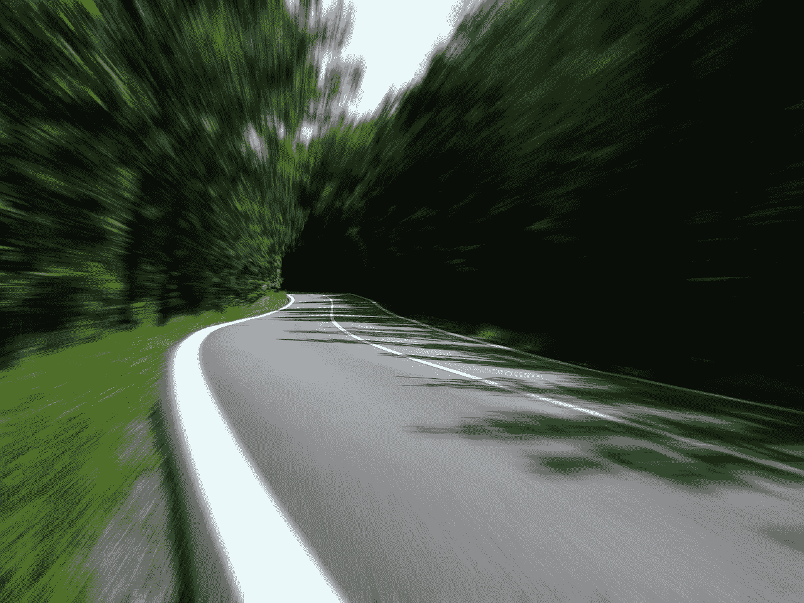

Lane With Motion Blur (from Pexels)

*这是* [*Udacity 自动驾驶汽车工程师纳米学位*](https://www.udacity.com/course/self-driving-car-engineer-nanodegree--nd013) *第一学期的项目 4。你可以在*[*github*](https://github.com/kenshiro-o/CarND-Advanced-Lane-Lines)*上找到与这个项目相关的所有代码。你也可以阅读我以前项目的帖子:*

*   *项目 1:* [*利用计算机视觉检测车道线*](https://medium.com/computer-car/udacity-self-driving-car-nanodegree-project-1-finding-lane-lines-9cd6a846c58c)
*   *项目二:* [*交通标志分类使用深度学习*](https://medium.com/towards-data-science/recognizing-traffic-signs-with-over-98-accuracy-using-deep-learning-86737aedc2ab)
*   *项目三:* [*转向角度预测利用深度学习*](https://medium.com/towards-data-science/teaching-cars-to-drive-using-deep-learning-steering-angle-prediction-5773154608f2)

识别道路上的车道是所有人类驾驶员执行的共同任务，以确保他们的车辆在行驶时处于车道限制内，从而确保交通顺畅，并将与附近车道上的其他车辆发生碰撞的可能性降至最低。同样，这也是自动驾驶汽车要完成的一项关键任务。事实证明，使用众所周知的计算机视觉技术来识别道路上的车道标志是可能的。我们将介绍如何使用各种技术来识别和绘制车道内侧，计算车道曲率，甚至估计车辆相对于车道中心的位置。

为了检测并绘制一个呈现汽车当前所在车道形状的多边形，我们构建了一个由以下步骤组成的管道:

*   从一组棋盘图像计算摄像机标定矩阵和畸变系数
*   图像失真消除
*   应用颜色和梯度阈值来聚焦车道线
*   通过透视变换生成*鸟瞰图*图像
*   使用滑动窗口寻找*热点*车道线像素
*   拟合二次多项式以识别构成车道的左线和右线
*   车道曲率和偏离车道中心的计算
*   在图像上扭曲和绘制车道边界以及车道曲率信息

我相信一张图胜过千言万语，所以在这里:

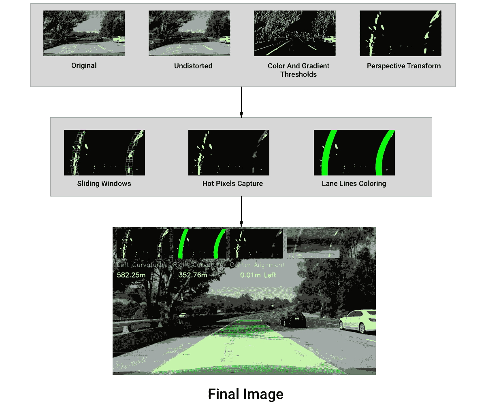

Diagram of our Lane Detection Pipeline

# 相机校准和图像失真消除

我们将采取的第一步是找到校准矩阵，以及用于拍摄道路照片的摄像机的失真系数。这是必要的，因为相机镜头的凸面形状使光线在进入针孔时发生弯曲，从而导致真实图像失真。因此，现实世界中的直线可能不会再出现在我们的照片上。

为了计算相机的变换矩阵和失真系数，我们使用同一台相机拍摄的一个*棋盘*在一个平面上的多张照片。OpenCV 有一个方便的方法叫做[findchesboardcorners](http://docs.opencv.org/2.4/modules/calib3d/doc/camera_calibration_and_3d_reconstruction.html#cv2.findChessboardCorners)，它将识别黑白方块相交的点，并以这种方式逆向工程扭曲矩阵。下图显示了在样本图像上跟踪的已识别棋盘角:

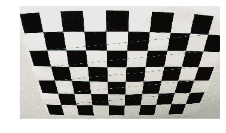

9x6 corners of chessboard found

我们可以看到角点非常清晰。接下来，我们在从不同角度拍摄的多个棋盘图像上运行我们的棋盘寻找算法，以识别图像和对象点来校准相机。前者指的是我们的 2D 映射中的坐标，而后者表示这些图像点在 3D 空间中的真实坐标(对于我们的棋盘图像，z 轴或深度= 0)。这些映射使我们能够找出如何正确地消除从同一台相机拍摄的图像上的失真。你可以在下图中看到它的有效性:

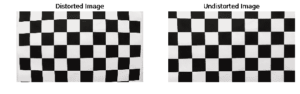

original vs undistorted chessboard images

我们现在可以扭转所有图像的失真，如下图所示:

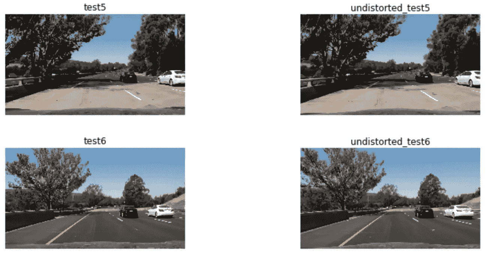

sample of original vs undistorted images

# 阈值处理

我们在这一部分应用颜色和边缘阈值来更好地检测线条，并使其更容易找到最好地描述我们的左右车道的多项式。

我们首先探索我们应该采用哪些颜色空间来增加我们检测车道的机会并促进梯度阈值步骤的任务。

## 颜色阈值

我们对不同的色彩空间进行了实验，以了解我们应该使用哪种色彩空间和通道来最有效地分离车道线:

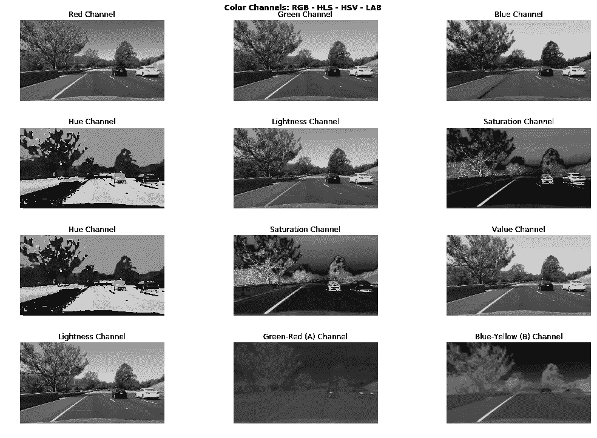

from top to bottom: RGB, HLS, HSV, LAB color spaces split in their 3 channels

在 RGB 分量上，我们看到蓝色通道在识别黄线方面最差，而红色通道似乎给出了最好的结果。

对于 HLS 和 HSV，色调通道产生极其嘈杂的输出，而 HLS 的饱和通道似乎给出了强有力的结果；比 HSV 的饱和通道要好。相反，HSV 的值通道给出了非常清晰的灰度图像，特别是在黄线上，比 HLS 的亮度通道好得多。

最后，实验室的 A 通道表现不佳，而 B 通道擅长识别黄线。但是，在识别黄线和白线时发光的是亮度通道(没有双关的意思)。

在这个阶段，我们面临着各种有利有弊的选择。我们的目标是在给定的颜色通道上找到合适的阈值来突出车道的黄线和白线。实际上，有许多方法可以实现这一结果，但我们选择使用 HLS，因为我们已经知道如何从[项目 1:简单车道检测](https://github.com/kenshiro-o/CarND-LaneLines-P1)中设置黄色和白色车道线的阈值。

下面的代码显示了我们如何对 HLS 上的白色和黄色(我们的车道颜色)进行阈值处理，并生成二进制图像:

```
def compute_hls_white_yellow_binary(rgb_img):
    """
    Returns a binary thresholded image produced retaining only white and yellow elements on the picture
    The provided image should be in RGB format
    """
    hls_img = to_hls(rgb_img)

    # Compute a binary thresholded image where yellow is isolated from HLS components
    img_hls_yellow_bin = np.zeros_like(hls_img[:,:,0])
    img_hls_yellow_bin[((hls_img[:,:,0] >= 15) & (hls_img[:,:,0] <= 35))
                 & ((hls_img[:,:,1] >= 30) & (hls_img[:,:,1] <= 204))
                 & ((hls_img[:,:,2] >= 115) & (hls_img[:,:,2] <= 255))                
                ] = 1

    # Compute a binary thresholded image where white is isolated from HLS components
    img_hls_white_bin = np.zeros_like(hls_img[:,:,0])
    img_hls_white_bin[((hls_img[:,:,0] >= 0) & (hls_img[:,:,0] <= 255))
                 & ((hls_img[:,:,1] >= 200) & (hls_img[:,:,1] <= 255))
                 & ((hls_img[:,:,2] >= 0) & (hls_img[:,:,2] <= 255))                
                ] = 1

    # Now combine both
    img_hls_white_yellow_bin = np.zeros_like(hls_img[:,:,0])
    img_hls_white_yellow_bin[(img_hls_yellow_bin == 1) | (img_hls_white_bin == 1)] = 1

    return img_hls_white_yellow_bin
```

结果如下所示:

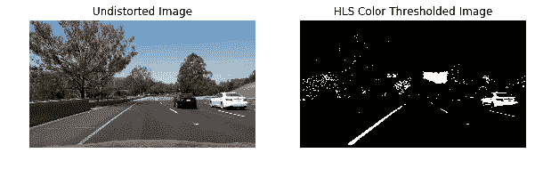

undistorted vs HLS binary color image (filtering for yellow and white)

正如你在上面看到的，我们的 HLS 颜色阈值在图像上取得了很好的效果。阈值处理与前面黄线上的树的阴影有点冲突。我们认为梯度阈值在这种情况下会有所帮助。

## 梯度阈值

我们使用 [Sobel](https://en.wikipedia.org/wiki/Sobel_operator) 算子来识别*梯度*，即图像中*颜色强度*的变化。较高的值表示强烈的梯度，因此颜色变化剧烈。

我们决定使用实验室的 L 通道作为单通道图像，作为以下 sobel 函数的输入。

我们试验了许多参数和不同的 Sobel 操作(所有这些都可以在这个 Jupyter [笔记本](https://github.com/kenshiro-o/CarND-Advanced-Lane-Lines/blob/master/notebook.ipynb)上看到)，得出了这个最终结果:

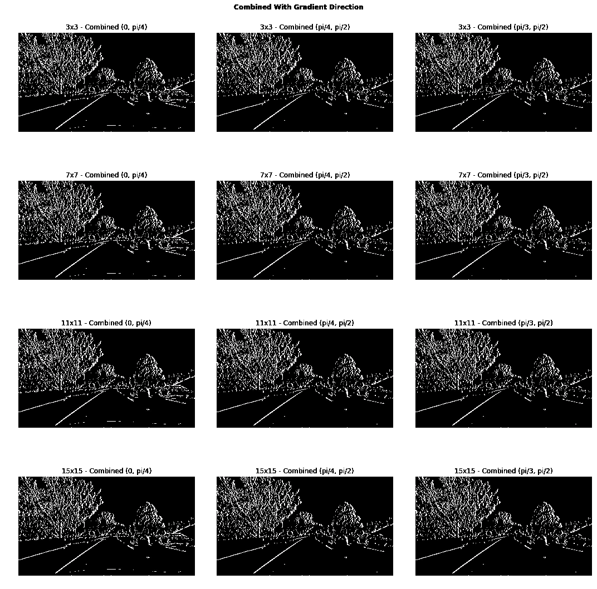

Results of multiple sobel operations

我们从底部选择第二个图像作为我们的最佳结果。请注意，在我们选择的图像上，我们应用了 15x15 像素的内核，从而有效地平滑了像素，产生了更清晰的二进制图像。

## 结合两者

我们自然地将彩色和 Sobel 阈值化的二值图像结合起来，并得到以下结果:

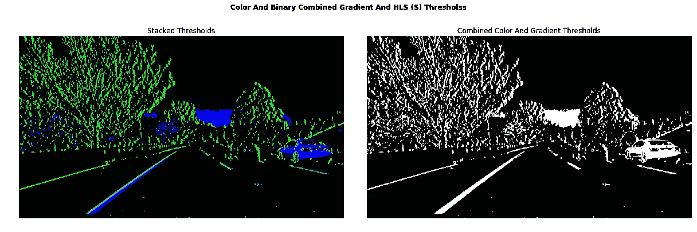

combined color and gradient thresholded images in (R)GB and binary formats

在左边的图像中，所有的绿色像素被我们的 Sobel 阈值化保留，而蓝色像素被我们的 HLS 颜色阈值化识别。结果非常令人鼓舞，似乎我们已经找到了正确的参数，以稳健的方式检测车道。接下来，我们对我们的图像进行透视变换，并生成车道的鸟瞰图。

# 透视变换

我们现在需要在 2D 图像中定义一个梯形区域，该区域将通过透视变换转换为鸟瞰图，如下所示:

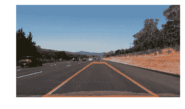

trapezoid of lane on road

然后，我们定义 4 个额外的点，它们形成一个矩形，映射到我们的源梯形中的像素:

```
dst_pts = np.array([[200, bottom_px], [200, 0], [1000, 0], [1000, bottom_px]], np.float32)
```

透视变换产生以下类型的图像:

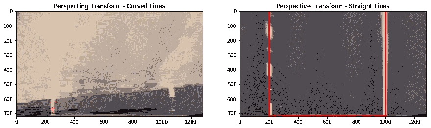

bird’s eye view on both straight and curved lanes

# 把所有的放在一起

我们可以看到，我们的透视变换保持直线笔直，这是一个必需的健全性检查。然而，曲线在上面的例子中并不完美，但是它们也不会给我们的算法带来无法克服的问题。

现在，我们可以将阈值处理应用于鸟瞰图图像:

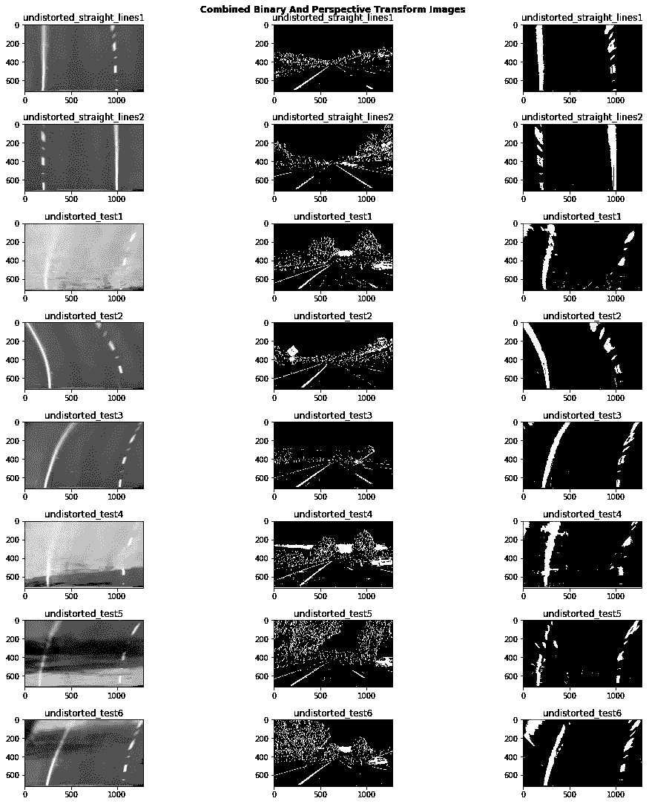

test images with perspective transform, color and gradient thresholds applied

# 柱状图

然后，我们在图像的下半部分计算 y 方向上的二进制阈值图像的直方图，以识别像素强度最高的 x 位置:

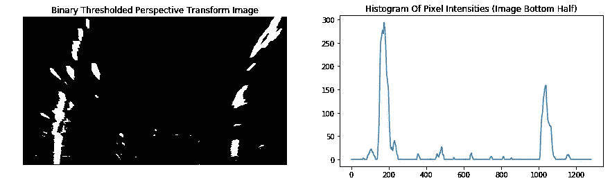

Left: birds eye view binary representation of lane. Right: histogram of pixel intensities of the image

# 寻找线条并绘制车道区域

## 推拉窗

因为我们现在知道了最有可能产生车道线的像素的起始 x 位置(从图像的底部开始)，我们运行了一个[滑动窗口搜索](https://www.coursera.org/learn/machine-learning/lecture/bQhq3/sliding-windows)，试图“捕获”我们车道线的像素坐标。

从那时起，我们通过 numpy 的 [polyfit](https://docs.scipy.org/doc/numpy-1.13.0/reference/generated/numpy.polyfit.html) 简单地计算一个二次多项式，找到最适合左右车道线的曲线系数。

我们改进算法的一种方法是保存先前为帧 *t-1* 计算的系数，并尝试从这些系数中找到我们的车道像素。然而，当我们没有找到足够的车道线像素(少于总非零像素的 85%)时，我们恢复到滑动窗口搜索，以帮助提高我们在车道周围拟合更好曲线的机会。

## 车道曲率

我们还通过计算与车道线相切的最小圆的半径来计算车道曲率，在直线车道上，半径会很大。我们必须通过定义适当的像素高度与车道长度以及像素宽度与车道宽度的比率，将像素空间转换为米(也称为真实世界单位):

```
# Height ratio: 32 meters / 720 px
self.ym_per_px = self.real_world_lane_size_meters[0] / self.img_dimensions[0]# Width ratio: 3.7 meters / 800 px
self.xm_per_px = self.real_world_lane_size_meters[1] / self.lane_width_px
```

我试图通过参考来自这个[资源](https://www.psychologicalscience.org/news/motr/lines-on-the-road-are-longer-than-you-think.html)的数据，在我的鸟瞰图像上手动估计道路的长度:每次汽车行驶都超过 40 英尺(约 12.2 米)。在我的样本图像上，鸟瞰图似乎覆盖了大约 32 米。宽度保持在 3.7 米，符合美国高速公路标准。你可以通过下面的[链接](https://www.intmath.com/applications-differentiation/8-radius-curvature.php)找到更多关于曲率半径的数学基础的信息。

我们还通过偏移车道左右线的起始(即底部)坐标的平均值，减去中点作为偏移量，并乘以车道的像素与真实世界宽度的比率，来计算汽车与车道中心的距离。

## 取消绘制车道区域

最后，我们用绿色绘制车道的内侧，并*取消扭曲*图像，从而从鸟瞰图移动到原始的未失真图像。此外，我们用我们的车道检测算法的小图像覆盖这个大图像，以便一帧一帧地更好地感受正在发生的事情*。我们还添加了关于车道曲率和车辆中心位置的文本信息:*

*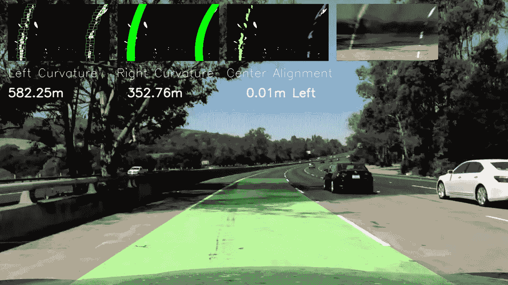*

*Sample result of the output of detected lanes*

## *决赛成绩*

*下面的 gif 显示了我们为项目视频构建了一个强大的车道检测管道:*

*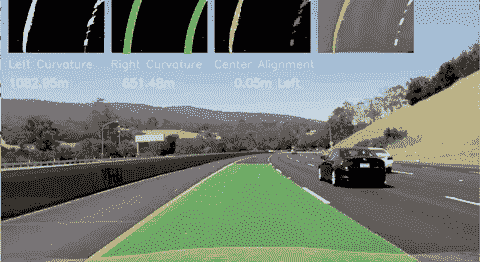*

*Lane detection gif*

*此外，我在 Youtube 上上传了一个视频，我在项目视频上画了车道，并添加了额外的信息，如车道曲率近似值。背景音乐是*弗林的儿子*(显然来自Tron:Legacy😎).尽情享受吧！*

*Video of lanes detected on project video*

# *结论*

*这是一个令人兴奋但困难的项目，感觉与我们之前的两个深度学习项目非常不同。我们已经介绍了如何执行相机校准、颜色和梯度阈值，以及透视变换和滑动窗口来识别车道线！滑动窗口代码最初特别难理解，但是经过长时间的调试和评论(都在我的笔记本上)，我终于理解了每一行！*

*我们认为该项目可以进行许多改进，例如:*

*   *尝试 LAB 和 YUV 色彩空间，以确定我们是否可以产生更好的色彩阈值*
*   *使用卷积而不是滑动窗口来识别热点像素*
*   *产生先前帧的行系数的指数移动平均值，并在我们的像素检测失败时使用它*
*   *更好地检测“捕获”的像素中的异常(例如，一些完全离线的非零像素)并剔除它们*
*   *应用本项目未涵盖的其他相关计算机视觉技术*

*此外，我们需要建立一个更强大的渠道来成功完成这个项目中的两个挑战视频。*

*像往常一样，我要感谢我的导师迪伦的建议和支持，以及我在 Udacity 的同事，以前和现在的同事，他们整理了很多优秀的文章，激励了我。*

*感谢你阅读这篇文章。希望你觉得有用。我现在正在创建一个名为[*env sion*](https://envsion.io)*的新公司！在 EnVsion，我们正在为 UX 的研究人员和产品团队创建一个中央存储库，以从他们的用户采访视频中挖掘见解。当然我们用人工智能来做这个。).**

**如果你是一名 UX 的研究人员或产品经理，对与用户和客户的视频通话感到不知所措，那么 EnVsion 就是为你准备的！**

**你也可以关注我的* [*推特*](https://twitter.com/Ed_Forson) *。**