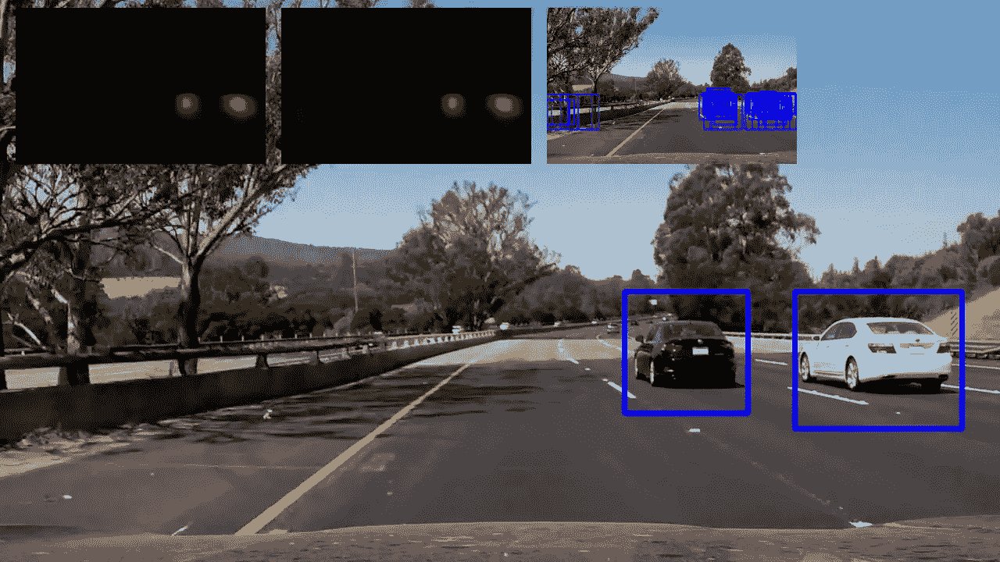
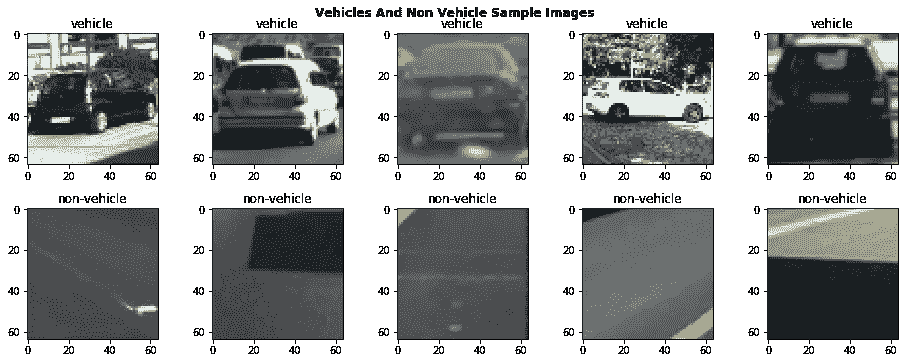
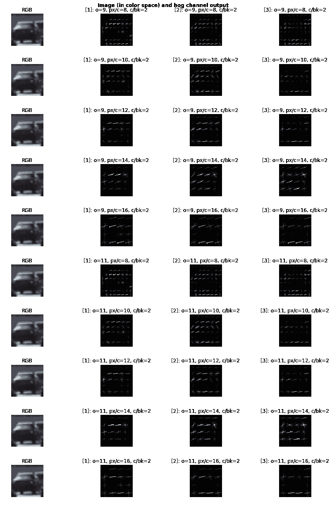
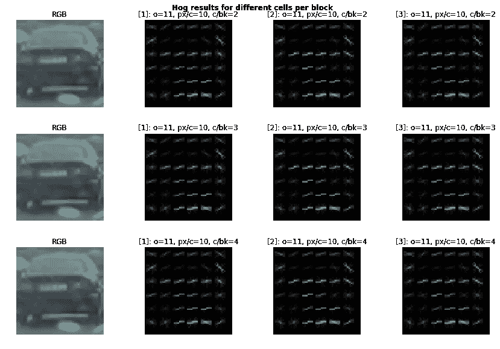
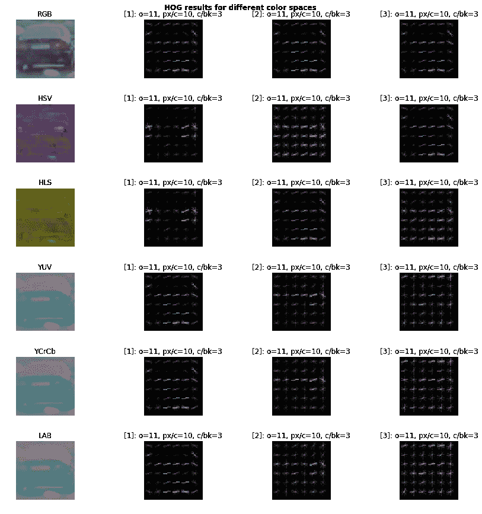
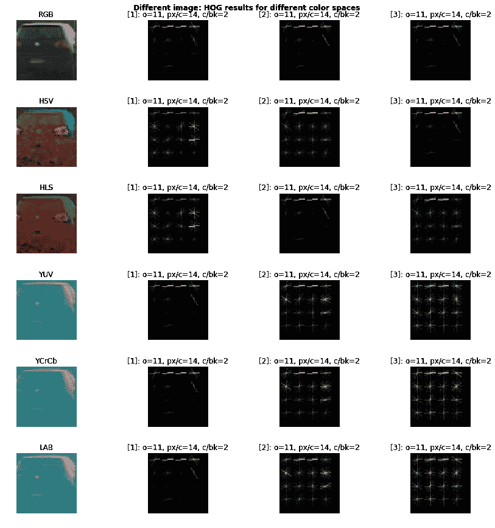
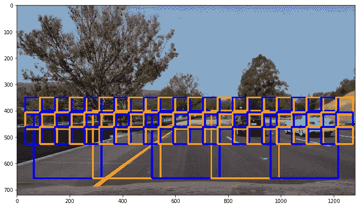
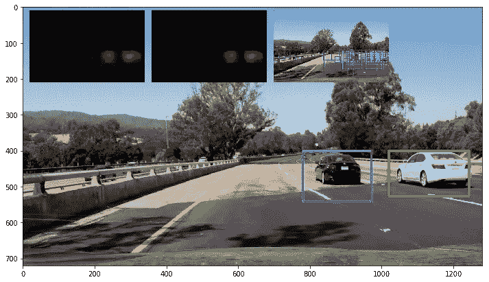
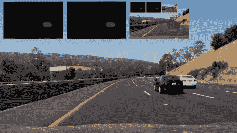

# 教汽车看东西——使用机器学习和计算机视觉进行车辆检测

> 原文：<https://towardsdatascience.com/teaching-cars-to-see-vehicle-detection-using-machine-learning-and-computer-vision-54628888079a?source=collection_archive---------4----------------------->



*这是* [*Udacity 自动驾驶汽车工程师纳米学位*](https://www.udacity.com/course/self-driving-car-engineer-nanodegree--nd013) *第一学期的期末项目。你可以在*[*github*](https://github.com/kenshiro-o/CarND-Vehicle-Detection)*上找到与这个项目相关的所有代码。你也可以阅读我以前项目的帖子:*

*   *项目 1:* [*利用计算机视觉检测车道线*](https://medium.com/computer-car/udacity-self-driving-car-nanodegree-project-1-finding-lane-lines-9cd6a846c58c)
*   *项目二:* [*交通标志分类使用深度学习*](https://medium.com/towards-data-science/recognizing-traffic-signs-with-over-98-accuracy-using-deep-learning-86737aedc2ab)
*   *项目三:* [*转向角度预测利用深度学习*](https://medium.com/towards-data-science/teaching-cars-to-drive-using-deep-learning-steering-angle-prediction-5773154608f2)
*   *项目 4:* [*利用计算机视觉进行高级车道检测*](https://medium.com/towards-data-science/teaching-cars-to-see-advanced-lane-detection-using-computer-vision-87a01de0424f)

当我们开车时，我们不断关注我们的环境，因为这关系到我们和其他许多人的安全。我们特别注意潜在障碍物的位置，无论是其他汽车、行人还是路上的物体。同样，随着我们开发为自动驾驶汽车提供动力所必需的智能和传感器，这种汽车也能检测障碍物是至关重要的，因为这可以加强汽车对环境的理解。最重要的一种 ostacles 是检测道路上的其他车辆，因为它们很可能是我们车道或邻近车道上最大的物体，因此构成了潜在的危险。

从传统的计算机视觉技术到深度学习技术，在整个文献中已经开发了许多障碍检测技术。在本练习中，我们通过采用一种称为*梯度方向直方图(HOG)* 的传统计算机视觉技术，结合一种称为*支持向量机(SVM)* 的机器学习算法，来构建一个车辆检测器。

# 资料组

Udacity 慷慨地提供了一个具有以下特征的*平衡*数据集:

*   约 9K 的车辆图像
*   非车辆的~ 9K 图像
*   所有图像都是 64x64

数据集来自 [GTI 车辆图像数据库](http://www.gti.ssr.upm.es/data/Vehicle_database.html)、 [KITTI Vision 基准套件](http://www.cvlibs.net/datasets/kitti/)，以及从项目视频本身提取的例子。后者要大得多，没有用于这个项目。然而，这在未来将是一个很好的补充，特别是当我们计划使用深度学习建立一个分类器时。您可以从下面的数据集中看到一个图像示例:



Sample of vehicles and non-vehicles from dataset

我们可以清楚地看到车辆和非车辆图像。非车辆图像往往是道路的其他元素，如沥青、路标或路面。区别非常明显。大多数图像也将车辆显示在中央，但方向不同，这很好。此外，还有各种各样的汽车类型和颜色，以及照明条件。

# 探索特性

## 方向梯度直方图(HOG)

Navneet Dalal 和 Bill Triggs 在他们的论文《人类检测的方向梯度直方图[中展示了令人印象深刻的结果后，使用 HOG 进行检测受到了欢迎。Satya Mallick 在这篇](https://hal.inria.fr/inria-00548512/document)[文章](https://www.learnopencv.com/histogram-of-oriented-gradients/)中很好地解释了这个算法，对于那些想要更好地掌握 HOG 的人来说。

我们首先在 RGB 图像上探索了 HOG 算法中以下值的不同配置:

*   方位数量(用 *o 表示)*
*   每个单元格的像素(用 *px/c 表示)*

每个块的单元最初固定为 2(用 *c/bk 表示)*。下图显示了在 RGB 格式的样本车辆图像上获得的结果:



Results of different configurations for HOG

从纯粹的观察来看，它看起来像一个猪配置:

*   11 个方向
*   每个单元格 14 个像素
*   每个区块 2 个单元

产生车辆最独特的坡度。我们还没有对每个模块的不同单元进行实验，所以现在让我们来尝试一下。



HOG results with different cells per block

对于人眼来说，我们在视觉上没有注意到明显的差异。理想情况下，我们希望减少特征空间以加快计算速度。我们现在决定每块 3 个细胞。

## 色彩空间

我们现在必须为我们的配置探索最合适的颜色空间，因为看起来我们在 3 个 RGB 通道上的 HOG 特征太相似了，因此感觉我们没有生成具有足够变化的特征。

我们在众多色彩空间中生成以下输出:



HOG image across all channels in different color spaces

对于某些颜色通道，很难解释 HOG 的结果。有趣的是，YUV、YCrCb 和 LAB 中的第一个颜色通道似乎足以捕捉我们正在寻找的渐变。在 HSV 和 HLS 中，HOG 分别在*值*和*亮度*通道上捕捉车辆的最重要特征。

为了证实我们的假设，让我们尝试一个不同的车辆图像:



Same HOG settings but on a different image

*休斯顿，我们这里有一个问题* …在如上图这样的暗图像上，我们可以观察到携带最多光信息的信道上的 HOG 产生了不好的结果。**因此，我们必须考虑所有的颜色通道，以捕捉最多的特征。**最后，我们的配置如下:

*   **ycr CB 色彩空间的所有通道**
*   **11**的拱起方向
*   **每 14 个单元的 HOG 像素**
*   **每块猪细胞 2 个**

我们还将添加颜色信息来增强我们的功能集。为此，我们只需使用 32 个箱生成所有颜色通道的直方图，如下所示:

```
def color_histogram(img, nbins=32, bins_range=(0, 256)):
    """
    Returns the histograms of the color image across all channels, as a concatenanted feature vector
    """
    # Compute the histogram of the color channels separately
    channel1_hist = np.histogram(img[:,:,0], bins=nbins, range=bins_range)
    channel2_hist = np.histogram(img[:,:,1], bins=nbins, range=bins_range)
    channel3_hist = np.histogram(img[:,:,2], bins=nbins, range=bins_range) # Concatenate the histograms into a single feature vector and return it
    return np.concatenate((channel1_hist[0], channel2_hist[0], channel3_hist[0])) 
```

# 分类者

分类器负责将我们提交的图像分为*车辆*或*非车辆*类别。为此，我们必须采取以下步骤:

*   从数据集中加载我们的图像
*   提取我们想要的特征
*   使这些特征正常化
*   分割用于*训练*和*测试*的数据集
*   使用适当的参数构建分类器
*   在*训练*数据上训练分类器

正如上一节所讨论的，我们决定只保留一个特征:在 YCrCb 图像的 Y 通道上计算的 HOG 特征向量。

我们随机分割数据集，留下 20%用于测试。此外，我们通过使用一个[sk learn . preprocessing . standard scaler](http://scikit-learn.org/stable/modules/generated/sklearn.preprocessing.StandardScaler.html)normalizer 来缩放数据。

我们没有足够的时间对许多分类器进行实验，所以选择使用*支持向量机* (SVMs)，因为它们通常与 HOG 结合用于对象检测问题。此外，我们使用了带有内核的 SVC，因为它提供了最好的精度，但是比线性 SVC 慢。我们接受了这种折衷，因为当我们在一系列图像上测试时，使用 rbf 核的 SVC 的检测更强。

使用 [GridSearchCV](http://scikit-learn.org/stable/modules/generated/sklearn.model_selection.GridSearchCV.html#sklearn.model_selection.GridSearchCV) 函数获得了核类型(*线性*或 *rbf* )、 *C* ( *1，100，1000，1000* )和*伽马* ( *自动，0.01，0.1，1* )中的理想参数。最佳配置实现了超过 99%的准确度，并具有以下参数:

*   **内核** = rbf
*   **C** = 100
*   **伽玛** =自动

# 推拉窗

我们创建了多个维度的滑动窗口，范围从 64x64 到 256x256 像素，以针对分类器测试图像的部分，并仅保留正面预测。我们通常从屏幕底部滑动较大的窗口，因为这将对应于车辆出现最大的位置。较小的窗口会在屏幕上滑得更高。此外，我们能够配置小区重叠，并且当前已经将它设置为 1 以获得最大覆盖(即，每 14 像素*比例重叠，其中比例 1 的最小窗口是 64x64)。我们停止尝试检测 y 方向上任何低于 350 像素的车辆(即屏幕上图像的较高部分)。下图显示了单元格重叠设置为 4 的重叠滑动窗口示例:



Sliding windows of different sizes with cell overlap = 4

# 热图和阈值

分类器有时会误分类图像中实际上不是车辆的部分。为了避免突出显示视频中的车辆，我们利用我们通过多尺寸滑动窗口创建的冗余，并计算我们的分类器在图像的给定部分的所有窗口中预测车辆的次数。我们首先使用*scipy . ndimage . measurements*'[label](https://docs.scipy.org/doc/scipy-0.16.0/reference/generated/scipy.ndimage.measurements.label.html)函数来标记具有重叠窗口的对象。然后，我们通过确定我们检测到的对象能够适合的最小边界框来提取每个标签的位置。我们只保留图像中检测到的阈值被设置为特定值的部分。通过实验，我们发现阈值 4 足以在项目视频上获得稳定的结果。下图说明了热图和阈值处理的工作原理:



Detected vehicles with heatmaps and thresholding

第一个迷你热图代表来自分类器的原始原始检测，而第二个显示阈值区域，其中红色的强度随着重叠窗口数量的增加而增加。右边最后一个小图像显示了我们的分类器预测到*车辆*的所有窗口。在这个例子中，我们实际上使用了*线性 SVC* ，它比 *rbf SVC 更容易预测错误。*

# 帧聚合

为了进一步加强我们的管道，我们决定每隔 *n* 帧平滑所有检测到的窗口。为此，我们累积帧( *n-1)*f+1* 到 *n*f* 之间的所有检测到的窗口，其中 *n* 是表示我们所在的帧的*组*的正标量。我们已经创建了以下封装检测到的对象的类:

```
class DetectedObject:
    """
    The DetectedObject class encapsulates information about an object identified by our detector
    """
    def __init__(self, bounding_box, img_patch, frame_nb):
        self.bounding_box = bounding_box
        self.img_patch = img_patch 
        self.frame_nb = frame_nb
        self.centroid = (int((bounding_box[0][0] + bounding_box[1][0]) / 2), int((bounding_box[0][1] + bounding_box[1][1]) / 2))
        self.similar_objects = []
...
```

每当我们在组中的当前帧或下一帧上检测到新的对象时，我们检查我们过去是否检测到类似的对象，如果是，我们附加类似的对象，从而增加该对象在多个帧上的计数。在帧 *n*f* 处，我们仅保留具有超过 *m* 个检测计数的检测到的对象(及其相关联的边界框)，从而在流水线中实现某种类型的*双重过滤*(第一次过滤是关于重叠边界框的数量的阈值)。

在下面的 gif 上，你可以看到当我们有一个单一的边界框覆盖两辆汽车时和当每辆汽车都有自己的边界框时之间有一瞬间:帧聚合逻辑必须等到两个窗口出现足够的次数后才显示它们:



gif of vehicle detection with frame sampling

# 决赛成绩

下面的视频链接显示了对车辆的成功检测。由于这是第一学期的最后一个项目，我刚刚*让*使用 Tron Legacy 的 OST 的音轨*片尾标题*作为背景音乐——没有什么比这更合适的了😎。像往常一样享受吧！

Video montage of vehicle detection

# 丰富

这是一个棘手的项目，特别是对于那些选择更传统的计算机视觉和机器学习方法而不是深度学习的人来说。以下步骤相当耗时:

*   确定最合适的特征(HOG、图像颜色直方图等)
*   探索 HOG 参数+色彩空间的组合
*   应用网格搜索寻找最合适的分类器

此外，在我们的渠道中，我们还面临以下问题:

*   确定滑动窗口和重叠的正确位置
*   为重叠检测识别合适的*阈值*
*   采用合适的帧采样率
*   在多个帧中找到足够好的最小检测计数
*   聚集重叠检测的组合窗口维度

对于不是车辆但被分类器检测到的对象，流水线将失败，并且在足够多的重叠窗口上出现这种错误检测以突破所配置的阈值，并且在每组的最小数量的帧上始终如此。绘制的边界框并不总是完全适合车辆，并且每隔 n 帧重画一次，因此造成缺乏平滑度的印象。此外，与每 n 个帧进行批量聚合相反，可以通过使用 n 个帧的滚动窗口来改进帧聚合。

最后一个问题是我们的流水线*太慢*。我们不应该在整个屏幕上滑动窗口，只需要查看屏幕的一部分:例如，将来我们可以使用决策树来识别感兴趣的区域。我们还可以考虑减少滑动窗口的数量，以及采用像 *LinearSVC* 这样的更快的分类器来加速检测(但准确性也会显著下降)。尽管如此，这种车辆检测管道不太可能实时工作。

在未来，将采用深度学习方法，例如使用[更快的 R-CNN](https://arxiv.org/abs/1506.01497) 或 [YOLO](https://arxiv.org/abs/1506.02640) 架构，因为这些架构现在是检测问题的最先进技术，并且可以实时运行。然而，这是一个有价值的练习，可以更好地理解传统的机器学习技术，并在特征选择上建立直觉。此外，像 HOG 这样的技术的美丽和简单给我留下了深刻的印象，它仍然能够产生可靠的结果。

# 感谢

我要再次感谢我的导师迪伦，感谢他在这一学期对我的支持和建议。我也非常感谢 Udacity 设立了这样一个令人兴奋和具有挑战性的纳米学位，有着伟大的项目和优秀的材料。

我们站在巨人的肩膀上，因此我感谢人工智能、计算机视觉等领域的所有研究人员和爱好者，感谢他们通过论文和代码所做的工作和分享。没有这些资源，我就无法“借用”他们的想法和技术，并成功完成这个项目。

第一学期已经结束了🎉🎉。我将于 2018 年 1 月开始第二学期，与此同时，我将致力于深化我刚刚起步的人工智能技能，并恢复兼职项目的工作。感谢阅读，敬请关注！

感谢你阅读这篇文章。希望你觉得有用。我现在正在建立一个新的创业公司，叫做 [*EnVsion*](https://envsion.io) *！在 EnVsion，我们正在为 UX 的研究人员和产品团队创建一个中央存储库，以从他们的用户采访视频中挖掘见解。当然我们用人工智能来做这个。).*

*如果你是一名 UX 研究员或产品经理，对与用户和客户的视频通话感到不知所措，那么 EnVsion 就是为你准备的！*

*你也可以关注我的* [*推特*](https://twitter.com/Ed_Forson) *。*