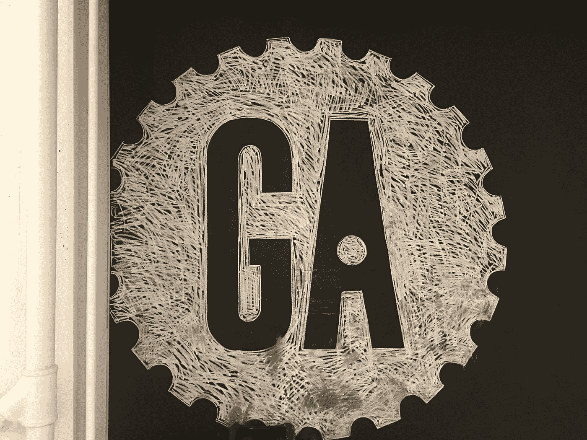
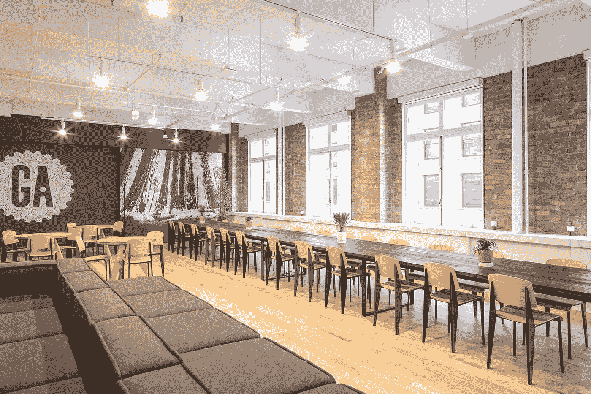
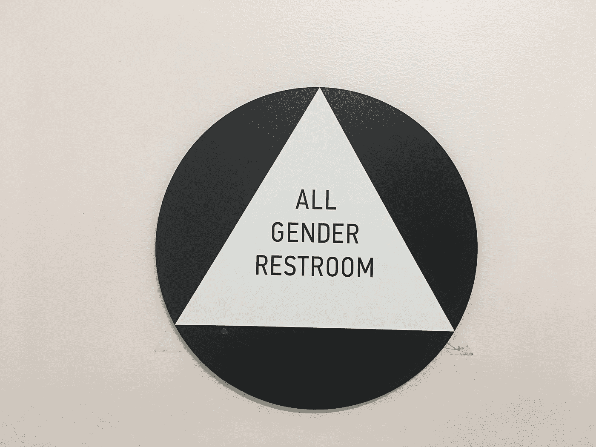
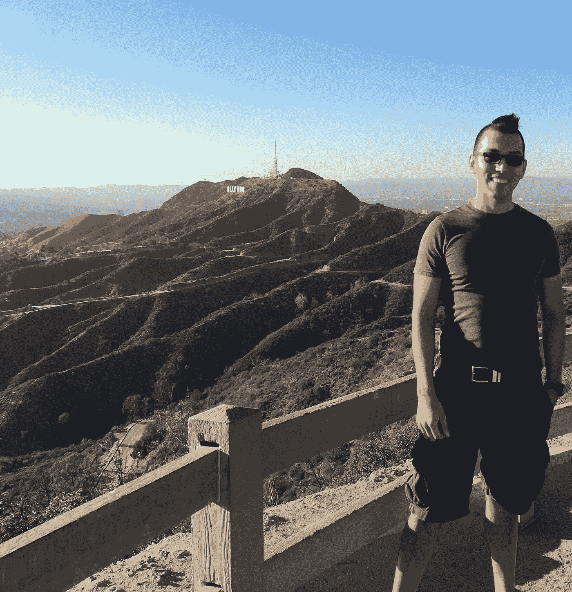

# 在大会上讲授数据科学:第 1 周

> 原文：<https://towardsdatascience.com/teaching-data-science-at-general-assembly-week-1-985144ae2189?source=collection_archive---------0----------------------->

本周，我开始向学生传授将他们转变为数据科学家的技能和技术，这些数据科学家是初创公司和大公司的宝贵团队成员，正在从根本上改变世界对数据的看法。

在旧金山，General Assembly (GA)将于 2017 年 1 月 30 日开始他们的第五期 [**数据科学沉浸式**](https://generalassemb.ly/locations/san-francisco) 课程。我将成为两位数据科学讲师之一，将我们的专业知识和行业经验带入课堂和课程。

我的行业经验包括为 Wine.com 和 NASA 构建可扩展的数据产品。对于 Wine.com，我使用 Spark 的机器学习库构建了一个推荐系统。这个系统根据每个用户对葡萄酒的喜好为他们提供个性化的推荐。在山景城的 NASA 中心，我为地理空间图像建立了一个可扩展的特征提取 ETL 管道。这个项目在他们内部的超级计算机昴宿星上运行。

这些项目和其他项目可以在我的 [**GitHub**](https://github.com/DataBeast03/DataBeast) 欢迎页面找到。

我们的学生是工作专业人士，他们渴望改变和新的挑战，并强烈希望利用数据科学工具包来改善企业和人们的生活。他们的学术背景从数学、工程到商业都有。他们每个人都带来了独特的优势、工作经验和观点，这将交叉授粉的想法，并导致丰富的学习环境。

我的一些学生的个人兴趣包括萨尔萨和摇摆舞，以及交叉健身和踢拳。我的生活方式还包括各种形式的体育锻炼，比如跳探戈和奥运会举重。我几乎还不了解我的学生，但我们已经建立了关系，这将使接下来的 3 个月对每个人来说都是有趣而难忘的经历。

**An inclusive culture for an inclusive community.**

GA 不仅投资于学生的成果，也投资于教师。我对教师在培训和反馈方面获得的支持程度印象深刻。GA 培养主动学习和成长的教育思维方式，这种方式将继续为学生和教师带来成功的结果。

通过整合数据科学家的行业经验，GA 确保学生尽可能接受最新和行业相关的培训。在过去的两周，我一直在通过 GA 的讲师培训电路(ITC)工作，并帮助建立该课程的数据科学课程。

在那段时间里，我开始了解 GA 的学生——不仅仅是通过 DSI 项目，还有其他项目。当学生从事他们的项目，创造数据驱动的产品和解决方案时，有一种明显的兴奋感、协作和创新思维。

如果您对 GA 的 DSI 计划或我在数据科学领域的工作有任何疑问，请随时联系我。

此外，我们正在寻找客座演讲人走进教室，与学生分享他们所学的数据科学技能和技术如何解决现实世界的问题。如果你感兴趣，请告诉我！

[**领英**](https://www.linkedin.com/in/alexander-barriga-m-s-52bb558b)

[GitHub](https://github.com/DataBeast03/DataBeast)

[**邮箱**](http://alexanderbarriga03@gmail.com)