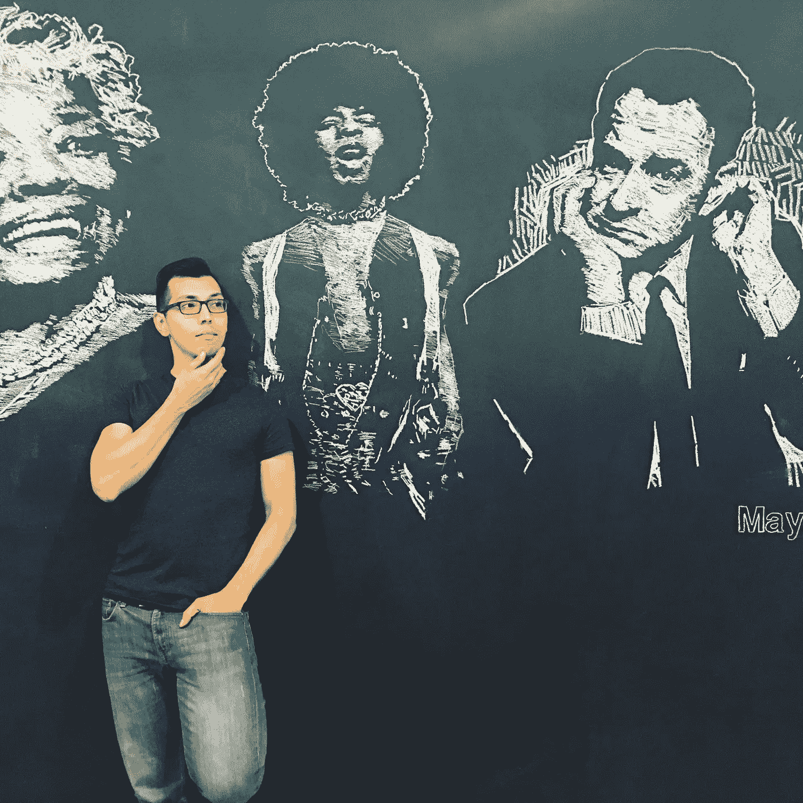
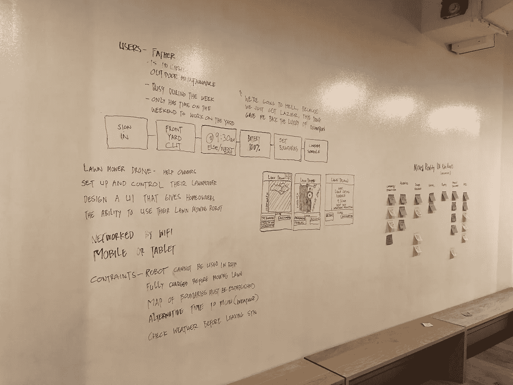
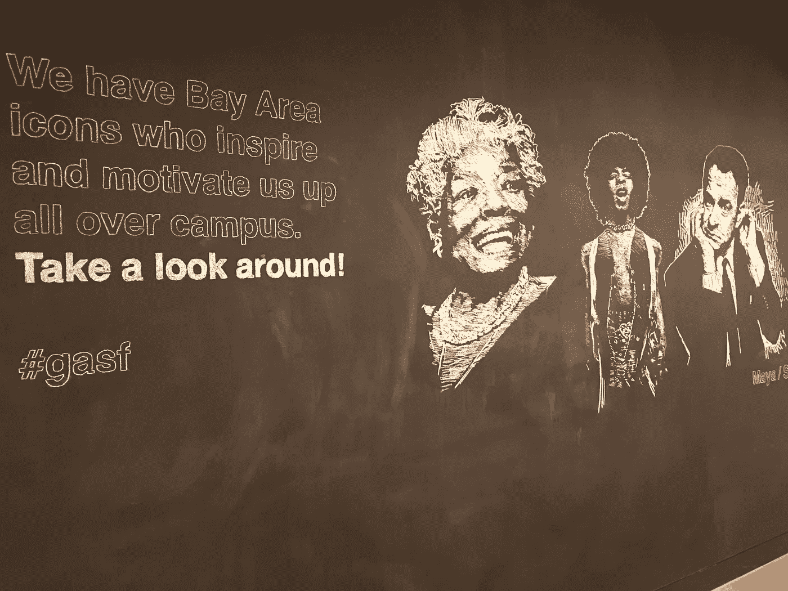

# 在大会上讲授数据科学:第 4 周

> 原文：<https://towardsdatascience.com/teaching-data-science-at-general-assembly-week-4-916c45583f35?source=collection_archive---------3----------------------->

**砂砾。这就是我如何在每个工作日的早上 5:30 醒来，走进举重房，摇着水壶的铃铛，看着奥林匹克解除我眼中的睡意。**

**勇气**是在为期 12 周的课程中学习数据科学基础知识所需要的，我的学生很快就发现了这一点。

## 第 2–3 周

我和我的教学团队教授了计算机科学、线性代数、统计学、概率等几门大学课程，并在两周半的时间里将它们的核心概念提炼出来。日复一日地频繁转移话题会让学生们有点迷失方向——如果你愿意的话，可以说是教育上的鞭打。当学生学习提到的低水平基础知识时，可能会有点迷失方向，因为他们正在学习看似孤立的技能和技术。对于他们来说，在课程中看到并应用这些技能和技术，利用机器学习和大数据综合创建令人惊叹的数据产品并优化业务运营还为时过早。

耐心点，年轻的杰迪们，基于系统的解决方案将会及时出现，因为现在你们将在光剑训练期间被盲目折叠，同时躲避盘旋在机器人周围的冲击波。

Those Web Development kids and their graffiti (shakes fist furiously in air).

## 第四周

第 4 周和第 3 周的末尾向学生介绍了机器学习的奇妙世界。是的，ML，计算机科学中的一个令人敬畏的领域，让你告诉你的朋友，你在与人工智能打交道——尽管是人工智能的一个狭窄子集。对于那些在斯坦福大学或加州大学伯克利分校等传统大学上过机器学习入门课程的人，或者在 GA 等训练营学习过 ML 的人，你会知道 ML 的教学首先是介绍线性回归和逻辑回归。你在传统大学通常得不到的是一个小班，有多名教师，致力于通过个性化的关注和定期的反馈来帮助学生取得成功。

我就是从那里进来的！是的，我很高兴通过机器学习及其所有许多方面来指导 GA 的下一批行业就绪数据科学家。下周—推进机器学习！

## 行业发言人

教学团队和我接触行业数据科学家，目的是让他们向学生介绍他们的工作。在第 3 周，我们有一位前 GA 学生讲述了他如何使用机器学习和 cleaver 合并开源数据集为他的太阳能公司节省了数万美元。

下周，MyFitnessPal 的一位数据科学家将讲述他围绕用户行为的 A/B 测试所做的工作。这些讲座帮助学生弥合他们在课堂上学到的知识与如何利用这些技能和技术解决现实世界的问题并为他们未来的创业创造巨大影响之间的差距。

我向我的学生脱帽致敬，他们不仅挺过了课程的难关，还迅速提高了技能和信心。看到他们在短短 4 周内取得如此大的进步，真是令人惊讶。行业就绪型数据科学家即将到来！

## 关于作者

Alexander 毕业于加州大学伯克利分校，获得物理学学士学位，毕业于 T2 大学，获得数据科学硕士学位。他热衷于应用数据科学来解决医疗保健、清洁能源和环境领域的挑战性问题。