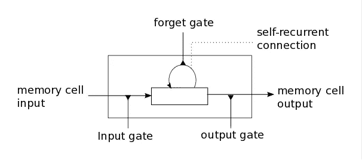

# 教机器说话和即兴演奏布鲁斯爵士乐

> 原文：<https://towardsdatascience.com/teaching-machines-to-speak-and-improvise-blues-jazz-283571983c89?source=collection_archive---------10----------------------->

对于本周的文章，我想重点关注*长短期记忆* (LSTM)模型的例子，因为它们是我在深度学习中遇到的最优雅的概念之一。他们还为[谷歌翻译](https://research.googleblog.com/2016/09/a-neural-network-for-machine.html)提供动力，帮助[优步预测极端事件期间的需求](https://eng.uber.com/neural-networks/)，让亚马逊回声[听起来像真人](http://www.allthingsdistributed.com/2016/11/amazon-ai-and-alexa-for-all-aws-apps.html)，教[机器人外科医生打结](http://ieeexplore.ieee.org/document/4059310/?reload=true)，甚至谱写[新的布鲁斯爵士乐](http://people.idsia.ch/~juergen/blues/)。

## 挑战:我的狗有四只…

假设我让你猜句子*“我的狗有四条腿……”*中的下一个作品，你可能会说“腿”。在这种情况下，最后一个单词的上下文在紧邻的前一个单词内。除了知道句子的主语是“狗”，你不需要任何上下文。*递归神经网络* (RNNs) 特别擅长做这类预测，当上下文和预测之间的差距很小时。

但是如果我说的不是上面的，而是:

“我有一只叫查理的狗。查理喜欢在我出去的时候追棍子，追猫，吃我的鞋子。查理有四个…”

你也会猜“腿”。但那只是因为你**记得**的相关上下文，即“查理”是我的“狗”。相关的上下文并不是紧接在前面的单词的一部分，而是在故事的开头。对于这类问题——当上下文和预测之间的差距很大时——rnn 很快就会崩溃。这就是长短期记忆模型的用武之地。

## 你的记忆是做什么的？

想想你自己的记忆。它有效地做了三件事:

1.  **记录新信息**(输入门)—*“我回到家，把钥匙放在烤箱旁边”*
2.  **忘记一些信息**(忘记门)–*忘记钥匙在烤箱旁边*
3.  **向前传递剩余信息**(输出门)–***我回到家，把钥匙放在某个地方***

**LSTMs 使用上述三个函数来为它试图预测的事物提供上下文。然后，它每次接受一小组单词(例如，“我有一只狗……”)，以(a)预测下一个单词(“叫查理”)和(b)记住句子的上下文(“狗”)。然后，当它需要预测句子后半部分的下一个单词(“查理有四个……”)时，它依靠记忆通知它我们在这里谈论的是一只狗，因此可能的答案是“腿”。**

**LSTMs 已经被证明在长时间内保持相关的上下文信息是非常有效的。**

****

**A memory cell. It takes as an input 1) new information + 2) outputted memory from an earlier cell. It then forgets some of its information. Finally, it outputs 1) a prediction + 2) the input into the ***next*** *memory cell. Source: deeplearning.net***

## **给机器人类语言**

**如果你在 Mac / iOS 上阅读这篇文章，试试这个:**突出显示这一段，然后进入编辑- >语音- >开始朗读** (OSX) **或点击朗读** (iOS)。**

**或者，这里有一个你会听到的例子:**

**A basic text-to-speech (not using LSTMs). Notice how it sounds monotone and not like a human. [Source](https://www.youtube.com/watch?v=RXznVo_JurI)**

**虽然你能理解字面意思，但它听起来显然不像人类。它是单调的，声音不像人类那样掌握同样的语调。在高层次上，您可以将人类语言视为以下内容的组合:**

1.  **你说的话**
2.  **你使用的音高**
3.  **你发音的节奏**

**(1)很容易做到，因为*通常*不是上下文相关的。警告是一个异义词(两个单词拼写相同，但发音和含义不同，如“我们必须擦亮波兰家具”或“请关上你靠近的门”)。**

**但是(2)和(3)(音高/节奏)是*高度*语境化的，基于你试图传达的内容(想象一下如果小马丁·路德·金的“我有一个梦想”演讲被苹果单调的 Safari 阅读器阅读)。高级语言语音系统，如百度的[或亚马逊的](http://research.baidu.com/deep-voice-production-quality-text-speech-system-constructed-entirely-deep-neural-networks/)[Polly](http://www.allthingsdistributed.com/2016/11/amazon-ai-and-alexa-for-all-aws-apps.html)(Alexa 背后的声音)通过对人类声音的音高和节奏进行编码来解决这一问题，并应用 LSTMs 不仅预测下一个单词，还预测下一个单词的音高和节奏。**

**这里有一个使用不同的 TTS 系统阅读的两个英语句子的例子。你会注意到第三个——[谷歌的 WaveNet](https://deepmind.com/blog/wavenet-generative-model-raw-audio/) ，它使用 lst ms——听起来更像人类。**

# **用 LSTMs 创作蓝调爵士乐**

**Eck 和 Schmidhüber 将 LSTMs 应用于音乐创作，通过随机选择符合布鲁斯风格音乐形式的旋律来训练他们的模型。具体来说，他们训练他们的 LSTM 学习如何生成新的旋律结构，以“适应”和弦结构。这是第一次使用神经网络来捕捉音乐中的*全局音乐结构*(即歌曲早期部分的上下文记忆)，而不是*局部音乐结构*(就像 RNNs 能够做的那样)。**

**[这是一个示例输出](http://people.idsia.ch/~juergen/blues/lstm_0224_2200.mp3)。虽然它不是 B. B. King，但它非常好，并且显示了我们离用 LSTMs 生成高级爵士乐有多近。**