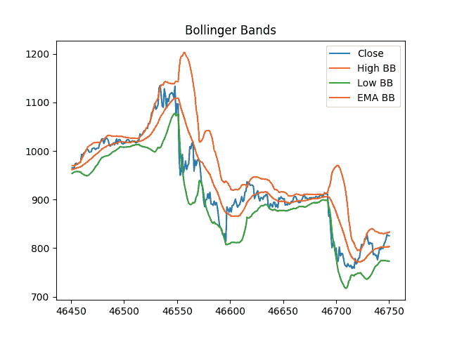
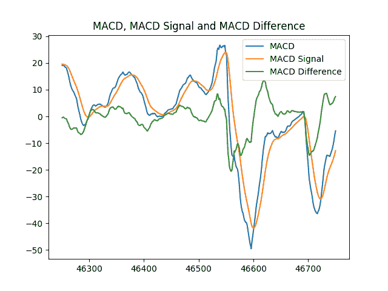

# Python Pandas 金融数据集技术分析库

> 原文：<https://towardsdatascience.com/technical-analysis-library-to-financial-datasets-with-pandas-python-4b2b390d3543?source=collection_archive---------3----------------------->

[Image[1] (Image courtesy: [https://unsplash.com](https://unsplash.com))]

在过去的几个月里，我一直在研究一些金融时间序列，如[预测比特币价格](https://github.com/bukosabino/btctrading)或[号人物](https://numer.ai/)、[两个适马投资](https://www.kaggle.com/c/two-sigma-financial-modeling)或 [G-Research](https://financialforecasting.gresearch.co.uk) 提出的不同挑战。也就是说，我们已经决定基于 *Pandas* 库用 python 开发一个技术分析库。您可以在以下位置找到该库:

 [## 布科萨比诺/ta

### ta——Python 中的技术分析库

github.com](https://github.com/bukosabino/ta) 

这个新的库面向从典型的金融数据集进行“特征工程”，这些数据集通常包括诸如“时间戳”、“开盘”、“高”、“低”、“收盘”和“成交量”等列。该库将由希望使用 Python 数据科学技术堆栈(Pandas、Scikit-Learn、XGBoost、LightGBM、Keras、TensorFlow 等)解决机器学习问题的数据科学人员使用。

目前，这些工具在预测几乎任何事情上都取得了很好的效果，但是当它们被用来面对金融问题时，就不能正常工作了。它们不能正常工作，因为数据集中的行仅包含关于特定时间段(例如 6 小时或一天)的信息，这不足以使用当前模型生成良好的预测。为了改进预测，我们需要向数据集提供更多信息(要素),因为当提供更多信息时，当前模型会获得更好的结果。

技术分析的重点是提供过去的新信息来预测价格的走向。通过增加不同变量(“数量”、“波动性”、“趋势”、“势头”等)的不同指标产生的信息，我们可以提高原始数据集的质量。

现在，我们将详细解释两个例子:

[**布林线**](http://stockcharts.com/school/doku.php?id=chart_school:technical_indicators:bollinger_bands)

布林线用于分析特定时期内资产价格的波动性。有 3 个波段，中间波段(MB)是最近 n 个周期的价格平均值，上波段(UB)和下波段(LB)等于中间波段，但加上和减去 x 倍标准差。正在使用的正常参数是 n = 20 个周期，x = 2。所以:

> MB =总和(n 个最后收盘值)/ n
> 
> UB = MB + (X *标准偏差)
> 
> LB = MB — (X *标准偏差)

Bollinger Bands example [Image[2] (Own image generated with Matplotlib)]

在库中，收盘价变量被转换为 5 个新特性。除了 3 个布林线，我们还生成了另外 2 个指标，当收盘值高于上布林线或低于下布林线时，这两个指标会显示出来。因此，这两个特征将为 0，除非收盘值超出这些范围，否则将为 1。

如果我们看一下图 2，当收盘波(蓝色)超过上波段或下波段时，价格会发生突然变化，通常在高于上波段时卖出，在低于下波段时买入是一个好主意。

[**MACD**](http://stockcharts.com/school/doku.php?id=chart_school:technical_indicators:moving_average_convergence_divergence_macd)

**均线收敛背离是一个关注指数移动平均线(EMA)的交易指标。为了计算它，我们使用:**

> **MACD =均线(n1，收盘)—均线(n2，收盘)**
> 
> **MACD 信号=均线(n3，MACD)**
> 
> **MACD _ 差异= MACD—MACD _ 信号**
> 
> **变量的典型值是 n1=12，n2=26，n3=9，但是根据你的交易风格和目标，库中也可以有其他的值。**

****

**MACD example [Image[3] (Own image generated with Matplotlib)]**

**理论告诉我们，当 MACD 曲线(蓝色)小于 MACD 信号(橙色)时，或者当 MACD 差(绿色曲线代表 MACD 信号和 MACD 曲线之间的差)的值小于 0 时，价格趋势将是熊市。反之，则表示涨价。**

**这时，图书馆已经实施了 32 项指标:**

## **卷**

*   **积累/分配指数**
*   **平衡量(OBV)**
*   **平衡体积平均值(OBV 平均值)**
*   **柴金资金流(CMF)**
*   **力指数**
*   **便于移动(EMV 选举观察团)**
*   **量价趋势(VPT)**
*   **负体积指数**

## **波动性**

*   **平均真实距离**
*   **布林线(BB)**
*   **凯尔特纳海峡**
*   **唐奇安海峡(DC)**

## **趋势**

*   **移动平均收敛发散(MACD)**
*   **平均定向运动指数**
*   **涡流指示器(六)**
*   **特里克斯(Trix)**
*   **质量指数**
*   **商品频道指数(CCI)**
*   **去趋势价格振荡器(DPO)**
*   **KST 振荡器(KST)**
*   **一目岛**

## **动力**

*   **货币流通指数**
*   **相对强度指数**
*   **真实强度指数**
*   **终极振荡器(UO)**
*   **随机振荡器**
*   **威廉姆斯%R (WR)**
*   **超棒振荡器(AO)**

## **其他人**

*   **每日退货**
*   **累积回报**

**这些指标产生了 58 个特征。开发人员可以设置许多输入参数，如窗口的大小，不同的常数或智能自动填充方法中生成的 NaN 值。**

**我们已经将该库的第一个稳定版本上传到 GitHub，可以使用“pip”安装。该库正在继续开发，所以我们将包括更多的指标，功能，文档等。请让我们知道任何评论，贡献或反馈。**

** [## 布科萨比诺/ta

### ta——Python 中的技术分析库

github.com](https://github.com/bukosabino/ta) 

此外，我是一名软件自由职业者，专注于数据科学，使用 Python 工具，如 Pandas、Scikit-Learn、Zipline 或 Catalyst。如果你需要与本库相关的东西，技术分析，Algo 交易，机器学习等，请随时联系我。**