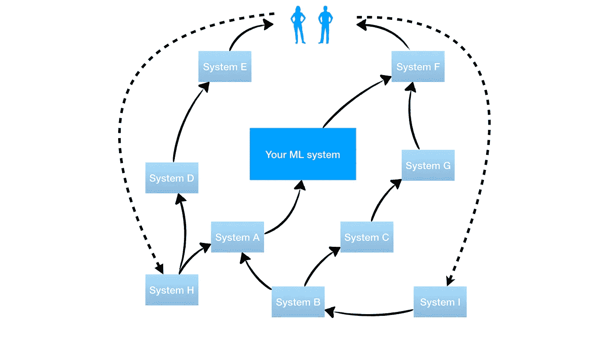
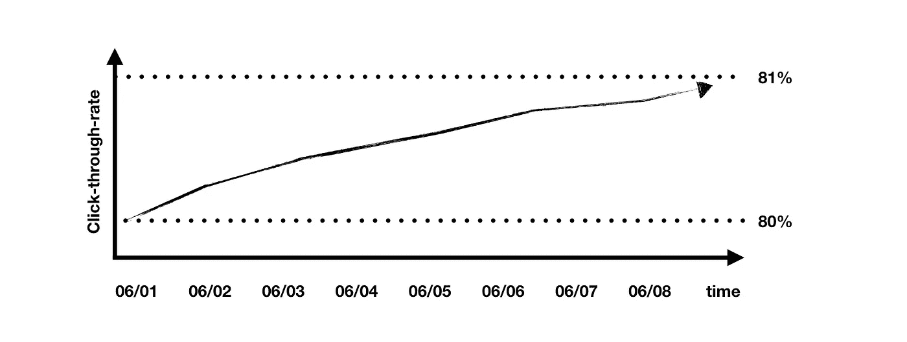
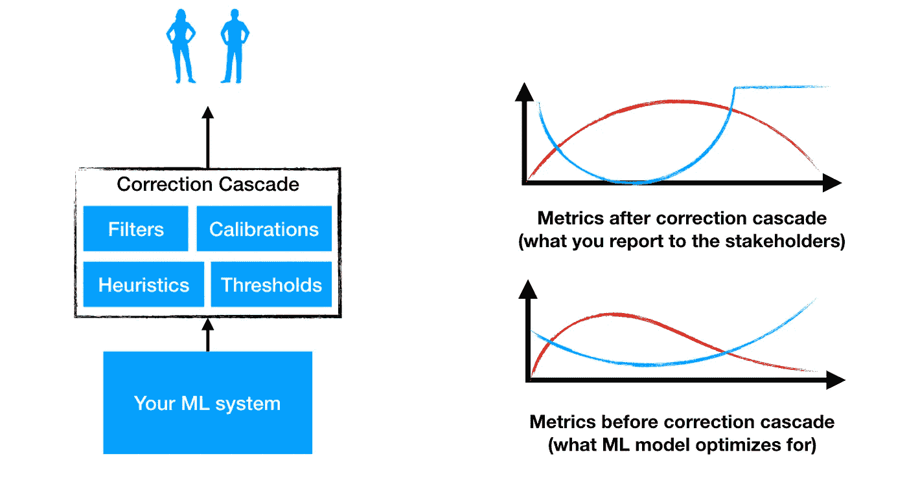

# 机器学习中的技术债务

> 原文：<https://towardsdatascience.com/technical-debt-in-machine-learning-8b0fae938657?source=collection_archive---------0----------------------->

或者如何用火箭筒打自己的脚。

我们许多人都不喜欢技术债务，但一般来说，这并不是一件坏事。技术债务是一种工具，当我们需要满足一些发布截止日期或解除同事的封锁时，它是合理的。然而，技术债务的问题与金融债务的问题是一样的——当偿还债务的时候，我们归还的比开始时多。这是因为技术债务具有复合效应。

有经验的团队知道什么时候应该支持堆积如山的债务，但是机器学习中的技术债务堆积得非常快。 **你可以在一个工作日内创造几个月的债务，即使是最有经验的团队也会错过债务如此巨大的时刻，以至于他们推迟半年，这通常足以扼杀一个快节奏的项目。**

这里有三篇探讨这个问题的精彩论文:
[机器学习:技术债的高息信用卡](https://research.google.com/pubs/pub43146.html) NIPS'14
[机器学习系统中隐藏的技术债](https://papers.nips.cc/paper/5656-hidden-technical-debt-in-machine-learning-systems.pdf) NIPS'15
[你的 ML 测试分数是多少？](https://research.google.com/pubs/pub45742.html)NIPS’16

这些论文分类并展示了几十种机器学习反模式，它们会慢慢潜入您的基础设施，成为一颗定时炸弹。在这里，我只讨论三种让我在夜里吓出一身冷汗的反模式，其余的留给读者。

# **反馈回路**

当 ML 模型的输出被间接反馈到它自己的输入中时，反馈循环就发生了。听起来像是很容易避免的事情，但实际上并不可行。反馈回路有多种变化，NIPS 的论文给出了一个很好的例子，但我将给出一个更真实的例子。

**例子**
假设你的公司有一个购物网站。一个后端团队提出了一个推荐系统，它根据客户的个人资料和过去的购买历史来决定是否显示一个带有报价的弹出通知。很自然，你想根据之前点击或忽略的弹出通知来训练你的推荐系统，这还不是一个反馈循环。当点击通知的比例一周比一周慢慢增加时，您启动了这个功能并欣喜不已。你用人工智能改善其过去性能的能力来解释这种增长:)但你不知道的是，前端团队实现了一个固定的阈值，如果推荐报价的可信度低于 50%，它会隐藏弹出通知，因为显然，他们不想向客户显示潜在的坏报价。随着时间的推移，以前在 50–60%置信度范围内的建议现在用< 50%置信度进行推断，只留下 50–100%范围内最有效的建议。这是一个反馈循环——您的度量在增长，但是系统的质量没有提高。士气:你不仅要 ***利用***ML 系统，还要允许它 ***探索***——摆脱固定的门槛。

在小公司中，控制反馈循环相对容易，但是在大公司中，几十个团队在几十个复杂的系统上工作，这些系统通过管道相互连接，一些反馈循环很可能会被遗漏。

如果您注意到一些指标随着时间慢慢上升，甚至在没有启动时，也能感觉到反馈循环。找到并修复循环是一个非常困难的问题，因为它涉及到跨团队的努力。

# **校正级联**

当 ML 模型没有学习到您希望它学习的东西，并且您最终在 ML 模型的输出上应用了一个修补程序时，就会发生校正级联。随着修补程序的堆积，你最终会在 ML 模型的顶部有一层厚厚的试探法，这被称为校正级联。即使在没有时间压力的情况下，修正级联也是非常诱人的。很容易对 ML 系统的输出应用过滤器，以便处理 ML 不想学习的一些罕见的特殊情况。

校正级联将您的 ML 模型在从整个系统的整体指标进行训练时试图优化的指标去相关。随着这一层变得越来越厚，你不再知道 ML 模型的什么变化会改进你向你的老板展示的最终度量，并且你最终不能交付新的改进。

# **垃圾特征**

垃圾特性是指在你的 ML 系统中没有任何用处的特性，你无法摆脱它们。有三种类型的垃圾特征:

**捆绑特性** 有时，当我们有一组新特性时，你会一起评估它们，如果发现有益，就提交整个捆绑包。不幸的是，捆绑包中只有一些功能是有用的，而其他功能正在拖累它。

**ε-特性** 有时添加一个特性是很诱人的，即使质量增加很少。然而，如果基础数据有一点漂移，这些特征可能会在一周内变得中性或负面。

随着时间的推移，我们向项目中添加新的特性，并且不再重新评估它们。几个月后，其中一些功能可能会变得完全无用或被新功能取代。

在复杂的 ML 系统中，有效清除垃圾特征的唯一方法是尝试一次修剪一个。也就是说，您一次删除一个特性，训练 ML 系统，并使用您的度量标准评估它。如果系统需要 1 天来训练，我们一次最多可以运行 5 次训练，我们有 500 个功能，那么修剪所有功能将需要 100 天。不幸的是，特征可能会相互作用，这意味着您必须尝试修剪所有可能的特征子集，这成为一个指数级的难题。

# 凭借我们的力量

在你的机器学习基础设施中拥有这三种反模式可能会毁掉整个项目。

有了反馈循环，你的度量将不能反映系统的真实质量，你的 ML 模型将学习利用这些反馈循环，而不是学习有用的东西。此外，随着时间的推移，您的模型可能会被工程团队无意中塑造成更多地利用这些循环。

校正级联将放松在 ML 模型上直接测量的指标和作为整体的系统之间的相关性。您将最终处于这样一种情况，对 ML 模型的积极改进会对整个系统的度量产生随机的影响。

有了垃圾特征，你甚至不知道你的数百个特征中的哪一个实际上携带了有用的信息，并且删除它们的代价太大了。每天，您通常监控的指标会随机上升或下降，因为一些垃圾特性会随机出现。不，正规化只会有一点点帮助。

您最终得到的项目中，度量标准随机上下跳动，不能反映实际的质量，并且您不能改进它们。唯一的出路就是从头开始重写整个项目。这时你就知道了——你用火箭筒打中了自己的脚。