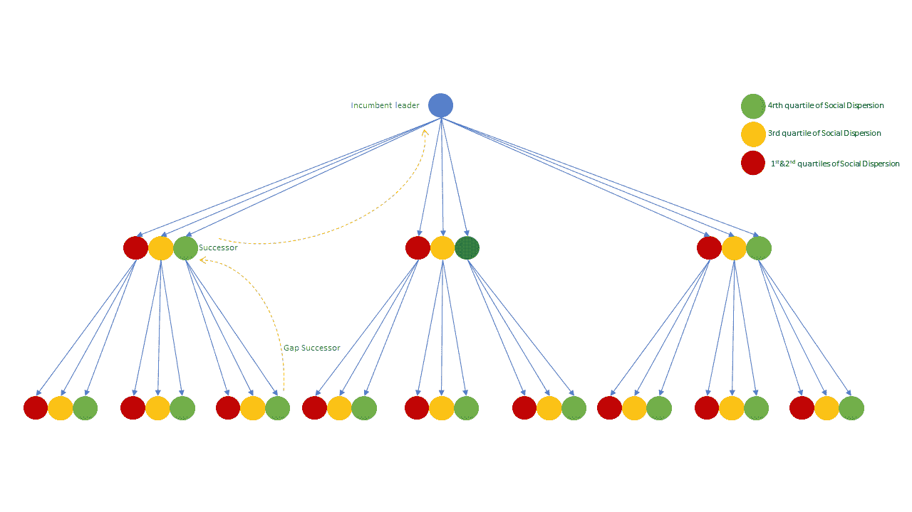
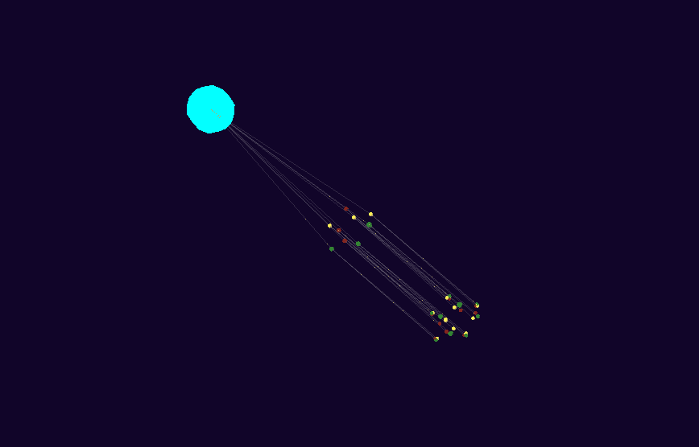

# 基于电子邮件网络的见解的技术概述

> 原文：<https://towardsdatascience.com/technical-overview-of-e-mail-network-based-insights-376a2ef73c1c?source=collection_archive---------17----------------------->


unsplash.com

*组织网络分析和沟通内容分析系列文章*

这是[第 1 部分](https://medium.com/@agronfazliu/how-to-use-corporate-e-mail-analysis-to-reveal-hidden-stars-and-ensure-equal-opportunities-90bb77d61a7f)文章的后续，其中我们提到了一些我们想要解决的关键难点。

在这里，我们深入探讨两个最有趣的观点:

*   内部继任计划
*   如果员工离职怎么办

**内部继任规划**

内部候选人被提拔为接班人是常有的事。内部晋升往往基于与离职领导和周围影响群体的绩效和社会关系，而没有数据驱动的分析。今天的系统在继任规划方面做得并不理想，因为它们有偏见，没有考虑到数据驱动的网络和关系(ONA)。

在我们的方法中，除了领导者-继任者沟通，我们还关注间接涉及其他因素和混杂因素的整体社会状态。我们借用了脸书提出的社会分散的概念。除其他外，该条指出:

> *一个人的网络邻居——与他或她有联系的一群人——已经被证明在广泛的环境中具有重要的影响，包括社会支持和职业机会。*

“包括社会支持和职业机会”这句话是探讨继任规划方面的重要基础，此外还有共同的朋友交流范式。这种方法的缺点是不容易对外部候选人进行这种分析，因为离职的领导者在另一个通信领域，因此几乎不可能进行基于电子邮件网络的分析。

> *我们的实施可以向即将离任的领导者推荐几个潜在的内部继任者。*

这是通过了解继任者的网络是否也在与领导者的网络通信来实现的。可以推断，高度分散是成功的内部继任规划的良好基础。这意味着继任者的网络与领导者的网络高度互联。显然，即将离任的领导人在确定继任者时会考虑其他因素，也许不是很数据驱动，而是基于直觉。我们的方法实际上是一个推荐器，而不是绝对匹配。

然而，如果继任者得到提升，她很可能会在组织中留下一个角色空缺。因此，我们更进了一步，我们提供了更进一步的接班人。下图更详细地解释了这个概念。



为了实现这一点，我们使用了基于电子邮件网络的“发件人”和“收件人”字段，不涉及任何内容(在稍后阶段，我们将利用时间戳来解决关系衰退)。该数据集包含 8000 名员工和 25 万封电子邮件。在技术和算法方面，我们使用了 Python 包，如: [NetworkX](https://networkx.github.io) 、[熊猫](https://pandas.pydata.org)、 [NumPy](http://www.numpy.org) 。以下代码片段是内部继任计划算法实施的关键部分:

```
df = pd.DataFrame(data, columns = ['Sender','Recipient'])
G = nx.from_pandas_edgelist(df, source = 'Sender', target = 'Recipient', create_using = nx.DiGraph())
dis = nx.dispersion(G, normalized = True)
```

对于我们的观众，我们实现了一个 3D 网络可视化，如下所示。但是，产品实现是基于 API 即服务的。

(注意姓名不代表我们的员工)



**如果员工离职怎么办**

一旦员工不再担任相同的角色，了解沟通风险是企业运营的关键。这一特性对直线经理特别有用，他们需要在整个变革过程中保持正常的沟通和劳动力。高中间中心性意味着更高的员工替换成本。如果一个员工有很高的关系网，并作为沟通的桥梁，介绍一个新的候选人担任这样的角色需要花费时间和金钱。

中间中心性被定义为节点“I”需要节点“k”(其中心性正在被测量)以通过最短路径到达节点“j”的时间份额。我们实现的研究基础来自研究论文[中心性和网络流](https://pdfs.semanticscholar.org/de44/bd07d4cacbbd7950ee873512a5313704765d.pdf)。

该算法的核心实现片段如下所示:

```
def betweenness_centrality_chunks(l, n):
    l_c = iter(l)
    while 1:
        x = tuple(itertools.islice(l_c, n))
        if not x:
            return
        yield x
def _betweenness_centrality_map(G_normalized_weight_sources_tuple):
    return nx.betweenness_centrality_source(*G_normalized_weight_sources_tuple)
def betweenness_centrality_parallel(G, processes=None):
    p = Pool(processes=processes)
    node_divisor = len(p._pool)
    node_chunks = list(betweenness_centrality_chunks(G.nodes(), int(G.order() / node_divisor)))
    num_chunks = len(node_chunks)
    bt_sc = p.map(_betweenness_centrality_map,
                  zip([G] * num_chunks,
                      [True] * num_chunks,
                      [None] * num_chunks,
                      node_chunks))
    bt_c = bt_sc[0]
    for bt in bt_sc[1:]:
        for n in bt:
            bt_c[n] += bt[n]
    return bt_c
    btwn_cent = betweenness_centrality_parallel(G)
```

同样，对于展示案例，我们已经实现了 3D 网络可视化。


有许多与员工离职概率相关的实现，如风险逃离、员工流失等。这些方法大多基于机器学习和对类似情况的分析，例如 k-means 聚类。我们的方法与众不同，因为它使用 ONA 指标来得出与实际员工更相关的结论，而不是从其他案例中学习。更好的方法是将 ONA 和机器学习的指标进行加权组合，我们正在研究这种方法。

________________________________________________________________

大多数公司通过书面的官方流程来解决这些问题。这不会让这些公司为未来做好准备，因为流程是静态的，很难更新，不容易获得，也不能动态地反映不断变化的事件。我们想通过引入动态方法来改变这种情况。这种方法不依赖于书面文件，而是依赖于当前的信息流、背景、趋势、沟通和实际的员工数据——基本上是一种 [VUCA](https://en.wikipedia.org/wiki/Volatility,_uncertainty,_complexity_and_ambiguity) 反应。

我们的进一步发展进入机器学习、异常检测和时间序列分析的方向。

# 本文是 ONA @豪夫系列文章的一部分

________________________________________________________________

1.  如何使用企业电子邮件分析来揭示隐藏的明星并确保机会均等([第一部分](https://medium.com/@agronfazliu/how-to-use-corporate-e-mail-analysis-to-reveal-hidden-stars-and-ensure-equal-opportunities-90bb77d61a7f)
2.  **电子邮件网络见解技术概述(** [**第二部分**](https://medium.com/@agronfazliu/technical-overview-of-e-mail-network-based-insights-376a2ef73c1c) **)**
3.  深入探讨基于电子邮件网络的推荐([第 3 部分](https://www.linkedin.com/post/edit/deep-dive-e-mail-network-based-recommendations-agron-fazliu))
4.  如何利用趋势发现隐藏的明星，并致力于一个完美的项目？人物分析会让你成为明星
5.  如何实现基于电子邮件内容的分析([第 5 部分](https://www.linkedin.com/pulse/how-implement-email-content-based-analysis-alex-filip))

________________________________________________________________