# TED 演讲分析—面向初学者的 EDA

> 原文：<https://towardsdatascience.com/ted-talks-analysis-eda-for-beginners-df346bc431a6?source=collection_archive---------5----------------------->


Google — TED Talks

Ted 演讲是一个了不起的创举。很多人，你通过他们的工作和成就了解他们，但从来不知道他们的奋斗，他们对生活的看法，但通过 Ted 演讲，你可以了解所有这些。很多杂志也刊登采访，但是听他们的故事和他们自己的观点是完全不同的。很多时候，人们建议我应该听听 Ted 演讲，就像有一次我的一个朋友建议我听听马尔科姆·格拉德威尔。

我一直相信人们的选择，相信我认识的人，坦率地说，我甚至不喜欢一些 ted 演讲。这让我想到，我想成为一名数据科学家，也许我应该更多地依赖数据，从更多的人口中获得观点。

## 介绍

为了实现分析数据的愿望，我从 [Kaggle](https://www.kaggle.com/rounakbanik/ted-talks/data) 下载了 Ted 演讲数据。在本帖中，我们将使用这个数据集，并尝试找出 ted 演讲中的顶级演讲者，以及关于什么时候 Ted 演讲进行得最多的一些想法。

在我们开始代码和探索部分之前，作为初学者，理解 EDA 是什么以及它为什么重要是非常重要的。

**EDA(探索性数据分析)-**

维基百科定义

> 在统计学中，**探索性数据分析** ( **EDA** )是一种分析数据集以总结其主要特征的方法，通常采用可视化方法。探索性数据分析是由约翰·图基倡导的，目的是鼓励统计学家探索数据，并可能提出可能导致新的数据收集和实验的假设。

EDA 有助于鸟瞰数据，我们可以尝试理解它。在数据分析中，它是第一步，是在我们应用任何统计技术之前实现的。人们使用一些特定的统计技术，如直方图或箱线图，但 EDA 不是一套技术或程序，也不限于一两种图或技术。EDA 是关于理解数据的，在开始对数据建模之前获得关于数据的见解是很重要的。

让我们举一个非常简单的现实生活中的例子，当你去购物时，在购买任何东西之前，你会在商店里闲逛，探索哪些东西最适合你或者哪些更便宜。价格、品牌、布料质量、尺寸等等，这些都是特点或特征，如果你不去探索这些特征，你可能最终会买一些你不喜欢的东西。

希望这有意义。让我们开始探索我们的数据。该数据集包含截至 2017 年 9 月 21 日上传到 TED.com 官方网站的所有 TED 演讲音频视频记录的信息。所有谈话，包括观点数量，评论数量，描述，发言者和标题。

```
ted_data = pd.read_csv("ted_main.csv")
ted_data.head()
```

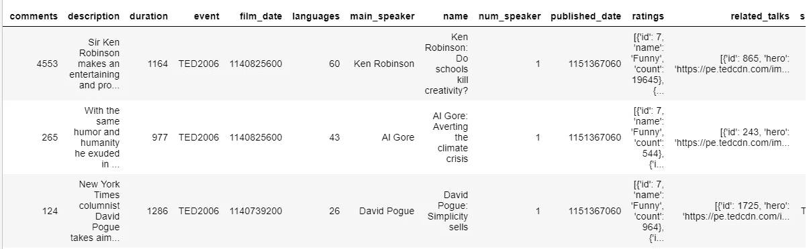

Ted Dataset Snapshot

从快照中我们可以看到，日期是 Unix 时间戳格式，name 列包含 name + title。看起来是时候清理数据了。

## 数据准备:清理和格式化

在数据项目管道中，这一步占用了数据科学家的大部分时间。因此，在开始我们的数据分析和探索之前，让我们试着找出我们的数据集是否需要一些清理和格式化。

从寻找任何丢失的值开始-

```
# Let's have a look how many values are missing.
ted_data.isnull().sum()
```

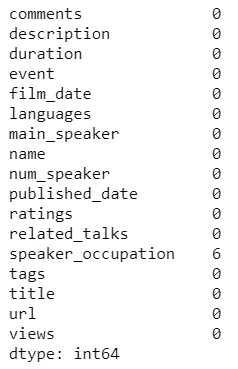

Missing value analysis

我们很幸运，没有丢失值(可以忽略扬声器职业，只有 6 个丢失)。让我们看看数据集结构的内部

```
#identify Object/Categorical values and Continuous values
ted_data.dtypes
```

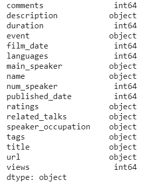

Structure of dataset

这里的 name 列不包含任何数据分析所需的值。所以，我们将放弃这个专栏—

```
#Drop the name column
ted_data = ted_data.drop(['name'], axis = 1)
ted_data.columns
```

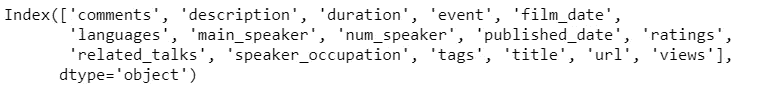

Ted Talk Column Data

我们还需要转换日期列值，以便在进一步的分析中更好地理解数据。日期列包含 Unix 时间戳格式的值，我们将把它转换成日期时间格式。

```
from datetime import datetime
def convert(x):
    return pd.to_datetime(x,unit='s')ted_data['film_date'] = ted_data['film_date'].apply(convert)
ted_data['published_date'] = ted_data['published_date'].apply(convert)
ted_data.head()
```

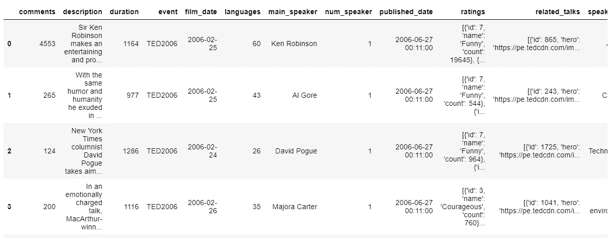

Formatted Data

一些列包含字典和列表格式的数据。我们还不会查看这些列。但是我们还不会查看这些专栏，因为我们的目标是找出最受欢迎的演讲者，以及什么时候演讲发表得最多。

## 数据探索

***1。热门演讲人***

数据集中有一个持续时间列。让我们找出谁比其他演讲者讲的时间更长。

```
#Lets see who talked a lot - top 20
import seaborn as sns
ax = sns.barplot(x="duration", y="main_speaker", data=ted_data.sort_values('duration', ascending=False)[:20])
```

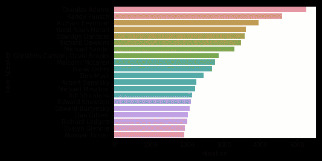

Speaker vs duration — who talked the most

以上情节表明，道格拉斯·亚当斯谈了很长时间。很多人不喜欢看较长的视频，除非它非常有趣。让我们看看这个演讲者有多少观点。

```
#Let's see which video got the most views
ax = sns.barplot(x="views", y="main_speaker", data=ted_data.sort_values('views', ascending=False)[:20])
```

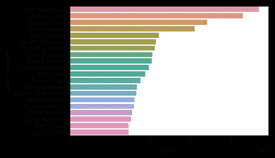

Speaker vs views

在上面的图中，我们可以看到道格拉斯·亚当不在这里，但是很多名字都在这里。视图和时长有关系吗？有可能，我们来看看。

首先，我们将检查数据的分布，然后查看视图和持续时间是否相关/相关。

```
#let's see the distribution of views
sns.distplot(ted_data[ted_data['views'] < 0.4e7]['views'])#let's see the distribution of duration
sns.distplot(ted_data[ted_data['duration'] < 0.4e7]['duration'])
```

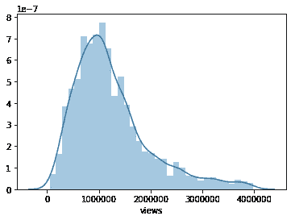

Views data distribution

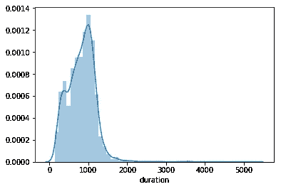

Duration data distribution

我们来看看它们有没有关联？

```
ax = sns.jointplot(x='views', y='duration', data=ted_data)
```

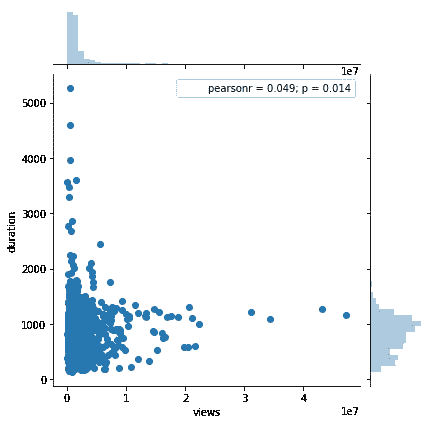

View v/s duration

看来我们错了。与长短和持续时间没有关系。看看 p 值，相当低。

有评论栏，最受欢迎的视频可能会得到更多的讨论。但是在找到热门演讲人和他/她的视频之前，我们先看看评论和观点有没有关系？

```
sns.jointplot(x='views', y='comments', data=ted_data)
```

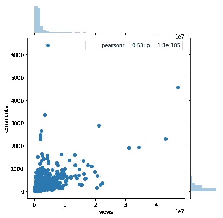

Views vs Comments

看上面的情节和 p 值，说明观点和评论有很强的关系。流行的视频往往有更多的讨论。

现在我们知道评论和观点使得 ted 演讲上的任何视频都很受欢迎。所以，让我们来看看谁是最受欢迎的演讲者。

```
ted_data[['title', 'main_speaker','views', 'comments', 'duration']].sort_values('comments', ascending=False).head(10)
```

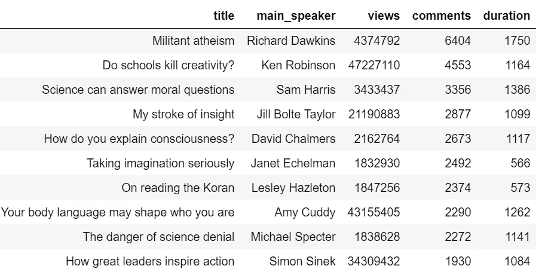

Top 10 speaker(According to discussion on their talk)

看来我要去看理查德·道金斯的无神论演讲了。

**2*。月—脱口秀主持人最多的***

现在我们想知道哪个月举办的 Ted 演讲最多。我们有 film_date 专栏，但我们没有每月组织一次讲座。我们可以很容易地获得这些信息，只需计算电影日期月份的条目数。

```
talk_month = pd.DataFrame(ted_data['film_date'].map(lambda x: x.month).value_counts()).reset_index()
talk_month.columns = ['month', 'talks']
talk_month.head()
```

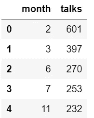

Number of talks organized by months

不是很好，是吗？让我们将数据可视化。

```
sns.barplot(x='month', y='talks', data=talk_month)
```

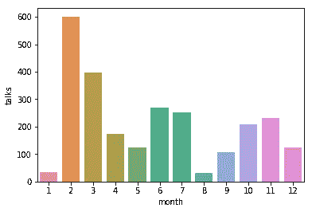

Number of Ted talks in each month

看起来二月是举办 ted 演讲的最佳月份。所以，明年二月，我会准备好倾听人们的心声。虽然，我们可以根据年份进一步划分数据，但在这篇文章中我们不会涉及太多细节。

## **总结**

正如我们从这篇文章中看到的，数据科学家甚至可以在应用复杂的机器学习算法之前对数据做些什么。EDA 是数据科学项目管道的重要组成部分，也是我认为最复杂和耗时的部分。在对数据做出决定之前，应该花时间去理解和探索数据。很多公司有时会问一些关于数据的问题，他们问的不是结果或最终产品，而是洞察力，或者我应该说是数据的故事。

## 参考

1.  [Kaggle 数据集](https://www.kaggle.com/rounakbanik/ted-talks/data)
2.  [GitHub 回购](https://github.com/SharmaNatasha/Machine-Learning-using-Python/blob/master/Ted_Talks_EDA.ipynb)
3.  [EDA](http://www.statisticshowto.com/exploratory-data-analysis/)
4.  [约翰·土耳其的书](https://www.amazon.com/Exploratory-Data-Analysis-John-Tukey/dp/0201076160)