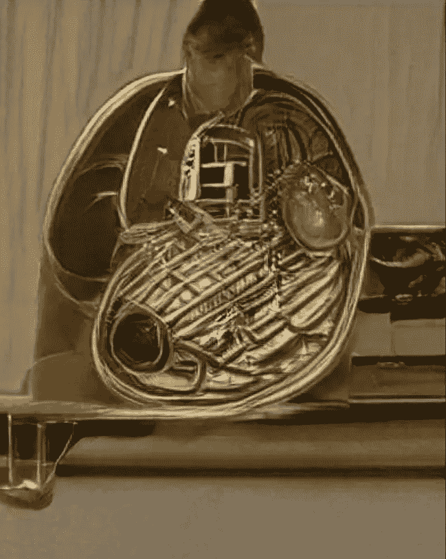
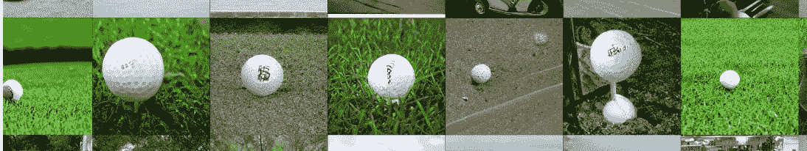

# 区分人工智能和人类#2:照片与 GAN 生成的图像

> 原文：<https://towardsdatascience.com/telling-apart-ai-and-humans-2-photo-vs-gan-generated-image-c20e09e69554?source=collection_archive---------15----------------------->

如果你错过了这个系列的第一集，人类对机器人在这里。

受生成性对抗网络(GAN)的推动，一年前我在推特上发了一条关于区分相机拍摄的图片和生成的图片的帖子。这里是该线程的更新版本。我的一些建议仍然适用。谁知道会持续多久？趁热吃吧。

自第一篇 GAN 论文发表以来的几年中，已经有了许多进展，导致了越来越好的“假”图像。GANs 是在成千上万张真实图片上训练的神经网络，目的是产生完全虚构但看起来像真实图片的图像。

# 不完全是人类。

我们的贝恩斯特别擅长识别人脸，这是你最有机会发现一个甘的类别。请记住，下一次播放紧张的音乐时，你必须选择哪个是你最好的朋友，哪个是邪恶的替身。

寻找透视问题:眼睛看向不同的方向，眼睛向前看，但脸转向一侧，或者在这种情况下，毕加索对称性:我们不应该看到那个人的左耳…

化妆的女性有时更容易发现对称问题。只有一只眼睛画了眼影，眉毛的形状也各不相同……当然，下面的女性有更紧迫的问题，但她们也有非常原始的妆容——一只熊猫眼，一条缺失的眉毛，不同颜色的眼睑↓

即使是最新的 GANs 仍然很难处理这些问题。

# 可疑的模糊。

旧的网络往往在帧的四个角有强烈的失真，导致奇怪的模糊世界。对于较新的网络来说，这不是问题，但模糊性以不同的方式表现出来:GANs 最典型的特征，即从一个图像平滑地变换到另一个图像的能力，也是它们的弱点。

暂停在上面 gif 的任何地方。你能说出脸和头发从哪里开始，到哪里结束吗？通常他们只是融入到另一个人的头发或脸上。跟随物体的轮廓，检查是否一切都像它应该的那样清晰，如果部分没有融入其他部分。

有时是…一些不同的东西。

Oh no

[Oh no!](https://arxiv.org/abs/1809.11096)

# 外星剧本。

詹妮尔·谢恩[说对了](https://tmblr.co/ZP7VLs2cMaGfq)，甘斯不会写。他们得到了文字在标签上，数字在钟面上的概念，但有些东西不太对。下面的图片来自与上面相同的[论文](https://arxiv.org/abs/1809.11096)。

The price of gas will drive you nuts

My favorite brand of not-quite-round golf balls.

# 无关的一切。

甘斯不会数数。最多两个就可以了:两只眼睛，两只手…除此之外，所有的赌注都取消了！

这个帖子很棒，我邀请你阅读每一条推文。

# 高分辨率图像。

这一点源于一个非常基本的事实:在计算机上运行 GAN 算法是一件痛苦的事情。它们需要特定的硬件，并且需要几天时间在数据集上进行训练。他们天生贪吃计算时间和资源，因此通常被训练生成小的、低分辨率的图像。如果图像小而模糊，也更容易蒙骗人眼。如果你觉得活泼，常见的尺寸从 64x64 到 256x256 像素不等；有时更多一点。

— —

我希望你对识别假货感觉好些——在大多数情况下，photoshop 仍然比 GANs 更令人担忧。但是甘更有趣！这只蜘蛛同意了。