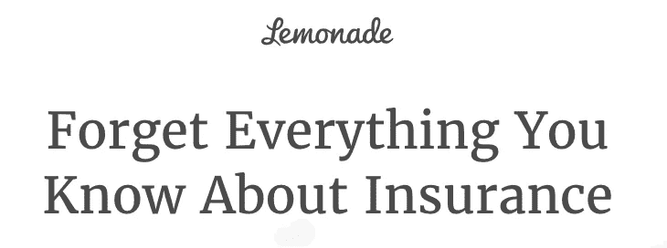

# 人工智能在金融科技中的十大应用

> 原文：<https://towardsdatascience.com/ten-applications-of-ai-to-fintech-22d626c2fdac?source=collection_archive---------2----------------------->

几周前，我作为 [Swish](http://www.swishlabs.com) 的机器学习负责人，参加了 [Fintech 论坛](http://www.fintechmontreal.com/events/2018-canada-fintech-forum/event-summary-3513f8ea87504c628ded8bf0a83f7330.aspx)(蒙特利尔)。

在两场讲座和精彩的讨论之间，我举办了一场研讨会，讨论人工智能在金融科技行业的应用。

如果你参加了研讨会并想要更多，下面是一个更长的版本，有例子和技术解释。如果你没有机会参加这个研讨会，这个分析将为你提供你应该知道的关于金融行业人工智能的一切。

# Fintech？

金融业以极大的兴趣关注着技术进步。摩根大通等大银行是区块链等颠覆性技术的早期采用者。

人工智能(AI)是一种范式转换技术，它正在无缝改变我们的生活、移动、互动和购物方式。金融也不例外，行业才刚刚开始见顶的冰山一角。

金融科技(Fin-tech)是对金融行业尖端技术使用案例的称呼。

在本文中，我们将介绍人工智能的十个应用，以及这项技术的一个细分领域，即金融科技中的机器学习。

# 个人金融和保险人工智能

# #1.数字金融蔻驰/顾问

交易型机器人是人工智能中最受欢迎的用例之一，可能是因为应用的范围如此广泛——跨越所有行业，在几个层面上。

**在金融领域，交易机器人可以用来为用户提供金融辅导/建议服务。**

把它们想象成帮助用户管理财务计划、储蓄和消费的数字助手。这种服务增加了用户参与度，并改善了用户对他们正在交互的金融产品的整体体验。

数字助理可以使用**自然语言处理** (NLP)来构建，这是一种机器学习模型，可以处理人类语言格式的数据。可以添加产品推荐模型层，允许助理基于算法和人类用户之间发生的交易来推荐产品/服务。

Sun Life 已经部署了这种应用程序的一个例子，它创建了一个虚拟助理 Ella T1，通过允许用户掌握自己的保险计划来帮助他们获得福利和养老金。该助理根据用户数据向用户发送提醒，如“健康福利即将到期”或“您的孩子将很快失去福利”

数字助理还可以用于其他与金融相关的场景:股息管理、定期寿险续期、交易限额临近或支票兑现通知。

# #2.交易搜索和可视化

**聊天机器人也可以用于银行业，专注于搜索任务。**

管理人员向 bot 提供对用户交易数据(银行交易)的访问，它使用 NLP 来检测用户发送的请求的含义(搜索查询)。请求可能涉及余额查询、消费习惯、一般账户信息等等。然后，机器人处理请求并显示结果。

美国银行使用这样一个机器人(名为[艾丽卡](https://promo.bankofamerica.com/erica/))作为他们客户群的数字金融助理。人工智能机器人很快被采用——三个月内有一百万用户。

该机器人提供用户友好的交易搜索，使用户能够在他们的历史数据中搜索与特定商家的特定交易，避免他们在每个银行对账单中查找这些交易的麻烦。该机器人还计算信用和债务总额，这是一项用户必须自己在计算器上完成的任务。

# #3.客户风险概况

银行和保险公司工作的一个关键部分是根据客户的风险评分对他们进行分析。

**人工智能是一个很好的工具，因为它可以根据客户的风险状况从低到高自动对客户进行分类。**

在分类工作的基础上，顾问可以决定为每个风险状况关联金融产品，并以自动化的方式向客户提供这些产品([产品推荐](https://medium.com/swishlabs/8-use-cases-of-machine-learning-technology-for-offline-and-online-retailers-c772487467b3))。

对于此用例，分类模型，如 **XGBoost** 或**人工神经网络** (ANN)根据历史客户数据和顾问提供的预标记数据进行训练，这消除了数据引起的偏差。

# #4.核保、定价和信用风险评估

保险公司提供承保服务，主要是贷款和投资。

**人工智能驱动的模型可以对客户的信用风险进行即时评估，然后让顾问制定最适合的报价。**

将 AI 用于承保服务提高了提案的效率，并改善了客户体验，因为它加快了此类操作的流程和周转时间。

加拿大金融服务集团宏利是该国第一家将人工智能用于承保服务的公司，这使得[“许多加拿大人可以更快地购买基本人寿保险，这是解决加拿大‘保障缺口’的关键。”](http://manulife.force.com/Master-Article-Detail?content_id=a0Qf200000Jq4krEAB&ocmsLang=en_US)

保险公司使用一种特定的 AI，**人工智能决策算法** (AIDA)，该算法根据以前的承保方法&支出进行训练，可以有不同的分类过程，如大额损失支出或价格。

这种方法的应用不限于保险业；它也可以用于贷款的信用评分。

# #5.自动化索赔流程

众所周知，保险业按照一个标准流程运作:客户购买保险，并为此付费。如果客户遇到问题(健康保险中的疾病、汽车保险中的车祸、房屋保险中的水损坏)，她需要通过提交索赔来激活她的保险范围。这个过程通常是漫长而复杂的。

**事务型机器人可以将用户体验转化为更愉快的过程。**

随着图像识别、欺诈检测和支出预测的增强，整个用户之旅得到了升级-更少的摩擦、更少的公司成本、更少的运营任务(呼叫、背景调查)以及更少的错误。整个过程花费的时间更少，对客户和保险公司员工来说都是无缝体验。

机器人所做的是负责整个周期:它以对话的形式一步一步地引导客户完成整个过程。

Swishbot, a transactional bot we built from scratch, can be used by an insurer for their customers

它要求视频或照片的损害，并上传到数据库。它包含处理索赔所需的所有信息。然后，该机器人可以通过欺诈检测方法运行应用程序，寻找异常和不符合要求的数据。

然后进入调整模型，提供一系列的支出值。一旦设置好所有数据，就可以出于审计目的进行人工干预。机器人可以在这一点上计算和建议支出金额，基于支出预测模型，它已经被训练。

这个应用程序是一个三合一的机器学习解决方案，有可能缓解行业中的一个高痛点。

这是纽约一家保险初创公司 Lemonade 的使命。在他们网站的主页上，他们要求用户“忘记你对保险的了解”，明确宣布他们通过使用人工智能给该行业带来的颠覆。[该公司自 2015 年成立以来已筹集 1.8 亿美元。](https://www.crunchbase.com/organization/lemonade#section-overview)

To be able to start fresh, one has to forget

*在* [*这篇分析*](https://medium.com/swishlabs/tech-for-insurance-how-machine-learning-can-upgrade-the-insurance-industry-97a578ed74f8) *中阅读更多关于 AI 在保险行业的应用。*

# 跨行业

# #6.合同分析器

**在金融行业，合同分析是一项重复性的内部任务。经理和顾问可以将这一日常任务委托给机器学习模型。**

**光学字符识别** (OCR)可用于数字化硬拷贝文件。然后，具有分层业务逻辑的 NLP 模型可以高速解释、记录和修正合同。

业务逻辑是一种条件格式，类似于 Microsoft Excel 中的格式。可以将公式添加到模型中，例如“如果选中了此框，则此框应该为空。”该模型可以在现有合同上进行训练，并学习如何处理这些内容。

**在这种情况下，由于合同的重复性，模型结果的准确性非常高。**

JP 摩根已经利用了这种人工智能应用的力量，仅在几秒钟内就将员工的工作量从 360，000 小时(每年)中解放出来[。](https://futurism.com/an-ai-completed-360000-hours-of-finance-work-in-just-seconds)

这些解决方案支持与合同相关的分析，而总部位于区块链的智能合同(smart contracts)正在被更广泛地采用，它是对合同管理的一种范式转换升级。

# #7.流失预测

流失率是所有行业和企业的关键 KPI。公司需要留住客户，要做到这一点，预测即将到来的客户流失对采取预防措施非常有帮助。

AI 可以通过提供一份显示出考虑取消保单迹象的优先客户名单来支持经理完成这一使命。然后，经理可以相应地处理这个列表:提供更高程度的服务或改进的产品。

在这种情况下，模型是基于客户行为数据的流失效应的解释变量。Explainer 变量可以是报表被下载的次数、用户阅读账户政策的发生、对时事通讯和邮件的退订以及流失行为的其他指标。通过处理消费者数据，银行可以通过采用他们的产品和定价来更好地为他们服务。

所使用的模型是一个分类模型，该模型根据已经取消其保单的客户和在考虑离开该机构后仍然保留的其他客户的历史数据进行训练。

一篇关于银行业客户流失预测的[研究论文](https://www.researchgate.net/profile/Sami_Nousiainen/publication/47749836_Customer_churn_prediction_-_A_case_study_in_retail_banking/links/0deec51879c7040292000000/Customer-churn-prediction-A-case-study-in-retail-banking.pdf#page=21)显示了消费者研究相对于大众营销在这一特定行业中的重要性:

> 大众营销方法不能在今天多样化的消费者业务中取得成功。客户价值分析和客户流失预测将有助于营销计划瞄准更具体的客户群体。

# #8.算法交易——你永远不会看到的最先进的 ML。

算法交易的大多数应用都是在投资银行或对冲基金的闭门造车中进行的。

**交易通常是为了快速分析数据和做出决策。机器学习算法擅长分析数据，无论其大小和密度如何。**

唯一的先决条件是有足够的数据来训练模型，这是交易所拥有的丰富数据(市场数据，当前的和历史的)。

该算法检测通常难以被人类发现的模式，它比人类交易者反应更快，并且它可以根据从数据中获得的洞察力自动执行交易。

这种模型可以被寻求基于快速价格运动的短期交易的做市商使用。这种操作是时间敏感的，模型提供了所需的速度。

这方面的一个例子是交易个股与标准普尔 500 指数的价格变动，这是一个已知的领先指标(即股票跟随指数)。该算法从指数中提取价格变动，并预测个股的相应变动(例如:苹果)。然后立即买入(或卖出)股票，并在预测水平下限价单，希望股票达到该价格。

# #9.增强的研究工具

在投资金融领域，很大一部分时间花在了研究上。新的机器学习模型增加了给定交易想法的可用数据。

**情绪分析**可用于对公司和管理者的尽职调查。它允许分析师浏览大量文本数据(如新闻或金融评论)的语气/情绪。它还能让你深入了解经理如何反映他们的公司业绩。

**卫星图像识别**可以让研究人员洞察许多实时数据点。例如，特定位置的停车场交通(例如，零售店)或海洋中的货船交通。从这些数据中，模型和分析师可以获得业务洞察力，如在上述零售商的特定商店购物的频率、运输流量、路线等。

先进的 NLP 技术可以帮助研究人员快速分析公司的财务报告。抽出公司最感兴趣的关键话题。

其他数据科学技术也可以格式化和标准化财务报表。

# #10.估价模型

估价模型通常是投资和银行业务的一般应用。

**该模型可以使用资产周围的数据点和历史实例快速计算资产的估值。**这些数据点是人类用来评估资产的(例如:一幅画的创作者)，但是模型通过使用历史数据来学习将哪些权重分配给每个数据点。

该模型传统上用于房地产领域，可以根据以前的销售交易对算法进行训练。对于金融公司，它可以使用财务分析数据点、市场倍数、经济指标、增长预测；都是为了预测公司/资产的价值。

此类模型被投资银行团队用作内部工具。

这是人工智能在金融科技领域的应用综述。这项技术每天都在发展，而且这个列表还会继续扩大。目前，采用人工智能的金融公司将改善其运营、营销、销售、客户体验、收入和交易质量。

**如果你想阅读更多关于我从事的机器学习和人工智能项目的信息，可以看看**[**Swish Labs**](http://www.medium.com/swishlabs)**的故事。**

*作者科尔宾·哈德森，原载于*[【www.swishlabs.com】T21](http://www.swishlabs.com)