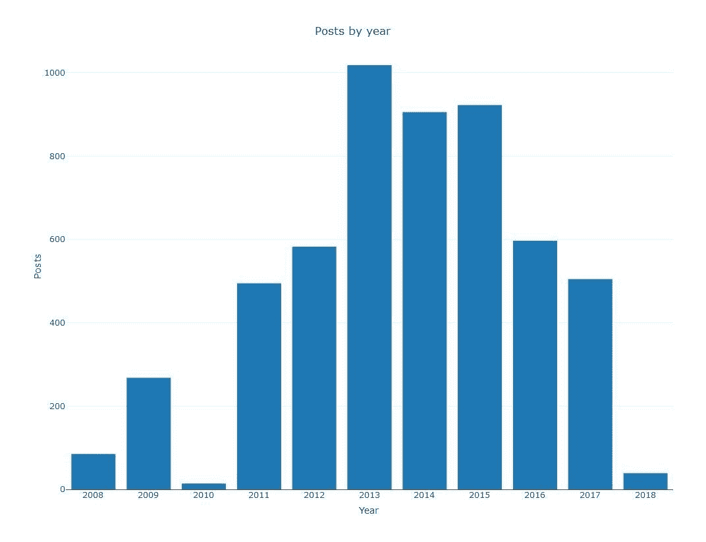
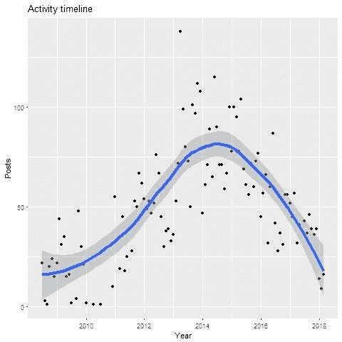
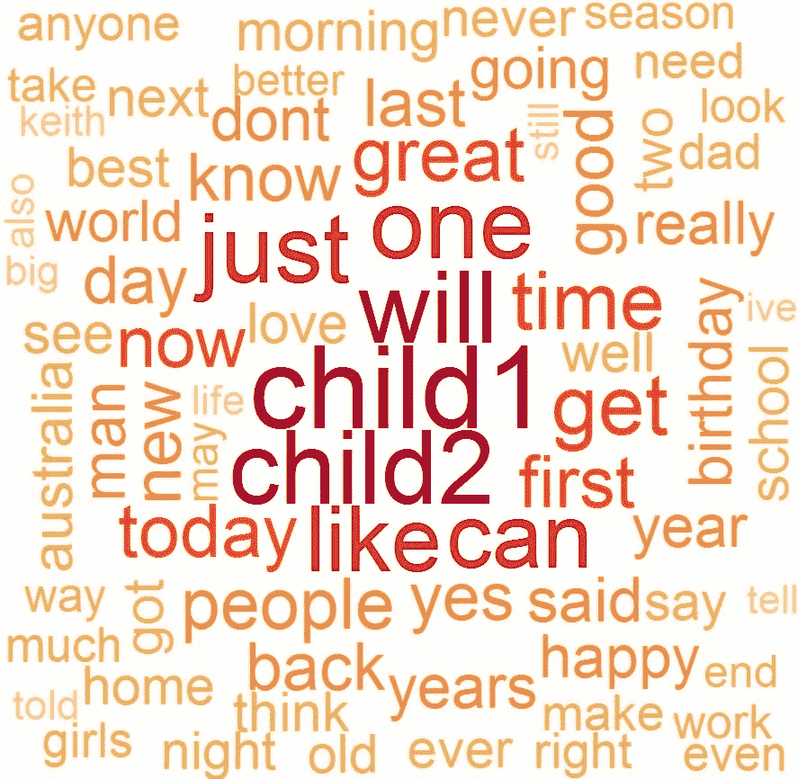
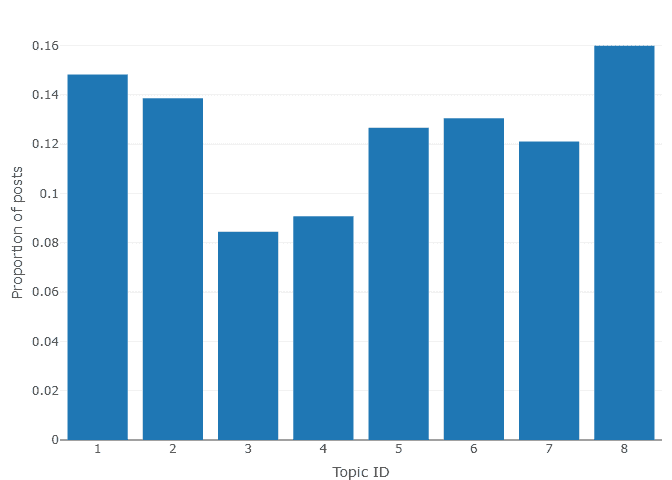
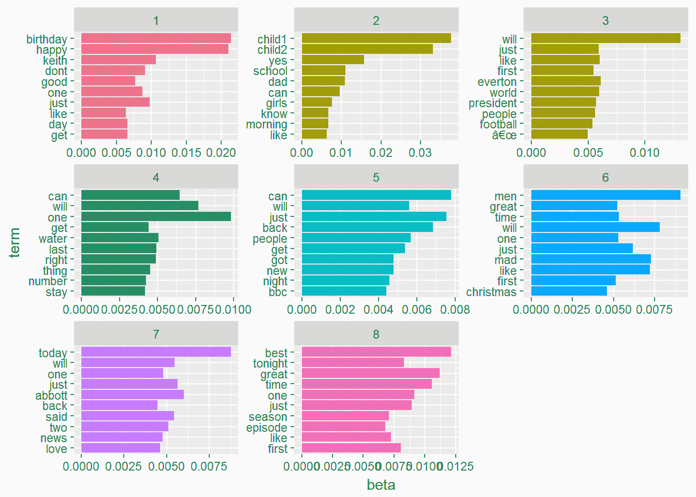

# 使用主题建模和其他 NLP 方法分析脸书帖子和活动

> 原文：<https://towardsdatascience.com/ten-years-of-my-life-on-facebook-a4750c9ae629?source=collection_archive---------14----------------------->

4 月，我永久删除了我在脸书的存在。我于 2008 年加入，这些年来相当活跃。

在删除我的帐户的过程中，我下载了我所有的数据。我忍不住问自己:这个数字时间胶囊告诉了我关于我十年生活的什么？它对脸书十年的生活给出了什么样的暗示？是时候让我的数据科学技能发挥作用了。

对于阅读这篇文章的 R 程序员，我已经把我的代码发布到了 [*RPubs*](http://rpubs.com/keithmcnulty/facebook_analysis) *，*上，利用了包括`tm`，`topicmodels`，`ldatuning`，`plotly`和`ggplot2`在内的许多包进行可视化。希望您可以用它来做一些类似的事情，只需很少/不需要调整。我希望你能试一试，希望你能学到一些有趣的东西。

# 1.对我的时间线进行分析

我下载了我的脸书数据的 zip 文件，并将其解压缩到我的计算机上的一个文件夹中。[如果您不确定如何操作，下面是如何操作的](https://www.cnbc.com/2018/03/23/how-to-download-a-copy-of-facebook-data-about-you.html)。我感兴趣的特定文件位于名为 timeline.htm 的 html 子目录中。这个文件包含了我加入以来(几乎)十年时间线上的所有帖子。虽然其他人可以在你的时间线上发表文章，但是绝大多数的评论都是我自己的。

接下来，我使用文本分析从这个文件的沉重的 html 代码中提取所有文本，直到我只剩下一个来自我的时间线的评论列表。这并不简单，但是几行正确的代码就可以让你达到目的。

我还以类似的方式提取了所有的活动日期，这样我就可以分析我发布的时间和日期的模式。

总的来说，在 3632 天的会员时间里，有 5115 个帖子，平均每天 1.4 个帖子，所以我的个人资料在这十年里相当活跃。

# 2.分析我在脸书的活动

我获取了我活动的日期和时间的数据，并使用 R 的优秀功能将它们分组，这样我就可以了解我的活动在一年、一年中的几个月以及一天中的几个小时是如何变化的。

首先，我看了看我的活动是如何逐年变化的，我制作了这张图表，它显示我在 2010 年几乎没有活动(我记得我故意从脸书休假一年！)，在 2013–2015 年最为活跃。

然后我逐月观察我的活动的整体发展，用一个黄土平滑曲线的散点图来显示整体趋势。这证实了我在 2013-2015 年左右达到了一个活动高峰。2015 年后活跃度大幅下降。我不禁要问:这是脸书的总趋势吗？对我来说确实是这样！

最后，我对我的每日发帖趋势感兴趣，所以我查看了一天中每个小时的总发帖量。这看起来像我是奇怪的夜间活动，直到我意识到脸书记录的时区是 GMT，但在这段时间的大部分时间里，我住在澳大利亚，根据一年中的时间，澳大利亚要提前 9-10 个小时。从这个角度来看，这种活动看起来相对正常，在(澳大利亚)早上和晚上有一个高峰，在工作时间和晚上活动水平较低。

# 3.我帖子中最重要的词

接下来，我整理了课文，以便于我分析。我去掉了标点符号、数字，把所有东西都转换成小写。我还删除了*停用词*，它们是像‘和’这样的无意义的词，在互联网搜索查询中经常被删除。最后，我替换了一些我知道会出现的名字，特别是我的两个孩子的名字，我把它们转换成了“孩子 1”和“孩子 2”。我这样做是为了保护他们的隐私，因为我希望分享我的分析。

我把我的帖子列表变成了一个文档语料库，每个帖子都是一个单独的文档。我创建了一个文档术语矩阵，计算每个单词在每个文档中出现的次数。然后，我使用一种叫做*词频-逆文档频率(TF-IDF)* 的方法来确定文档中单词的重要性。

我对所有单词的 TF-IDF 频率进行平均，然后从大到小排列。最后，我用这些数据创建了一个文字云来代表我十年来发表的文章。在这里。

首先，这告诉我，至少在脸书，我的孩子就是我的生命。然而，TF-IDF 相对于简单字数统计的价值在于，与简单字数统计相比，它给予稍微不太频繁的单词额外的分数，并使它们更加突出。这些额外的单词给我的帖子增添了一些色彩。看着它，我看起来很开心，也很忙。我认为这是一个公平的结论。

# 4.我最常见的发帖主题

接下来，我继续看我是否能阐明一些我定期发布的常见话题。为此，我使用了一种叫做*主题建模*的技术。使用我的文档术语矩阵，我首先使用一种数学技术来确定将我的帖子分成的最佳主题数量。我登陆了八个主题——比这更多的似乎会产生递减的回报，每增加一个额外的主题，就会显著增加处理时间。

我的主题建模过程按照要求找到了八个主题。每个主题出现的频率在这个条形图中，最常见的主题是主题 8，尽管所有主题都以一定的频率出现。

但是主题到底是什么呢？

我按主题列出了前十个单词，以帮助我找出主题，结果如下:

所以这很好玩！主题建模可能有点断断续续——尤其是当语料库中的文档很短时，如脸书帖子或推文——但看看按主题排列的前十个词，我发现一些有意义的东西:

*   最常见的话题(话题 8)是关于电视的，最佳、剧集和季节等词可以说明这一点。我的确是一个伟大的电视爱好者——稍后会有更多的介绍。
*   话题 1 并不奇怪——生日祝福——可能是这些年来别人给我的。
*   话题 2 也很受欢迎，显然是关于我的家庭生活。我很幸运能够每天早上把我的孩子送到学校，这是我已经做了很多年的事情，看起来我发布了很多关于这个的内容。
*   话题 3 是关于我对足球的热爱和我最喜欢的球队——埃弗顿。
*   话题 6 把我带回到电视，以及我一直以来最喜欢的节目——《广告狂人》。我确实记得发布了很多关于这个节目的帖子。很多年来每一集之后。
*   其他主题似乎有点难以理解，但例如在主题 7 中，提到了“新闻”和“阿博特”(托尼·阿博特，我在澳大利亚生活的大部分时间里是总理和反对党领袖)，这表明这可能是一些基于澳大利亚新闻和政治的热门帖子。

所以我在脸书的十年告诉我，我是一个顾家的男人，我热爱足球，对政治评论太多，我花了太多时间分析《T2 广告狂人》的剧集。

这就是了。感谢脸书十年的快乐时光！

*最初我是一名纯粹的数学家，后来我成为了一名心理计量学家和数据科学家。我热衷于将所有这些学科的严谨性应用到复杂的人的问题上。我也是一个编码极客和日本 RPG 的超级粉丝。在*[*LinkedIn*](https://www.linkedin.com/in/keith-mcnulty/)*或*[*Twitter*](https://twitter.com/dr_keithmcnulty)*上找我。*