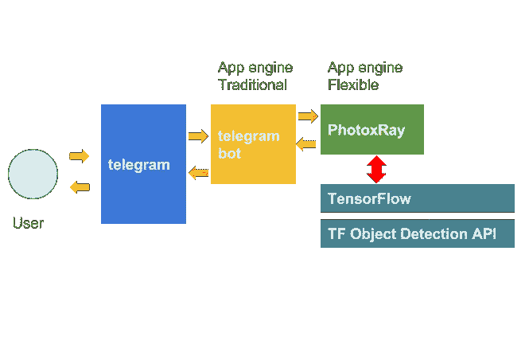
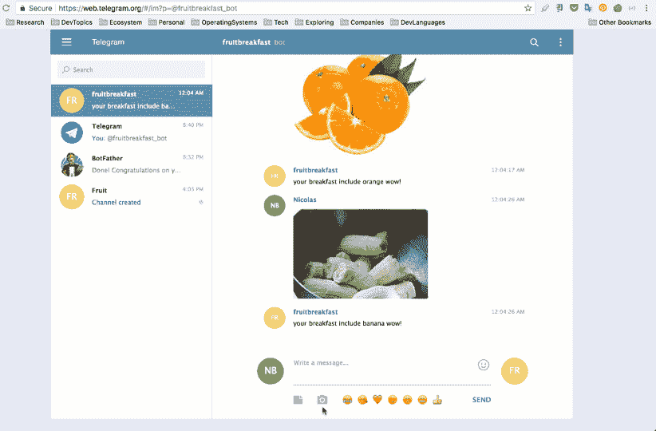

# 电报机器人、我的早餐、水果和交互式对话上的张量流对象检测

> 原文：<https://towardsdatascience.com/tensor-flow-object-detection-over-telegram-bot-my-breakfast-fruits-and-an-interactive-e54acdd6869a?source=collection_archive---------6----------------------->

在本文中，我们将探索一个案例，其中我们使用[张量流](https://www.tensorflow.org/)(对象检测 API)将图像中的对象检测与通过 bot 架构(电报平台)的交互相结合。

面临的挑战是创造一个能够在对话中使用图像进行交互的机器人，以告知用户早餐中包含的水果。利用这些信息，这款软件可以在未来提供许多不同的分析，目前还只是一个概念证明。

我们将提出一个 [TensorPhotoXRay](https://github.com/nbortolotti/TensorPhotoXRay) (我们的图像检测解决方案，[以前的文章](https://medium.com/towards-data-science/tensorflow-photo-x-ray-object-detection-with-app-engine-7de9dd8f63f5))的集成，以检测图像中的水果，我们将创建一个与电报机器人的集成(项目 [appengine-telegram-bot](https://github.com/nbortolotti/appengine-telegram-bot) )。

这是已经完成并正在运行的解决方案:

让我们描述一下使用这个架构的基本元素。

**电报中机器人的创建**:你可以通过这个[官方链接](https://telegram.org/blog/bot-revolution)探索更多关于这个选项的信息。*此步骤的重要元素，获取*令牌*以连接电报平台。

**创建 bot 电报解决方案**:让我们创建一个基于 App Engine 的 bot。(项目 [appengine-telegram-bot](https://github.com/nbortolotti/appengine-telegram-bot) )。*这是对来自电报的消息进行分析的方法，以及对图像检测方法的调用。

*我们使用超过 50%的置信度来显示标签。[在这里](https://github.com/nbortolotti/appengine-telegram-bot)您将找到要部署的完整项目。

**部署 Telegram Bot 解决方案**:在本例中，该解决方案是为 [Google App Engine 传统环境](https://cloud.google.com/appengine/docs/python/)设计的。您应该特别注意这些要素:

*   **电报令牌**:要获得这些信息并在电报平台上创建机器人，你应该与[机器人父亲](https://telegram.me/botfather)对话。[在这里](https://core.telegram.org/bots)你有所有的官方指示。
*   **与 TensorPhotoXRay 的 url 集成**:一旦部署了解决方案，您将需要 Url 来执行分析。记住你有一个*新方法*，格式如下:

> root URL/**photobot**/photourl

*   **rooturl** : app 引擎 url。
*   **photourl** :要分析的照片的 url。

**电报钩子配置**:您需要在 App Engine 上部署解决方案。完成此操作后，您将获得以下 URL 格式。

> rooturl/ **水果 _ 分析**

*rooturl:应用程序引擎 url

**部署 TensorPhotoXRay 解决方案**:该活动可按照以下说明进行。请记住，该解决方案使用[应用引擎灵活环境](https://cloud.google.com/appengine/docs/flexible/python/)。
*我在原项目上做了修改，增加了一个新方法，在图像检测上只返回一个*标签数组*。

这是新方法:

**最后一步，将电报与我们开发的机器人**
连接起来。现在让乐趣开始吧…

*   对于与我们的应用引擎解决方案的 bot 链接，我们必须设置挂钩。(仅访问此链接并验证 *web_hook 配置正常*)

> rooturl/set_webhook

*   rooturl:应用程序引擎 url

现在，我们可以与一个组件交互，让我们在食物选择方面进行合作，在未来以一种非常灵活的方式建议和学习。

有几个要素需要发展和改进，但这个简单的解决方案展示了一条有趣的道路，在与用户的交互中充满了新的机会。