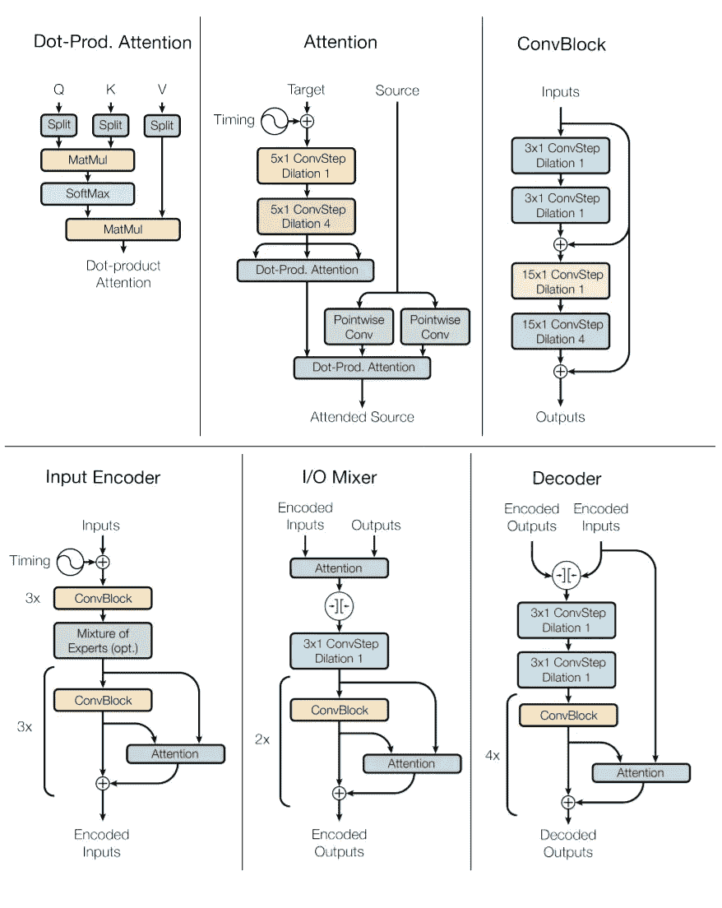

# Tensor2Tensor 和一个模型来学习所有内容

> 原文：<https://towardsdatascience.com/tensor2tensor-and-one-model-to-learn-them-all-7ef3f9b61ba4?source=collection_archive---------9----------------------->

最近谷歌宣布发布 [Tensor2Tensor](https://github.com/tensorflow/tensor2tensor) 库。T2T 的主要目的是通过向每个人提供最先进的模型来加速深度学习研究。现在，它主要集中在 NLP 问题和一般的序列到序列。然而，它是建立在 Tensorflow 之上的，Tensor2Tensor 的模块化结构允许开发人员和研究人员以简单的方式添加新模型。

这个 python 库为数据集生成、训练和超参数调整提供了简单的 API。它包含:

*   流行的序列数据集生成工具
*   不同输入/输出模式的工作模型:符号、图像、音频、标签
*   模型及其优化器的预调超参数集
*   具有简单 CLI 界面的训练器
*   像 ByteNet、MultiModel( [paper](https://arxiv.org/pdf/1706.05137.pdf) )、SliceNet、Transformer( [paper](https://arxiv.org/pdf/1706.03762.pdf) )和 Xception 这样的 SOTA 模型

但是这一个值得特别注意:

# 多模态建筑

这个网络最吸引人的特点是它可以学会同时解决一系列不同的问题。研究人员训练同一个神经网络来进行图像分类、图像字幕、文本解析、语音识别、英语德语和英语法语翻译。它在每一个方面都做得很好！

这在迁移学习中是一个巨大的成功，在不久的将来，我们可能会看到很多论文和对这个架构的改进。

Transformer 也很酷，它使用注意力机制而不是递归层，并在 WMT 英语->德语翻译基准测试中获得 SOTA。与此同时，相对于竞争对手，它只需要 1%到 10%的计算能力。

事实上，我相信多式联运网络有一个非常光明的未来。也许会成为 DL 最大的突破之一。

> 最初发表于[CognitiveChaos.com](http://cognitivechaos.com/tensor2tensor-and-one-model-to-learn-them-all/)