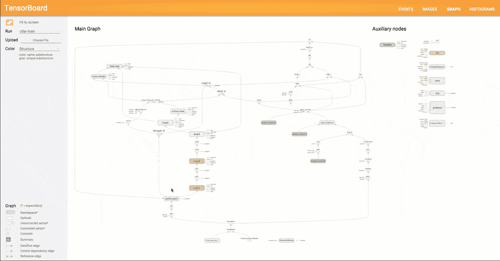
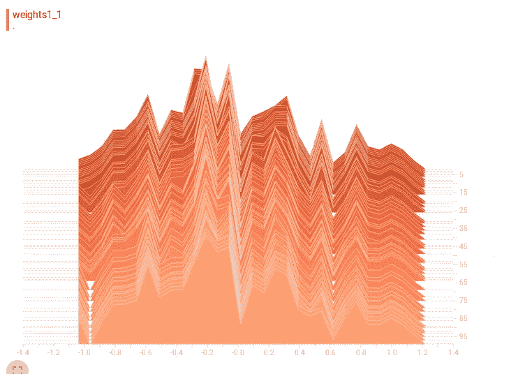
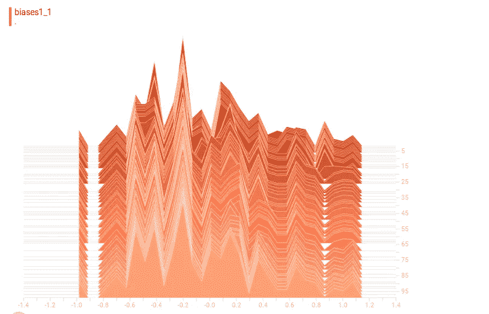
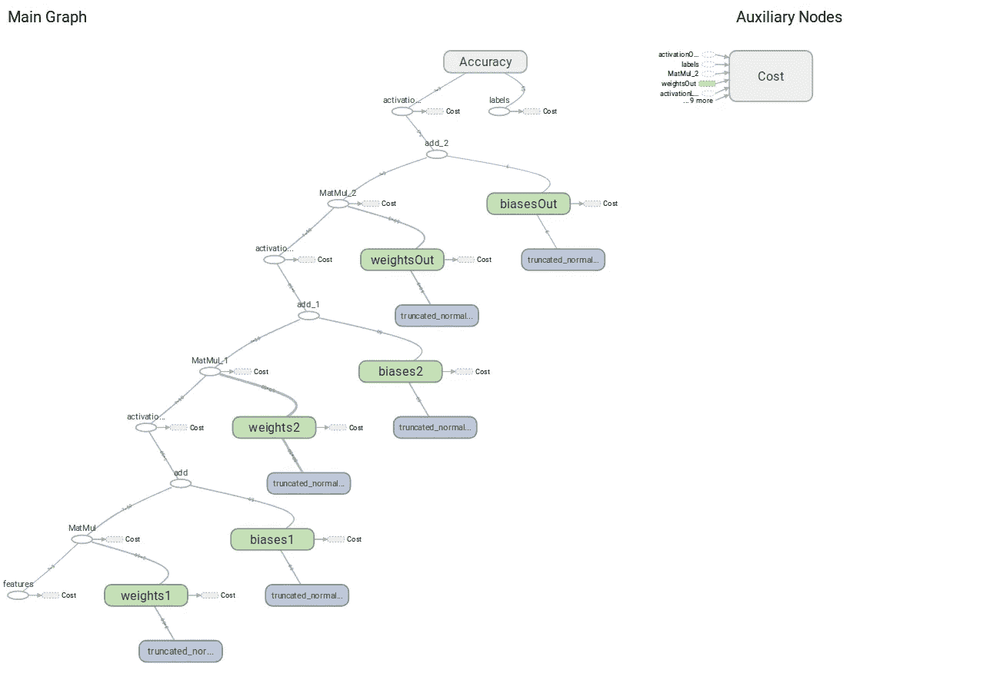
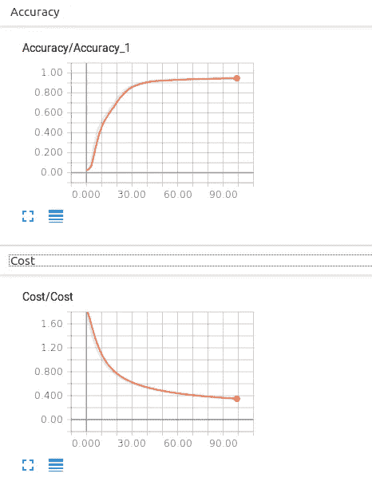

# TensorBoard:可视化学习

> 原文：<https://towardsdatascience.com/tensorboard-visualizing-learning-ad1b6667585?source=collection_archive---------1----------------------->

*一个使实现透明的简洁工具*

# 为什么选择 TensorBoard？

这是 tensorflow 提供的可视化工具。但这很有用的原因是，它有一些特殊的功能，例如将您的机器学习模型视为节点和连接这些节点(数据流)的边的概念性图形表示(计算图)。此外，它还为我们提供了根据期望的指标评估模型性能的能力。

谷歌创建 tensorboard 这样的工具的进一步动机是，当我们使用 tensorflow 创建模型时，我们不知道幕后发生了什么，特别是在神经网络这样的算法中，它的操作是一个完全的黑盒，可能具有非常复杂的结构。在这种情况下，我们如何确保我们的实现流程没有错误？

# Tensorboard 能提供什么？

Google 的 Tensorflow 机器学习库通过提供操作和各种信息(即维度、数据类型等)的可视化表示(tensorboard 计算图)来解决这个问题。)流经其中的数据。

## 使用汇总操作

汇总操作使您能够存储所选操作的汇总值(例如:-与每个时期相关的训练精度)以备后用。首先，您必须首先指定操作的名称。以便将来参考时更容易。在你保存了你的汇总操作之后，你必须使用 **tf.summary.mergeall()** 将所有这些操作合并成一个操作。现在，您必须使用**文件写入器**对象将这些元数据写入一个期望的位置，以便将来能够访问。

一个例子如下:

Illustration of setting up summary operations

上面的代码创建了第一层的权重和偏差的汇总直方图。这将在 tensorboard 上显示如下:

这些图像基本上描述了在训练时期权重和偏差分布的变化。每个切片是特定时期的参数分布。

可以在下面的链接中找到关于更多可用概要操作的更多信息。请参考此官方文档以获得更多参考。

 [## tf.summary .直方图|张量流

### fake _ quant _ with _ min _ max _ vars _ per _ channel _ gradient

www.tensorflow.org](https://www.tensorflow.org/api_docs/python/tf/summary/histogram) 

## 将模型保存到图表中

此外，在 tensorboard 中，我们可以查看由执行操作的张量和通过图形表示数据流的边组成的计算图形。这种设计可用于确定模型的创建是否合适。这种可视化图形让我们确保图形中的数据流是有意义的，并且转换应用于正确数据的正确位置。下面的代码可以用来保存图表。请注意，这应该在会话实例中执行，因为张量属性只能在会话中访问。

保存后的图形示例如下所示:

Example of a computational graph

通过使用如下标量运算，可以获得性能评估度量的进一步图形:

在 tensorboard 上，其可视化效果如下:

这是 tensorboard 入门的简要概述，如果您需要更多资料，可以在下面的 references 标签下找到 tensorflow 官方网站的链接。因此，如果你觉得这篇文章的内容有用，请与他人分享。

# 参考

 [## 深入 TensorBoard:示例教程- neptune.ai

### 有一个常见的商业说法是，你不能改进你没有衡量的东西。这在机器学习中是正确的，因为…

海王星. ai](https://neptune.ai/blog/tensorboard-tutorial)  [## 张量板:可视化学习|张量流

### 你将使用 TensorFlow 进行的计算——比如训练一个大规模深度神经网络——可能会很复杂和令人困惑…

www.tensorflow.org](https://www.tensorflow.org/get_started/summaries_and_tensorboard)