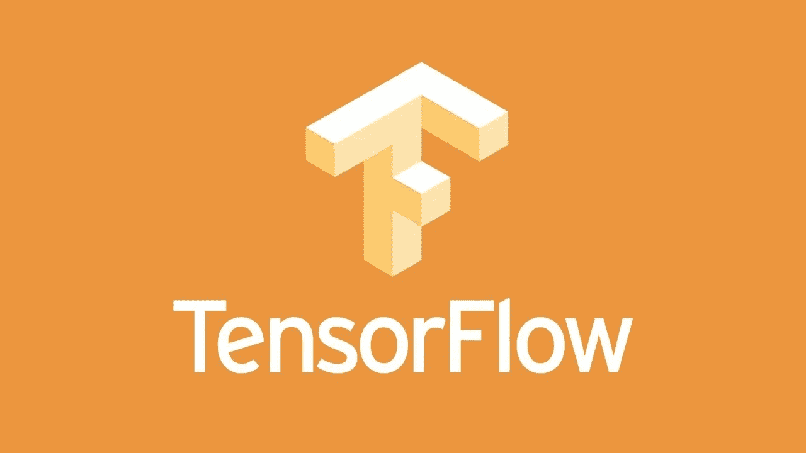

# TensorFlow 1.9 已经到来！

> 原文：<https://towardsdatascience.com/tensorflow-1-9-has-arrived-1e6e9171ce5e?source=collection_archive---------8----------------------->

## 你需要知道的一切…

在撰写本文时， **TensorFlow 1.9** 尚未在他们的官方网站上更新，但 TensorFlow 1.9 rc-0 已经在他们的**[**GitHub**](https://github.com/tensorflow/tensorflow/releases/tag/v1.9.0-rc0?linkId=52763826)上发布。**

****

# **主要内容和改进🚀**

1.  **将您的 **tf.keras** 更新到 **Keras 2.1 API。****
2.  **请继承`tf.keras.Model`，因为`tfe.Network`现在已经被**弃用**。**
3.  **向**梯度增强树估计器添加核心特征列和损失的支持。****
4.  **Bijectors API 支持通过新的 API 更改来广播 bi objectrs。**
5.  **分层变量在以下条件下发生变化**

*   **在子类`tf.keras.Model`中使用`tf.layers`。[支持的链接](https://www.tensorflow.org/versions/r1.9/api_docs/python/tf/layers)**

# **可能会在这里断裂**

****替换** `**variable_scope**` **(“，...)由** `**variable_scope**` **(** `**tf.get_variable_scope()**` **，...)**如果你正在打开变量作用域。**

****

# **错误修复🐛**

## **tf.data**

*   **`DatasetBase::DebugString()`方法现在是`const`。**
*   **添加了从多个数据集随机采样的`tf.contrib.data.sample_from_datasets()` API。**

## **tf.keras**

*   **将 Keras 代码移出 _impl 文件夹，并**移除 API 文件**。**
*   **`tf.keras.Model.save_weights`现在默认保存为 TensorFlow 格式。**
*   **将数据集迭代器传递给`tf.keras.Model`训练/评估方法。**

## **加速线性代数(XLA)**

## **[张量流调试器(tfdbg) CLI](https://www.tensorflow.org/programmers_guide/debugger)**

## **tf .贡献**

*   **添加`tf.contrib.data.choose_from_datasets()`。**
*   **`tf.contrib.data.make_csv_dataset()`现在支持引用字符串中的换行符。从`make_csv_dataset`中删除了两个参数。**
*   **`tf.contrib.framework.zero_initializer`支持资源变量。**
*   **将“ **constrained_optimization** ”添加到 tensorflow/contrib。**

> **进入以下链接**查看更多** [**Bug 修复**](https://github.com/tensorflow/tensorflow/releases/tag/v1.9.0-rc0?linkId=52763826) 。**

**感谢您阅读本文，希望您能利用新特性编写出高效的代码。**

**有关 TensorFlow 版本的更多更新以及更多关于 [**Medium**](https://medium.com/@sagarsharma4244) **和**[**Twitter**](https://twitter.com/SagarSharma4244)**的关注。****

****

****鼓掌吧！分享一下！跟我来。****

# **你会喜欢的以前的故事:**

** [## 50 tensor flow . js API 5 分钟讲解| TensorFlow.js Cheetsheet

### TensorFlow API Cheetsheet

towardsdatascience.com](/50-tensorflow-js-api-explained-in-5-minutes-tensorflow-js-cheetsheet-4f8c7f9cc8b2)  [## 手机上的 tensor flow:tensor flow Lite

### 我们得到了什么？

towardsdatascience.com](/tensorflow-on-mobile-tensorflow-lite-a5303eef77eb)  [## 手机上的 TensorFlow:教程

### 在 Android 和 iOS 上

towardsdatascience.com](/tensorflow-on-mobile-tutorial-1-744703297267)  [## 激活函数:神经网络

### Sigmoid，tanh，Softmax，ReLU，Leaky ReLU 解释！！！

towardsdatascience.com](/activation-functions-neural-networks-1cbd9f8d91d6)  [## 纪元与批量大小与迭代次数

### 了解您的代码…

towardsdatascience.com](/epoch-vs-iterations-vs-batch-size-4dfb9c7ce9c9)**