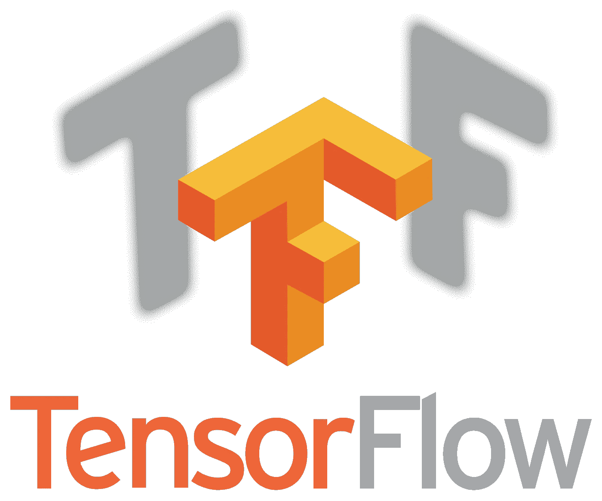
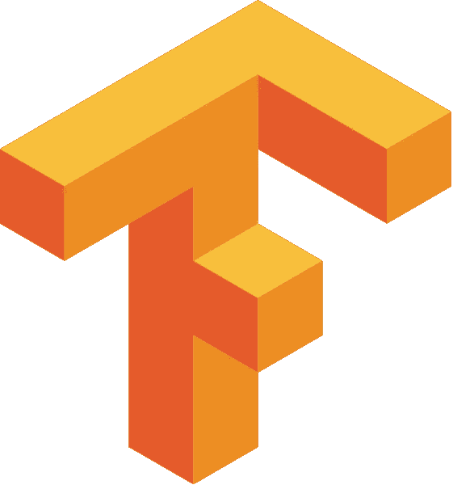
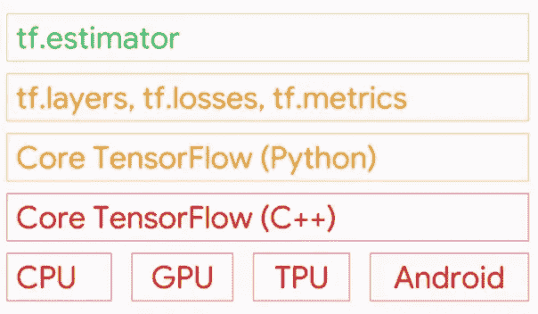
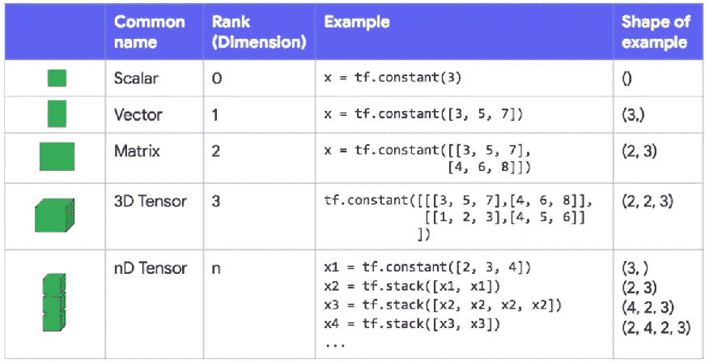
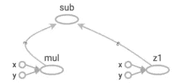
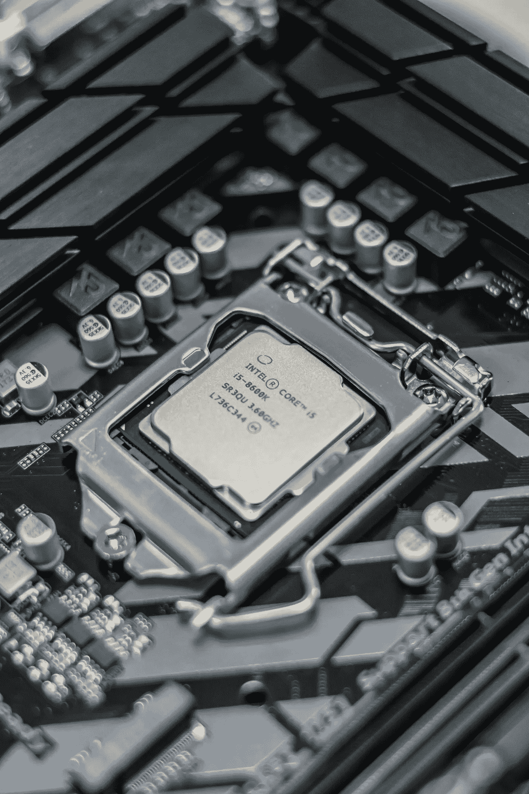

# 张量流——实践方法

> 原文：<https://towardsdatascience.com/tensorflow-a-hands-on-approach-8614372f021f?source=collection_archive---------3----------------------->



[Source: www.tensorflow.org]

这是我将要撰写的系列文章的第一篇，介绍 TensorFlow 并深入研究它提供的无数数学和机器学习库。首先，在这篇文章中，我将描述 TensorFlow 框架背后的思想，它的构造方式，它的关键组件等。到本文结束时，您将能够用 TensorFlow 编写简单的数值求解器代码片段。

对于那些不知道的人来说，

> TensorFlow 是一个用于构建机器学习模型的计算框架。它是由杰夫·迪恩领导的谷歌大脑的第二代系统。它于 2017 年初推出，通过引入从可扩展性到构建生产就绪模型的众多功能，颠覆了 ML 世界。
> 【鸣谢:维基百科】



[Source: www.tensorflow.org]

## 框架



TensorFlow toolkit hierarchy

TensorFlow 提供了各种不同的工具包，允许您在自己喜欢的抽象级别上编写代码。例如，您可以在核心 TensorFlow (C++)中编写代码，并从 Python 代码中调用该方法。你也可以定义你的代码应该运行的架构(CPU，GPU 等等。).在上面的层次结构中，可以编写代码的最低层是 C++或 Python。这两个层次允许你编写数值程序来求解数学运算和方程。虽然这并不强烈推荐用于构建机器学习模型，但它提供了大量的数学库来减轻您的任务。您可以编写代码的下一个层次是使用 TF 特定的抽象方法，这些方法针对模型组件进行了高度优化。例如，使用 tf.layers 方法抽象，您可以处理神经网络的层。您可以使用 tf.metrics 方法构建模型并评估模型性能。使用最广泛的级别是 tf.estimator API，它允许您使用 easy 构建(训练和预测)生产就绪模型。estimator API 非常容易使用，并且经过了很好的优化。尽管它提供的灵活性较低，但它具有训练和测试您的模型所需的所有功能。让我们看看 estimator API 的一个应用程序，它只用三行代码就构建了一个分类器。

Simple Classifier Using TensorFlow Estimator API

在本文中，我将使用核心 TensorFlow (Python)来编写代码。但在此之前，让我先讨论一下 TensorFlow 中可用的数据类型。

## 数据类型

这个框架中的基本数据类型是一个**张量。**张量是数据的 N 维数组。例如，你可以称一个标量(一个常量值，比如整数 2)为 0 维张量。向量是一维张量，矩阵是二维张量。下图详细描述了张量的每个维度。



Tensor Data Type

观察上图。变量 *x* 是使用 *tf.constant* 类声明的张量。

**常数:**常数是一个值根本不能改变的张量。在第一个例子中， *x* 取常数值 3，因此形状为 None。你可以通过使用 *tf.stack* 函数在现有张量上叠加张量来声明任何维度的张量，这可以从 **nD 张量**的例子中看出。

现在我们已经看到了如何在 TensorFlow 中声明常数，让我们看看声明变量。

**变量:**变量是一个张量，它的值被初始化，然后通常随着程序的运行而改变。在 TensorFlow 中，变量由 *tf 操纵。变量*类。创建变量的最好方法是调用 *tf.get_variable* 函数。该函数要求您指定变量的名称。其他副本将使用此名称来访问同一变量，并在检查指向和导出模型时命名此变量的值。 *tf.get_variable* 还允许您重用之前创建的同名变量，从而轻松定义重用层的模型。

```
my_variable = tf.get_variable("my_variable", [1, 2, 3])
```

**初始化变量:**由于使用了低级 API 核心张量流，变量需要明确初始化。如果像 *tf 这样的高层框架。正在使用估算器*或 *Keras* ，变量将自动为您初始化。为了初始化变量，需要调用*TF . global _ variables _ initializer*。您可以使用以下代码行初始化会话中的所有变量。

```
session.run(tf.global_variables_initializer())
```

但是什么是 *session.run* ？？什么是会话？

## 会话和图表

会话封装了 TensorFlow 运行时的状态，并运行 TensorFlow 操作。使用 TensorFlow 编写的每一行代码都由一个底层图形表示。下面我们用一个例子来理解这一点。

TensorFlow sessions

我创建了两个 1D 张量 *x* 和*y。*我将它们相加并存储在一个名为 *z1* 的变量中。我将它们相乘并存储在变量 *z2* 中。我通过从 *z2* 中减去 *z1* 创建了另一个变量 *z3* 。当执行这个特定的代码片段时，TensorFlow **不计算结果**，而是创建一个表示上述代码的图形(如下所示)。



TensorFlow Graph

利用图形背后的想法是创建可移植的代码。是的，任何人都可以在任何类型的架构上导出和使用这个图。但是，TensorFlow 为什么不计算结果呢？因为，它遵循了懒惰的评估范式。所有创建的图形都绑定到一个会话，我们必须告诉 TensorFlow 使用 *session.run* 计算结果。

```
session.run(z3)
```

记住这一点，如果一个 *tf。图形*就像一个*。py* 文件，一个 *tf。会话*类似于 python 可执行文件。

现在我们已经知道了会话、图形、数据类型以及如何创建变量的基础知识，让我们通过编写一些 TensorFlow 代码来尝试一下。

# 张量流代码

## 加法和减法

## 乘法和除法

## 重塑

## 我已经用上面讨论的简单操作编写了一个二次方程解算器，同样的代码可以在我的 GitHub 库中找到。[ [链接](https://github.com/avinashingit/TensorflowProjects/blob/master/Programming/Halleys%20Equation%20Solver.ipynb)

# 结论

TensorFlow 主要用作后端框架，其模块通过 Keras API 调用。通常，TensorFlow 用于解决图像分类、对象识别、声音识别等复杂问题。在本文中，我们学习了张量流的结构和组成。在下一篇文章中，我们将深入研究机器学习，并使用 TensorFlow 构建我们的第一个线性回归模型。

深入了解 TensorFlow 的一些资源:

1.  [TensorFlow](https://www.tensorflow.org) 文档。
2.  Coursera 上 TensorFlow MOOC 介绍。

敬请关注我的后续文章。

Github: [链接](https://github.com/avinashingit)
Linkedin: [链接](https://www.linkedin.com/in/avinashkadimisetty)



Photo by [Alexandru-Bogdan Ghita](https://unsplash.com/photos/eM6WUs4nKMY?utm_source=unsplash&utm_medium=referral&utm_content=creditCopyText) on [Unsplash](https://unsplash.com/search/photos/intel?utm_source=unsplash&utm_medium=referral&utm_content=creditCopyText)